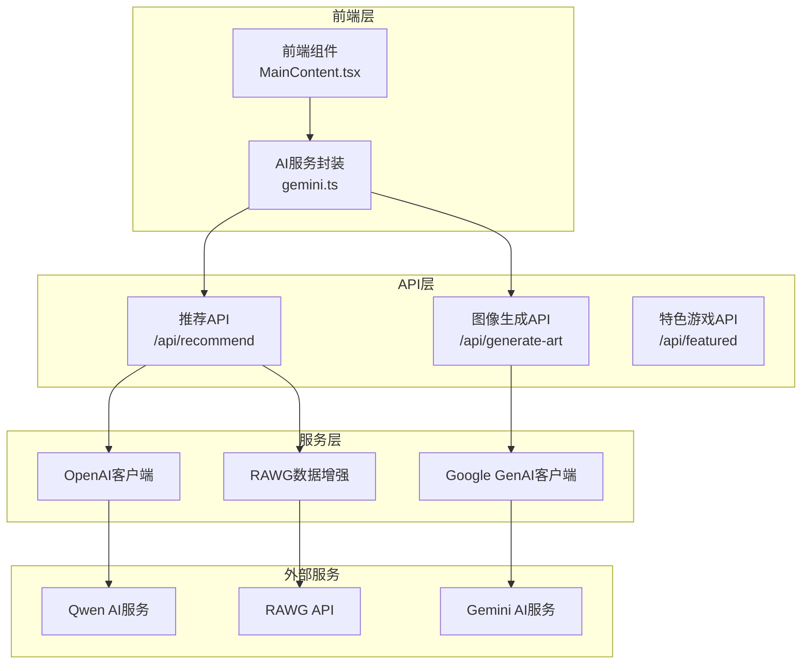
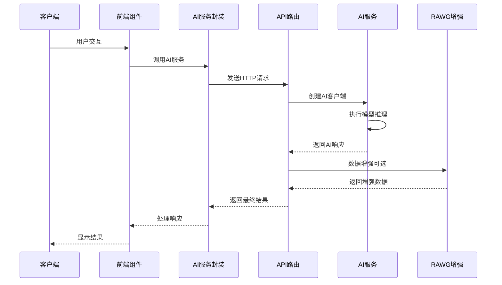
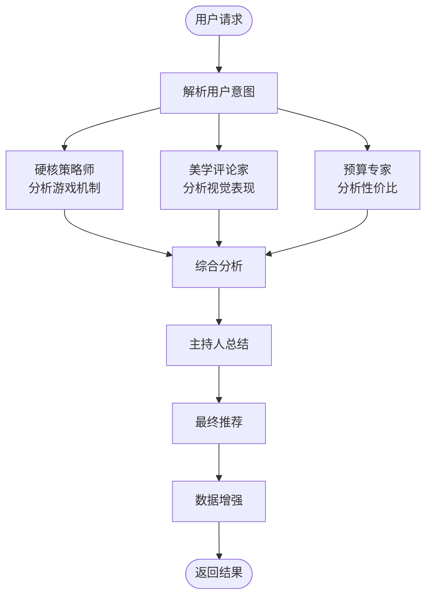
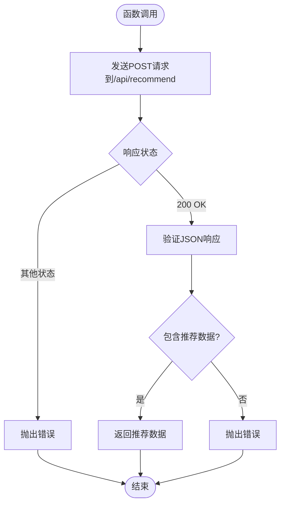
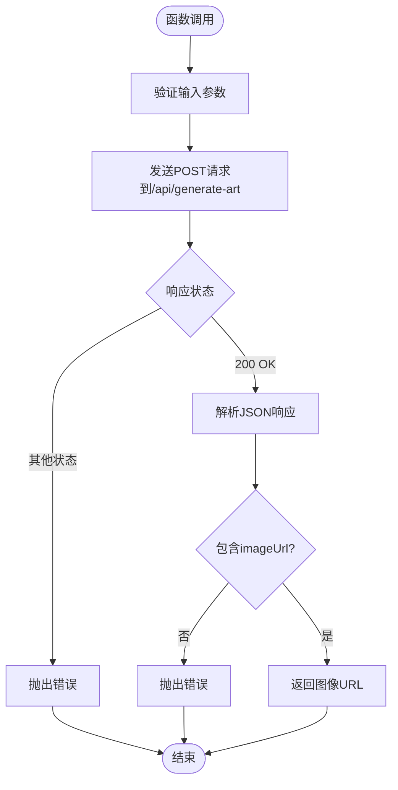
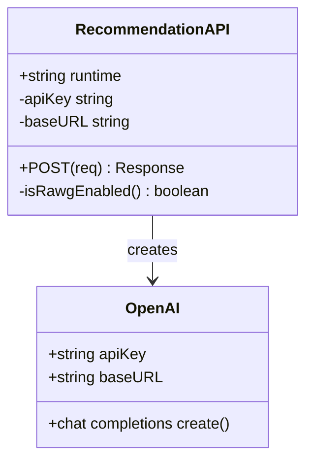
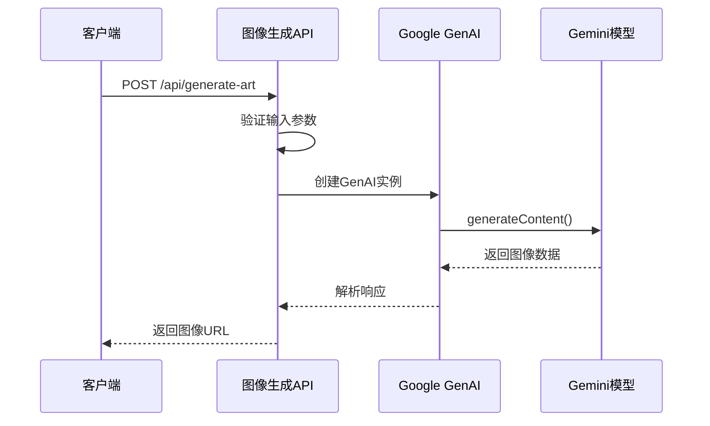
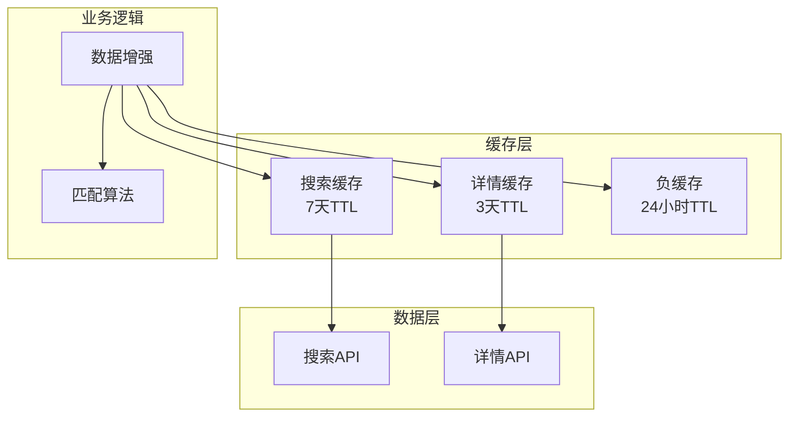
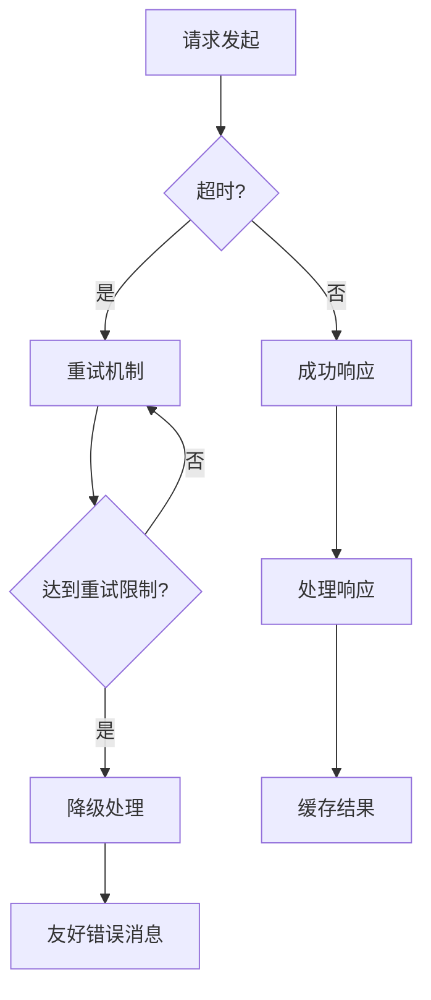
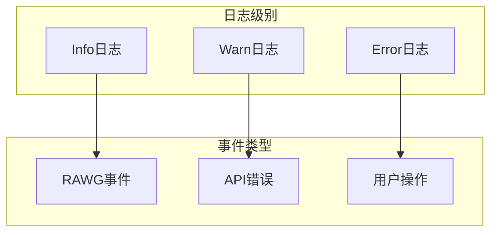

# AI服务封装

<cite>
**本文档引用的文件**
- [gemini.ts](file://src/services/gemini.ts)
- [route.ts](file://src/app/api/recommend/route.ts)
- [route.ts](file://src/app/api/generate-art/route.ts)
- [route.ts](file://src/app/api/featured/route.ts)
- [rawg.ts](file://src/lib/rawg.ts)
- [MainContent.tsx](file://src/components/MainContent.tsx)
- [gameI18n.ts](file://src/lib/gameI18n.ts)
- [package.json](file://package.json)
- [README.md](file://README.md)
- [RAWG_DATA_CACHE.md](file://RAWG_DATA_CACHE.md)
</cite>

## 目录
1. [简介](#简介)
2. [项目结构](#项目结构)
3. [核心组件](#核心组件)
4. [架构概览](#架构概览)
5. [详细组件分析](#详细组件分析)
6. [依赖关系分析](#依赖关系分析)
7. [性能考虑](#性能考虑)
8. [故障排除指南](#故障排除指南)
9. [结论](#结论)

## 简介

JoyMate是一个基于AI的智能游戏助手应用，采用Next.js框架构建，集成了多种AI服务来提供智能化的游戏推荐和内容生成功能。该应用的核心AI服务封装了多个关键功能模块，包括游戏推荐、图像生成和数据增强服务。

本项目主要使用了两个AI服务提供商：
- **Qwen（通义千问）**：通过OpenAI兼容接口提供对话式AI服务
- **Gemini**：Google的Gemini AI模型用于图像生成

系统采用了多智能体协作模式，通过三个不同视角的专业人士（硬核策略师、美学评论家、预算专家）共同分析用户需求，提供全面的游戏推荐。

## 项目结构

项目采用模块化的组织方式，主要分为以下几个核心层次：



**图表来源**
- [gemini.ts:1-32](file://src/services/gemini.ts#L1-L32)
- [route.ts:14-157](file://src/app/api/recommend/route.ts#L14-L157)
- [route.ts:6-61](file://src/app/api/generate-art/route.ts#L6-L61)

**章节来源**
- [gemini.ts:1-32](file://src/services/gemini.ts#L1-L32)
- [route.ts:14-157](file://src/app/api/recommend/route.ts#L14-L157)
- [route.ts:6-61](file://src/app/api/generate-art/route.ts#L6-L61)

## 核心组件

### AI服务封装模块

AI服务封装模块位于`src/services/gemini.ts`，提供了两个核心的异步函数：

1. **getGameRecommendation()**：用于获取游戏推荐
2. **generateGameArt()**：用于生成游戏概念图

这两个函数都通过HTTP请求与后端API进行通信，实现了前后端分离的架构设计。

### API路由层

系统包含三个主要的API路由：
- **推荐API** (`/api/recommend`)：处理游戏推荐请求
- **图像生成API** (`/api/generate-art`)：处理图像生成请求  
- **特色游戏API** (`/api/featured`)：提供特色游戏列表

### 数据增强层

`src/lib/rawg.ts`模块实现了复杂的多层缓存系统，用于增强游戏推荐的准确性：

- **搜索缓存**：缓存游戏搜索结果
- **详情缓存**：缓存游戏详细信息
- **负缓存**：避免重复查询无结果的游戏名

**章节来源**
- [gemini.ts:1-32](file://src/services/gemini.ts#L1-L32)
- [rawg.ts:1-434](file://src/lib/rawg.ts#L1-L434)

## 架构概览

系统采用分层架构设计，实现了清晰的关注点分离：



**图表来源**
- [gemini.ts:1-32](file://src/services/gemini.ts#L1-L32)
- [route.ts:14-157](file://src/app/api/recommend/route.ts#L14-L157)
- [route.ts:6-61](file://src/app/api/generate-art/route.ts#L6-L61)

### 多智能体协作机制

推荐系统实现了独特的多智能体协作模式：



**图表来源**
- [route.ts:40-72](file://src/app/api/recommend/route.ts#L40-L72)

每个智能体都有特定的专业领域：
- **硬核策略师**：专注于游戏机制、难度、深度和可玩性
- **美学评论家**：关注艺术风格、音乐、叙事氛围和情感共鸣
- **预算专家**：分析性价比和购买建议

**章节来源**
- [route.ts:40-72](file://src/app/api/recommend/route.ts#L40-L72)

## 详细组件分析

### AI服务封装模块分析

#### getGameRecommendation() 函数

该函数负责处理游戏推荐请求，实现了完整的错误处理和响应验证机制：



**图表来源**
- [gemini.ts:1-14](file://src/services/gemini.ts#L1-L14)

#### generateGameArt() 函数

图像生成功能提供了灵活的尺寸选择和错误处理：



**图表来源**
- [gemini.ts:16-31](file://src/services/gemini.ts#L16-L31)

**章节来源**
- [gemini.ts:1-32](file://src/services/gemini.ts#L1-L32)

### 推荐API路由分析

#### OpenAI客户端初始化

推荐API使用OpenAI兼容接口连接到Qwen服务：



**图表来源**
- [route.ts:28-31](file://src/app/api/recommend/route.ts#L28-L31)

#### 提示词工程最佳实践

推荐系统的提示词设计体现了高级的提示词工程技术：

1. **角色定义**：明确JoyMate游戏购物顾问的身份
2. **思维过程**：详细描述三智能体的分析步骤
3. **输出格式**：严格约束JSON结构
4. **个性化**：根据用户历史和偏好定制

**章节来源**
- [route.ts:28-31](file://src/app/api/recommend/route.ts#L28-L31)
- [route.ts:40-72](file://src/app/api/recommend/route.ts#L40-L72)

### 图像生成API分析

#### Google GenAI集成

图像生成功能使用Google GenAI SDK，支持多种图像尺寸：



**图表来源**
- [route.ts:17-31](file://src/app/api/generate-art/route.ts#L17-L31)

**章节来源**
- [route.ts:17-31](file://src/app/api/generate-art/route.ts#L17-L31)

### 数据增强系统分析

#### 多层缓存架构

RAWG数据增强系统实现了复杂的缓存策略：



**图表来源**
- [rawg.ts:6-26](file://src/lib/rawg.ts#L6-L26)

#### 匹配算法优化

系统实现了高级的字符串匹配算法：

1. **标题规范化**：统一大小写和标点符号
2. **相似度计算**：使用Levenshtein距离
3. **年份匹配**：处理版本差异
4. **权重调整**：根据平台和评分调整匹配分数

**章节来源**
- [rawg.ts:116-158](file://src/lib/rawg.ts#L116-L158)
- [rawg.ts:351-433](file://src/lib/rawg.ts#L351-L433)

## 依赖关系分析

### 外部依赖管理

项目使用npm管理依赖，主要依赖包括：

```mermaid
graph LR
subgraph "核心依赖"
NextJS[Next.js 15.5.0]
React[React 19.0.0]
OpenAI[OpenAI ^4.77.0]
GenAI[@google/genai ^1.29.0]
end
subgraph "开发依赖"
TypeScript[TypeScript ~5.8.2]
TailwindCSS[TailwindCSS ^4.1.14]
ESLint[ESLint ^9.35.0]
end
subgraph "UI组件"
Lucide[Lucide React ^0.546.0]
Motion[Motion ^12.23.24]
Markdown[React Markdown ^10.1.0]
end
```

**图表来源**
- [package.json:12-21](file://package.json#L12-L21)

### 环境变量配置

系统使用环境变量进行配置管理：

| 环境变量 | 用途 | 必需 | 默认值 |
|---------|------|------|--------|
| `GEMINI_API_KEY` | Gemini API密钥 | 是 | - |
| `QWEN_API_KEY` | Qwen API密钥 | 否 | - |
| `QWEN_BASE_URL` | Qwen API基础URL | 否 | `https://dashscope.aliyuncs.com/compatible-mode/v1` |
| `RAWG_API_KEY` | RAWG API密钥 | 否 | - |
| `RAWG_ENRICHMENT` | RAWG增强模式 | 否 | `auto` |

**章节来源**
- [route.ts:20-27](file://src/app/api/recommend/route.ts#L20-L27)
- [route.ts:12](file://src/app/api/generate-art/route.ts#L12)
- [README.md:26](file://README.md#L26)

## 性能考虑

### 缓存策略

系统实现了多层次的缓存机制来优化性能：

1. **搜索缓存**：7天TTL，减少重复搜索请求
2. **详情缓存**：3天TTL，缓存游戏详细信息
3. **负缓存**：24小时TTL，避免无效查询

### 并发控制

数据增强系统使用并发控制来平衡性能和资源使用：

- **最大并发数**：2-3个请求
- **请求超时**：3-5秒
- **整体超时**：6-8秒

### 错误处理优化

系统实现了智能的错误处理策略：



## 故障排除指南

### 常见问题诊断

#### API密钥问题

**症状**：出现"Missing API key"错误
**解决方案**：
1. 确认环境变量已正确设置
2. 检查API密钥的有效性
3. 验证网络连接

#### 配额限制问题

**症状**：收到配额耗尽错误
**解决方案**：
1. 等待配额恢复
2. 考虑升级API套餐
3. 实现请求节流

#### 网络连接问题

**症状**：超时或连接失败
**解决方案**：
1. 检查网络连接
2. 验证API端点可达性
3. 调整超时设置

### 日志分析

系统提供了详细的日志记录：



**章节来源**
- [route.ts:107-125](file://src/app/api/recommend/route.ts#L107-L125)
- [route.ts:41-58](file://src/app/api/generate-art/route.ts#L41-L58)

## 结论

JoyMate的AI服务封装展现了现代全栈应用的最佳实践：

### 技术优势

1. **模块化设计**：清晰的职责分离和接口定义
2. **错误处理**：完善的异常处理和降级机制
3. **性能优化**：多层缓存和并发控制
4. **可扩展性**：插件化的架构设计

### 架构亮点

1. **多智能体协作**：通过三个专业视角提供全面分析
2. **数据增强**：结合AI生成和外部数据源
3. **用户体验**：流畅的交互和及时的响应
4. **安全性**：环境变量管理和API密钥保护

### 改进建议

1. **监控系统**：添加APM工具进行性能监控
2. **测试覆盖**：增加单元测试和集成测试
3. **文档完善**：提供更详细的API文档
4. **国际化**：支持多语言界面

该AI服务封装为类似的应用提供了优秀的参考架构，展示了如何在实际生产环境中有效集成和管理多种AI服务。