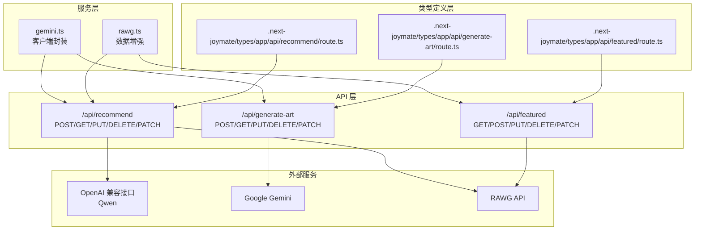
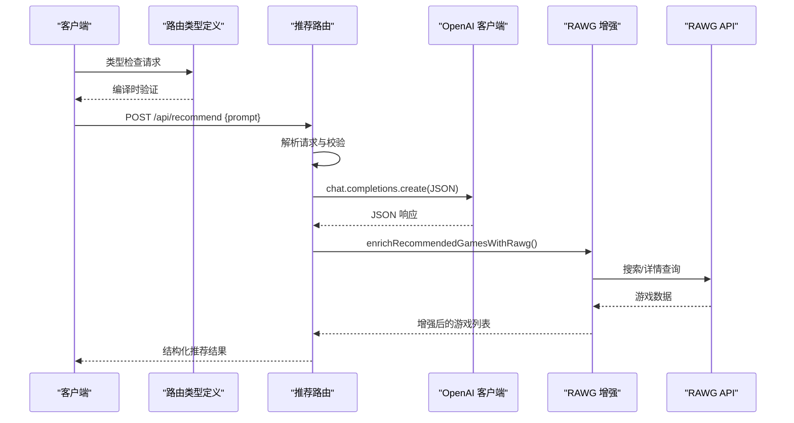
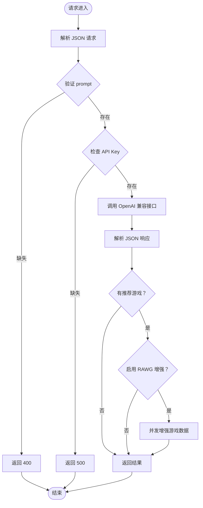
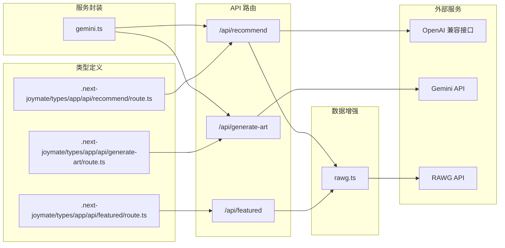

# API服务

<cite>
**本文档引用的文件**
- [src/app/api/recommend/route.ts](file://src/app/api/recommend/route.ts)
- [src/app/api/featured/route.ts](file://src/app/api/featured/route.ts)
- [src/app/api/generate-art/route.ts](file://src/app/api/generate-art/route.ts)
- [src/services/gemini.ts](file://src/services/gemini.ts)
- [src/lib/rawg.ts](file://src/lib/rawg.ts)
- [.next-joymate/types/app/api/recommend/route.ts](file://.next-joymate/types/app/api/recommend/route.ts)
- [.next-joymate/types/app/api/featured/route.ts](file://.next-joymate/types/app/api/featured/route.ts)
- [.next-joymate/types/app/api/generate-art/route.ts](file://.next-joymate/types/app/api/generate-art/route.ts)
- [README.md](file://README.md)
- [DESIGN_DOC.md](file://DESIGN_DOC.md)
</cite>

## 更新摘要
**所做更改**
- 新增了Next.js App Router架构下的API路由类型定义文件分析
- 更新了API端点结构说明，反映新的类型安全机制
- 增强了API路由的类型系统和参数验证说明
- 补充了API端点的完整HTTP方法支持说明

## 目录
1. [简介](#简介)
2. [项目结构](#项目结构)
3. [核心组件](#核心组件)
4. [架构概览](#架构概览)
5. [详细组件分析](#详细组件分析)
6. [依赖关系分析](#依赖关系分析)
7. [性能考量](#性能考量)
8. [故障排除指南](#故障排除指南)
9. [结论](#结论)
10. [附录](#附录)

## 简介
本文件为 JoyMate 的 API 服务层提供全面的技术文档，重点覆盖三个核心 API 端点：
- /api/recommend：AI 推荐核心逻辑，支持多智能体讨论与 JSON 结构化输出
- /api/featured：首页推荐数据，提供热门游戏的基础信息
- /api/generate-art：游戏概念图生成，基于 Gemini 图像模型

文档将详细说明每个端点的 HTTP 方法、请求参数、响应格式、错误处理机制，深入分析 gemini.ts 服务封装的实现，包括 AI 模型调用、提示词工程和输出格式化。同时阐述安全考虑、速率限制和性能优化策略，并提供完整的 API 使用示例和集成指南。

**更新** 新增了Next.js App Router架构下的API路由类型定义分析，展示了新的类型安全机制和完整的HTTP方法支持。

## 项目结构
项目采用 Next.js App Router 架构，API 端点位于 src/app/api 下，服务封装位于 src/services，数据增强逻辑位于 src/lib。系统还包括自动生成的类型定义文件，提供编译时类型检查和IDE支持。

**图表来源**
- [src/app/api/recommend/route.ts:1-185](file://src/app/api/recommend/route.ts#L1-L185)
- [src/app/api/featured/route.ts:1-84](file://src/app/api/featured/route.ts#L1-L84)
- [src/app/api/generate-art/route.ts:1-61](file://src/app/api/generate-art/route.ts#L1-L61)
- [.next-joymate/types/app/api/recommend/route.ts:1-348](file://.next-joymate/types/app/api/recommend/route.ts#L1-L348)
- [.next-joymate/types/app/api/featured/route.ts:1-348](file://.next-joymate/types/app/api/featured/route.ts#L1-L348)
- [.next-joymate/types/app/api/generate-art/route.ts:1-348](file://.next-joymate/types/app/api/generate-art/route.ts#L1-L348)

**章节来源**
- [src/app/api/recommend/route.ts:1-185](file://src/app/api/recommend/route.ts#L1-L185)
- [src/app/api/featured/route.ts:1-84](file://src/app/api/featured/route.ts#L1-L84)
- [src/app/api/generate-art/route.ts:1-61](file://src/app/api/generate-art/route.ts#L1-L61)
- [.next-joymate/types/app/api/recommend/route.ts:1-348](file://.next-joymate/types/app/api/recommend/route.ts#L1-L348)
- [.next-joymate/types/app/api/featured/route.ts:1-348](file://.next-joymate/types/app/api/featured/route.ts#L1-L348)
- [.next-joymate/types/app/api/generate-art/route.ts:1-348](file://.next-joymate/types/app/api/generate-art/route.ts#L1-L348)

## 核心组件
本节概述三个 API 端点的功能职责、输入输出规范和关键特性。

- /api/recommend（POST/GET/PUT/DELETE/PATCH）
  - 功能：接收用户输入的自然语言提示，通过 OpenAI 兼容接口（默认 Qwen）生成多智能体讨论后的 JSON 结构化推荐结果
  - 关键特性：系统提示词工程、JSON 输出约束、RAWG 数据增强、配额不足友好降级
  - 响应字段：intent（意图识别）、aesthetic_critic、hardcore_strategist、budget_expert、host_message、recommended_games（含标题、理由、匹配度、图像关键词）

- /api/featured（GET/POST/PUT/DELETE/PATCH）
  - 功能：返回首页推荐的热门游戏基础信息
  - 关键特性：本地缓存（24 小时）、RAWG 数据增强、无 API Key 时的回退方案
  - 响应字段：featured 数组，包含标题、英文名、封面、评分、平台、类型等

- /api/generate-art（POST/GET/PUT/DELETE/PATCH）
  - 功能：基于文本提示生成游戏概念图
  - 关键特性：Gemini 图像模型调用、尺寸控制（1K/2K/4K）、配额不足友好降级
  - 响应字段：imageUrl（Base64 数据 URI）

**章节来源**
- [src/app/api/recommend/route.ts:14-185](file://src/app/api/recommend/route.ts#L14-L185)
- [src/app/api/featured/route.ts:26-84](file://src/app/api/featured/route.ts#L26-L84)
- [src/app/api/generate-art/route.ts:6-61](file://src/app/api/generate-art/route.ts#L6-L61)

## 架构概览
API 服务层采用分层架构，包含路由层、业务逻辑层、数据增强层和外部服务集成层。新的类型定义系统提供了编译时类型安全和IDE支持。

**图表来源**
- [src/app/api/recommend/route.ts:44-151](file://src/app/api/recommend/route.ts#L44-L151)
- [src/lib/rawg.ts:351-433](file://src/lib/rawg.ts#L351-L433)
- [.next-joymate/types/app/api/recommend/route.ts:151-187](file://.next-joymate/types/app/api/recommend/route.ts#L151-L187)

## 详细组件分析

### /api/recommend（AI推荐核心逻辑）
该端点负责执行多智能体推荐流程，包含意图识别、多视角分析和最终汇总。

- HTTP 方法与路径
  - POST /api/recommend
  - 支持的HTTP方法：GET、POST、PUT、DELETE、PATCH（类型定义支持）

- 请求参数
  - Content-Type: application/json
  - body: { prompt: string }（必填）

- 响应格式
  - JSON 对象，包含：
    - intent: { game_name, emotion, scenario, preferences[] }
    - aesthetic_critic: string
    - hardcore_strategist: string
    - budget_expert: string
    - host_message: string
    - recommended_games: Array<{ title, reason, match_percentage, image_keyword }>
    - thinking_time: string（秒）
    - rawg: { enabled, mode, total, enriched, ms }

- 错误处理
  - 缺少 prompt：400
  - 缺少 API Key：500
  - 配额不足（429/配额耗尽）：返回友好提示 JSON
  - 其他上游错误：502

- 关键实现要点
  - 模型选择：优先使用 QWEN_API_KEY，否则回退到 GEMINI_API_KEY
  - 基础 URL：默认 Qwen 兼容模式地址
  - 输出格式：强制 response_format: json_object
  - RAWG 增强：并发控制（concurrency: 2）、最大游戏数（maxGames: 6）、超时（timeoutMs: 4500）
  - 日志统计：rawg_enrich 事件，包含路由、总数、增强数量、耗时

**图表来源**
- [src/app/api/recommend/route.ts:14-185](file://src/app/api/recommend/route.ts#L14-L185)

**章节来源**
- [src/app/api/recommend/route.ts:14-185](file://src/app/api/recommend/route.ts#L14-L185)
- [src/lib/rawg.ts:351-433](file://src/lib/rawg.ts#L351-L433)

### /api/featured（首页推荐数据）
该端点提供首页推荐的热门游戏信息，支持缓存和数据增强。

- HTTP 方法与路径
  - GET /api/featured
  - 支持的HTTP方法：GET、POST、PUT、DELETE、PATCH（类型定义支持）

- 请求参数
  - 无

- 响应格式
  - JSON 对象，包含：
    - featured: Array<{
        title: string
        title_en?: string
        cover_url?: string
        metacritic?: number | null
        rating?: number | null
        platforms?: string[]
        genres?: string[]
        rawg_url?: string
      }>

- 错误处理
  - 未启用 RAWG 或缺少 API Key：返回预设热门游戏列表
  - 并发增强失败：回退到基础信息

- 关键实现要点
  - 本地缓存：expiresAt 字段，24 小时有效
  - RAWG 增强：Promise.all 并发处理四个固定游戏
  - 日志统计：rawg_featured 事件，包含路由、总数、增强数量

**章节来源**
- [src/app/api/featured/route.ts:26-84](file://src/app/api/featured/route.ts#L26-L84)
- [src/lib/rawg.ts:252-342](file://src/lib/rawg.ts#L252-L342)

### /api/generate-art（游戏概念图生成）
该端点基于文本提示生成游戏概念图，支持多种输出尺寸。

- HTTP 方法与路径
  - POST /api/generate-art
  - 支持的HTTP方法：GET、POST、PUT、DELETE、PATCH（类型定义支持）

- 请求参数
  - Content-Type: application/json
  - body: { prompt: string, size: "1K" | "2K" | "4K" }

- 响应格式
  - JSON 对象，包含：
    - imageUrl: string（Base64 数据 URI）
  - 或配额不足时的友好提示对象

- 错误处理
  - 缺少 prompt：400
  - 缺少 API Key：500
  - 配额不足（429/配额耗尽）：返回包含 error 字段的 JSON（状态码 200）
  - 其他上游错误：502

- 关键实现要点
  - 模型：gemini-3-pro-image-preview
  - 尺寸控制：aspectRatio 16:9，imageSize 默认 1K
  - 输出格式：Base64 数据 URI

**章节来源**
- [src/app/api/generate-art/route.ts:6-61](file://src/app/api/generate-art/route.ts#L6-L61)

### gemini.ts 服务封装
提供前端友好的客户端封装，简化 API 调用。

- getGameRecommendation(prompt)
  - 方法：POST /api/recommend
  - 参数：prompt: string
  - 返回：Promise<推荐结果对象>
  - 错误：非 2xx 状态抛出 Error

- generateGameArt(prompt, size)
  - 方法：POST /api/generate-art
  - 参数：prompt: string, size: "1K" | "2K" | "4K"
  - 返回：Promise<string>（Base64 数据 URI）
  - 错误：非 2xx 状态或无 imageUrl 抛出 Error

**章节来源**
- [src/services/gemini.ts:1-32](file://src/services/gemini.ts#L1-L32)

### RAWG 数据增强服务
提供智能的游戏标题匹配与元数据增强能力。

- enrichTitleWithRawg(title, apiKey, opts?)
  - 功能：将中文/英文标题标准化，进行模糊匹配，返回最佳候选
  - 关键算法：Levenshtein 距离、年份匹配、评分权重调整
  - 输出：RawgEnrichment 对象或 null

- enrichRecommendedGamesWithRawg(games, apiKey, opts?)
  - 功能：并发增强多个游戏的 RAWG 信息
  - 并发控制：concurrency 1-3，默认 2
  - 查询策略：英文查询、图像关键词、原始标题
  - 输出：增强后的游戏数组

- 缓存机制
  - 搜索缓存：7 天
  - 详情缓存：3 天
  - 未命中缓存：24 小时

**章节来源**
- [src/lib/rawg.ts:252-342](file://src/lib/rawg.ts#L252-L342)
- [src/lib/rawg.ts:351-433](file://src/lib/rawg.ts#L351-L433)

### Next.js App Router 类型定义系统
新的类型定义系统提供了编译时类型安全和IDE支持。

- 类型验证范围
  - 支持的HTTP方法：GET、HEAD、OPTIONS、POST、PUT、DELETE、PATCH
  - 请求参数类型检查：Request | NextRequest
  - 响应类型检查：Response | void | never | Promise<Response | void | never>
  - 上下文参数：{ params: Promise<SegmentParams> }

- 类型安全特性
  - 参数位置验证：__param_position__ 确保正确的参数顺序
  - 返回类型验证：__return_type__ 确保正确的返回值类型
  - 运行时配置：runtime、dynamic、fetchCache 等配置项的类型检查

**章节来源**
- [.next-joymate/types/app/api/recommend/route.ts:1-348](file://.next-joymate/types/app/api/recommend/route.ts#L1-L348)
- [.next-joymate/types/app/api/featured/route.ts:1-348](file://.next-joymate/types/app/api/featured/route.ts#L1-L348)
- [.next-joymate/types/app/api/generate-art/route.ts:1-348](file://.next-joymate/types/app/api/generate-art/route.ts#L1-L348)

## 依赖关系分析

**图表来源**
- [src/app/api/recommend/route.ts:1-185](file://src/app/api/recommend/route.ts#L1-L185)
- [src/app/api/featured/route.ts:1-84](file://src/app/api/featured/route.ts#L1-L84)
- [src/app/api/generate-art/route.ts:1-61](file://src/app/api/generate-art/route.ts#L1-L61)
- [.next-joymate/types/app/api/recommend/route.ts:1-348](file://.next-joymate/types/app/api/recommend/route.ts#L1-L348)
- [.next-joymate/types/app/api/featured/route.ts:1-348](file://.next-joymate/types/app/api/featured/route.ts#L1-L348)
- [.next-joymate/types/app/api/generate-art/route.ts:1-348](file://.next-joymate/types/app/api/generate-art/route.ts#L1-L348)

**章节来源**
- [src/app/api/recommend/route.ts:1-185](file://src/app/api/recommend/route.ts#L1-L185)
- [src/app/api/featured/route.ts:1-84](file://src/app/api/featured/route.ts#L1-L84)
- [src/app/api/generate-art/route.ts:1-61](file://src/app/api/generate-art/route.ts#L1-L61)
- [.next-joymate/types/app/api/recommend/route.ts:1-348](file://.next-joymate/types/app/api/recommend/route.ts#L1-L348)
- [.next-joymate/types/app/api/featured/route.ts:1-348](file://.next-joymate/types/app/api/featured/route.ts#L1-L348)
- [.next-joymate/types/app/api/generate-art/route.ts:1-348](file://.next-joymate/types/app/api/generate-art/route.ts#L1-L348)

## 性能考量
- 缓存策略
  - /api/featured：本地缓存 24 小时，减少 RAWG API 调用
  - RAWG：搜索缓存 7 天，详情缓存 3 天，未命中缓存 24 小时
- 并发控制
  - 推荐游戏增强：concurrency 默认 2，最大 3，避免过度并发导致上游限流
  - 首页推荐：Promise.all 并发处理 4 个固定游戏
- 超时设置
  - RAWG 请求超时：4500ms，防止阻塞
  - RAWG 搜索页面大小：默认 5，平衡准确性与性能
- 输出优化
  - 推荐端点强制 JSON 输出，减少解析开销
  - 图像生成返回 Base64 数据 URI，便于前端直接渲染
- 类型安全优化
  - 编译时类型检查，减少运行时错误
  - 自动补全和IDE支持，提高开发效率

**章节来源**
- [src/app/api/featured/route.ts:24-82](file://src/app/api/featured/route.ts#L24-L82)
- [src/lib/rawg.ts:24-26](file://src/lib/rawg.ts#L24-L26)
- [src/lib/rawg.ts:357-358](file://src/lib/rawg.ts#L357-L358)
- [src/app/api/recommend/route.ts:97-102](file://src/app/api/recommend/route.ts#L97-L102)

## 故障排除指南
- 常见错误与解决方案
  - 400 Missing prompt：检查请求体 JSON 格式和 prompt 字段
  - 500 Missing API_KEY：确认环境变量设置（QWEN_API_KEY 或 GEMINI_API_KEY）
  - 502 Upstream error：检查上游服务可用性和网络连接
  - 429 配额不足：等待配额恢复或降低调用频率
- 调试技巧
  - 查看服务器日志中的事件统计（rawg_enrich、rawg_featured）
  - 使用 gemini.ts 包装函数捕获异常并记录堆栈
  - 在开发环境中临时禁用 RAWG 增强以隔离问题
  - 利用类型定义文件进行编译时错误检查
- 配置检查清单
  - 环境变量：RAWG_API_KEY、QWEN_API_KEY、GEMINI_API_KEY
  - RAWG 模式：RAWG_ENRICHMENT（auto/on/off）
  - 网络访问：允许访问 RAWG API 和上游 AI 服务域名
  - 类型定义：确保.next-joymate/types目录存在且最新

**章节来源**
- [src/app/api/recommend/route.ts:152-182](file://src/app/api/recommend/route.ts#L152-L182)
- [src/app/api/generate-art/route.ts:41-58](file://src/app/api/generate-art/route.ts#L41-L58)
- [src/services/gemini.ts:8-11](file://src/services/gemini.ts#L8-L11)

## 结论
JoyMate 的 API 服务层通过清晰的分层架构实现了高效的 AI 推荐与内容生成功能。三个核心端点分别承担了智能推荐、首页展示和图像生成的职责，配合 RAWG 数据增强和缓存机制，在保证用户体验的同时兼顾了性能与成本控制。新的Next.js App Router类型定义系统进一步增强了代码质量，提供了编译时类型安全和IDE支持。gemini.ts 服务封装进一步简化了前端集成，提供了统一的错误处理和响应格式。

## 附录

### API 使用示例
- 获取推荐
  - POST /api/recommend
  - 请求体：{ "prompt": "推荐几款适合放松的剧情向游戏" }
  - 成功响应：包含多智能体分析和推荐游戏列表

- 获取首页推荐
  - GET /api/featured
  - 成功响应：包含封面、评分、平台等增强信息

- 生成概念图
  - POST /api/generate-art
  - 请求体：{ "prompt": "科幻风格的太空站概念图", "size": "2K" }
  - 成功响应：Base64 数据 URI

### 集成指南
- 前端集成
  - 使用 gemini.ts 中的包装函数简化调用
  - 处理配额不足的友好提示
  - 实现本地缓存策略提升性能
- 后端集成
  - 配置环境变量确保 API Key 正确
  - 监控事件日志进行性能分析
  - 根据流量调整并发参数
  - 利用类型定义文件进行编译时类型检查
- 开发工具支持
  - IDE自动补全和错误提示
  - 编译时参数类型验证
  - 运行时配置项的类型安全

**章节来源**
- [src/services/gemini.ts:1-32](file://src/services/gemini.ts#L1-L32)
- [README.md:24-41](file://README.md#L24-L41)
- [DESIGN_DOC.md:41-74](file://DESIGN_DOC.md#L41-L74)