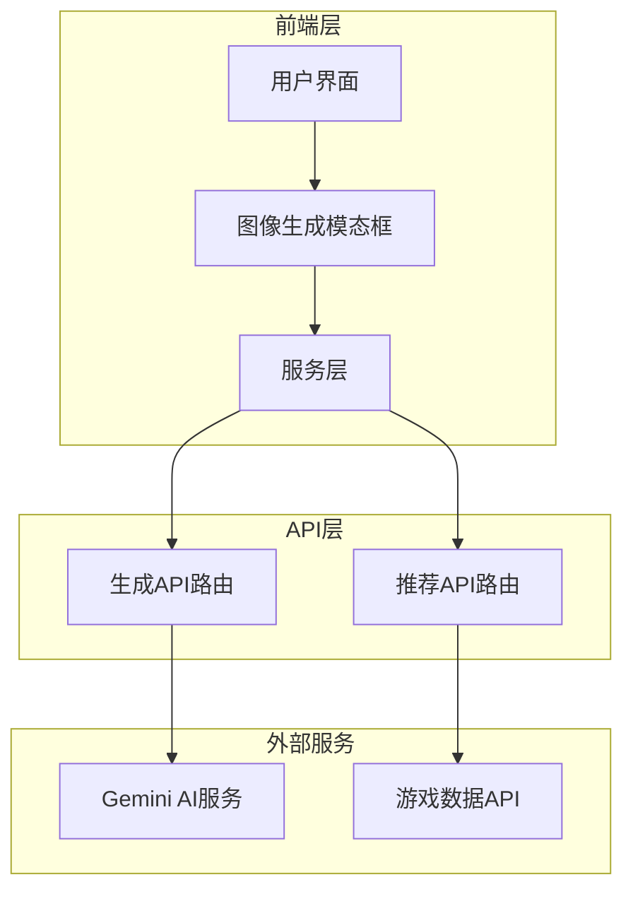
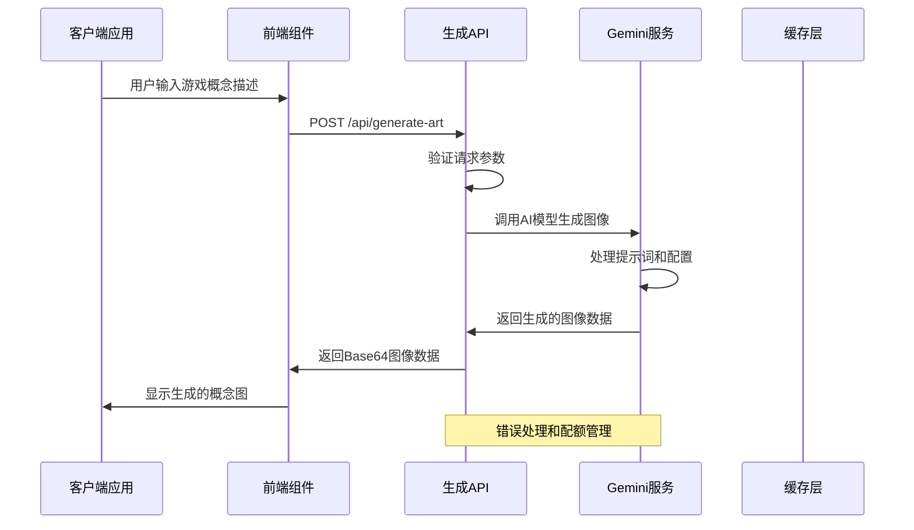
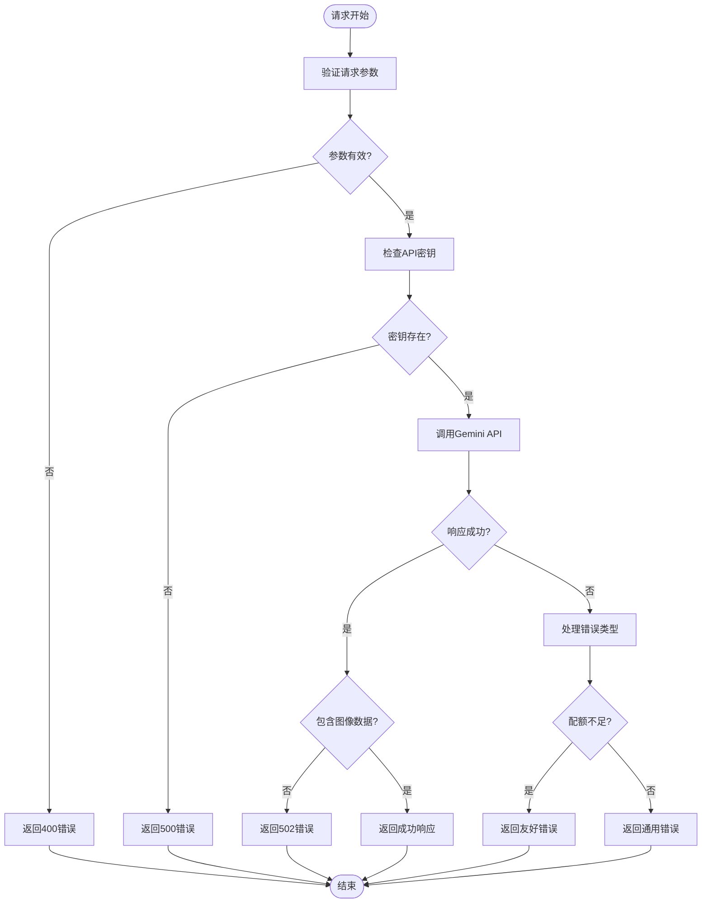
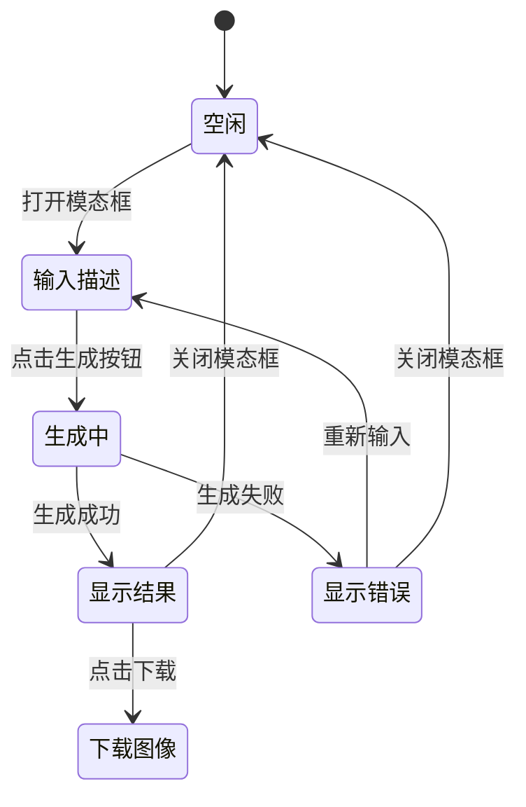
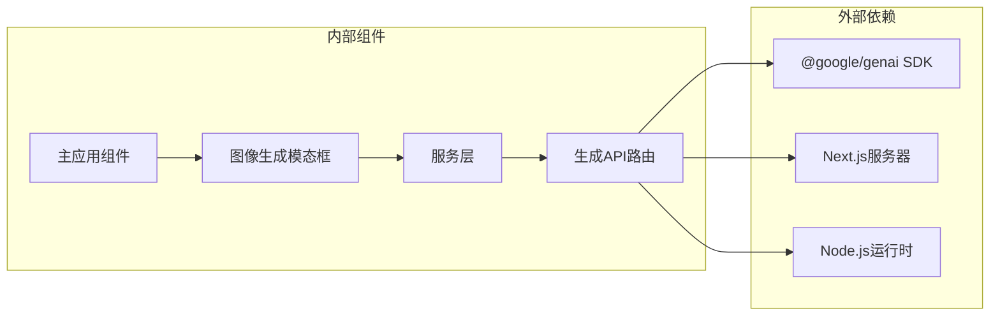

# 图像生成API

<cite>
**本文档引用的文件**
- [src/app/api/generate-art/route.ts](file://src/app/api/generate-art/route.ts)
- [src/services/gemini.ts](file://src/services/gemini.ts)
- [src/components/ImageGeneratorModal.tsx](file://src/components/ImageGeneratorModal.tsx)
- [src/App.tsx](file://src/App.tsx)
- [README.md](file://README.md)
- [DESIGN_DOC.md](file://DESIGN_DOC.md)
- [package.json](file://package.json)
- [src/lib/rawg.ts](file://src/lib/rawg.ts)
</cite>

## 目录
1. [简介](#简介)
2. [项目结构](#项目结构)
3. [核心组件](#核心组件)
4. [架构概览](#架构概览)
5. [详细组件分析](#详细组件分析)
6. [依赖关系分析](#依赖关系分析)
7. [性能考虑](#性能考虑)
8. [故障排除指南](#故障排除指南)
9. [结论](#结论)
10. [附录](#附录)

## 简介

图像生成API是JoyMate项目中的核心功能之一，专门用于为游戏概念图提供AI生成能力。该API基于Google Gemini 3.0图像模型，支持多种分辨率输出，能够根据用户提供的文本描述生成高质量的游戏概念艺术作品。

JoyMate是一个AI驱动的游戏推荐助手，旨在帮助玩家在信息过载的时代快速找到真正想玩的游戏。图像生成功能作为产品的重要组成部分，为用户提供直观的游戏视觉体验。

## 项目结构

项目采用Next.js框架构建，API端点位于`src/app/api/`目录下，前端组件位于`src/components/`目录中。图像生成功能涉及以下关键文件：



**图表来源**
- [src/app/api/generate-art/route.ts:1-61](file://src/app/api/generate-art/route.ts#L1-L61)
- [src/services/gemini.ts:1-32](file://src/services/gemini.ts#L1-L32)
- [src/components/ImageGeneratorModal.tsx:1-108](file://src/components/ImageGeneratorModal.tsx#L1-L108)

**章节来源**
- [src/app/api/generate-art/route.ts:1-61](file://src/app/api/generate-art/route.ts#L1-L61)
- [src/services/gemini.ts:1-32](file://src/services/gemini.ts#L1-L32)
- [src/components/ImageGeneratorModal.tsx:1-108](file://src/components/ImageGeneratorModal.tsx#L1-L108)

## 核心组件

### API端点概述

POST /api/generate-art 是图像生成的核心端点，负责接收用户的游戏概念描述，调用Gemini AI模型生成相应的图像，并返回Base64编码的图像数据。

### 请求参数

| 参数名 | 类型 | 必填 | 描述 | 默认值 |
|--------|------|------|------|--------|
| prompt | string | 是 | 游戏概念描述，包含风格、场景、元素等详细信息 | - |
| size | "1K" \| "2K" \| "4K" | 否 | 图像分辨率规格 | "1K" |

### 响应格式

成功的响应返回JSON对象，包含以下字段：

```json
{
  "imageUrl": "data:image/png;base64,iVBORw0K..."
}
```

错误响应格式：
```json
{
  "imageUrl": "",
  "error": "配额不足，请稍后再试"
}
```

**章节来源**
- [src/app/api/generate-art/route.ts:6-10](file://src/app/api/generate-art/route.ts#L6-L10)
- [src/app/api/generate-art/route.ts:33-38](file://src/app/api/generate-art/route.ts#L33-L38)
- [src/app/api/generate-art/route.ts:45-53](file://src/app/api/generate-art/route.ts#L45-L53)

## 架构概览

图像生成系统采用分层架构设计，确保了良好的可维护性和扩展性：



**图表来源**
- [src/components/ImageGeneratorModal.tsx:12-25](file://src/components/ImageGeneratorModal.tsx#L12-L25)
- [src/services/gemini.ts:16-31](file://src/services/gemini.ts#L16-L31)
- [src/app/api/generate-art/route.ts:19-31](file://src/app/api/generate-art/route.ts#L19-L31)

## 详细组件分析

### API路由实现

生成API路由实现了完整的图像生成流程，包括参数验证、Gemini API调用、错误处理等功能。

#### 关键实现特性

1. **参数验证**：确保请求包含有效的prompt参数
2. **环境配置**：检查GEMINI_API_KEY的存在
3. **Gemini集成**：使用GoogleGenAI SDK进行图像生成
4. **质量控制**：设置16:9宽高比和指定分辨率
5. **错误处理**：区分配额限制和其他错误类型

#### 错误处理机制

系统实现了多层次的错误处理策略：



**图表来源**
- [src/app/api/generate-art/route.ts:8-15](file://src/app/api/generate-art/route.ts#L8-L15)
- [src/app/api/generate-art/route.ts:41-58](file://src/app/api/generate-art/route.ts#L41-L58)

**章节来源**
- [src/app/api/generate-art/route.ts:6-59](file://src/app/api/generate-art/route.ts#L6-L59)

### 前端集成组件

图像生成模态框提供了用户友好的界面，支持多种分辨率选择和下载功能。

#### 组件功能特性

1. **多分辨率支持**：提供1K、2K、4K三种分辨率选项
2. **实时预览**：生成完成后立即显示图像
3. **下载功能**：支持直接下载生成的图像
4. **错误处理**：优雅地处理生成失败的情况
5. **加载状态**：显示生成进度和状态

#### 用户交互流程



**图表来源**
- [src/components/ImageGeneratorModal.tsx:12-25](file://src/components/ImageGeneratorModal.tsx#L12-L25)
- [src/components/ImageGeneratorModal.tsx:84-102](file://src/components/ImageGeneratorModal.tsx#L84-L102)

**章节来源**
- [src/components/ImageGeneratorModal.tsx:1-108](file://src/components/ImageGeneratorModal.tsx#L1-L108)

### 服务层封装

服务层提供了统一的API调用接口，简化了前端组件的使用。

#### 关键方法

1. **generateGameArt**：主要的图像生成方法
2. **错误处理**：统一的错误捕获和处理
3. **类型安全**：提供TypeScript类型定义

**章节来源**
- [src/services/gemini.ts:16-31](file://src/services/gemini.ts#L16-L31)

## 依赖关系分析

图像生成功能涉及多个依赖组件，形成了清晰的依赖关系：



**图表来源**
- [package.json:12-21](file://package.json#L12-L21)
- [src/app/api/generate-art/route.ts:1-2](file://src/app/api/generate-art/route.ts#L1-L2)
- [src/services/gemini.ts:1-32](file://src/services/gemini.ts#L1-L32)

**章节来源**
- [package.json:12-21](file://package.json#L12-L21)
- [src/app/api/generate-art/route.ts:1-4](file://src/app/api/generate-art/route.ts#L1-L4)

### 第三方依赖

项目使用了以下关键第三方依赖：

| 依赖包 | 版本 | 用途 |
|--------|------|------|
| @google/genai | ^1.29.0 | Gemini AI服务集成 |
| next | ^15.5.0 | Web框架和API路由 |
| lucide-react | ^0.546.0 | 图标组件库 |
| react | ^19.0.0 | 前端UI框架 |

**章节来源**
- [package.json:12-21](file://package.json#L12-L21)

## 性能考虑

### 成本控制策略

1. **分辨率选择**：提供1K、2K、4K三种分辨率，用户可根据需要选择合适的质量级别
2. **配额管理**：实现智能的配额检测和降级处理
3. **缓存机制**：利用Gemini API的内置缓存减少重复请求

### 性能优化措施

1. **异步处理**：所有API调用都是异步的，避免阻塞主线程
2. **错误隔离**：独立的错误处理逻辑，不影响其他功能
3. **资源清理**：及时清理生成过程中的临时资源

### 最佳实践建议

1. **合理选择分辨率**：对于快速预览使用1K，正式发布使用4K
2. **优化提示词**：提供详细且具体的描述，提高生成质量
3. **监控使用情况**：定期检查API使用统计，合理规划预算

## 故障排除指南

### 常见问题及解决方案

#### 1. API密钥配置错误

**症状**：返回500错误，提示缺少GEMINI_API_KEY

**解决方案**：
- 确保在环境变量中正确设置GEMINI_API_KEY
- 验证API密钥的有效性和权限
- 检查生产环境的环境变量配置

#### 2. 配额不足

**症状**：返回包含错误信息的响应，提示配额已用完

**解决方案**：
- 等待配额恢复
- 考虑升级API计划
- 优化使用模式，减少不必要的请求

#### 3. 网络连接问题

**症状**：超时或网络错误

**解决方案**：
- 检查网络连接稳定性
- 增加重试机制
- 实现断线重连逻辑

#### 4. 图像生成失败

**症状**：返回"No image generated"错误

**解决方案**：
- 检查提示词的准确性和完整性
- 尝试不同的描述方式
- 简化复杂的场景描述

**章节来源**
- [src/app/api/generate-art/route.ts:12-15](file://src/app/api/generate-art/route.ts#L12-L15)
- [src/app/api/generate-art/route.ts:43-57](file://src/app/api/generate-art/route.ts#L43-L57)

## 结论

图像生成API为JoyMate项目提供了强大的AI图像生成功能，通过简洁的API设计和完善的错误处理机制，为用户提供了流畅的使用体验。系统采用了合理的成本控制策略和性能优化措施，确保了在保证质量的同时控制使用成本。

未来可以考虑的功能扩展包括：
- 支持更多的图像风格和模板
- 实现批量生成和队列管理
- 添加图像质量评估和过滤功能
- 提供更丰富的提示词模板

## 附录

### API使用示例

#### 基本请求格式

```javascript
// 前端JavaScript示例
const response = await fetch('/api/generate-art', {
  method: 'POST',
  headers: {
    'Content-Type': 'application/json'
  },
  body: JSON.stringify({
    prompt: '一个赛博朋克风格的农场模拟游戏，霓虹灯下的麦田，高分辨率',
    size: '2K'
  })
});

const data = await response.json();
console.log(data.imageUrl); // Base64图像数据
```

#### 响应处理

```javascript
// 处理成功响应
if (data.imageUrl) {
  const imgElement = document.createElement('img');
  imgElement.src = data.imageUrl;
  document.body.appendChild(imgElement);
}

// 处理错误响应
if (data.error) {
  alert(data.error);
}
```

### 集成指南

#### 1. 环境配置

在项目根目录创建`.env.local`文件：

```
GEMINI_API_KEY=your_gemini_api_key_here
```

#### 2. 依赖安装

```bash
npm install
```

#### 3. 运行应用

```bash
npm run dev
```

#### 4. 生产部署

```bash
npm run build
npm start
```

### 提示词设计最佳实践

为了获得最佳的图像生成效果，建议遵循以下提示词设计原则：

1. **具体描述**：包含游戏类型、风格、场景等详细信息
2. **质量要求**：明确分辨率和图像质量标准
3. **情感色彩**：描述期望的情绪和氛围
4. **技术规范**：指定宽高比和图像格式

**章节来源**
- [README.md:24-38](file://README.md#L24-L38)
- [DESIGN_DOC.md:77-146](file://DESIGN_DOC.md#L77-L146)