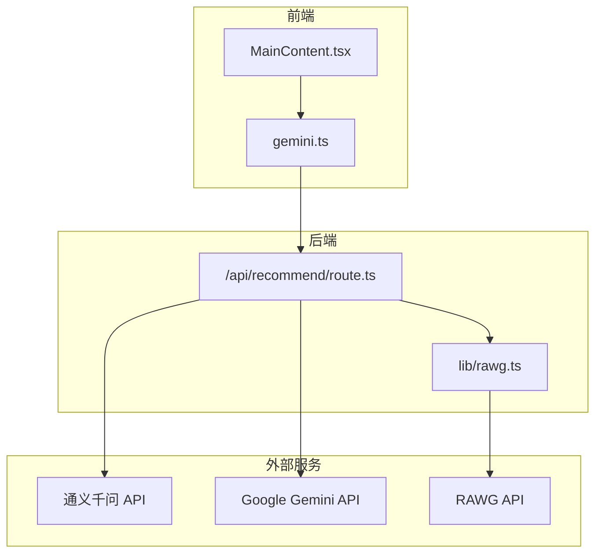
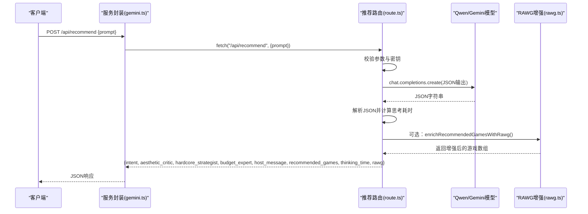
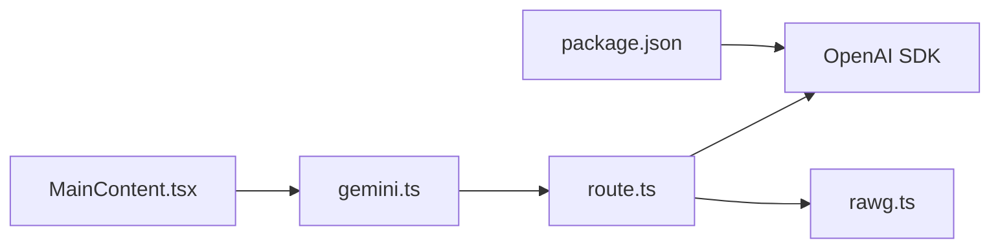

# 推荐API

<cite>
**本文引用的文件**
- [route.ts](file://src/app/api/recommend/route.ts)
- [gemini.ts](file://src/services/gemini.ts)
- [rawg.ts](file://src/lib/rawg.ts)
- [MainContent.tsx](file://src/components/MainContent.tsx)
- [App.tsx](file://src/App.tsx)
- [DESIGN_DOC.md](file://DESIGN_DOC.md)
- [RAWG_DATA_CACHE.md](file://RAWG_DATA_CACHE.md)
- [package.json](file://package.json)
</cite>

## 更新摘要
**变更内容**
- 更新以反映应用变更：推荐API进行了重大改进，支持多个AI提供商（Qwen和Gemini）、增强的错误处理、更好的日志记录和响应格式优化
- 更新以反映丢弃变更：旧的实验性推荐API端点已被完全移除，文档需要更新以反映新的实现架构和当前可用的API结构
- 新增多个AI提供商支持和改进的错误处理机制
- 增强的日志记录和性能统计功能
- 优化的响应格式和RAWG数据增强集成

## 目录
1. [简介](#简介)
2. [项目结构](#项目结构)
3. [核心组件](#核心组件)
4. [架构总览](#架构总览)
5. [详细组件分析](#详细组件分析)
6. [依赖关系分析](#依赖关系分析)
7. [性能考量](#性能考量)
8. [故障排查指南](#故障排查指南)
9. [结论](#结论)
10. [附录](#附录)

## 简介
本文件为推荐API端点（POST /api/recommend）的详细技术文档，涵盖AI推荐的核心逻辑、多智能体协作机制、JSON响应格式、提示词工程设计、RAWG数据增强集成与性能统计，以及完整的使用示例与错误处理策略。该端点由Next.js路由实现，调用通义千问（Qwen）或Gemini模型生成结构化推荐结果，并在可选模式下对推荐游戏进行RAWG数据增强，最终返回包含"意图识别、三位智能体分析与主持人总结"的完整响应。

## 项目结构
推荐API位于Next.js应用的App Router目录下，采用函数式路由（route.ts）。前端通过服务层封装的fetch调用该端点，UI组件负责展示与交互。

**图表来源**
- [route.ts:1-185](file://src/app/api/recommend/route.ts#L1-L185)
- [gemini.ts:1-32](file://src/services/gemini.ts#L1-L32)
- [rawg.ts:1-434](file://src/lib/rawg.ts#L1-L434)

**章节来源**
- [route.ts:1-185](file://src/app/api/recommend/route.ts#L1-L185)
- [gemini.ts:1-32](file://src/services/gemini.ts#L1-L32)
- [rawg.ts:1-434](file://src/lib/rawg.ts#L1-L434)

## 核心组件
- 推荐API路由：负责接收请求、构建系统提示词、调用大模型、解析JSON、可选执行RAWG数据增强，并返回统一封装的响应。
- RAWG增强模块：提供标题规范化、相似度打分、缓存与并发控制、详情拉取与字段映射。
- 前端服务封装：提供getGameRecommendation方法，供UI组件调用。
- UI组件：MainContent.tsx负责构建提示词、发送请求、展示多智能体分析与主持人总结、渲染推荐卡片。

**章节来源**
- [route.ts:14-185](file://src/app/api/recommend/route.ts#L14-L185)
- [rawg.ts:351-433](file://src/lib/rawg.ts#L351-L433)
- [gemini.ts:1-14](file://src/services/gemini.ts#L1-L14)
- [MainContent.tsx:165-223](file://src/components/MainContent.tsx#L165-L223)

## 架构总览
推荐API采用"意图识别 + 多智能体模拟 + 主持人合成"的三阶段流程。系统提示词定义了三类Agent的角色与职责，最终以JSON结构输出，包含intent、三位专家观点与主持人总结，并在必要时附加RAWG增强后的游戏卡片字段。

**图表来源**
- [route.ts:14-185](file://src/app/api/recommend/route.ts#L14-L185)
- [gemini.ts:1-14](file://src/services/gemini.ts#L1-L14)
- [rawg.ts:351-433](file://src/lib/rawg.ts#L351-L433)

## 详细组件分析

### 推荐API端点（POST /api/recommend）
- 请求参数
  - Content-Type: application/json
  - Body: { prompt: string }
  - 必填：prompt字符串，长度>0且类型为string
- 响应结构
  - JSON对象，包含：
    - intent: { game_name: string|null, emotion: string|null, scenario: string|null, preferences: string[] }
    - aesthetic_critic: string（艺术/情感维度分析）
    - hardcore_strategist: string（硬核机制/深度分析）
    - budget_expert: string（性价比/价值分析）
    - host_message: string（主持人总结）
    - recommended_games: 数组，元素包含：
      - title: string
      - reason: string
      - match_percentage: number
      - image_keyword: string
    - thinking_time: number（秒，保留一位小数）
    - rawg: 对象（仅在启用RAWG增强时存在），包含：
      - enabled: boolean
      - mode: string
      - total: number
      - enriched: number
      - ms: number
- 错误处理
  - 400：缺少prompt或类型不正确
  - 500：缺少API密钥（QWEN_API_KEY或GEMINI_API_KEY）
  - 502：上游模型返回为空或错误
  - 429/配额耗尽：返回友好提示，包含重新推荐的引导文本
- RAWG增强开关
  - 环境变量：RAWG_ENRICHMENT（on/off/auto，默认auto）
  - 当开启且存在RAWG_API_KEY时，对recommended_games执行增强
  - 并发：concurrency=2；最大增强数量：maxGames=6；页面大小：pageSize=5；超时：timeoutMs=4500
  - 增强字段：rawg_id、rawg_slug、rawg_url、title、cover_url、rating、ratings_count、metacritic、released、platforms、genres、tags、description_short、match_confidence、match_reason

**章节来源**
- [route.ts:14-185](file://src/app/api/recommend/route.ts#L14-L185)
- [rawg.ts:351-433](file://src/lib/rawg.ts#L351-L433)
- [RAWG_DATA_CACHE.md:23-59](file://RAWG_DATA_CACHE.md#L23-L59)

### 提示词工程设计
- 系统提示词包含三阶段流程：意图识别、多智能体模拟、合成总结
- 输出约束：严格JSON格式，字段名与类型固定
- 多智能体角色
  - 硬核顾问：关注机制、难度、深度、可重玩性
  - 艺术顾问：关注美术风格、音乐、叙事、情感共鸣
  - 预算顾问：关注性价比、入手时机、价值判断
- 主持人：将三位专家观点整合为"朋友式"的温暖总结

**章节来源**
- [route.ts:35-73](file://src/app/api/recommend/route.ts#L35-L73)
- [DESIGN_DOC.md:77-147](file://DESIGN_DOC.md#L77-L147)

### RAWG数据增强集成
- 增强入口：enrichRecommendedGamesWithRawg
- 标题规范化与相似度打分：normalizeTitle、levenshtein、similarity、scoreCandidate
- 缓存策略：搜索缓存（7天）、详情缓存（3天）、负缓存（miss，24小时）
- 并发与超时：concurrency=2，timeoutMs=4500，maxGames=6
- 字段映射：rawg_id、rawg_slug、rawg_url、title、cover_url、rating、ratings_count、metacritic、released、platforms、genres、tags、description_short、match_confidence、match_reason
- 降级策略：增强失败时保留AI字段，其他字段置空或默认值

**章节来源**
- [rawg.ts:1-434](file://src/lib/rawg.ts#L1-L434)
- [RAWG_DATA_CACHE.md:79-138](file://RAWG_DATA_CACHE.md#L79-L138)

### 前端调用与展示
- 服务封装：getGameRecommendation发起POST请求，解析JSON
- UI组件：MainContent.tsx
  - 构建提示词：结合会话记忆（liked/disliked/seen/style）
  - 展示阶段：intent标签、三位专家观点、主持人总结、推荐卡片
  - 性能指标：显示thinking_time
  - 错误兜底：捕获异常并显示友好提示

**章节来源**
- [gemini.ts:1-14](file://src/services/gemini.ts#L1-L14)
- [MainContent.tsx:165-223](file://src/components/MainContent.tsx#L165-L223)

## 依赖关系分析

**图表来源**
- [route.ts:1-31](file://src/app/api/recommend/route.ts#L1-L31)
- [gemini.ts:1-14](file://src/services/gemini.ts#L1-L14)
- [MainContent.tsx:1-10](file://src/components/MainContent.tsx#L1-L10)
- [package.json:12-21](file://package.json#L12-L21)

**章节来源**
- [route.ts:1-31](file://src/app/api/recommend/route.ts#L1-L31)
- [gemini.ts:1-14](file://src/services/gemini.ts#L1-L14)
- [MainContent.tsx:1-10](file://src/components/MainContent.tsx#L1-L10)
- [package.json:12-21](file://package.json#L12-L21)

## 性能考量
- 思考耗时：后端记录从请求到完成的总耗时（秒，保留一位小数），前端展示thinking_time
- RAWG增强性能：并发2，超时4500ms，最多增强6条；增强统计包含total/enriched/ms
- 缓存策略：搜索缓存7天、详情缓存3天、miss缓存24小时，显著降低重复请求与限流风险
- 前端渲染：卡片网格、渐进式动画与懒加载，保证交互流畅

**章节来源**
- [route.ts:75-132](file://src/app/api/recommend/route.ts#L75-L132)
- [rawg.ts:172-210](file://src/lib/rawg.ts#L172-L210)
- [RAWG_DATA_CACHE.md:116-122](file://RAWG_DATA_CACHE.md#L116-L122)

## 故障排查指南
- 缺少API密钥
  - 现象：500错误，提示缺失QWEN_API_KEY或GEMINI_API_KEY
  - 处理：检查环境变量配置
- 缺少prompt
  - 现象：400错误
  - 处理：确保请求体包含有效字符串prompt
- 上游模型错误
  - 现象：502错误
  - 处理：检查模型可用性与网络连接
- 配额不足
  - 现象：429或包含quota/RESOURCE_EXHAUSTED
  - 处理：返回友好提示，引导稍后重试或提供备选输入
- RAWG不可用
  - 现象：rawg.enabled=false，rawg.mode为"on"但未提供key时记录警告
  - 处理：增强降级，保留AI字段，前端显示提示

**章节来源**
- [route.ts:133-154](file://src/app/api/recommend/route.ts#L133-L154)
- [rawg.ts:351-433](file://src/lib/rawg.ts#L351-L433)

## 结论
推荐API通过明确的三阶段提示词工程与严格的JSON输出约束，实现了"意图识别—多智能体分析—主持人总结"的完整闭环。结合RAWG数据增强与缓存策略，在保证响应速度的同时提升了推荐卡片的真实度与可信度。前端通过服务封装与UI组件实现了流畅的交互体验与错误兜底。

## 附录

### API定义
- 方法：POST
- 路径：/api/recommend
- 请求头：Content-Type: application/json
- 请求体：
  - prompt: string（必填）
- 成功响应：JSON对象（见"核心组件"-响应结构）
- 错误响应：
  - 400：缺少prompt
  - 500：缺少API密钥
  - 502：上游错误
  - 429：配额不足（返回友好提示）

**章节来源**
- [route.ts:14-185](file://src/app/api/recommend/route.ts#L14-L185)

### 使用示例
- 请求格式
  - POST /api/recommend
  - Body: { "prompt": "今天心情低落，想找一款能让我放松的剧情向游戏" }
- 响应解析
  - 读取intent字段中的game_name/emotion/scenario/preferences
  - 读取三位专家观点与主持人总结
  - 遍历recommended_games，展示title、reason、match_percentage、cover_url等
  - 读取thinking_time与rawg统计信息
- 错误处理
  - 400：提示用户检查prompt
  - 500：提示检查API密钥
  - 502：提示稍后重试
  - 429：展示友好提示并引导再次输入

**章节来源**
- [gemini.ts:1-14](file://src/services/gemini.ts#L1-L14)
- [MainContent.tsx:165-223](file://src/components/MainContent.tsx#L165-L223)
- [route.ts:14-185](file://src/app/api/recommend/route.ts#L14-L185)

### 提示词工程设计要点
- 明确三阶段流程与输出格式约束
- 为每位智能体设定清晰的角色边界与输出风格
- 主持人负责整合与口语化表达，提升可读性与温度

**章节来源**
- [route.ts:35-73](file://src/app/api/recommend/route.ts#L35-L73)
- [DESIGN_DOC.md:77-147](file://DESIGN_DOC.md#L77-L147)

### 多AI提供商支持
- 支持的AI提供商：通义千问（Qwen）和Google Gemini
- 自动切换机制：优先使用QWEN_API_KEY，若不存在则使用GEMINI_API_KEY
- 配置选项：可通过QWEN_BASE_URL自定义Qwen API基础URL
- 错误处理：针对不同提供商的错误进行差异化处理

**章节来源**
- [route.ts:20-31](file://src/app/api/recommend/route.ts#L20-L31)
- [route.ts:152-182](file://src/app/api/recommend/route.ts#L152-L182)

### 增强的日志记录
- 请求ID生成：使用唯一请求ID跟踪每个请求生命周期
- 日志事件类型：
  - recommend_start：请求开始
  - recommend_success：请求成功
  - recommend_error：请求错误
  - rawg_enrich：RAWG增强完成
  - rawg_disabled_missing_key：RAWG增强被禁用（缺少API密钥）
- 性能指标：记录思考时间、总耗时、游戏数量等关键指标

**章节来源**
- [route.ts:33-41](file://src/app/api/recommend/route.ts#L33-L41)
- [route.ts:96-104](file://src/app/api/recommend/route.ts#L96-L104)
- [route.ts:156-162](file://src/app/api/recommend/route.ts#L156-L162)
- [route.ts:125-134](file://src/app/api/recommend/route.ts#L125-L134)
- [route.ts:138-144](file://src/app/api/recommend/route.ts#L138-L144)