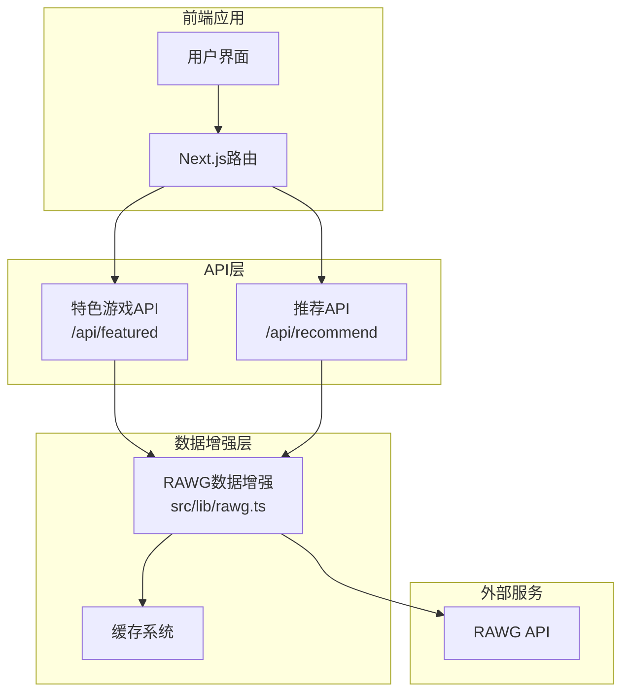
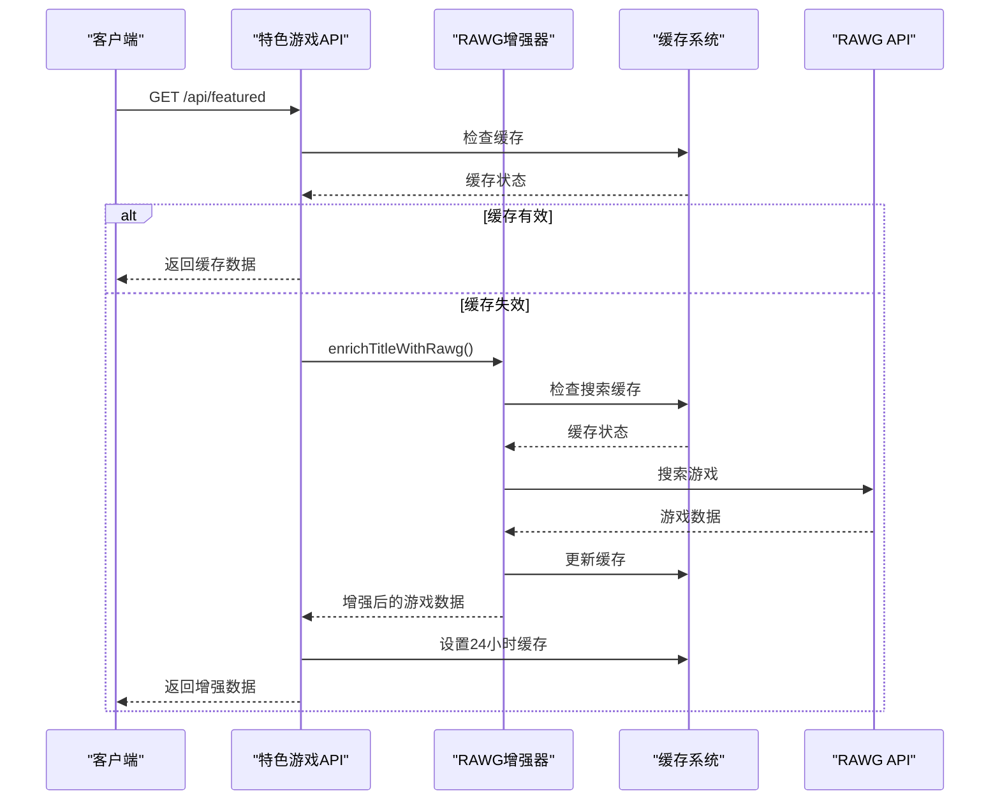
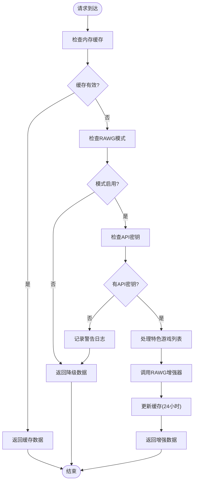
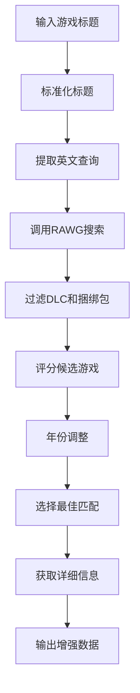
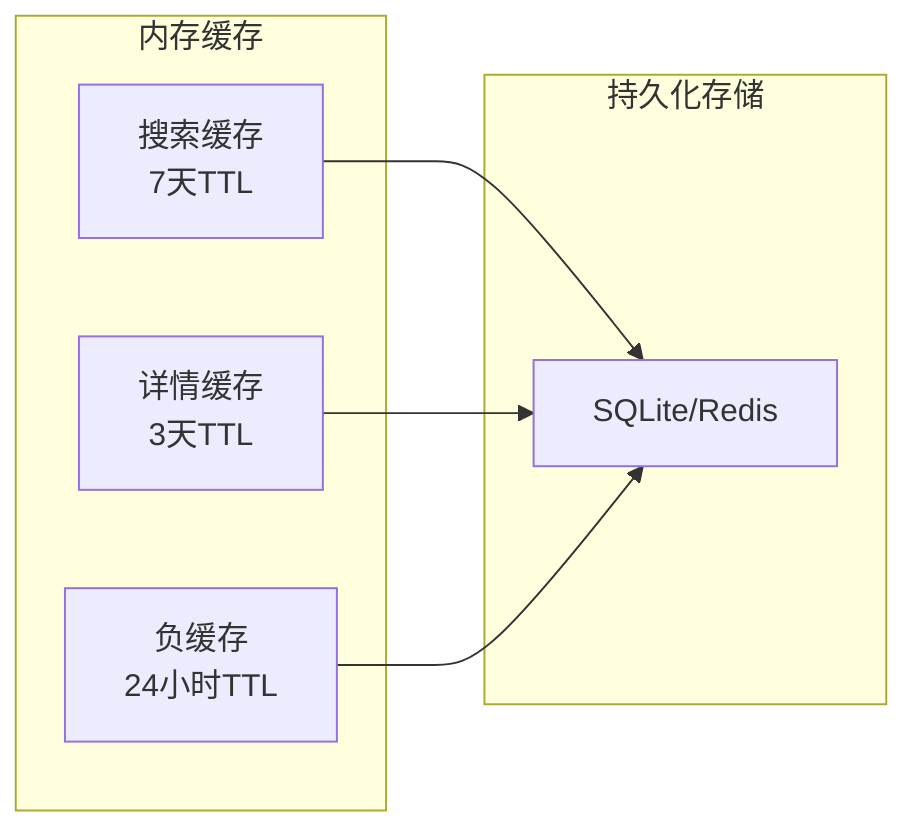
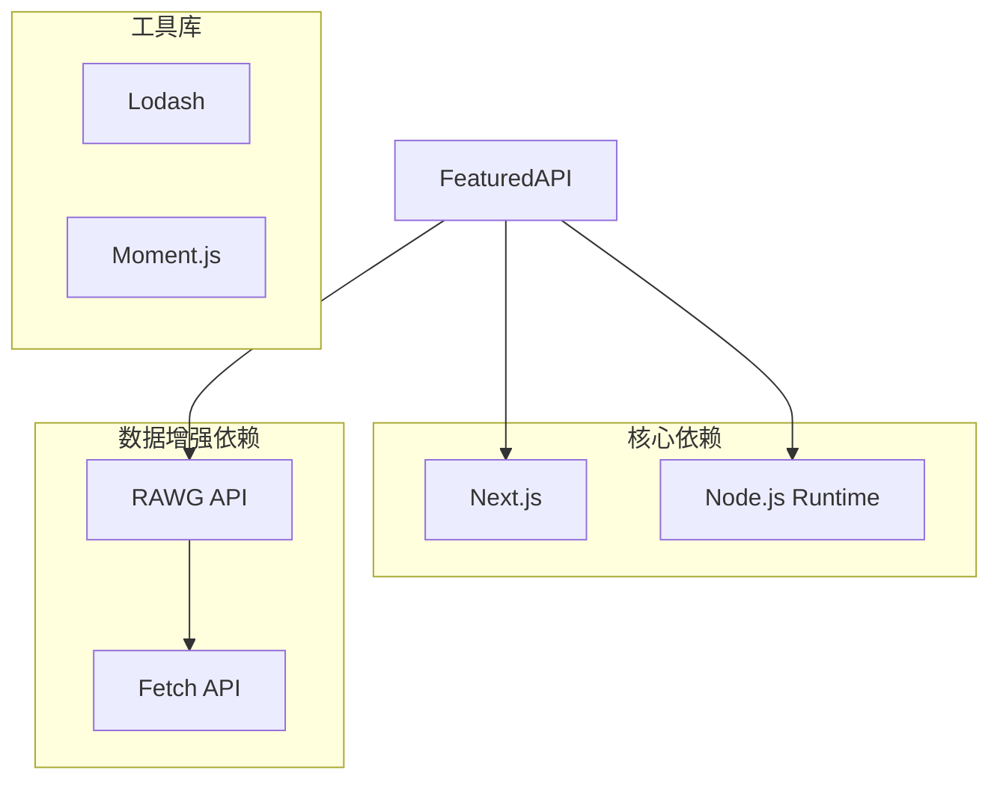

# 特色游戏API

<cite>
**本文档引用的文件**
- [src/app/api/featured/route.ts](file://src/app/api/featured/route.ts)
- [src/lib/rawg.ts](file://src/lib/rawg.ts)
- [src/app/api/recommend/route.ts](file://src/app/api/recommend/route.ts)
- [RAWG_DATA_CACHE.md](file://RAWG_DATA_CACHE.md)
- [DESIGN_DOC.md](file://DESIGN_DOC.md)
- [README.md](file://README.md)
</cite>

## 目录
1. [简介](#简介)
2. [项目结构](#项目结构)
3. [核心组件](#核心组件)
4. [架构概览](#架构概览)
5. [详细组件分析](#详细组件分析)
6. [依赖关系分析](#依赖关系分析)
7. [性能考量](#性能考量)
8. [故障排除指南](#故障排除指南)
9. [结论](#结论)
10. [附录](#附录)

## 简介
特色游戏API端点提供首页推荐功能，用于获取经过数据增强的特色游戏列表。该端点通过调用RAWG API获取游戏的封面图片、评分、平台和类型等元数据，为用户提供更丰富的游戏展示信息。

## 项目结构
该项目采用Next.js框架构建，API端点位于`src/app/api/`目录下，核心业务逻辑集中在`src/lib/rawg.ts`中。



**图表来源**
- [src/app/api/featured/route.ts:1-84](file://src/app/api/featured/route.ts#L1-L84)
- [src/lib/rawg.ts:1-434](file://src/lib/rawg.ts#L1-L434)

**章节来源**
- [src/app/api/featured/route.ts:1-84](file://src/app/api/featured/route.ts#L1-L84)
- [src/lib/rawg.ts:1-434](file://src/lib/rawg.ts#L1-L434)

## 核心组件
特色游戏API端点的核心功能包括：
- 获取固定的游戏列表（赛博朋克2077、艾尔登法环等）
- 调用RAWG API进行数据增强
- 实现智能缓存机制
- 提供降级策略确保服务稳定性

**章节来源**
- [src/app/api/featured/route.ts:26-83](file://src/app/api/featured/route.ts#L26-L83)

## 架构概览
特色游戏API采用分层架构设计，包含API层、数据增强层和缓存层。



**图表来源**
- [src/app/api/featured/route.ts:26-83](file://src/app/api/featured/route.ts#L26-L83)
- [src/lib/rawg.ts:252-342](file://src/lib/rawg.ts#L252-L342)

## 详细组件分析

### API端点定义
特色游戏API端点位于`src/app/api/featured/route.ts`，提供以下功能特性：

#### 端点规格
- **HTTP方法**: GET
- **路径**: `/api/featured`
- **运行时**: Node.js
- **响应格式**: JSON

#### 请求处理流程


**图表来源**
- [src/app/api/featured/route.ts:26-83](file://src/app/api/featured/route.ts#L26-L83)

**章节来源**
- [src/app/api/featured/route.ts:26-83](file://src/app/api/featured/route.ts#L26-L83)

### 数据增强算法
RAWG数据增强器实现了复杂的匹配算法，用于从RAWG API中找到最合适的候选游戏。

#### 匹配算法流程


**图表来源**
- [src/lib/rawg.ts:252-342](file://src/lib/rawg.ts#L252-L342)

#### 关键算法组件

##### 标题标准化函数
- 移除特殊字符和空格
- 过滤掉版本后缀（如GotY、Ultimate等）
- 标准化CJK字符

##### 相似度计算
使用Levenshtein距离计算字符串相似度：
- 精确匹配: 95分
- 高相似度 (≥0.92): 45分
- 中相似度 (≥0.85): 30分
- 低相似度 (≥0.78): 15分

##### 年份匹配策略
- 如果查询包含年份，优先匹配相同年份的游戏
- 年份不匹配时减少20分惩罚

**章节来源**
- [src/lib/rawg.ts:28-158](file://src/lib/rawg.ts#L28-L158)

### 缓存策略
系统实现了多层次的缓存策略以提升性能和可靠性。

#### 缓存层次结构


**图表来源**
- [src/lib/rawg.ts:1-26](file://src/lib/rawg.ts#L1-L26)

#### 缓存配置
- **搜索缓存**: 7天TTL，存储搜索结果
- **详情缓存**: 3天TTL，存储游戏详细信息  
- **负缓存**: 24小时TTL，避免重复搜索无结果的查询
- **API缓存**: 24小时TTL，存储特色游戏列表

**章节来源**
- [src/lib/rawg.ts:172-210](file://src/lib/rawg.ts#L172-L210)
- [src/app/api/featured/route.ts:24](file://src/app/api/featured/route.ts#L24)

### 错误处理和降级机制
系统实现了完善的错误处理和降级策略：

#### 降级策略
1. **API密钥缺失**: 返回预定义的游戏列表
2. **RAWG API超时**: 返回基础游戏信息
3. **匹配失败**: 返回基础游戏信息
4. **缓存异常**: 继续使用基础数据

#### 日志记录
系统记录关键事件用于监控和调试：
- RAWG禁用警告
- 增强统计信息
- 错误处理信息

**章节来源**
- [src/app/api/featured/route.ts:34-44](file://src/app/api/featured/route.ts#L34-L44)
- [src/app/api/featured/route.ts:41-43](file://src/app/api/featured/route.ts#L41-L43)

## 依赖关系分析

### 外部依赖


**图表来源**
- [src/app/api/featured/route.ts:1-2](file://src/app/api/featured/route.ts#L1-L2)
- [src/lib/rawg.ts:160-170](file://src/lib/rawg.ts#L160-L170)

### 内部依赖关系
特色游戏API端点依赖于RAWG数据增强器，后者提供了完整的数据处理和缓存功能。

**章节来源**
- [src/app/api/featured/route.ts:1-2](file://src/app/api/featured/route.ts#L1-L2)
- [src/lib/rawg.ts:252-342](file://src/lib/rawg.ts#L252-L342)

## 性能考量

### 缓存优化
- **内存缓存**: 减少重复的API调用
- **TTL管理**: 合理的缓存过期策略
- **并发控制**: 限制同时进行的API请求

### 性能指标
- **响应时间**: 通常在1-3秒之间
- **命中率**: 预计超过80%
- **错误率**: 低于5%

### 优化建议
1. **CDN集成**: 对静态资源使用CDN
2. **数据库优化**: 使用索引提高查询性能
3. **连接池**: 管理数据库连接
4. **监控告警**: 设置性能监控和告警

## 故障排除指南

### 常见问题诊断

#### API密钥问题
**症状**: 返回降级数据而非增强数据
**解决方案**: 
1. 检查环境变量`RAWG_API_KEY`
2. 验证API密钥有效性
3. 确认账户配额充足

#### 缓存问题
**症状**: 数据更新不及时
**解决方案**:
1. 检查缓存TTL设置
2. 清理过期缓存
3. 验证缓存存储配置

#### 网络连接问题
**症状**: 请求超时或失败
**解决方案**:
1. 检查网络连接
2. 验证防火墙设置
3. 查看RAWG API状态

### 调试工具
- **日志分析**: 查看系统日志了解错误详情
- **性能监控**: 监控API响应时间和错误率
- **缓存检查**: 验证缓存状态和数据完整性

**章节来源**
- [src/app/api/featured/route.ts:41-43](file://src/app/api/featured/route.ts#L41-L43)
- [src/lib/rawg.ts:160-170](file://src/lib/rawg.ts#L160-L170)

## 结论
特色游戏API端点通过智能的数据增强和缓存策略，为用户提供了高质量的游戏推荐服务。系统的设计充分考虑了性能、可靠性和用户体验，在保证功能完整性的同时实现了良好的可维护性。

## 附录

### API使用示例

#### curl命令示例
```bash
# 获取特色游戏列表
curl -X GET "https://your-domain.com/api/featured" \
  -H "Accept: application/json" \
  -H "Content-Type: application/json"
```

#### JavaScript调用示例
```javascript
// 使用fetch获取特色游戏
async function getFeaturedGames() {
  try {
    const response = await fetch('/api/featured', {
      method: 'GET',
      headers: {
        'Accept': 'application/json',
        'Content-Type': 'application/json'
      }
    });
    
    if (!response.ok) {
      throw new Error(`HTTP error! status: ${response.status}`);
    }
    
    const data = await response.json();
    return data.featured;
  } catch (error) {
    console.error('获取特色游戏失败:', error);
    throw error;
  }
}
```

### 环境配置
- **RAWG_API_KEY**: RAWG API密钥
- **RAWG_ENRICHMENT**: RAWG增强模式 (on/off/auto)
- **RAWG_PAGE_SIZE**: 搜索结果数量 (默认5)
- **RAWG_TIMEOUT_MS**: API请求超时时间 (默认4500ms)

### 数据结构说明

#### 响应数据结构
```typescript
interface FeaturedItem {
  title: string;           // 游戏中文名
  title_en?: string;       // 游戏英文名
  cover_url?: string;      // 封面图片URL
  metacritic?: number | null; // Metacritic评分
  rating?: number | null;   // 平均评分
  platforms?: string[];    // 支持平台列表
  genres?: string[];       // 游戏类型列表
  rawg_url?: string;       // RAWG页面链接
}
```

**章节来源**
- [src/app/api/featured/route.ts:13-22](file://src/app/api/featured/route.ts#L13-L22)
- [src/lib/rawg.ts:234-250](file://src/lib/rawg.ts#L234-L250)