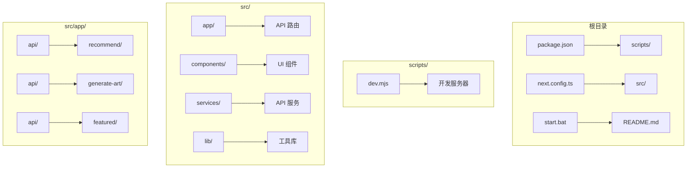
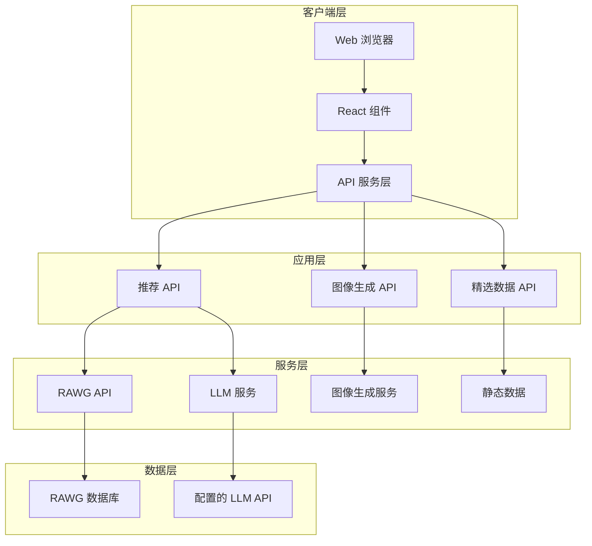
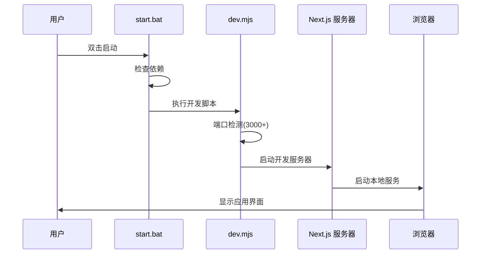
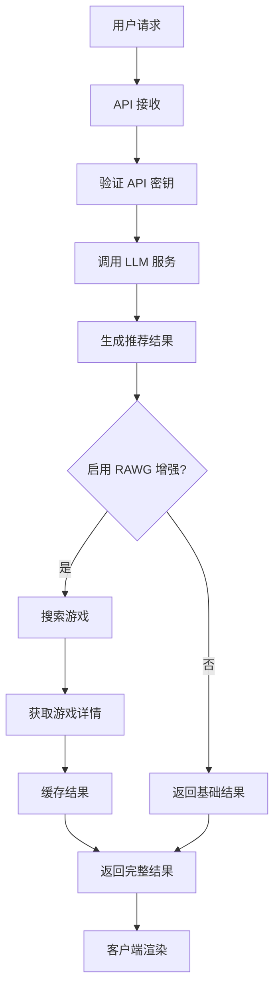
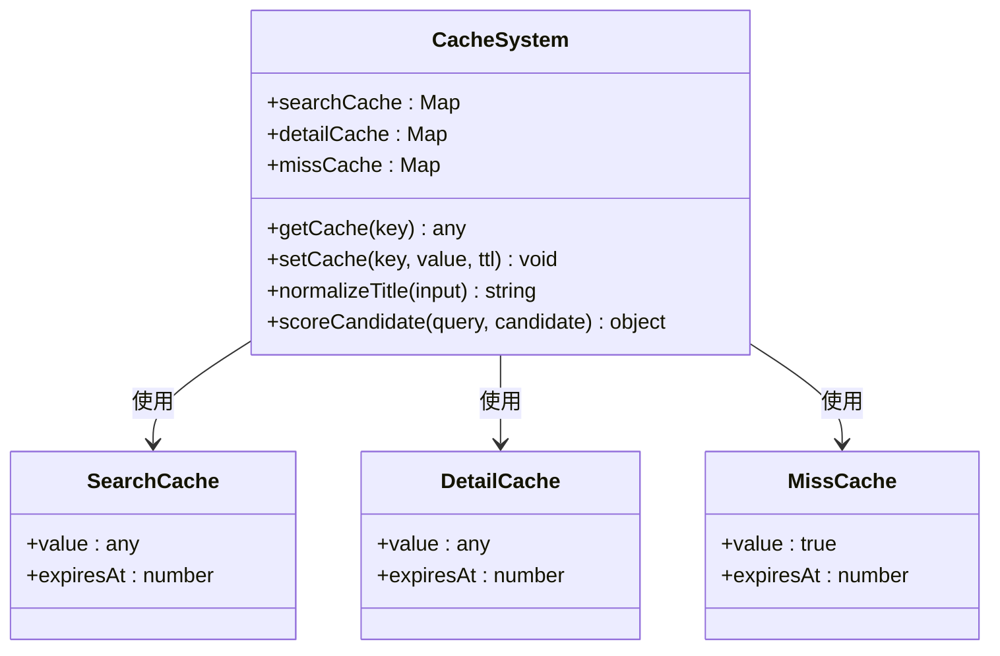
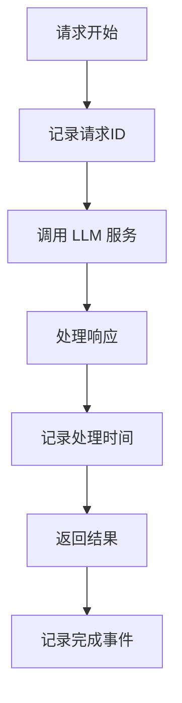

# 部署操作

<cite>
**本文档引用的文件**
- [README.md](file://README.md)
- [package.json](file://package.json)
- [next.config.ts](file://next.config.ts)
- [start.bat](file://start.bat)
- [test_start.bat](file://test_start.bat)
- [scripts/dev.mjs](file://scripts/dev.mjs)
- [src/services/gemini.ts](file://src/services/gemini.ts)
- [src/app/api/recommend/route.ts](file://src/app/api/recommend/route.ts)
- [src/lib/rawg.ts](file://src/lib/rawg.ts)
</cite>

## 目录
1. [简介](#简介)
2. [项目结构](#项目结构)
3. [核心组件](#核心组件)
4. [架构概览](#架构概览)
5. [详细组件分析](#详细组件分析)
6. [依赖关系分析](#依赖关系分析)
7. [性能考虑](#性能考虑)
8. [故障排除指南](#故障排除指南)
9. [结论](#结论)

## 简介

JoyMate 是一个基于 AI 的游戏推荐应用，采用 Next.js 构建的全栈 Web 应用程序。该应用利用大语言模型（LLM）提供智能游戏推荐服务，支持多智能体讨论机制，能够根据用户的情绪、偏好和场景提供个性化的游戏推荐。

## 项目结构

该项目采用现代化的 Next.js 15 架构，主要包含以下结构：



**图表来源**
- [package.json:1-35](file://package.json#L1-L35)
- [next.config.ts:1-10](file://next.config.ts#L1-L10)

**章节来源**
- [package.json:1-35](file://package.json#L1-L35)
- [next.config.ts:1-10](file://next.config.ts#L1-L10)

## 核心组件

### 前端组件架构

应用采用模块化的组件架构，主要包括：

- **MainContent**: 主要的聊天界面和推荐逻辑
- **Sidebar**: 左侧导航和预设问题
- **RightSidebar**: 右侧边栏
- **GameDetailsModal**: 游戏详情模态框
- **ImageGeneratorModal**: 图像生成模态框

### API 服务层

应用提供了多个 API 端点：

- `/api/recommend`: 游戏推荐服务
- `/api/generate-art`: AI 图像生成功能
- `/api/featured`: 精选游戏数据

### 数据缓存系统

实现了两级缓存机制来优化性能：

- **搜索缓存**: 缓存 RAWG API 的搜索结果
- **详情缓存**: 缓存游戏详情信息
- **负缓存**: 缓存搜索失败的结果

**章节来源**
- [src/components/MainContent.tsx:1-800](file://src/components/MainContent.tsx#L1-L800)
- [src/lib/rawg.ts:1-434](file://src/lib/rawg.ts#L1-L434)

## 架构概览



**图表来源**
- [src/services/gemini.ts:1-32](file://src/services/gemini.ts#L1-L32)
- [src/app/api/recommend/route.ts:1-185](file://src/app/api/recommend/route.ts#L1-L185)

## 详细组件分析

### 开发服务器启动流程



**图表来源**
- [start.bat:1-84](file://start.bat#L1-L84)
- [scripts/dev.mjs:1-51](file://scripts/dev.mjs#L1-L51)

### 推荐系统工作流程



**图表来源**
- [src/app/api/recommend/route.ts:14-185](file://src/app/api/recommend/route.ts#L14-L185)
- [src/lib/rawg.ts:351-434](file://src/lib/rawg.ts#L351-L434)

### 缓存系统设计



**图表来源**
- [src/lib/rawg.ts:1-434](file://src/lib/rawg.ts#L1-L434)

**章节来源**
- [scripts/dev.mjs:17-23](file://scripts/dev.mjs#L17-L23)
- [src/app/api/recommend/route.ts:7-12](file://src/app/api/recommend/route.ts#L7-L12)

## 依赖关系分析

### 核心依赖关系

```mermaid
graph LR
subgraph "运行时依赖"
A[next] --> B[React 19]
C[openai] --> D[LLM 通信]
E[@google/genai] --> F[Google Gemini]
end
subgraph "开发依赖"
G[typescript] --> H[类型检查]
I[tailwindcss] --> J[样式框架]
K[eslint] --> L[代码质量]
end
subgraph "构建工具"
M[next build] --> N[生产构建]
O[next start] --> P[生产服务器]
end
```

**图表来源**
- [package.json:12-33](file://package.json#L12-L33)

### 环境变量配置

应用使用以下关键环境变量：

| 环境变量 | 用途 | 默认值 |
|---------|------|--------|
| `GEMINI_API_KEY` | Google Gemini API 密钥 | 无 |
| `QWEN_API_KEY` | 阿里云通义千问 API 密钥 | 无 |
| `RAWG_API_KEY` | RAWG 游戏数据库 API 密钥 | 无 |
| `RAWG_ENRICHMENT` | RAWG 数据增强开关 | auto |

**章节来源**
- [src/app/api/recommend/route.ts:20-23](file://src/app/api/recommend/route.ts#L20-L23)
- [src/lib/rawg.ts:14-26](file://src/lib/rawg.ts#L14-L26)

## 性能考虑

### 缓存策略

应用实现了多层次的缓存策略来优化性能：

1. **搜索缓存**: 缓存 RAWG 搜索结果，TTL 7天
2. **详情缓存**: 缓存游戏详情信息，TTL 3天  
3. **负缓存**: 缓存搜索失败的结果，TTL 24小时

### 并发控制

- RAWG API 调用并发限制为 2-3 个请求
- 搜索页面大小限制为 5 个结果
- 单请求超时时间为 3-5 秒

### 端口管理

开发服务器支持动态端口选择，从 3000 开始尝试可用端口，最多尝试 30 个端口。

## 故障排除指南

### 常见部署问题

1. **端口占用问题**
   - 解决方案：使用 `start.bat` 脚本自动清理端口占用
   - 检查命令：`netstat -ano | findstr :3000`

2. **API 密钥配置错误**
   - 确保在 `.env.local` 文件中正确设置 API 密钥
   - 支持的密钥：`GEMINI_API_KEY` 或 `QWEN_API_KEY`

3. **RAWG API 限制**
   - 检查 `RAWG_API_KEY` 是否有效
   - 监控 API 速率限制和配额使用情况

4. **依赖安装问题**
   - 清理 `node_modules` 和 `package-lock.json`
   - 重新执行 `npm install`

### 性能监控

应用内置了详细的日志记录系统：



**图表来源**
- [src/app/api/recommend/route.ts:36-104](file://src/app/api/recommend/route.ts#L36-L104)

**章节来源**
- [start.bat:42-48](file://start.bat#L42-L48)
- [scripts/dev.mjs:6-23](file://scripts/dev.mjs#L6-L23)

## 结论

JoyMate 项目提供了一个完整的 AI 驱动游戏推荐解决方案，具有以下特点：

- **现代化技术栈**: 基于 Next.js 15 和 React 19
- **智能推荐系统**: 支持多智能体讨论机制
- **高性能架构**: 实现了多级缓存和并发控制
- **易于部署**: 提供一键启动脚本和清晰的部署文档
- **可扩展性**: 模块化设计支持功能扩展

该应用适合部署在支持 Node.js 的环境中，生产环境建议配置适当的环境变量和监控系统。