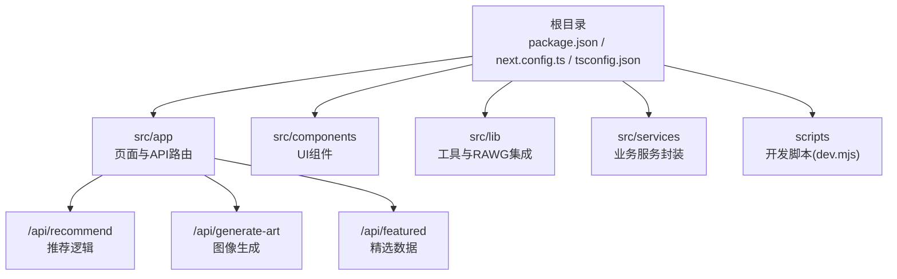
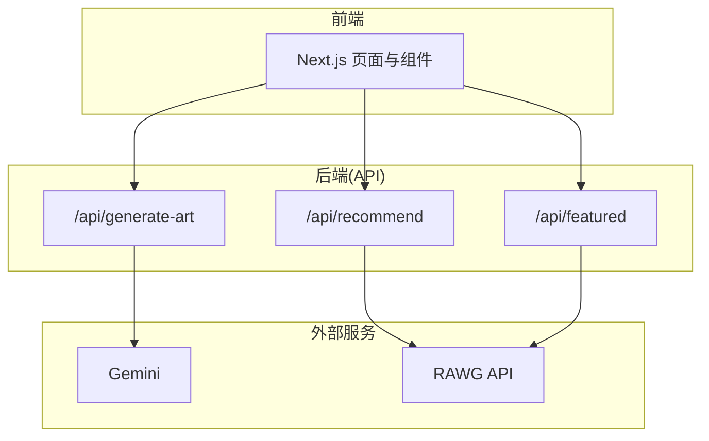
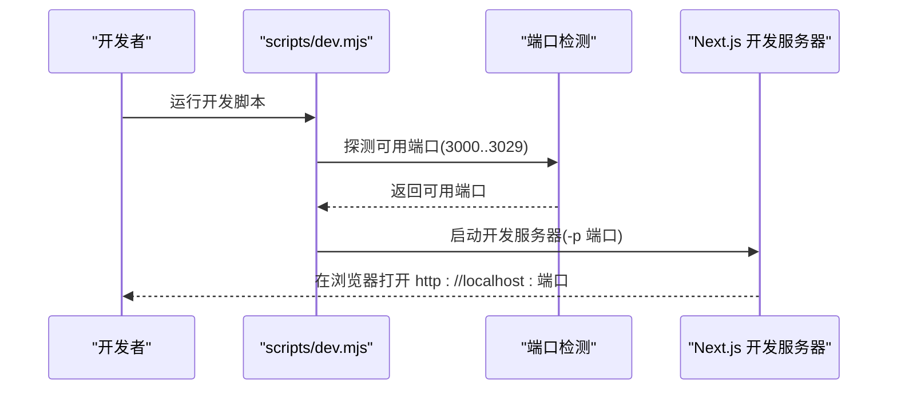
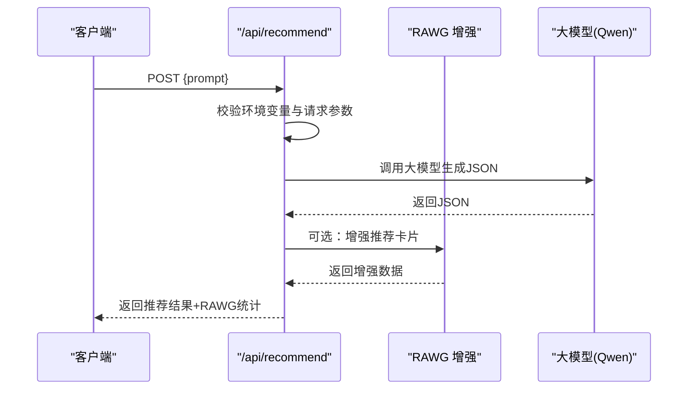
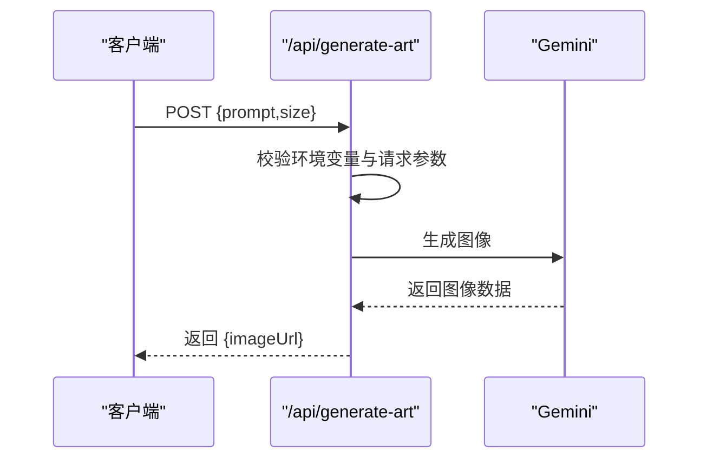
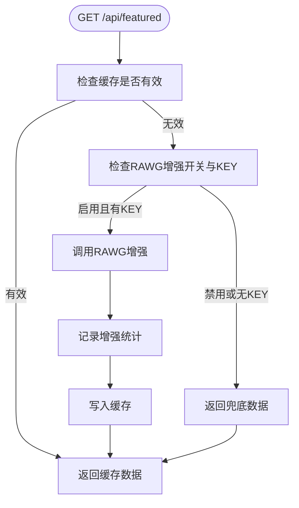
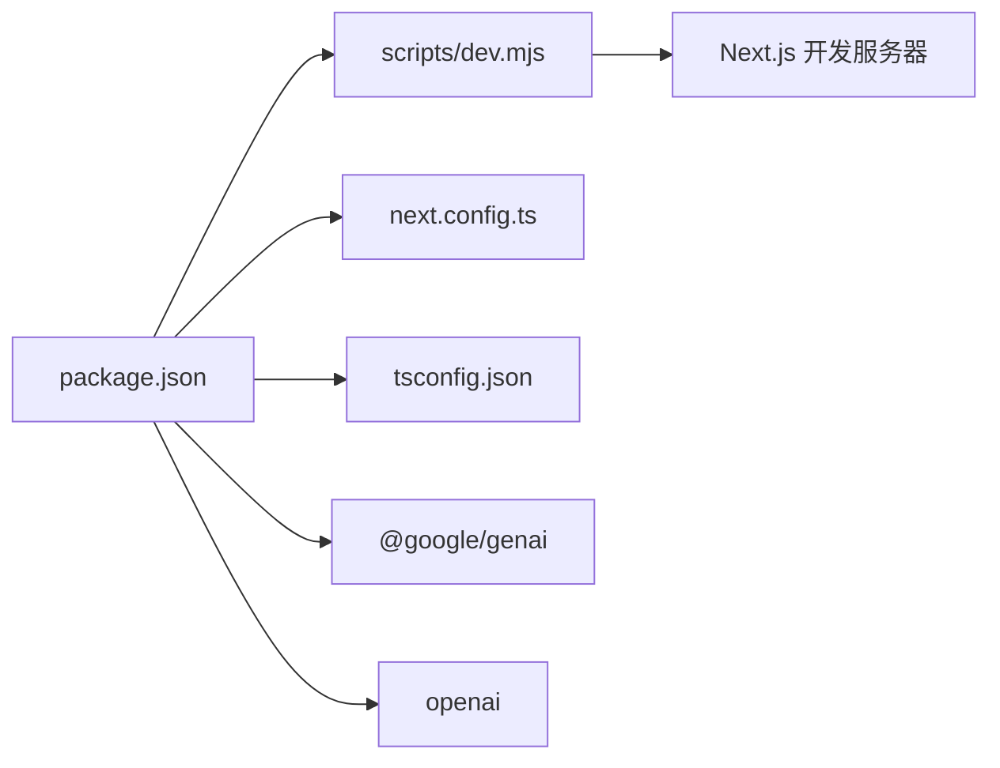

# 快速开始

<cite>
**本文引用的文件**
- [README.md](file://README.md)
- [package.json](file://package.json)
- [scripts/dev.mjs](file://scripts/dev.mjs)
- [next.config.ts](file://next.config.ts)
- [src/services/gemini.ts](file://src/services/gemini.ts)
- [src/app/api/recommend/route.ts](file://src/app/api/recommend/route.ts)
- [src/app/api/generate-art/route.ts](file://src/app/api/generate-art/route.ts)
- [src/app/api/featured/route.ts](file://src/app/api/featured/route.ts)
- [src/lib/rawg.ts](file://src/lib/rawg.ts)
- [tsconfig.json](file://tsconfig.json)
- [eslint.config.mjs](file://eslint.config.mjs)
- [postcss.config.mjs](file://postcss.config.mjs)
- [DESIGN_DOC.md](file://DESIGN_DOC.md)
- [RAWG_DATA_CACHE.md](file://RAWG_DATA_CACHE.md)
</cite>

## 目录
1. [简介](#简介)
2. [项目结构](#项目结构)
3. [核心组件](#核心组件)
4. [架构总览](#架构总览)
5. [详细组件分析](#详细组件分析)
6. [依赖关系分析](#依赖关系分析)
7. [性能注意事项](#性能注意事项)
8. [故障排除指南](#故障排除指南)
9. [结论](#结论)
10. [附录](#附录)

## 简介
本指南面向新加入的开发者，帮助你在最短时间内完成 JoyMate 项目的开发环境搭建、本地运行与生产部署。项目基于 Next.js 15，使用 TypeScript，集成 Gemini 图像生成功能与可选的 RAWG 游戏数据增强。你将学到：
- 开发环境要求（Node.js 与 npm 版本）
- 安装与依赖配置步骤
- 如何获取并配置 GEMINI_API_KEY 等关键环境变量
- 本地开发运行命令与生产构建/启动流程
- 常见初始化问题的排查与解决思路

## 项目结构
项目采用 Next.js 应用结构，核心目录与职责概览：
- 根目录包含项目配置、脚本与文档
- src/app 下为页面与 API 路由（Next.js App Router）
- src/components 为 UI 组件
- src/lib 为通用工具与第三方集成（如 RAWG）
- src/services 为业务服务封装（如 Gemini）

图表来源
- [next.config.ts:1-10](file://next.config.ts#L1-L10)
- [package.json:1-35](file://package.json#L1-L35)
- [src/app/api/recommend/route.ts:1-157](file://src/app/api/recommend/route.ts#L1-L157)
- [src/app/api/generate-art/route.ts:1-61](file://src/app/api/generate-art/route.ts#L1-L61)
- [src/app/api/featured/route.ts:1-84](file://src/app/api/featured/route.ts#L1-L84)

章节来源
- [package.json:1-35](file://package.json#L1-L35)
- [next.config.ts:1-10](file://next.config.ts#L1-L10)
- [tsconfig.json:1-44](file://tsconfig.json#L1-L44)

## 核心组件
- 开发脚本与端口选择：scripts/dev.mjs 自动寻找可用端口（默认从 3000 起），并启动 Next.js 开发服务器。
- API 路由：
  - /api/recommend：调用大模型生成推荐，支持 RAWG 数据增强（可选）
  - /api/generate-art：调用 Gemini 生成图像
  - /api/featured：获取精选游戏列表，支持 RAWG 增强
- RAWG 工具：提供搜索、详情、缓存与匹配算法，用于增强推荐卡片的真实数据。
- 配置文件：next.config.ts、tsconfig.json、eslint.config.mjs、postcss.config.mjs。

章节来源
- [scripts/dev.mjs:1-51](file://scripts/dev.mjs#L1-L51)
- [src/app/api/recommend/route.ts:1-157](file://src/app/api/recommend/route.ts#L1-L157)
- [src/app/api/generate-art/route.ts:1-61](file://src/app/api/generate-art/route.ts#L1-L61)
- [src/app/api/featured/route.ts:1-84](file://src/app/api/featured/route.ts#L1-L84)
- [src/lib/rawg.ts:1-434](file://src/lib/rawg.ts#L1-L434)
- [next.config.ts:1-10](file://next.config.ts#L1-L10)
- [tsconfig.json:1-44](file://tsconfig.json#L1-L44)
- [eslint.config.mjs:1-12](file://eslint.config.mjs#L1-L12)
- [postcss.config.mjs:1-10](file://postcss.config.mjs#L1-L10)

## 架构总览
系统分为三层：前端页面与组件、Next.js API 路由、外部服务（Gemini、RAWG）。API 路由负责与外部服务交互，并可选地进行数据增强。

图表来源
- [src/app/api/recommend/route.ts:1-157](file://src/app/api/recommend/route.ts#L1-L157)
- [src/app/api/generate-art/route.ts:1-61](file://src/app/api/generate-art/route.ts#L1-L61)
- [src/app/api/featured/route.ts:1-84](file://src/app/api/featured/route.ts#L1-L84)
- [src/lib/rawg.ts:1-434](file://src/lib/rawg.ts#L1-L434)

## 详细组件分析

### 开发脚本与本地运行
- 自动端口选择：脚本会尝试从 3000 起连续探测可用端口，若 30 次内未找到则退出。
- 启动 Next.js 开发服务器：通过子进程调用 next bin，继承父进程环境变量。
- 信号处理：支持 SIGINT/SIGTERM，保证子进程与父进程同步退出。

图表来源
- [scripts/dev.mjs:17-47](file://scripts/dev.mjs#L17-L47)

章节来源
- [scripts/dev.mjs:1-51](file://scripts/dev.mjs#L1-L51)

### 推荐 API（/api/recommend）
- 功能：接收用户输入，调用大模型生成结构化推荐，可选调用 RAWG 增强推荐卡片。
- 关键点：
  - 支持 QWEN_API_KEY 或 GEMINI_API_KEY（优先级：QWEN > GEMINI）
  - 可通过 RAWG_ENRICHMENT 控制是否启用 RAWG 增强（auto/on/off）
  - 对配额不足等错误进行友好降级，返回可读提示
  - 记录 RAWG 增强统计日志

图表来源
- [src/app/api/recommend/route.ts:14-155](file://src/app/api/recommend/route.ts#L14-L155)
- [src/lib/rawg.ts:351-433](file://src/lib/rawg.ts#L351-L433)

章节来源
- [src/app/api/recommend/route.ts:1-157](file://src/app/api/recommend/route.ts#L1-L157)
- [src/lib/rawg.ts:1-434](file://src/lib/rawg.ts#L1-L434)

### 图像生成 API（/api/generate-art）
- 功能：接收 prompt 与尺寸，调用 Gemini 生成图像，返回 data URL。
- 关键点：
  - 严格校验 GEMINI_API_KEY
  - 对配额不足进行友好提示，返回结构化错误信息
  - 使用指定模型与图像配置生成符合 16:9 的图像

图表来源
- [src/app/api/generate-art/route.ts:6-59](file://src/app/api/generate-art/route.ts#L6-L59)

章节来源
- [src/app/api/generate-art/route.ts:1-61](file://src/app/api/generate-art/route.ts#L1-L61)

### 精选数据 API（/api/featured）
- 功能：返回精选游戏列表，支持 RAWG 增强与缓存。
- 关键点：
  - 支持 RAWG_ENRICHMENT 控制增强开关
  - 未启用增强或无 KEY 时返回兜底数据
  - 设置缓存过期时间，减少重复请求

图表来源
- [src/app/api/featured/route.ts:26-83](file://src/app/api/featured/route.ts#L26-L83)
- [src/lib/rawg.ts:252-342](file://src/lib/rawg.ts#L252-L342)

章节来源
- [src/app/api/featured/route.ts:1-84](file://src/app/api/featured/route.ts#L1-L84)
- [src/lib/rawg.ts:1-434](file://src/lib/rawg.ts#L1-L434)

### RAWG 数据增强与缓存
- 能力：搜索游戏、获取详情、缓存与匹配算法，提升推荐卡片的真实性与一致性。
- 特性：
  - 两级缓存（搜索对齐缓存与详情缓存）
  - 匹配算法包含规范化、相似度计算、年份与数字冲突处理
  - 并发控制与超时保护，失败降级策略明确

章节来源
- [src/lib/rawg.ts:1-434](file://src/lib/rawg.ts#L1-L434)
- [RAWG_DATA_CACHE.md:1-153](file://RAWG_DATA_CACHE.md#L1-L153)

### 配置文件要点
- next.config.ts：启用严格模式，指定构建目录为 .next-joymate2。
- tsconfig.json：严格类型检查、ES2022 目标、路径别名 @/*。
- eslint.config.mjs：基于 Next.js 核心 Web Vitals 规则。
- postcss.config.mjs：集成 Tailwind PostCSS 插件。

章节来源
- [next.config.ts:1-10](file://next.config.ts#L1-L10)
- [tsconfig.json:1-44](file://tsconfig.json#L1-L44)
- [eslint.config.mjs:1-12](file://eslint.config.mjs#L1-L12)
- [postcss.config.mjs:1-10](file://postcss.config.mjs#L1-L10)

## 依赖关系分析
- 依赖管理：package.json 中定义了 Next.js、React、Tailwind、TypeScript、ESLint 等依赖，以及 @google/genai、openai 等外部服务 SDK。
- 开发脚本：dev 脚本指向 scripts/dev.mjs，进一步调用 next bin 启动开发服务器。
- 构建与启动：build 与 start 脚本分别执行 next build 与 next start。

图表来源
- [package.json:5-11](file://package.json#L5-L11)
- [scripts/dev.mjs:34-42](file://scripts/dev.mjs#L34-L42)
- [next.config.ts:4-6](file://next.config.ts#L4-L6)

章节来源
- [package.json:1-35](file://package.json#L1-L35)
- [scripts/dev.mjs:1-51](file://scripts/dev.mjs#L1-L51)
- [next.config.ts:1-10](file://next.config.ts#L1-L10)
- [tsconfig.json:1-44](file://tsconfig.json#L1-L44)

## 性能注意事项
- 端口探测：开发脚本会尝试多个端口，若机器占用较多端口，可能需要等待更多尝试。
- RAWG 增强：开启增强会增加网络请求与并发，建议合理设置并发与超时，避免阻塞。
- 缓存策略：利用搜索与详情缓存降低外部 API 压力，提升响应速度。
- 构建目录：自定义构建目录可避免与默认目录冲突，便于多环境隔离。

## 故障排除指南
- 端口被占用
  - 现象：无法启动开发服务器或提示端口冲突
  - 处理：关闭占用端口的进程，或等待脚本自动选择下一个可用端口
  - 参考：[scripts/dev.mjs:17-29](file://scripts/dev.mjs#L17-L29)
- 缺少 GEMINI_API_KEY
  - 现象：图像生成接口返回缺失密钥错误
  - 处理：在环境变量中设置 GEMINI_API_KEY
  - 参考：[src/app/api/generate-art/route.ts:12-15](file://src/app/api/generate-art/route.ts#L12-L15)
- 缺少 QWEN_API_KEY 或 QWEN_BASE_URL
  - 现象：推荐接口返回缺失密钥错误
  - 处理：设置 QWEN_API_KEY 或切换为 GEMINI_API_KEY；如需自定义基座，设置 QWEN_BASE_URL
  - 参考：[src/app/api/recommend/route.ts:20-31](file://src/app/api/recommend/route.ts#L20-L31)
- RAWG 增强未生效
  - 现象：推荐卡片缺少封面/评分/平台等真实数据
  - 处理：确认 RAWG_API_KEY 是否设置；检查 RAWG_ENRICHMENT 是否为 on；查看日志中的增强统计
  - 参考：[src/app/api/recommend/route.ts:88-127](file://src/app/api/recommend/route.ts#L88-L127)，[src/app/api/featured/route.ts:34-45](file://src/app/api/featured/route.ts#L34-L45)
- 配额不足
  - 现象：接口返回友好提示，告知配额已用完
  - 处理：稍后再试，或升级账户额度
  - 参考：[src/app/api/recommend/route.ts:137-149](file://src/app/api/recommend/route.ts#L137-L149)，[src/app/api/generate-art/route.ts:43-54](file://src/app/api/generate-art/route.ts#L43-L54)
- 构建失败或启动异常
  - 现象：build/start 报错
  - 处理：检查 Node.js 与 npm 版本是否满足要求；清理 node_modules 与缓存后重试
  - 参考：[README.md:20-22](file://README.md#L20-L22)，[package.json:12-32](file://package.json#L12-L32)

章节来源
- [scripts/dev.mjs:17-29](file://scripts/dev.mjs#L17-L29)
- [src/app/api/generate-art/route.ts:12-15](file://src/app/api/generate-art/route.ts#L12-L15)
- [src/app/api/recommend/route.ts:20-31](file://src/app/api/recommend/route.ts#L20-L31)
- [src/app/api/recommend/route.ts:88-127](file://src/app/api/recommend/route.ts#L88-L127)
- [src/app/api/featured/route.ts:34-45](file://src/app/api/featured/route.ts#L34-L45)
- [src/app/api/recommend/route.ts:137-149](file://src/app/api/recommend/route.ts#L137-L149)
- [src/app/api/generate-art/route.ts:43-54](file://src/app/api/generate-art/route.ts#L43-L54)
- [README.md:20-22](file://README.md#L20-L22)
- [package.json:12-32](file://package.json#L12-L32)

## 结论
通过本指南，你可以快速完成 JoyMate 的环境准备、本地开发与生产部署。建议在本地开发时：
- 确保 Node.js 与 npm 版本满足要求
- 正确配置 GEMINI_API_KEY 与可选的 RAWG_API_KEY
- 使用提供的开发脚本启动项目，自动选择可用端口
- 在生产环境部署时，先构建再启动，并确保环境变量正确注入

## 附录

### 开发环境要求
- Node.js：>= 16.0.0
- npm：>= 7.0.0

章节来源
- [README.md:20-22](file://README.md#L20-L22)

### 安装与依赖配置
- 安装依赖：执行安装命令
- 本地运行：执行开发脚本，自动选择端口并启动开发服务器
- 构建与启动：先构建，再启动生产服务器

章节来源
- [README.md:24-28](file://README.md#L24-L28)
- [package.json:5-11](file://package.json#L5-L11)
- [scripts/dev.mjs:25-42](file://scripts/dev.mjs#L25-L42)

### 环境变量配置
- GEMINI_API_KEY：用于图像生成接口
- QWEN_API_KEY/QWEN_BASE_URL：用于推荐接口（可选，优先于 GEMINI）
- RAWG_API_KEY：用于 RAWG 数据增强（可选）
- RAWG_ENRICHMENT：控制是否启用 RAWG 增强（auto/on/off）

章节来源
- [src/app/api/generate-art/route.ts:12-15](file://src/app/api/generate-art/route.ts#L12-L15)
- [src/app/api/recommend/route.ts:20-31](file://src/app/api/recommend/route.ts#L20-L31)
- [src/app/api/featured/route.ts:27-45](file://src/app/api/featured/route.ts#L27-L45)
- [RAWG_DATA_CACHE.md:14-22](file://RAWG_DATA_CACHE.md#L14-L22)

### 本地开发与生产部署
- 本地开发：安装依赖后，运行开发脚本启动项目
- 生产部署：先构建应用，再启动生产服务器；确保生产环境变量中设置 GEMINI_API_KEY

章节来源
- [README.md:18-38](file://README.md#L18-L38)
- [package.json:8-10](file://package.json#L8-L10)

### 产品与技术背景
- 产品定位：AI 游戏买手，提供多智能体讨论与情绪/场景匹配的推荐
- 技术架构：前端 Next.js/React，后端 Next.js API，外部服务 Gemini 与 RAWG

章节来源
- [DESIGN_DOC.md:3-18](file://DESIGN_DOC.md#L3-L18)
- [DESIGN_DOC.md:41-74](file://DESIGN_DOC.md#L41-L74)