# 开发脚本工具

<cite>
**本文档引用的文件**
- [README.md](file://README.md)
- [package.json](file://package.json)
- [scripts/dev.mjs](file://scripts/dev.mjs)
- [src/app/page.tsx](file://src/app/page.tsx)
- [src/App.tsx](file://src/App.tsx)
- [src/components/Sidebar.tsx](file://src/components/Sidebar.tsx)
- [src/components/MainContent.tsx](file://src/components/MainContent.tsx)
- [src/services/gemini.ts](file://src/services/gemini.ts)
- [src/lib/rawg.ts](file://src/lib/rawg.ts)
- [next.config.ts](file://next.config.ts)
- [src/app/api/recommend/route.ts](file://src/app/api/recommend/route.ts)
- [src/app/api/generate-art/route.ts](file://src/app/api/generate-art/route.ts)
- [src/app/api/featured/route.ts](file://src/app/api/featured/route.ts)
- [DESIGN_DOC.md](file://DESIGN_DOC.md)
- [RAWG_DATA_CACHE.md](file://RAWG_DATA_CACHE.md)
</cite>

## 目录
1. [简介](#简介)
2. [项目结构](#项目结构)
3. [核心组件](#核心组件)
4. [架构概览](#架构概览)
5. [详细组件分析](#详细组件分析)
6. [依赖关系分析](#依赖关系分析)
7. [性能考虑](#性能考虑)
8. [故障排除指南](#故障排除指南)
9. [结论](#结论)

## 简介

JoyMate 是一个基于 AI 的游戏推荐应用，旨在为用户提供智能化的游戏选择辅助。该应用采用 Next.js 框架构建，集成了多种 AI 服务（Gemini 和 OpenAI）来提供个性化的游戏推荐体验。

应用的核心特色包括：
- 多智能体讨论机制：三个不同视角的 AI 代理（硬核、艺术、省钱）协同工作
- 情绪/场景匹配：基于用户当前状态和需求进行推荐
- 跨平台数据整合：支持多种游戏平台的信息
- 实时概念图像生成功能

## 项目结构

项目采用标准的 Next.js 应用程序结构，主要目录组织如下：

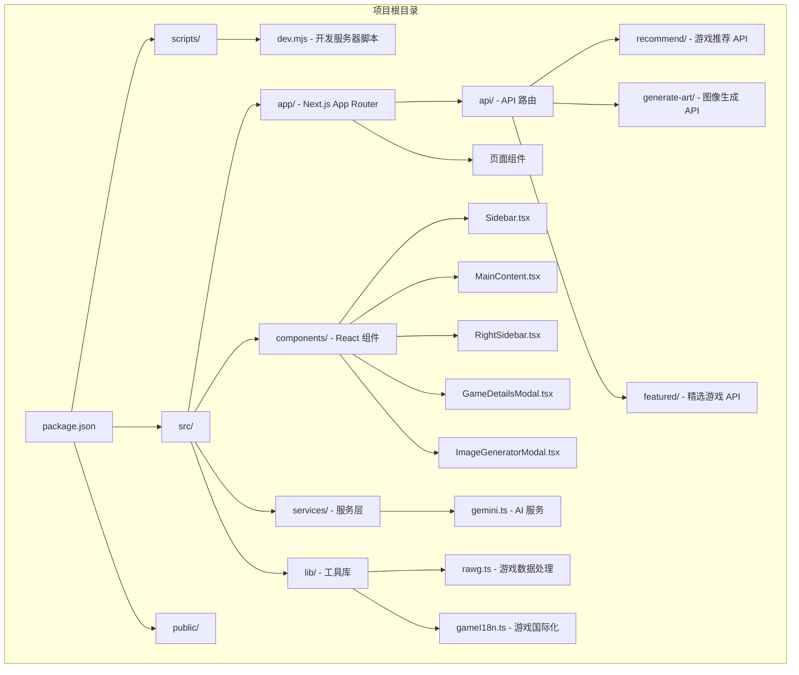

**图表来源**
- [package.json:1-35](file://package.json#L1-L35)
- [scripts/dev.mjs:1-51](file://scripts/dev.mjs#L1-L51)
- [src/app/api/recommend/route.ts:1-185](file://src/app/api/recommend/route.ts#L1-L185)

**章节来源**
- [package.json:1-35](file://package.json#L1-L35)
- [README.md:14-41](file://README.md#L14-L41)

## 核心组件

### 开发脚本系统

开发脚本工具是项目的核心基础设施，负责管理开发环境和构建流程。

#### 主要功能特性

1. **智能端口检测**：自动检测可用端口，避免端口冲突
2. **进程管理**：优雅地管理 Next.js 开发服务器进程
3. **信号处理**：正确处理 SIGINT 和 SIGTERM 信号
4. **环境隔离**：确保开发环境与生产环境的分离

#### 关键实现细节

- 端口检测算法：从指定起始端口开始，逐个检查可用性
- 进程生命周期管理：监听子进程退出事件并正确终止
- 跨平台兼容性：使用 Node.js 内置模块确保兼容性

**章节来源**
- [scripts/dev.mjs:1-51](file://scripts/dev.mjs#L1-L51)

### 前端应用架构

应用采用模块化组件设计，主要组件包括：

#### 主要组件层次

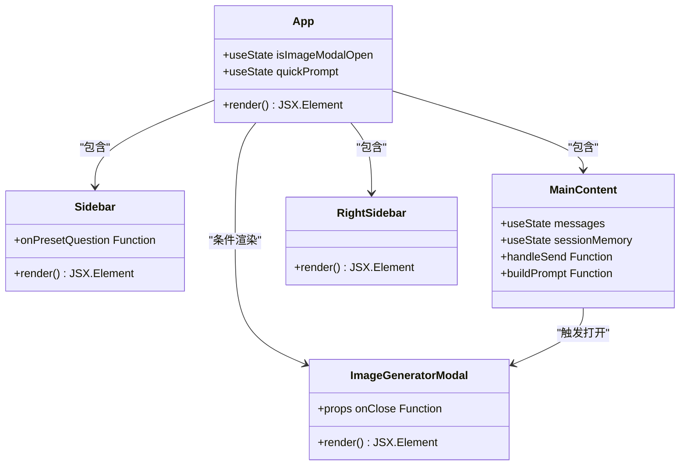

**图表来源**
- [src/App.tsx:12-24](file://src/App.tsx#L12-L24)
- [src/components/Sidebar.tsx:3-83](file://src/components/Sidebar.tsx#L3-L83)
- [src/components/MainContent.tsx:419-472](file://src/components/MainContent.tsx#L419-L472)

**章节来源**
- [src/App.tsx:1-25](file://src/App.tsx#L1-L25)
- [src/components/Sidebar.tsx:1-83](file://src/components/Sidebar.tsx#L1-L83)
- [src/components/MainContent.tsx:1-800](file://src/components/MainContent.tsx#L1-L800)

### AI 服务集成

应用集成了多个 AI 服务来提供丰富的功能：

#### Gemini API 集成

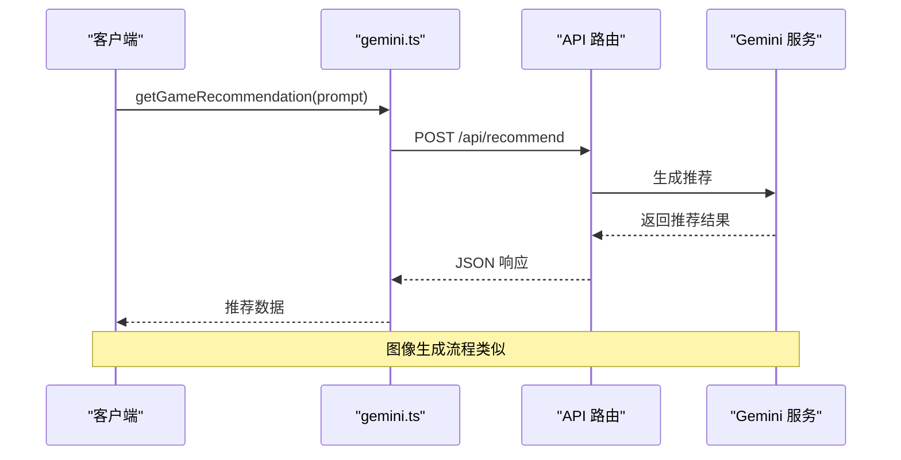

**图表来源**
- [src/services/gemini.ts:1-32](file://src/services/gemini.ts#L1-L32)
- [src/app/api/recommend/route.ts:14-185](file://src/app/api/recommend/route.ts#L14-L185)

**章节来源**
- [src/services/gemini.ts:1-32](file://src/services/gemini.ts#L1-L32)
- [src/app/api/recommend/route.ts:1-185](file://src/app/api/recommend/route.ts#L1-L185)

## 架构概览

应用采用分层架构设计，清晰分离了前端、后端和数据层：

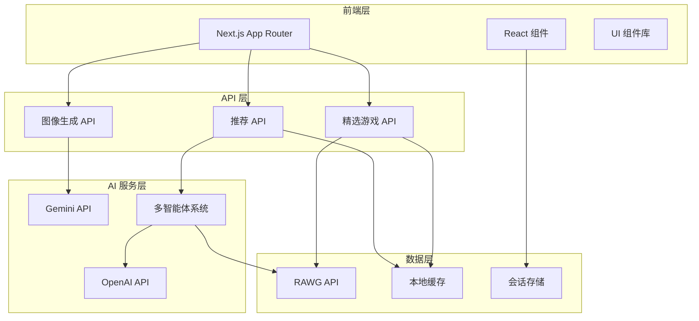

**图表来源**
- [src/app/api/recommend/route.ts:1-185](file://src/app/api/recommend/route.ts#L1-L185)
- [src/app/api/generate-art/route.ts:1-61](file://src/app/api/generate-art/route.ts#L1-L61)
- [src/app/api/featured/route.ts:1-84](file://src/app/api/featured/route.ts#L1-L84)

### 数据流架构

应用的数据流遵循严格的处理管道：

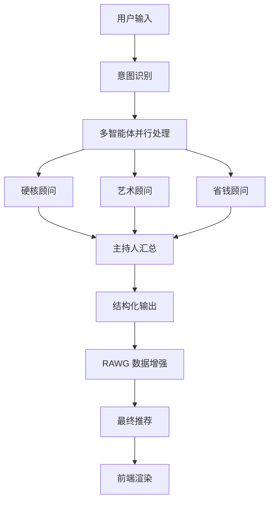

**图表来源**
- [src/app/api/recommend/route.ts:44-82](file://src/app/api/recommend/route.ts#L44-L82)
- [src/lib/rawg.ts:252-342](file://src/lib/rawg.ts#L252-L342)

## 详细组件分析

### 开发服务器脚本

开发服务器脚本是项目的重要基础设施，提供了智能的开发环境管理：

#### 端口管理机制

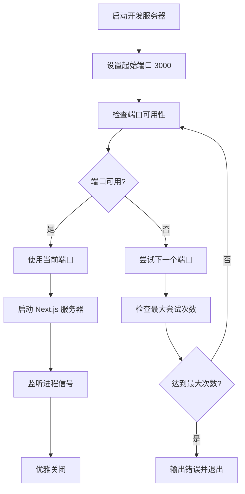

**图表来源**
- [scripts/dev.mjs:6-23](file://scripts/dev.mjs#L6-L23)
- [scripts/dev.mjs:25-51](file://scripts/dev.mjs#L25-L51)

#### 进程通信设计

脚本实现了完善的进程间通信机制：

- **信号处理**：正确处理 SIGINT 和 SIGTERM 信号
- **错误传播**：将子进程的退出码传递给父进程
- **资源清理**：确保所有子进程被正确终止

**章节来源**
- [scripts/dev.mjs:1-51](file://scripts/dev.mjs#L1-L51)

### 推荐系统核心

推荐系统是应用的核心功能，采用了先进的多智能体架构：

#### 多智能体协作机制

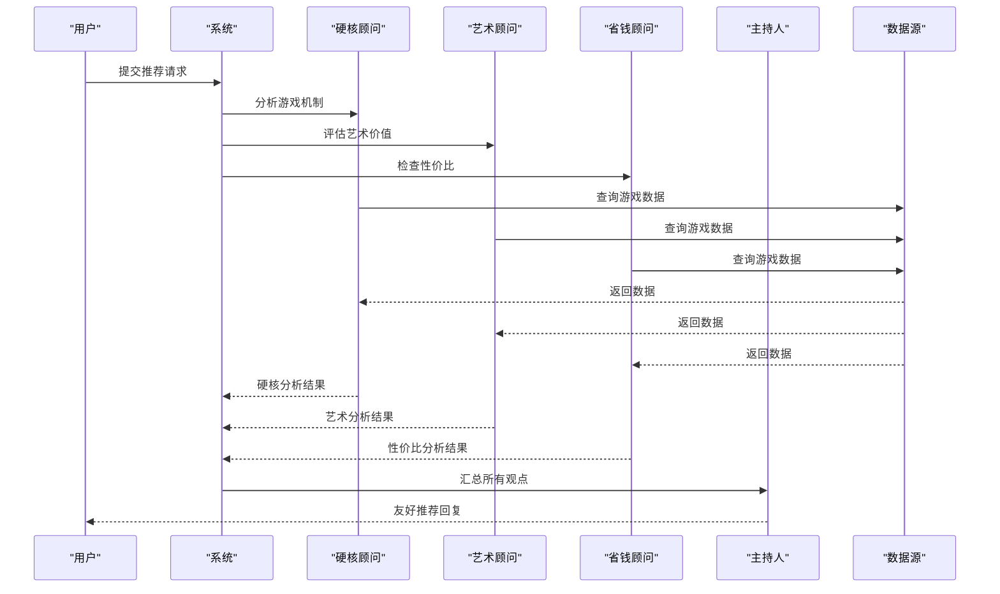

**图表来源**
- [src/app/api/recommend/route.ts:54-78](file://src/app/api/recommend/route.ts#L54-L78)
- [src/app/api/recommend/route.ts:110-146](file://src/app/api/recommend/route.ts#L110-L146)

#### 数据增强流程

推荐系统集成了 RAWG API 来增强游戏信息：

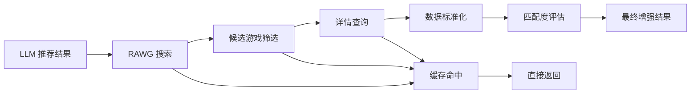

**图表来源**
- [src/lib/rawg.ts:172-210](file://src/lib/rawg.ts#L172-L210)
- [src/lib/rawg.ts:252-342](file://src/lib/rawg.ts#L252-L342)

**章节来源**
- [src/app/api/recommend/route.ts:1-185](file://src/app/api/recommend/route.ts#L1-L185)
- [src/lib/rawg.ts:1-434](file://src/lib/rawg.ts#L1-L434)

### 图像生成服务

应用提供了实时的概念图像生成功能：

#### Gemini 图像生成流程

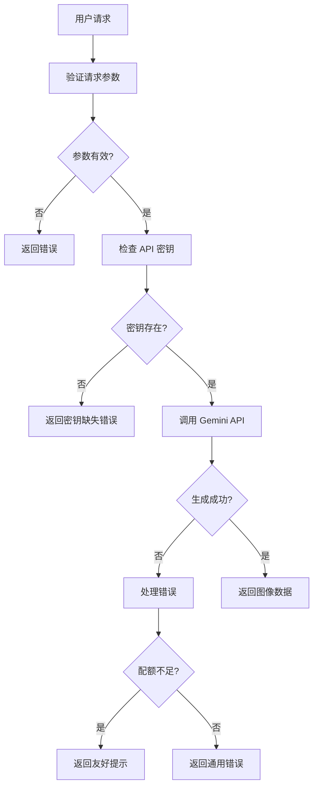

**图表来源**
- [src/app/api/generate-art/route.ts:6-59](file://src/app/api/generate-art/route.ts#L6-L59)

**章节来源**
- [src/app/api/generate-art/route.ts:1-61](file://src/app/api/generate-art/route.ts#L1-L61)

### 用户界面组件

应用的用户界面采用了现代化的设计模式：

#### 主要界面组件

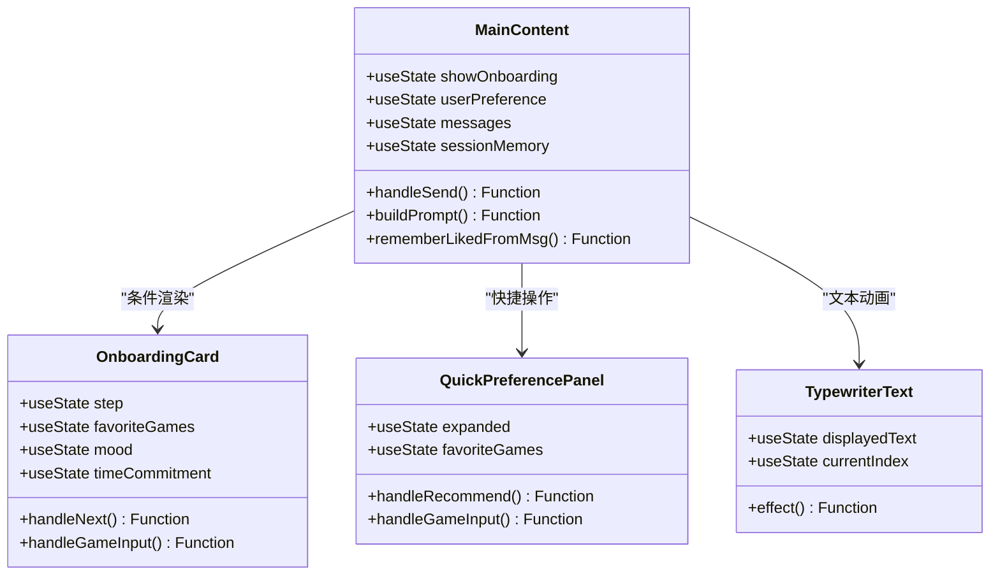

**图表来源**
- [src/components/MainContent.tsx:33-203](file://src/components/MainContent.tsx#L33-L203)
- [src/components/MainContent.tsx:206-356](file://src/components/MainContent.tsx#L206-L356)
- [src/components/MainContent.tsx:359-402](file://src/components/MainContent.tsx#L359-L402)

**章节来源**
- [src/components/MainContent.tsx:1-800](file://src/components/MainContent.tsx#L1-L800)

## 依赖关系分析

### 核心依赖关系

```mermaid
graph TB
subgraph "运行时依赖"
A[next] --> B[React]
A --> C[React DOM]
D[@google/genai] --> E[Gemini API]
F[openai] --> G[OpenAI API]
H[motion] --> I[动画库]
J[react-markdown] --> K[Markdown 渲染]
end
subgraph "开发依赖"
L[typescript] --> M[类型定义]
N[tailwindcss] --> O[样式框架]
P[eslint] --> Q[代码检查]
end
subgraph "应用层"
R[App.tsx] --> S[组件集合]
S --> T[服务层]
T --> U[API 路由]
end
```

**图表来源**
- [package.json:12-33](file://package.json#L12-L33)

### 构建配置

应用使用了自定义的构建配置来优化开发体验：

#### Next.js 配置特性

- **严格模式**：启用 React 严格模式以捕获潜在问题
- **自定义构建目录**：使用 `.next-joymate2` 作为构建输出目录
- **性能优化**：配置了适当的构建参数以提高性能

**章节来源**
- [next.config.ts:1-10](file://next.config.ts#L1-L10)
- [package.json:5-11](file://package.json#L5-L11)

## 性能考虑

### 缓存策略

应用实现了多层次的缓存机制来优化性能：

#### 数据缓存架构

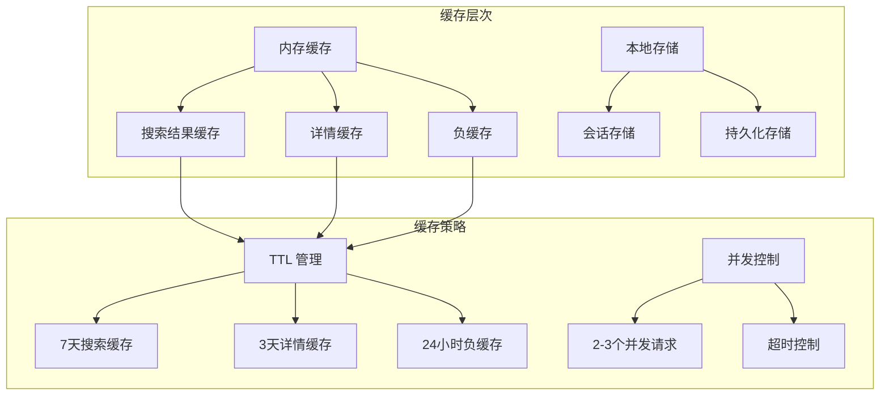

**图表来源**
- [src/lib/rawg.ts:6-26](file://src/lib/rawg.ts#L6-L26)
- [src/lib/rawg.ts:172-210](file://src/lib/rawg.ts#L172-L210)

### 性能优化措施

1. **异步加载**：所有外部 API 调用都是异步的
2. **错误边界**：实现了完善的错误处理机制
3. **资源管理**：合理管理内存和网络资源
4. **响应式设计**：优化了移动端用户体验

**章节来源**
- [src/lib/rawg.ts:1-434](file://src/lib/rawg.ts#L1-L434)

## 故障排除指南

### 常见问题诊断

#### 开发服务器问题

| 问题症状 | 可能原因 | 解决方案 |
|---------|---------|---------|
| 端口占用 | 端口已被其他进程占用 | 更改端口或终止占用进程 |
| 启动失败 | 依赖安装不完整 | 运行 `npm install` 重新安装 |
| 热重载失效 | 文件监听问题 | 检查文件权限和磁盘空间 |

#### API 集成问题

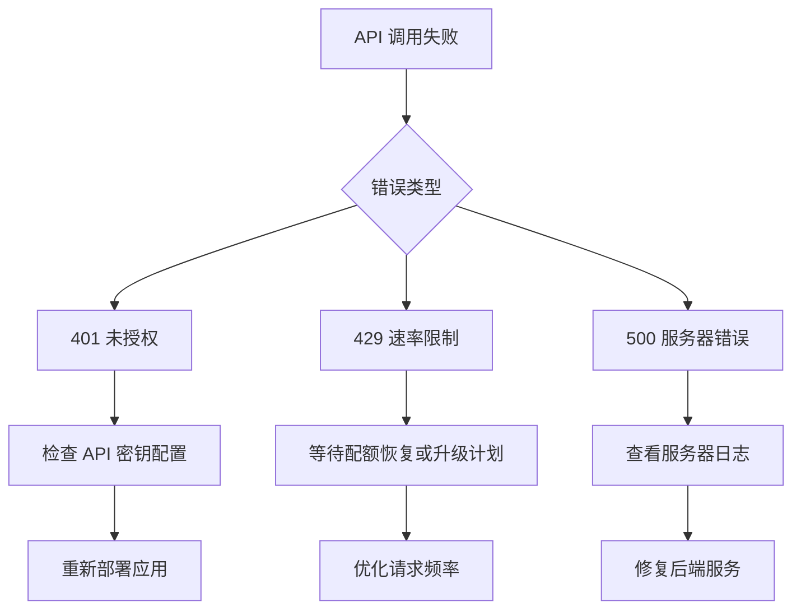

#### 数据增强问题

| 问题 | 影响范围 | 处理方式 |
|------|---------|---------|
| RAWG API 限流 | 推荐质量下降 | 实施重试机制和降级策略 |
| 网络超时 | 功能不可用 | 实现超时处理和错误提示 |
| 数据不准确 | 推荐偏差 | 调整匹配算法和阈值 |

**章节来源**
- [src/app/api/recommend/route.ts:152-182](file://src/app/api/recommend/route.ts#L152-L182)
- [src/app/api/generate-art/route.ts:42-58](file://src/app/api/generate-art/route.ts#L42-L58)

### 日志监控

应用实现了全面的日志记录机制：

#### 关键日志事件

- **recommend_start**：推荐请求开始
- **recommend_success**：推荐请求成功
- **recommend_error**：推荐请求失败
- **rawg_enrich**：RAWG 数据增强统计
- **rawg_disabled_missing_key**：RAWG 功能禁用警告

**章节来源**
- [src/app/api/recommend/route.ts:36-162](file://src/app/api/recommend/route.ts#L36-L162)

## 结论

JoyMate 开发脚本工具展现了现代 Web 应用开发的最佳实践。该项目成功地将复杂的 AI 功能与用户友好的界面相结合，提供了独特的游戏推荐体验。

### 主要成就

1. **架构设计**：采用了清晰的分层架构，便于维护和扩展
2. **性能优化**：实现了多层次缓存和异步处理机制
3. **用户体验**：提供了流畅的交互体验和个性化推荐
4. **技术栈**：选择了成熟稳定的技术栈，确保长期维护性

### 技术亮点

- **多智能体系统**：创新的 AI 协作机制
- **实时数据增强**：动态获取游戏相关信息
- **智能缓存策略**：平衡性能和准确性
- **优雅降级**：在服务不可用时提供最佳用户体验

该项目为类似的 AI 驱动应用提供了优秀的参考模板，展示了如何将先进的人工智能技术与现代 Web 开发实践相结合。