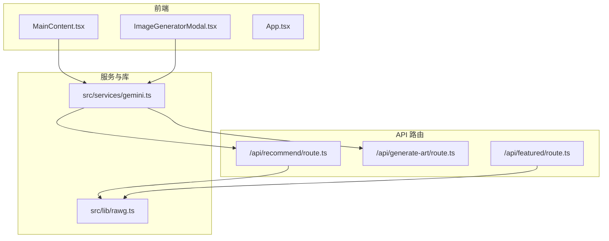
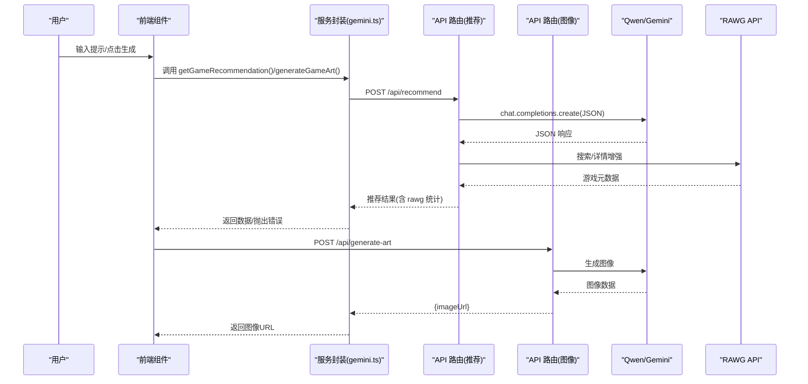
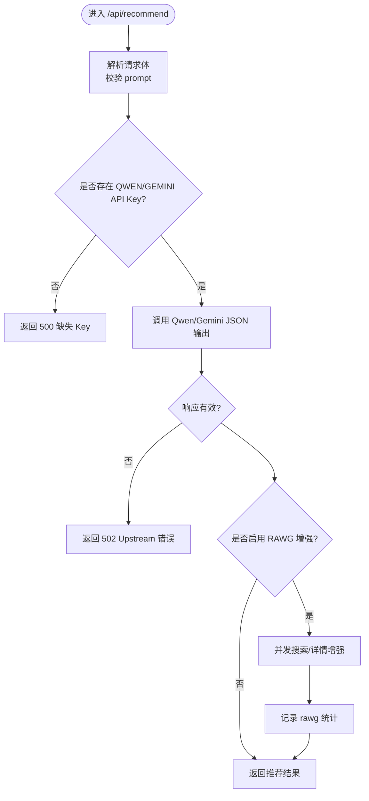
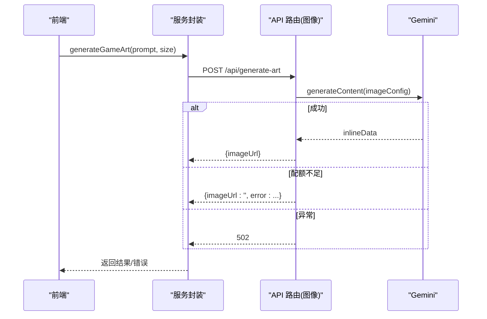
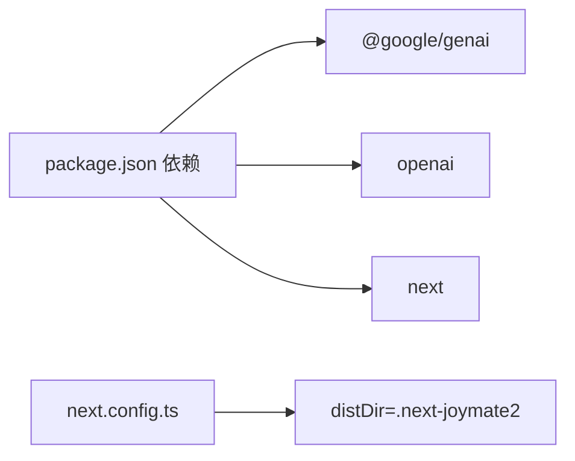
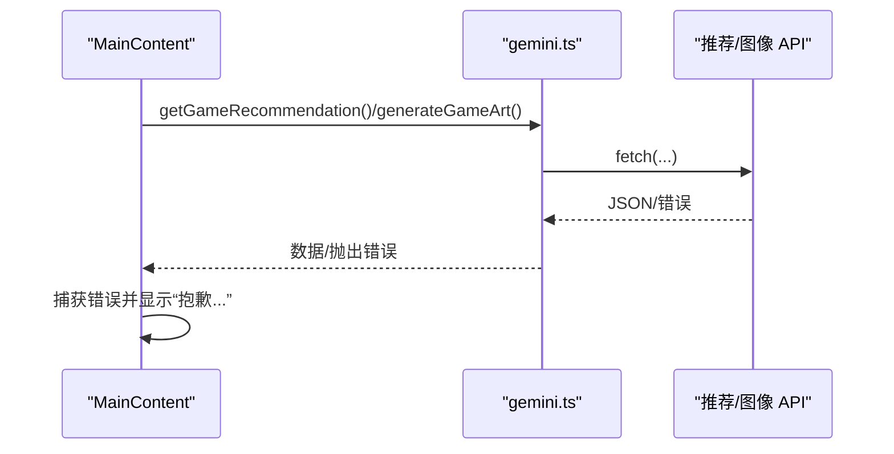

# 故障排除与常见问题

<cite>
**本文引用的文件**
- [README.md](file://README.md)
- [DESIGN_DOC.md](file://DESIGN_DOC.md)
- [RAWG_DATA_CACHE.md](file://RAWG_DATA_CACHE.md)
- [gemini.ts](file://src/services/gemini.ts)
- [rawg.ts](file://src/lib/rawg.ts)
- [route.ts（推荐）](file://src/app/api/recommend/route.ts)
- [route.ts（图像生成）](file://src/app/api/generate-art/route.ts)
- [route.ts（精选）](file://src/app/api/featured/route.ts)
- [MainContent.tsx](file://src/components/MainContent.tsx)
- [ImageGeneratorModal.tsx](file://src/components/ImageGeneratorModal.tsx)
- [App.tsx](file://src/App.tsx)
- [package.json](file://package.json)
- [next.config.ts](file://next.config.ts)
</cite>

## 目录
1. [简介](#简介)
2. [项目结构](#项目结构)
3. [核心组件](#核心组件)
4. [架构总览](#架构总览)
5. [详细组件分析](#详细组件分析)
6. [依赖关系分析](#依赖关系分析)
7. [性能考量](#性能考量)
8. [故障排除指南](#故障排除指南)
9. [结论](#结论)
10. [附录](#附录)

## 简介
本指南面向开发者与运维人员，聚焦 JoyMate 项目的常见问题与排障实践，覆盖以下主题：
- API 调用失败、网络连接问题与权限验证错误的排查
- AI 服务（Qwen/Gemini）集成调试与错误处理
- 数据缓存（RAWG）问题诊断与修复
- 性能识别与优化建议
- 日志分析与错误监控策略
- 预防性措施与最佳实践

## 项目结构
项目采用 Next.js 应用结构，前端组件负责用户交互，API 路由封装上游 AI 与数据服务，缓存逻辑集中在数据增强层。

图表来源
- [MainContent.tsx](file://src/components/MainContent.tsx)
- [ImageGeneratorModal.tsx](file://src/components/ImageGeneratorModal.tsx)
- [gemini.ts](file://src/services/gemini.ts)
- [route.ts（推荐）](file://src/app/api/recommend/route.ts)
- [route.ts（图像生成）](file://src/app/api/generate-art/route.ts)
- [route.ts（精选）](file://src/app/api/featured/route.ts)
- [rawg.ts](file://src/lib/rawg.ts)

章节来源
- [README.md](file://README.md)
- [DESIGN_DOC.md](file://DESIGN_DOC.md)
- [package.json](file://package.json)
- [next.config.ts](file://next.config.ts)

## 核心组件
- 前端交互层：负责聊天、图像生成弹窗、精选数据加载与展示。
- 服务封装层：封装对 /api/recommend 与 /api/generate-art 的调用，统一错误处理。
- API 路由层：对接 Qwen/Gemini 与 RAWG，执行意图识别、多 Agent 推理与数据增强。
- 数据增强层：实现 RAWG 搜索/详情缓存、负缓存、并发与超时控制、降级策略。

章节来源
- [MainContent.tsx](file://src/components/MainContent.tsx)
- [ImageGeneratorModal.tsx](file://src/components/ImageGeneratorModal.tsx)
- [gemini.ts](file://src/services/gemini.ts)
- [route.ts（推荐）](file://src/app/api/recommend/route.ts)
- [route.ts（图像生成）](file://src/app/api/generate-art/route.ts)
- [route.ts（精选）](file://src/app/api/featured/route.ts)
- [rawg.ts](file://src/lib/rawg.ts)

## 架构总览

图表来源
- [gemini.ts](file://src/services/gemini.ts)
- [route.ts（推荐）](file://src/app/api/recommend/route.ts)
- [route.ts（图像生成）](file://src/app/api/generate-art/route.ts)
- [rawg.ts](file://src/lib/rawg.ts)

## 详细组件分析

### 推荐 API（/api/recommend）
- 功能要点
  - 读取环境变量选择 Qwen 或 Gemini，构造 OpenAI 客户端
  - 以 JSON 格式约束模型输出，确保结构化推荐
  - 可选启用 RAWG 数据增强，支持并发与超时控制
  - 对上游配额/资源耗尽错误进行友好降级
- 错误处理
  - 缺少 API Key：返回 500 并提示缺失
  - 配额不足/资源耗尽：返回预设的友好文案，避免前端直接报错
  - 其他异常：记录错误并返回 502
- 可观测性
  - 记录 rawg 增强统计（总数、命中数、耗时）

图表来源
- [route.ts（推荐）](file://src/app/api/recommend/route.ts)

章节来源
- [route.ts（推荐）](file://src/app/api/recommend/route.ts)

### 图像生成 API（/api/generate-art）
- 功能要点
  - 读取 GEMINI_API_KEY，调用 Gemini 生成图像
  - 支持指定尺寸与宽高比
- 错误处理
  - 缺少 Key：返回 500
  - 配额不足：返回包含错误提示的 JSON（状态码 200）
  - 其他异常：记录错误并返回 502

图表来源
- [gemini.ts](file://src/services/gemini.ts)
- [route.ts（图像生成）](file://src/app/api/generate-art/route.ts)

章节来源
- [route.ts（图像生成）](file://src/app/api/generate-art/route.ts)
- [gemini.ts](file://src/services/gemini.ts)

### 精选 API（/api/featured）
- 功能要点
  - 读取 RAWG_API_KEY，按标题列表尝试增强
  - 未启用或无 Key 时返回静态兜底数据
  - 增强结果缓存 24 小时
- 错误处理
  - RAWG 关闭或无 Key：记录告警并返回兜底数据

章节来源
- [route.ts（精选）](file://src/app/api/featured/route.ts)

### 前端交互与错误处理
- MainContent
  - 调用 getGameRecommendation，捕获错误并显示“抱歉，我的分析引擎遇到了一点问题”
  - 加载期间显示“正在为你挑选下一款游戏…”
  - 支持“再推荐”“换一种风格”等交互
- ImageGeneratorModal
  - 调用 generateGameArt，捕获错误并在弹窗中提示
- App
  - 作为根容器，协调侧边栏、主内容与图像生成弹窗

章节来源
- [MainContent.tsx](file://src/components/MainContent.tsx)
- [ImageGeneratorModal.tsx](file://src/components/ImageGeneratorModal.tsx)
- [App.tsx](file://src/App.tsx)

### RAWG 数据增强与缓存
- 缓存策略
  - 搜索对齐缓存：按标准化查询缓存最佳候选
  - 详情缓存：按 RAWG ID 缓存展示字段
  - 负缓存：查询无结果或低分时缓存“miss”
- 并发与超时
  - 并发控制：最多 2~3 并发
  - 单请求超时：3~5 秒；整体增强设置硬超时
- 降级策略
  - 单卡片降级：保留 AI 字段，其余为空
  - 全局降级：返回 AI 结构化结果，前端稳定渲染
- 可观测性
  - 记录增强成功率、平均延迟、误匹配反馈、Top Miss 查询

章节来源
- [rawg.ts](file://src/lib/rawg.ts)
- [RAWG_DATA_CACHE.md](file://RAWG_DATA_CACHE.md)

## 依赖关系分析
- 运行时与依赖
  - 前端运行时：Next.js 15
  - AI SDK：@google/genai、openai
  - 开发工具：TypeScript、ESLint、TailwindCSS
- 配置
  - 自定义构建目录：distDir 指向 .next-joymate2

图表来源
- [package.json](file://package.json)
- [next.config.ts](file://next.config.ts)

章节来源
- [package.json](file://package.json)
- [next.config.ts](file://next.config.ts)

## 性能考量
- 响应时间
  - 推荐接口记录“思考用时”，前端提示 20–40 秒（受网络与模型负载影响）
- 缓存与降级
  - RAWG 两级缓存与负缓存显著降低外部依赖压力
  - 并发限制与超时避免雪崩
- 前端体验
  - 加载态动画与滚动行为优化
  - 交互按钮禁用状态避免重复提交

章节来源
- [route.ts（推荐）](file://src/app/api/recommend/route.ts)
- [MainContent.tsx](file://src/components/MainContent.tsx)
- [rawg.ts](file://src/lib/rawg.ts)

## 故障排除指南

### 一、API 调用失败排查
- 症状
  - 前端显示“抱歉，我的分析引擎遇到了一点问题”
  - /api/recommend 返回 502 或配额不足友好提示
  - /api/generate-art 返回 502 或配额不足友好提示
- 排查步骤
  - 确认环境变量是否正确设置
    - 开发：在 .env.local 设置 GEMINI_API_KEY 或 QWEN_API_KEY/QWEN_BASE_URL
    - 生产：确保部署环境变量存在
  - 查看后端日志
    - 推荐接口：rawg_enrich、rawg_disabled_missing_key
    - 图像接口：Unexpected error from Gemini (image)
  - 检查上游配额
    - 配额不足时接口会返回友好文案，避免 502 直接暴露
- 处置建议
  - 补充或轮换 API Key
  - 降低并发或提高超时阈值（谨慎评估）
  - 在前端展示“稍后再试”与“联系支持”入口

章节来源
- [route.ts（推荐）](file://src/app/api/recommend/route.ts)
- [route.ts（图像生成）](file://src/app/api/generate-art/route.ts)
- [MainContent.tsx](file://src/components/MainContent.tsx)

### 二、网络连接问题排查
- 症状
  - fetch 超时或中断
  - 前端长时间加载
- 排查步骤
  - 检查网络连通性与代理设置
  - 校验 RAWG 请求超时（默认 3~5 秒）与并发限制
  - 确认防火墙/安全组放行上游域名
- 处置建议
  - 增加超时时间或减少并发
  - 添加重试与指数退避（注意避免雪崩）
  - 使用健康检查与熔断策略

章节来源
- [rawg.ts](file://src/lib/rawg.ts)

### 三、权限验证错误排查
- 症状
  - /api/recommend 返回“缺失 QWEN_API_KEY”
  - /api/generate-art 返回“缺失 GEMINI_API_KEY”
- 排查步骤
  - 确认 .env.local 或部署环境变量已设置
  - 确认 Key 未过期且具备相应权限
- 处置建议
  - 重新生成 Key 并替换
  - 在 CI/CD 中校验环境变量注入

章节来源
- [route.ts（推荐）](file://src/app/api/recommend/route.ts)
- [route.ts（图像生成）](file://src/app/api/generate-art/route.ts)

### 四、AI 服务集成调试（Qwen/Gemini）
- 错误处理与响应分析
  - 推荐接口：对 429、quota、RESOURCE_EXHAUSTED 进行降级，返回可读文案
  - 图像接口：对配额不足返回包含 error 的 JSON，状态码 200
- 调试技巧
  - 打印上游响应结构，确认 JSON 输出是否符合预期
  - 使用最小 prompt 快速验证链路
  - 记录 thinking_time 与 rawg 统计，定位瓶颈
- 常见问题
  - 输出非 JSON：检查 system prompt 与 response_format
  - 图像为空：确认 inlineData 是否存在

章节来源
- [route.ts（推荐）](file://src/app/api/recommend/route.ts)
- [route.ts（图像生成）](file://src/app/api/generate-art/route.ts)

### 五、数据缓存问题诊断与修复
- 症状
  - 部分卡片无法获取真实数据，显示“备用信息”
  - 精选接口返回兜底数据
- 诊断
  - 检查 RAWG_API_KEY 是否存在
  - 查看 rawg_enabled 与 rawg_mode
  - 核对 miss 缓存是否命中导致短路
- 修复
  - 启用 RAWG_ENRICHMENT=on 并提供有效 Key
  - 清理异常缓存（内存缓存随进程重启失效）
  - 优化匹配阈值与候选过滤（避免误判）

章节来源
- [route.ts（推荐）](file://src/app/api/recommend/route.ts)
- [route.ts（精选）](file://src/app/api/featured/route.ts)
- [rawg.ts](file://src/lib/rawg.ts)
- [RAWG_DATA_CACHE.md](file://RAWG_DATA_CACHE.md)

### 六、性能问题识别与优化
- 识别
  - thinking_time 明显偏高
  - RAWG 增强耗时占比大
  - 并发请求导致上游限流
- 优化
  - 降低并发至 2~3
  - 增加搜索/详情缓存 TTL（权衡新鲜度）
  - 前端增加“排队/重试”提示
  - 上游扩配额或切换更高性能模型

章节来源
- [route.ts（推荐）](file://src/app/api/recommend/route.ts)
- [rawg.ts](file://src/lib/rawg.ts)

### 七、日志分析与错误监控策略
- 日志记录
  - rawg_enrich：记录 total/enriched/ms
  - rawg_disabled_missing_key：记录路由与模式
  - Gemini 图像生成异常：Unexpected error from Gemini (image)
- 监控建议
  - 关键指标：上游错误率、配额使用率、响应时间分位
  - 告警阈值：think_time 超过 40s、rawg 命中率低于阈值、配额耗尽
  - 可观测性：埋点记录用户交互（再推荐、换风格）与转化

章节来源
- [route.ts（推荐）](file://src/app/api/recommend/route.ts)
- [route.ts（图像生成）](file://src/app/api/generate-art/route.ts)
- [RAWG_DATA_CACHE.md](file://RAWG_DATA_CACHE.md)

## 结论
本指南提供了从前端到后端、从 AI 服务到数据缓存的全链路排障路径。建议团队建立：
- 明确的环境变量管理与注入流程
- 结构化的日志与监控体系
- 面向用户的“友好错误”与“稍后再试”策略
- 基于缓存与并发的性能优化基线

## 附录

### A. 环境变量与部署要点
- 开发：在 .env.local 设置 GEMINI_API_KEY 或 QWEN_API_KEY/QWEN_BASE_URL
- 生产：确保环境变量存在于部署平台
- 参考
  - [README.md](file://README.md)
  - [route.ts（推荐）](file://src/app/api/recommend/route.ts)
  - [route.ts（图像生成）](file://src/app/api/generate-art/route.ts)

### B. 前端调用链与错误兜底

图表来源
- [MainContent.tsx](file://src/components/MainContent.tsx)
- [ImageGeneratorModal.tsx](file://src/components/ImageGeneratorModal.tsx)
- [gemini.ts](file://src/services/gemini.ts)