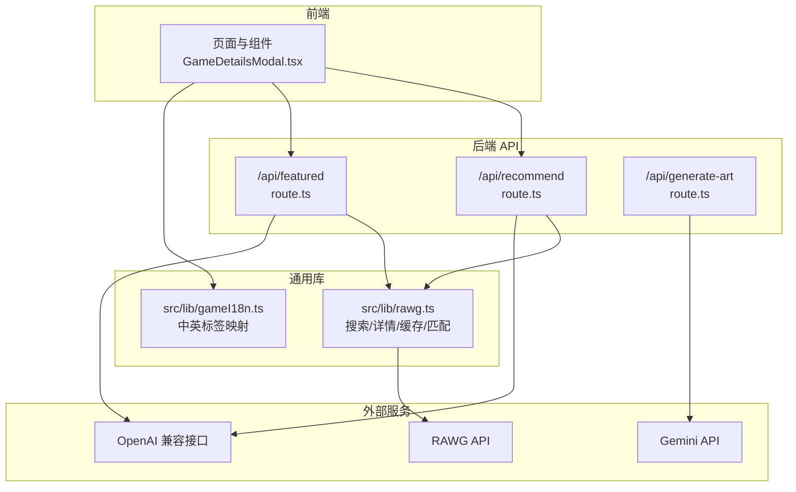
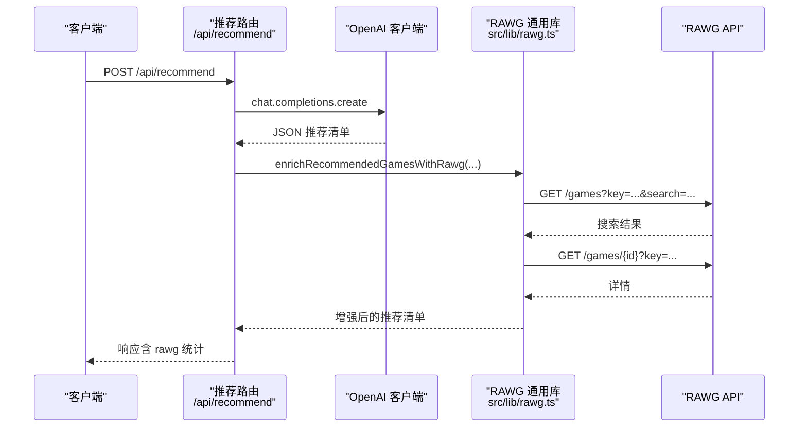
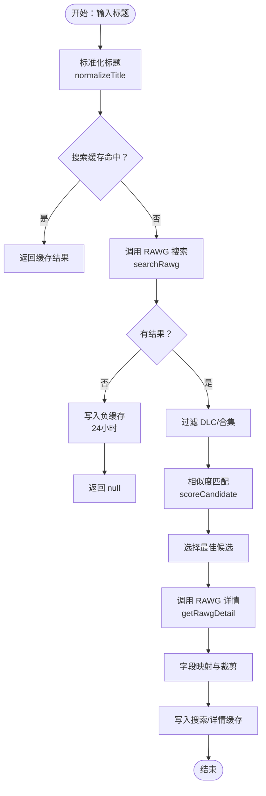
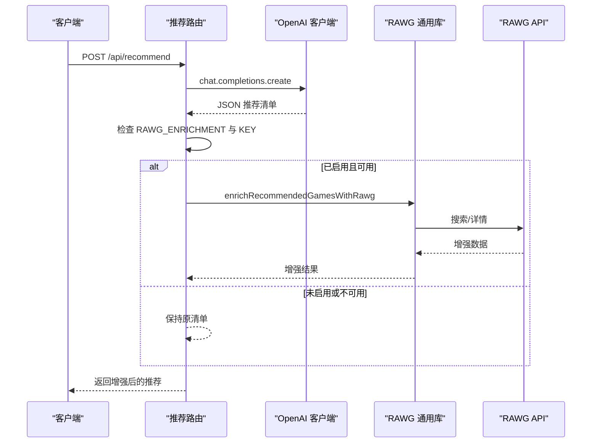
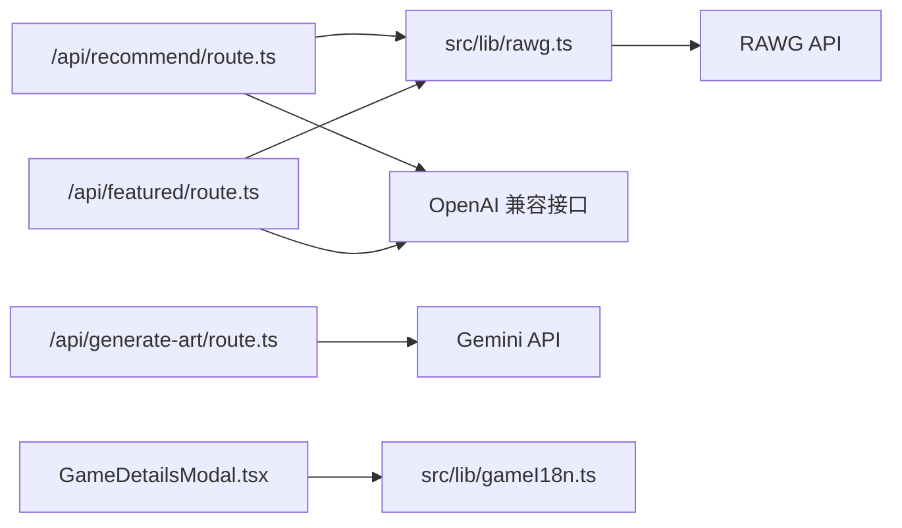

# RAWG API 集成

<cite>
**本文引用的文件**
- [src/lib/rawg.ts](file://src/lib/rawg.ts)
- [src/app/api/recommend/route.ts](file://src/app/api/recommend/route.ts)
- [src/app/api/featured/route.ts](file://src/app/api/featured/route.ts)
- [src/app/api/generate-art/route.ts](file://src/app/api/generate-art/route.ts)
- [src/components/GameDetailsModal.tsx](file://src/components/GameDetailsModal.tsx)
- [src/lib/gameI18n.ts](file://src/lib/gameI18n.ts)
- [DESIGN_DOC.md](file://DESIGN_DOC.md)
- [RAWG_DATA_CACHE.md](file://RAWG_DATA_CACHE.md)
- [README.md](file://README.md)
- [package.json](file://package.json)
</cite>

## 目录
1. [简介](#简介)
2. [项目结构](#项目结构)
3. [核心组件](#核心组件)
4. [架构总览](#架构总览)
5. [详细组件分析](#详细组件分析)
6. [依赖关系分析](#依赖关系分析)
7. [性能考量](#性能考量)
8. [故障排除指南](#故障排除指南)
9. [结论](#结论)
10. [附录](#附录)

## 简介
本文件面向开发者，系统化阐述 JoyMate 中 RAWG API 的集成方案与实现细节，覆盖搜索与详情 API 的调用机制、参数配置、超时与错误处理、JSON 数据封装与信号控制、API 密钥管理、请求头设置、响应解析与转换、缓存策略、并发与降级策略、以及调试与排障方法。文档同时提供最佳实践与性能优化建议，帮助在 Next.js 环境中稳定高效地使用 RAWG 数据增强推荐卡片。

## 项目结构
本项目采用 Next.js 应用结构，RAWG 集成主要集中在后端 API 路由与通用库中：
- 后端 API 路由：负责接收请求、调用大模型、触发 RAWG 数据增强、返回最终响应
- 通用库：封装 RAWG 搜索、详情、缓存、匹配与字段映射逻辑
- 前端组件：消费增强后的游戏卡片数据，展示封面、评分、平台、类型、标签等

图表来源
- [src/app/api/recommend/route.ts:1-157](file://src/app/api/recommend/route.ts#L1-L157)
- [src/app/api/featured/route.ts:1-84](file://src/app/api/featured/route.ts#L1-L84)
- [src/app/api/generate-art/route.ts:1-61](file://src/app/api/generate-art/route.ts#L1-L61)
- [src/lib/rawg.ts:1-434](file://src/lib/rawg.ts#L1-L434)
- [src/lib/gameI18n.ts:1-89](file://src/lib/gameI18n.ts#L1-L89)

章节来源
- [src/app/api/recommend/route.ts:1-157](file://src/app/api/recommend/route.ts#L1-L157)
- [src/app/api/featured/route.ts:1-84](file://src/app/api/featured/route.ts#L1-L84)
- [src/lib/rawg.ts:1-434](file://src/lib/rawg.ts#L1-L434)
- [src/lib/gameI18n.ts:1-89](file://src/lib/gameI18n.ts#L1-L89)

## 核心组件
- RAWG 通用库（src/lib/rawg.ts）
  - 搜索与详情 API 调用、JSON 封装与信号控制
  - 查询标准化、相似度匹配、DLc/合集过滤
  - 两级缓存（搜索对齐缓存、详情缓存）、负缓存
  - 字段映射与裁剪（封面、评分、平台、类型、标签、简介）
  - 推荐增强（单条与批量）、并发控制
- 推荐 API（/api/recommend/route.ts）
  - 调用大模型生成推荐清单，按需触发 RAWG 增强
  - 配额不足友好提示、错误降级与可观测性日志
- 精选 API（/api/featured/route.ts）
  - 固定精选游戏列表，按需触发 RAWG 增强
  - 缓存与降级策略
- 图像生成 API（/api/generate-art/route.ts）
  - 与 RAWG 无关，但同属后端 API，体现统一的错误处理模式
- 前端组件（GameDetailsModal.tsx）
  - 展示 RAWG 增强后的卡片字段，含评分、平台、类型、标签、简介等
- 国际化工具（src/lib/gameI18n.ts）
  - 将英文平台/类型/标签映射为中文展示

章节来源
- [src/lib/rawg.ts:1-434](file://src/lib/rawg.ts#L1-L434)
- [src/app/api/recommend/route.ts:1-157](file://src/app/api/recommend/route.ts#L1-L157)
- [src/app/api/featured/route.ts:1-84](file://src/app/api/featured/route.ts#L1-L84)
- [src/app/api/generate-art/route.ts:1-61](file://src/app/api/generate-art/route.ts#L1-L61)
- [src/components/GameDetailsModal.tsx:1-166](file://src/components/GameDetailsModal.tsx#L1-L166)
- [src/lib/gameI18n.ts:1-89](file://src/lib/gameI18n.ts#L1-L89)

## 架构总览
RAWG 集成遵循“后端 API 路由 + 通用库”的分层设计：
- 路由层：负责业务编排、参数校验、错误处理、可观测性
- 通用库层：负责 RAWG 调用、缓存、匹配、字段映射与并发控制
- 前端层：消费增强后的卡片数据，进行 UI 展示与交互

图表来源
- [src/app/api/recommend/route.ts:14-132](file://src/app/api/recommend/route.ts#L14-L132)
- [src/lib/rawg.ts:172-210](file://src/lib/rawg.ts#L172-L210)

章节来源
- [src/app/api/recommend/route.ts:1-157](file://src/app/api/recommend/route.ts#L1-L157)
- [src/lib/rawg.ts:1-434](file://src/lib/rawg.ts#L1-L434)

## 详细组件分析

### RAWG 通用库（src/lib/rawg.ts）
- 功能概览
  - 搜索 API：构建查询 URL，设置 key、page_size、search 参数，使用 AbortController 控制超时，返回 JSON
  - 详情 API：按 rawg_id 获取详情，返回 JSON
  - 缓存策略：搜索对齐缓存（7 天）、详情缓存（3 天）、负缓存（miss，24 小时）
  - 匹配与过滤：查询标准化、相似度计算、年份与数字冲突检测、DLc/合集过滤
  - 字段映射与裁剪：平台去重与上限、类型/标签选取、简介截断
  - 推荐增强：单条增强（enrichTitleWithRawg）与批量增强（enrichRecommendedGamesWithRawg），支持并发控制
- 关键实现要点
  - 超时与取消：AbortController + setTimeout，确保 fetch 能被及时中断
  - 错误降级：rawgJson 捕获异常并返回 null，避免阻塞主流程
  - 缓存键：search:、detail:、miss:，分别对应搜索、详情与“未命中”
  - 匹配策略：综合包含关系、模糊相似度、年份/数字一致性，给出置信度与原因
  - 并发控制：批量增强使用 Promise.all 与固定并发（1~3），避免过度并发导致限流
- 数据结构与复杂度
  - 缓存 Map：O(1) 读写，TTL 过期清理
  - Levenshtein 相似度：O(|a||b|)，在候选数量有限时可接受
  - 并发增强：O(n) 时间，受限于并发度与网络延迟

图表来源
- [src/lib/rawg.ts:172-210](file://src/lib/rawg.ts#L172-L210)
- [src/lib/rawg.ts:252-342](file://src/lib/rawg.ts#L252-L342)

章节来源
- [src/lib/rawg.ts:1-434](file://src/lib/rawg.ts#L1-L434)

### 推荐 API（/api/recommend/route.ts）
- 功能概览
  - 接收用户 prompt，调用 OpenAI 兼容接口生成结构化推荐清单
  - 根据环境变量决定是否启用 RAWG 增强（RAWG_ENRICHMENT 与 RAWG_API_KEY）
  - 对推荐清单执行批量 RAWG 增强，统计增强数量与耗时
  - 友好处理配额不足等上游错误
- 关键实现要点
  - 配置：RAWG_ENRICHMENT 支持 off/on/auto，auto 模式下需存在 RAWG_API_KEY
  - 并发：maxGames=6、concurrency=2、pageSize=5、timeoutMs=4500
  - 统计：记录 total/enriched/ms，便于观测
  - 降级：当 RAWG 不可用时，仍返回 AI 原始结构化结果

图表来源
- [src/app/api/recommend/route.ts:14-132](file://src/app/api/recommend/route.ts#L14-L132)
- [src/lib/rawg.ts:351-433](file://src/lib/rawg.ts#L351-L433)

章节来源
- [src/app/api/recommend/route.ts:1-157](file://src/app/api/recommend/route.ts#L1-L157)
- [src/lib/rawg.ts:351-433](file://src/lib/rawg.ts#L351-L433)

### 精选 API（/api/featured/route.ts）
- 功能概览
  - 固定精选游戏列表，逐项调用 RAWG 增强
  - 写入进程内缓存（24 小时），减少重复请求
  - 未启用或不可用时返回静态兜底列表
- 关键实现要点
  - 缓存：expiresAt 控制过期
  - 降级：无 KEY 时记录告警日志

章节来源
- [src/app/api/featured/route.ts:1-84](file://src/app/api/featured/route.ts#L1-L84)

### 图像生成 API（/api/generate-art/route.ts）
- 功能概览
  - 调用 Gemini 生成图像，返回 base64 数据 URL
  - 统一处理配额不足等错误，返回友好提示
- 与 RAWG 的关系
  - 该接口与 RAWG 无直接耦合，但体现了后端 API 的统一错误处理模式

章节来源
- [src/app/api/generate-art/route.ts:1-61](file://src/app/api/generate-art/route.ts#L1-L61)

### 前端组件（GameDetailsModal.tsx）
- 功能概览
  - 展示 RAWG 增强后的卡片字段：封面、评分、平台、类型、标签、简介、匹配置信度与原因
  - 中文标签映射与国际化展示
- 关键实现要点
  - 优先使用 RAWG 简介，若为中文则直接展示；否则拼装类型/平台/发行年份等摘要
  - 平台/类型/标签使用国际化映射函数 toZhLabels

章节来源
- [src/components/GameDetailsModal.tsx:1-166](file://src/components/GameDetailsModal.tsx#L1-L166)
- [src/lib/gameI18n.ts:1-89](file://src/lib/gameI18n.ts#L1-L89)

## 依赖关系分析
- 外部依赖
  - RAWG API：用于搜索与详情
  - OpenAI 兼容接口：用于生成推荐清单
  - Gemini API：用于图像生成
- 内部依赖
  - 推荐与精选路由依赖 RAWG 通用库
  - 前端组件依赖国际化工具进行标签映射

图表来源
- [src/app/api/recommend/route.ts:1-157](file://src/app/api/recommend/route.ts#L1-L157)
- [src/app/api/featured/route.ts:1-84](file://src/app/api/featured/route.ts#L1-L84)
- [src/app/api/generate-art/route.ts:1-61](file://src/app/api/generate-art/route.ts#L1-L61)
- [src/lib/rawg.ts:1-434](file://src/lib/rawg.ts#L1-L434)
- [src/lib/gameI18n.ts:1-89](file://src/lib/gameI18n.ts#L1-L89)

章节来源
- [src/app/api/recommend/route.ts:1-157](file://src/app/api/recommend/route.ts#L1-L157)
- [src/app/api/featured/route.ts:1-84](file://src/app/api/featured/route.ts#L1-L84)
- [src/app/api/generate-art/route.ts:1-61](file://src/app/api/generate-art/route.ts#L1-L61)
- [src/lib/rawg.ts:1-434](file://src/lib/rawg.ts#L1-L434)
- [src/lib/gameI18n.ts:1-89](file://src/lib/gameI18n.ts#L1-L89)

## 性能考量
- 超时与并发
  - 单请求超时：4500ms（默认）
  - 并发控制：批量增强并发度限制在 1~3，避免触发上游限流
- 缓存策略
  - 搜索缓存：7 天，降低重复搜索开销
  - 详情缓存：3 天，平衡新鲜度与性能
  - 负缓存：miss 查询 24 小时，避免无效请求
- 字段裁剪与映射
  - 平台/类型/标签数量限制，减少传输与渲染压力
  - 简介截断，避免过长文本影响首屏
- 错误降级
  - RAWG 失败不影响整体响应，前端稳定渲染
  - 配额不足时返回友好提示，避免错误堆栈暴露给用户

章节来源
- [src/lib/rawg.ts:160-210](file://src/lib/rawg.ts#L160-L210)
- [src/lib/rawg.ts:351-433](file://src/lib/rawg.ts#L351-L433)
- [src/app/api/recommend/route.ts:96-106](file://src/app/api/recommend/route.ts#L96-L106)
- [src/app/api/featured/route.ts:24-31](file://src/app/api/featured/route.ts#L24-L31)

## 故障排除指南
- 症状：推荐接口返回空或部分增强失败
  - 检查 RAWG_API_KEY 是否设置，以及 RAWG_ENRICHMENT 模式是否为 on/auto
  - 查看后端日志中的 rawg 相关事件，确认增强统计与耗时
  - 若出现配额不足，路由已返回友好提示，无需前端额外处理
- 症状：接口超时或响应缓慢
  - 检查超时设置（默认 4500ms）与网络状况
  - 减少并发度或增加 page_size，观察效果
- 症状：卡片缺少封面/评分/平台等字段
  - 可能为 RAWG 未命中或增强失败，前端会降级展示 AI 原始字段
  - 检查负缓存是否生效（miss 查询 24 小时）
- 症状：中文标签未正确显示
  - 确认 gameI18n 映射表是否包含对应英文标签
  - 检查 toZhLabels 的 limit 设置

章节来源
- [src/app/api/recommend/route.ts:133-154](file://src/app/api/recommend/route.ts#L133-L154)
- [src/app/api/featured/route.ts:41-43](file://src/app/api/featured/route.ts#L41-L43)
- [src/lib/rawg.ts:160-210](file://src/lib/rawg.ts#L160-L210)
- [src/lib/gameI18n.ts:1-89](file://src/lib/gameI18n.ts#L1-L89)

## 结论
本集成方案通过“路由编排 + 通用库 + 前端组件”的清晰分层，实现了对 RAWG API 的稳健使用。通用库提供了完善的缓存、匹配、并发与降级策略，路由层负责业务编排与可观测性，前端组件专注于展示与交互。整体设计兼顾了性能、稳定性与可维护性，适合在 Next.js 环境中持续演进。

## 附录

### API 请求与响应要点
- 搜索 API
  - URL 参数：key、search、page_size
  - 超时：默认 4500ms
  - 响应：results 数组，按 RAWG 返回结构解析
- 详情 API
  - URL 参数：key
  - 超时：默认 4500ms
  - 响应：单个游戏对象，包含封面、评分、平台、类型、标签、简介等字段
- 错误处理
  - 429/配额不足：返回友好提示
  - 其他错误：统一返回 Upstream 错误状态码

章节来源
- [src/lib/rawg.ts:172-210](file://src/lib/rawg.ts#L172-L210)
- [src/app/api/recommend/route.ts:133-154](file://src/app/api/recommend/route.ts#L133-L154)
- [src/app/api/featured/route.ts:41-43](file://src/app/api/featured/route.ts#L41-L43)

### 配置与最佳实践
- 环境变量
  - RAWG_API_KEY：RAWG API 密钥
  - RAWG_ENRICHMENT：on/off/auto（auto 表示自动启用，需存在 KEY）
  - QWEN_API_KEY/QWEN_BASE_URL：用于推荐接口的大模型配置（与 RAWG 互补）
- 参数建议
  - page_size：5（搜索候选数量）
  - timeoutMs：4500（单请求超时）
  - maxGames：6（每次推荐最多增强条数）
  - concurrency：2（并发度）
- 字段映射与裁剪
  - 平台/类型/标签数量限制，简介截断至 220 字左右
- 缓存策略
  - 搜索缓存：7 天
  - 详情缓存：3 天
  - 负缓存：miss 查询 24 小时

章节来源
- [RAWG_DATA_CACHE.md:14-22](file://RAWG_DATA_CACHE.md#L14-L22)
- [RAWG_DATA_CACHE.md:79-122](file://RAWG_DATA_CACHE.md#L79-L122)
- [src/lib/rawg.ts:252-342](file://src/lib/rawg.ts#L252-L342)
- [src/app/api/recommend/route.ts:96-106](file://src/app/api/recommend/route.ts#L96-L106)