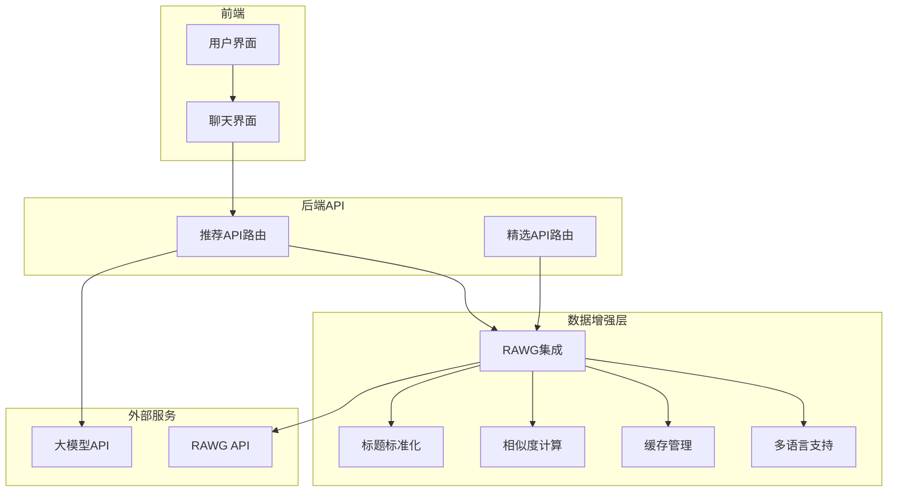
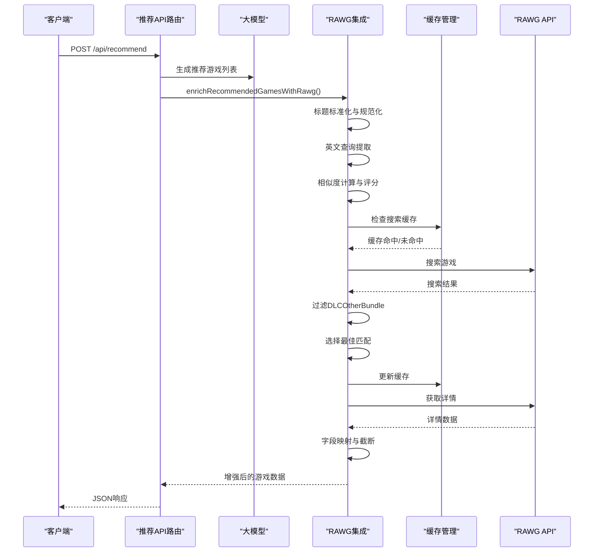
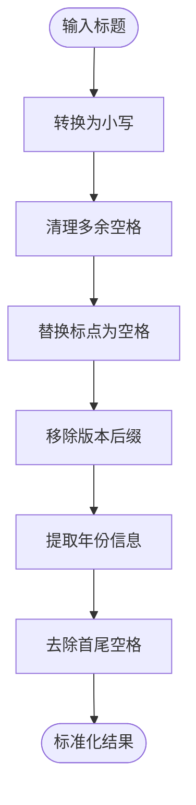
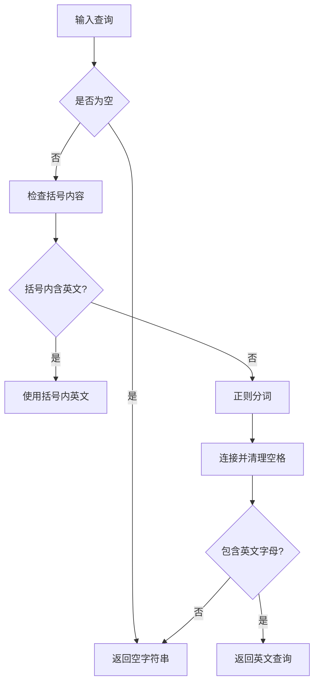
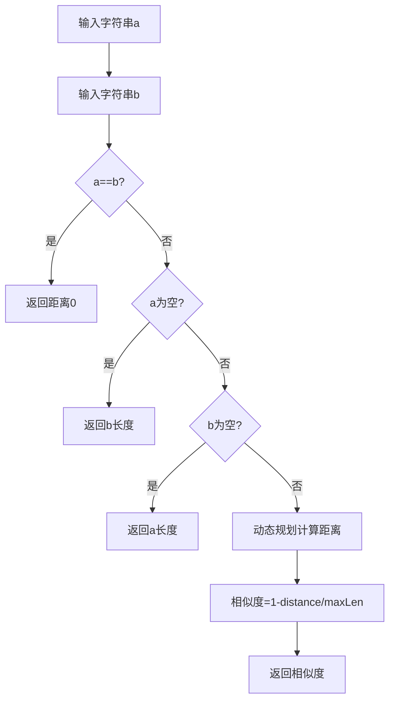
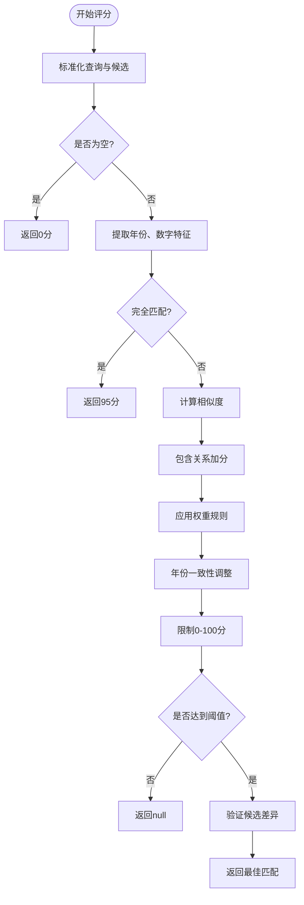
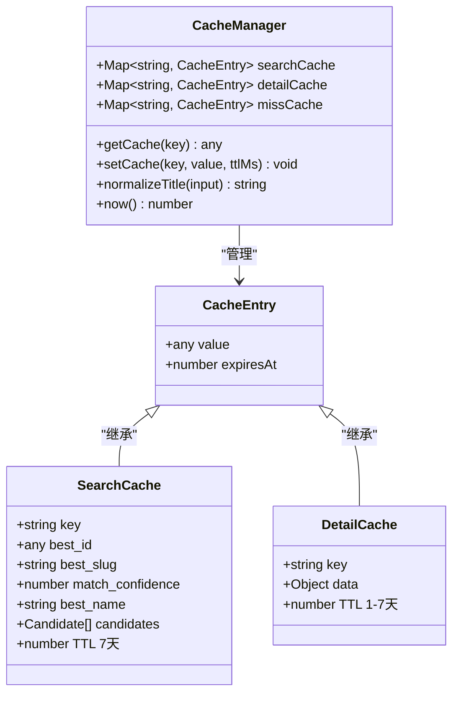
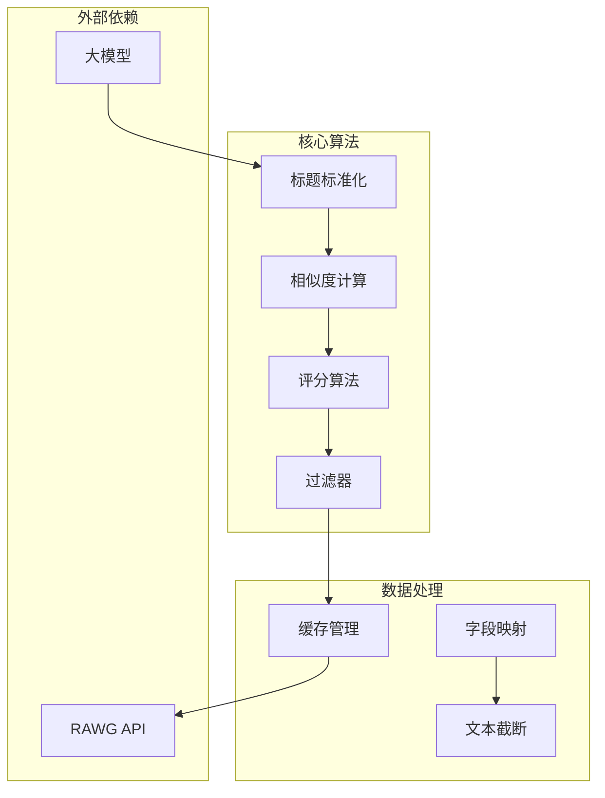

# 数据增强与匹配算法

<cite>
**本文档引用的文件**
- [src/lib/rawg.ts](file://src/lib/rawg.ts)
- [src/lib/gameI18n.ts](file://src/lib/gameI18n.ts)
- [src/app/api/recommend/route.ts](file://src/app/api/recommend/route.ts)
- [src/app/api/featured/route.ts](file://src/app/api/featured/route.ts)
- [src/services/gemini.ts](file://src/services/gemini.ts)
- [DESIGN_DOC.md](file://DESIGN_DOC.md)
- [RAWG_DATA_CACHE.md](file://RAWG_DATA_CACHE.md)
- [package.json](file://package.json)
</cite>

## 目录
1. [引言](#引言)
2. [项目结构](#项目结构)
3. [核心组件](#核心组件)
4. [架构概览](#架构概览)
5. [详细组件分析](#详细组件分析)
6. [依赖关系分析](#依赖关系分析)
7. [性能考量](#性能考量)
8. [故障排除指南](#故障排除指南)
9. [结论](#结论)
10. [附录](#附录)

## 引言
本文件面向JoyMate项目中的数据增强与匹配算法，深入解析游戏标题标准化与规范化处理流程、相似度计算算法、候选游戏选择策略以及多语言支持机制。文档旨在帮助开发者理解并优化基于RAWG API的游戏元数据增强流程，涵盖正则表达式匹配、字符串处理函数、Levenshtein距离算法、相似度评分机制、候选筛选与最佳匹配算法，以及CJK字符处理与英文查询提取等关键技术点。

## 项目结构
JoyMate采用前后端分离的Next.js架构，核心数据增强逻辑集中在后端API路由与工具库中：
- API路由负责接收用户请求、调用LLM生成推荐、触发数据增强流程
- 工具库提供RAWG集成、标题标准化、相似度计算、缓存管理等核心算法
- 多语言支持通过游戏标签映射与CJK字符检测实现

**图表来源**
- [src/app/api/recommend/route.ts:14-157](file://src/app/api/recommend/route.ts#L14-L157)
- [src/app/api/featured/route.ts:26-84](file://src/app/api/featured/route.ts#L26-L84)
- [src/lib/rawg.ts:28-434](file://src/lib/rawg.ts#L28-L434)

**章节来源**
- [src/app/api/recommend/route.ts:14-157](file://src/app/api/recommend/route.ts#L14-L157)
- [src/app/api/featured/route.ts:26-84](file://src/app/api/featured/route.ts#L26-L84)
- [src/lib/rawg.ts:28-434](file://src/lib/rawg.ts#L28-L434)

## 核心组件
本节概述数据增强与匹配算法的关键组件及其职责：
- 标题标准化与规范化：统一输入格式，去除冗余字符，提取年份与数字信息
- 英文查询提取：从混合语言输入中提取英文关键词，提升跨语言匹配效果
- Levenshtein距离与相似度评分：计算两个字符串间的编辑距离并转换为相似度分数
- 候选游戏评分与筛选：综合多种因素对候选游戏进行打分，过滤DLCOtherBundle并选择最佳匹配
- 缓存策略：两级缓存（搜索缓存、详情缓存、负缓存）提升性能与可靠性
- 多语言支持：游戏标签中文映射与CJK字符检测，支持中英文混合场景

**章节来源**
- [src/lib/rawg.ts:28-434](file://src/lib/rawg.ts#L28-L434)
- [src/lib/gameI18n.ts:1-89](file://src/lib/gameI18n.ts#L1-L89)

## 架构概览
数据增强流程从API路由开始，经过标题标准化、相似度计算、候选筛选，最终调用RAWG API获取真实元数据并进行字段映射与截断处理。

**图表来源**
- [src/app/api/recommend/route.ts:74-132](file://src/app/api/recommend/route.ts#L74-L132)
- [src/lib/rawg.ts:252-433](file://src/lib/rawg.ts#L252-L433)

## 详细组件分析

### 标题标准化与规范化处理
标题标准化是匹配算法的基础，通过一系列正则表达式和字符串处理函数统一输入格式：
- 转换为小写并去除多余空格
- 替换全角标点与括号为空格
- 移除版本后缀（如"GotY"、"Ultimate Edition"等）
- 提取年份信息用于后续评分调整
- 数字提取用于冲突检测

**图表来源**
- [src/lib/rawg.ts:28-41](file://src/lib/rawg.ts#L28-L41)
- [src/lib/rawg.ts:92-95](file://src/lib/rawg.ts#L92-L95)

**章节来源**
- [src/lib/rawg.ts:28-41](file://src/lib/rawg.ts#L28-L41)
- [src/lib/rawg.ts:87-95](file://src/lib/rawg.ts#L87-L95)

### 英文查询提取与多语言支持
针对中英文混合输入，系统提供英文查询提取功能：
- 优先从括号内的英文内容提取
- 使用正则匹配连续的英文字母、数字、冒号和连字符
- 对CJK字符进行检测，支持纯中文场景下的降级处理

**图表来源**
- [src/lib/rawg.ts:43-55](file://src/lib/rawg.ts#L43-L55)
- [src/lib/gameI18n.ts:83-89](file://src/lib/gameI18n.ts#L83-L89)

**章节来源**
- [src/lib/rawg.ts:43-55](file://src/lib/rawg.ts#L43-L55)
- [src/lib/gameI18n.ts:83-89](file://src/lib/gameI18n.ts#L83-L89)

### 相似度计算算法
系统采用Levenshtein距离计算字符串相似度，并结合多种特征进行综合评分：
- Levenshtein距离：动态规划算法计算两个字符串间的编辑距离
- 相似度转换：将距离转换为0-1之间的相似度分数
- 特征权重：包含关系、模糊匹配等级、年份一致性、数字一致性等

**图表来源**
- [src/lib/rawg.ts:57-85](file://src/lib/rawg.ts#L57-L85)

**章节来源**
- [src/lib/rawg.ts:57-85](file://src/lib/rawg.ts#L57-L85)

### 候选游戏评分与最佳匹配算法
评分算法综合考虑多种因素，确保匹配结果的准确性：
- 基础评分：包含关系+40分，高模糊匹配+45分，中模糊匹配+30分，低模糊匹配+15分
- 数字一致性：相同数字+10分，冲突-25分
- 年份一致性：匹配年份+20分，冲突-10分
- 评分阈值：最低70分，相近候选间差值小于5或非常接近时进行二次验证
- DLCOtherBundle过滤：排除DLC、扩展包、捆绑包等非主游戏内容

**图表来源**
- [src/lib/rawg.ts:116-158](file://src/lib/rawg.ts#L116-L158)
- [src/lib/rawg.ts:275-313](file://src/lib/rawg.ts#L275-L313)

**章节来源**
- [src/lib/rawg.ts:116-158](file://src/lib/rawg.ts#L116-L158)
- [src/lib/rawg.ts:275-313](file://src/lib/rawg.ts#L275-L313)

### 缓存策略与性能优化
系统实现两级缓存机制以提升性能与可靠性：
- 搜索缓存：缓存标准化查询到RAWG ID的映射，TTL 7天
- 详情缓存：缓存RAWG ID到完整详情的映射，TTL 1-7天
- 负缓存：缓存"搜索不到"的结果，TTL 24小时
- 并发控制：最大并发2-3个请求，避免API限流
- 超时控制：单请求3-5秒，整体增强层硬超时6-8秒

**图表来源**
- [src/lib/rawg.ts:1-26](file://src/lib/rawg.ts#L1-L26)
- [RAWG_DATA_CACHE.md:86-122](file://RAWG_DATA_CACHE.md#L86-L122)

**章节来源**
- [src/lib/rawg.ts:1-26](file://src/lib/rawg.ts#L1-L26)
- [RAWG_DATA_CACHE.md:86-122](file://RAWG_DATA_CACHE.md#L86-L122)

### 数据增强实现示例
系统提供多种数据增强场景的实现示例：
- 游戏信息映射：RAWG字段到展示字段的映射，包括封面、评分、平台、标签等
- 平台列表处理：去重、排序、限制数量（最多6个）
- 描述文本截断：优先使用简短描述，避免过长文本影响性能
- 多语言降级：对于纯中文查询，使用搜索结果第一条作为备选

**章节来源**
- [src/lib/rawg.ts:220-232](file://src/lib/rawg.ts#L220-L232)
- [src/lib/rawg.ts:351-433](file://src/lib/rawg.ts#L351-L433)

## 依赖关系分析
数据增强算法依赖关系清晰，模块化程度高：

**图表来源**
- [src/lib/rawg.ts:28-434](file://src/lib/rawg.ts#L28-L434)
- [src/app/api/recommend/route.ts:88-127](file://src/app/api/recommend/route.ts#L88-L127)

**章节来源**
- [src/lib/rawg.ts:28-434](file://src/lib/rawg.ts#L28-L434)
- [src/app/api/recommend/route.ts:88-127](file://src/app/api/recommend/route.ts#L88-L127)

## 性能考量
基于项目实现的性能特性与优化建议：
- 时间复杂度分析
  - 标题标准化：O(n)，n为输入长度
  - Levenshtein距离：O(m×n)，m、n为两字符串长度
  - 相似度计算：O(m×n)
  - 候选评分：O(k×(m×n))，k为候选数量
- 空间复杂度
  - 动态规划数组：O(n)空间
  - 缓存存储：与查询量和候选数量相关
- 优化建议
  - 使用更高效的字符串匹配算法（如快速编辑距离）
  - 实现批量处理减少API调用次数
  - 添加预过滤规则减少不必要的相似度计算
  - 考虑使用索引加速常见查询模式

[本节提供一般性指导，无需特定文件来源]

## 故障排除指南
针对数据增强过程中的常见问题提供排查方法：
- RAWG API错误处理
  - 检查API密钥配置与权限
  - 监控请求超时与限流状态
  - 查看缓存命中率与负缓存触发情况
- 匹配质量异常
  - 验证标题标准化规则是否正确
  - 检查相似度阈值设置是否合理
  - 确认候选过滤规则是否符合预期
- 性能问题
  - 监控缓存命中率与TTL设置
  - 调整并发参数避免API限流
  - 检查网络延迟与DNS解析

**章节来源**
- [src/app/api/recommend/route.ts:133-154](file://src/app/api/recommend/route.ts#L133-L154)
- [src/lib/rawg.ts:160-170](file://src/lib/rawg.ts#L160-L170)

## 结论
JoyMate的数据增强与匹配算法通过标准化处理、多特征评分与两级缓存策略，实现了高效可靠的游戏元数据增强。算法设计充分考虑了中英文混合场景，提供了灵活的降级机制。建议在生产环境中进一步优化缓存策略、监控关键指标，并根据实际使用情况进行参数调优。

[本节为总结性内容，无需特定文件来源]

## 附录

### 关键算法参数配置
- 相似度阈值：高模糊匹配≥0.92，中模糊匹配≥0.85，低模糊匹配≥0.78
- 评分权重：包含关系+40分，高模糊+45分，中模糊+30分，低模糊+15分
- 年份一致性：匹配年份+20分，冲突-10分
- 数字一致性：相同数字+10分，冲突-25分
- 最低匹配分数：70分，相近候选差值<5或非常接近时进行二次验证

### 多语言支持配置
- 中文标签映射：提供常用游戏类型的中文对应词汇
- CJK字符检测：中文字符占比≥20%视为主要CJK文本
- 英文查询提取：优先括号内英文，其次正则匹配连续英文字符

**章节来源**
- [src/lib/rawg.ts:141-157](file://src/lib/rawg.ts#L141-L157)
- [src/lib/gameI18n.ts:83-89](file://src/lib/gameI18n.ts#L83-L89)