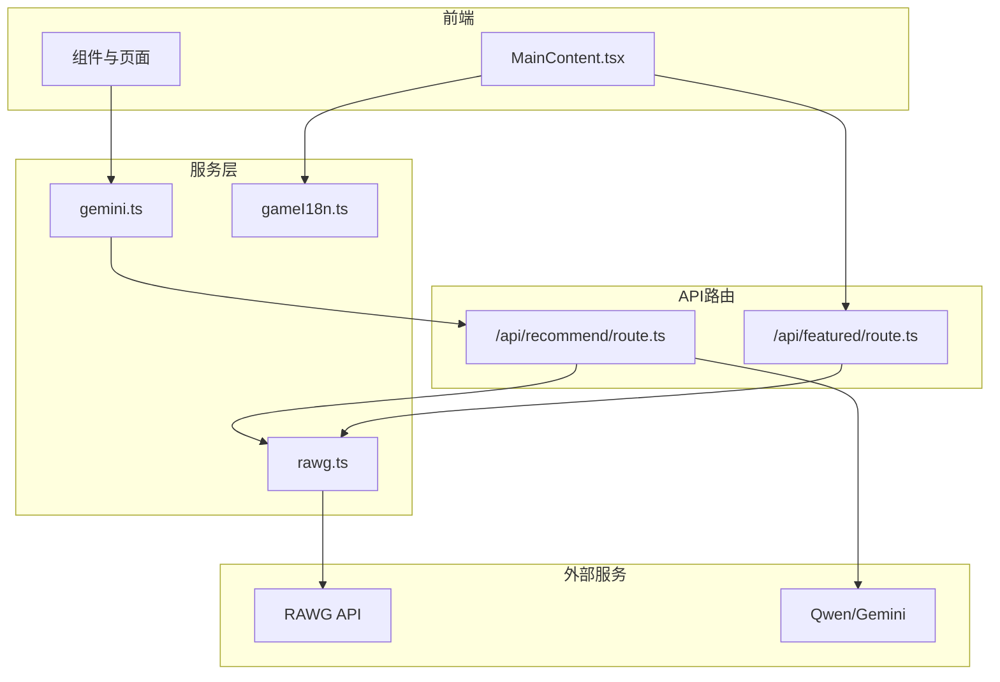
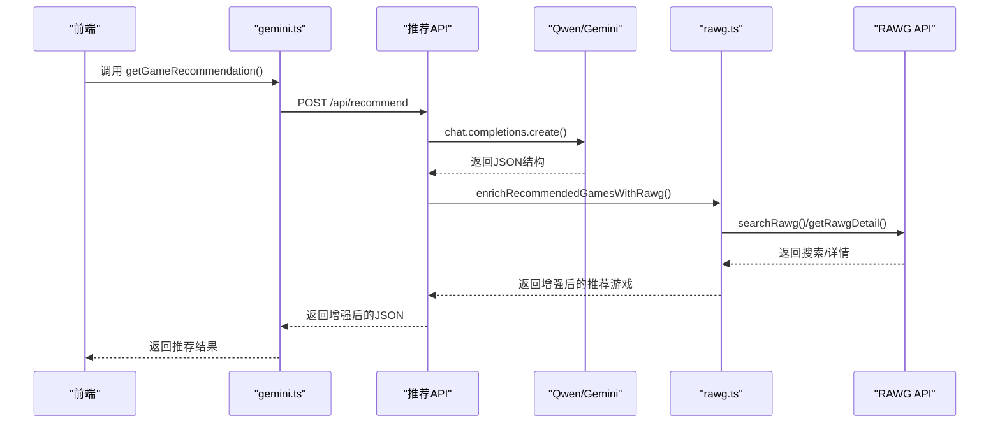
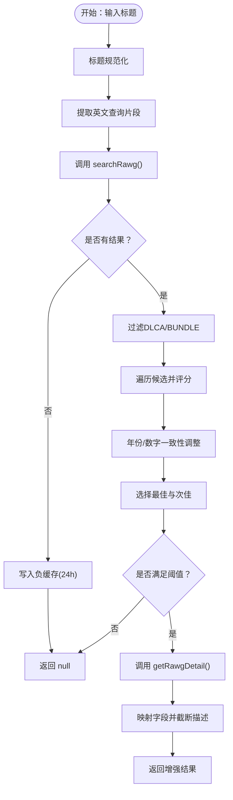
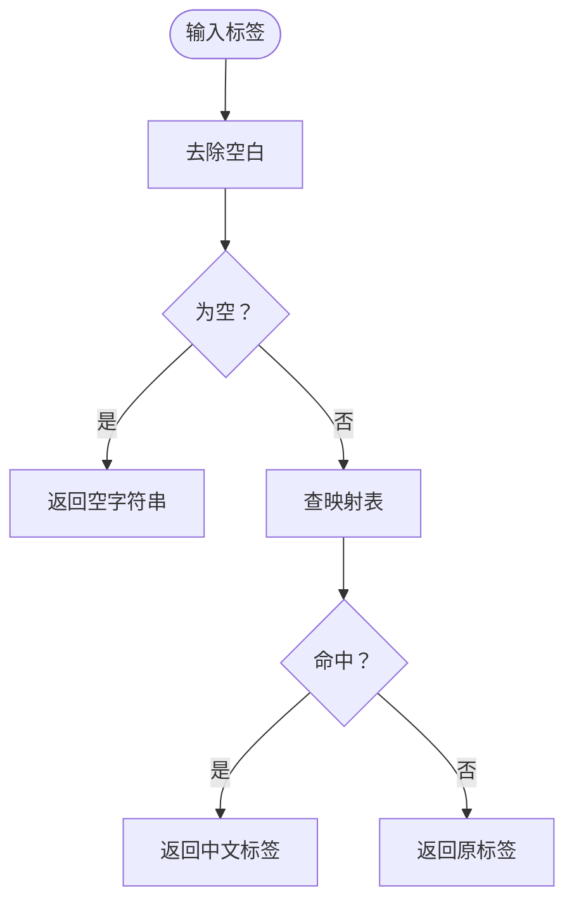
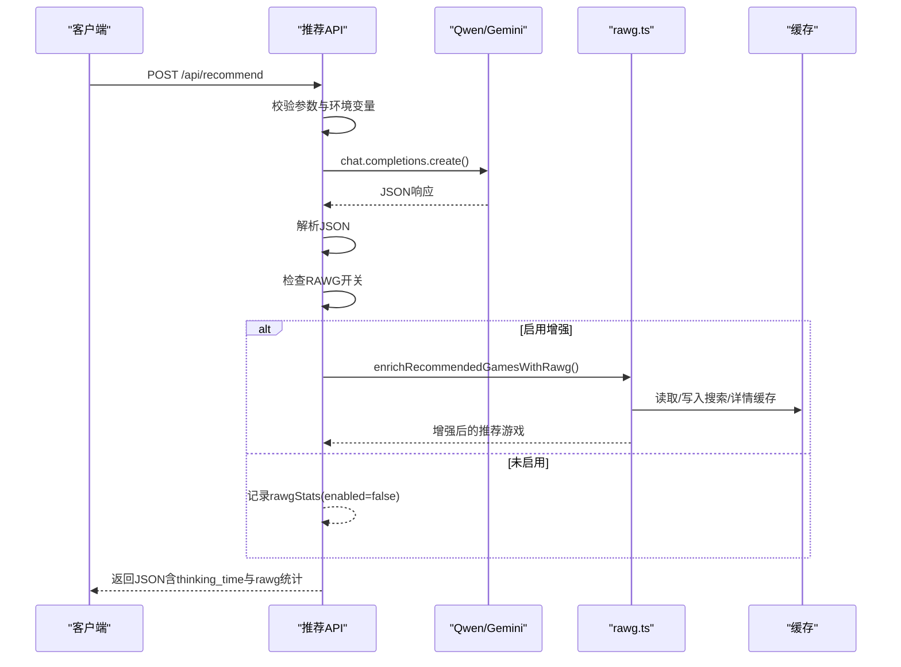
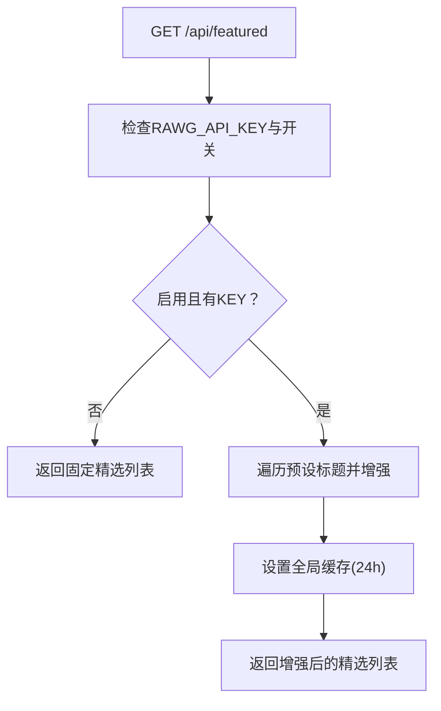
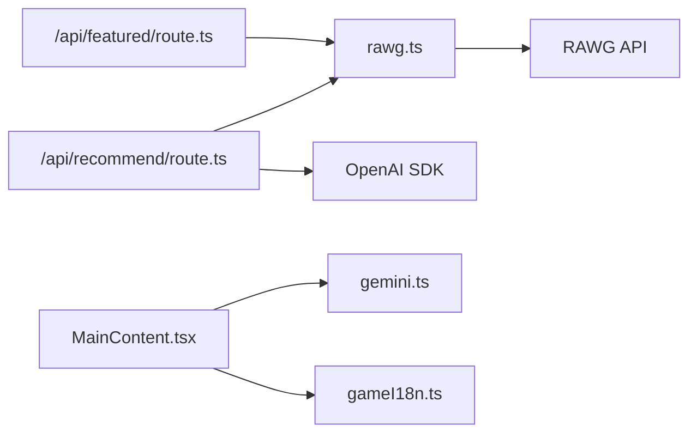
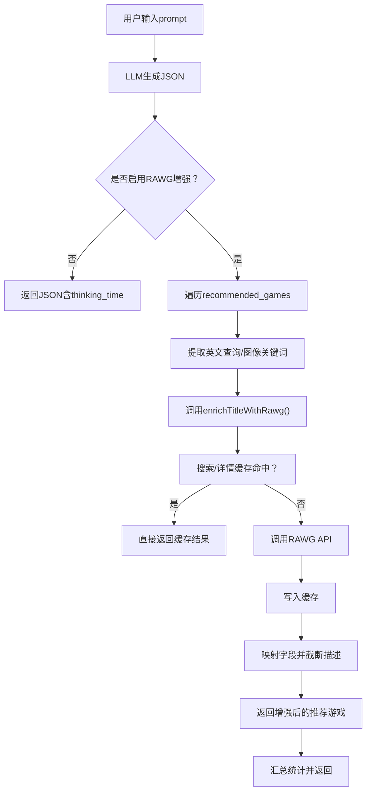
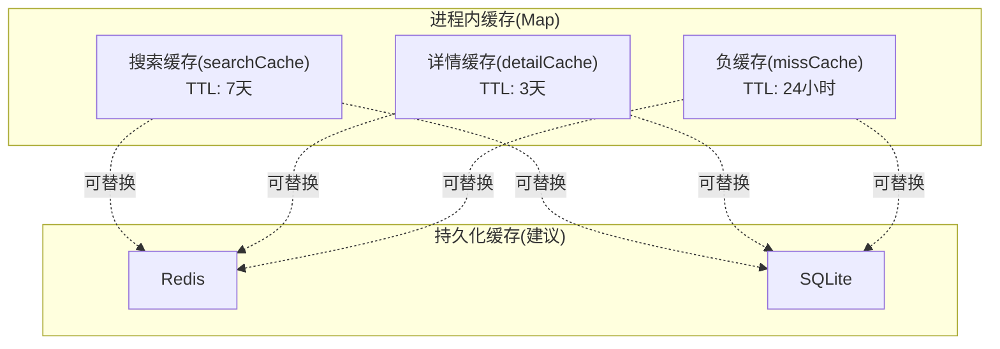

# 数据处理与缓存

<cite>
**本文引用的文件列表**
- [src/lib/rawg.ts](file://src/lib/rawg.ts)
- [src/lib/gameI18n.ts](file://src/lib/gameI18n.ts)
- [src/app/api/recommend/route.ts](file://src/app/api/recommend/route.ts)
- [src/app/api/featured/route.ts](file://src/app/api/featured/route.ts)
- [src/services/gemini.ts](file://src/services/gemini.ts)
- [src/components/MainContent.tsx](file://src/components/MainContent.tsx)
- [RAWG_DATA_CACHE.md](file://RAWG_DATA_CACHE.md)
- [package.json](file://package.json)
- [next.config.ts](file://next.config.ts)
</cite>

## 目录
1. [引言](#引言)
2. [项目结构](#项目结构)
3. [核心组件](#核心组件)
4. [架构总览](#架构总览)
5. [详细组件分析](#详细组件分析)
6. [依赖关系分析](#依赖关系分析)
7. [性能考量](#性能考量)
8. [故障排除指南](#故障排除指南)
9. [结论](#结论)
10. [附录](#附录)

## 引言
本文件面向JoyMate项目中的数据处理与缓存系统，聚焦于RAWG API集成、数据获取与处理、增强逻辑、国际化转换、智能缓存策略、数据增强算法以及推荐质量提升。文档提供数据流图与缓存架构图，给出配置选项与使用示例，并总结最佳实践与故障排除方法，帮助开发者快速理解并高效维护该模块。

## 项目结构
项目采用Next.js应用结构，核心数据处理位于lib目录，API路由位于app/api，前端消费数据的组件位于components，服务封装位于services。整体围绕“AI生成推荐 → RAWG增强 → 国际化转换 → 前端渲染”的主流程展开。

图表来源
- [src/services/gemini.ts:1-32](file://src/services/gemini.ts#L1-L32)
- [src/app/api/recommend/route.ts:1-157](file://src/app/api/recommend/route.ts#L1-L157)
- [src/app/api/featured/route.ts:1-84](file://src/app/api/featured/route.ts#L1-L84)
- [src/lib/rawg.ts:1-434](file://src/lib/rawg.ts#L1-L434)
- [src/lib/gameI18n.ts:1-89](file://src/lib/gameI18n.ts#L1-L89)
- [src/components/MainContent.tsx:1-721](file://src/components/MainContent.tsx#L1-L721)

章节来源
- [src/services/gemini.ts:1-32](file://src/services/gemini.ts#L1-L32)
- [src/app/api/recommend/route.ts:1-157](file://src/app/api/recommend/route.ts#L1-L157)
- [src/app/api/featured/route.ts:1-84](file://src/app/api/featured/route.ts#L1-L84)
- [src/lib/rawg.ts:1-434](file://src/lib/rawg.ts#L1-L434)
- [src/lib/gameI18n.ts:1-89](file://src/lib/gameI18n.ts#L1-L89)
- [src/components/MainContent.tsx:1-721](file://src/components/MainContent.tsx#L1-L721)

## 核心组件
- RAWG数据增强库：负责搜索、详情、缓存、相似度计算、标题规范化、DLCA/BUNDLE过滤、并发控制与超时。
- 国际化转换：将RAWG标签与平台名称映射为中文标签，支持CJK文本识别。
- 推荐API：整合LLM生成与RAWG增强，支持开关模式与降级策略。
- 精选API：固定精选游戏列表，按需增强封面、评分、平台、类型等。
- 前端消费：MainContent消费推荐与精选数据，进行标签本地化与UI渲染。

章节来源
- [src/lib/rawg.ts:1-434](file://src/lib/rawg.ts#L1-L434)
- [src/lib/gameI18n.ts:1-89](file://src/lib/gameI18n.ts#L1-L89)
- [src/app/api/recommend/route.ts:1-157](file://src/app/api/recommend/route.ts#L1-L157)
- [src/app/api/featured/route.ts:1-84](file://src/app/api/featured/route.ts#L1-L84)
- [src/components/MainContent.tsx:1-721](file://src/components/MainContent.tsx#L1-L721)

## 架构总览
本系统采用“LLM生成 + RAWG增强 + 国际化转换 + 前端渲染”的分层架构。推荐API负责编排增强流程，RAWG库提供缓存与数据清洗，国际化模块负责标签本地化，前端组件负责最终展示与交互。

图表来源
- [src/services/gemini.ts:1-32](file://src/services/gemini.ts#L1-L32)
- [src/app/api/recommend/route.ts:1-157](file://src/app/api/recommend/route.ts#L1-L157)
- [src/lib/rawg.ts:1-434](file://src/lib/rawg.ts#L1-L434)

## 详细组件分析

### RAWG数据增强库（rawg.ts）
- 缓存策略
  - 搜索缓存：Map结构，键为查询标准化后的字符串，值包含结果数组，TTL为7天。
  - 详情缓存：Map结构，键为rawg_id，值为详情对象，TTL为3天。
  - 负缓存：当搜索无结果或置信度过低时，记录miss标记，TTL为24小时。
- 数据获取
  - searchRawg：构造RAWG搜索URL，设置page_size与key，带超时控制。
  - getRawgDetail：根据rawg_id获取详情，带超时控制。
- 数据处理与增强
  - 标题规范化：去除多余空格、标点、版本后缀，保留年份与数字信息辅助匹配。
  - 英文查询提取：从输入中抽取英文片段，提高跨语言匹配效果。
  - 相似度计算：Levenshtein距离，归一化得到相似度，结合包含关系、年份与数字冲突打分。
  - DLCA/BUNDLE过滤：过滤掉DLCA/BUNDLE类名称，避免把DLC误认为正游戏。
  - 评分调整：若查询年份与发布年份一致则加分，否则扣分。
  - 并发与超时：增强推荐时限制并发（1~3），单请求超时4.5秒，整体增强层建议硬超时6~8秒。
- 输出结构
  - RawgEnrichment：包含rawg_id、rawg_slug、rawg_url、title、cover_url、rating、ratings_count、metacritic、released、platforms、genres、tags、description_short、match_confidence、match_reason。

图表来源
- [src/lib/rawg.ts:116-342](file://src/lib/rawg.ts#L116-L342)

章节来源
- [src/lib/rawg.ts:1-434](file://src/lib/rawg.ts#L1-L434)

### 国际化转换（gameI18n.ts）
- 标签映射：将RAWG标签与平台名称映射为中文，覆盖动作、冒险、RPG、射击、策略、模拟、独立、休闲、解谜、多人、合作、回合制、肉鸽、卡牌、视觉小说、潜行、点击解谜、砍杀、沙盒、城市建造、基地建造、种田、生活模拟、叙事、氛围、音乐优秀、画面精美、高难度、手柄支持、抢先体验、平台等。
- CJK识别：判断文本是否主要由CJK字符组成，用于处理中文/日文/韩文等语言的特殊匹配策略。
- 工具函数：toZhLabel、toZhLabels、isMostlyCjkText。

图表来源
- [src/lib/gameI18n.ts:70-81](file://src/lib/gameI18n.ts#L70-L81)

章节来源
- [src/lib/gameI18n.ts:1-89](file://src/lib/gameI18n.ts#L1-L89)

### 推荐API（/api/recommend/route.ts）
- 功能概述
  - 读取请求体中的prompt，校验必填字段。
  - 选择QWEN或GEMINI API密钥与基础URL，创建OpenAI客户端。
  - 调用chat.completions.create，要求JSON格式输出。
  - 若启用RAWG增强，则对recommended_games执行增强，统计增强数量与耗时。
  - 对配额不足等错误进行友好降级提示。
- 配置与开关
  - RAWG_ENRICHMENT：支持"on"/"off"/"auto"，auto模式下需要RAWG_API_KEY才启用。
  - RAWG_API_KEY：必须存在才启用增强。
- 输出
  - 在JSON中追加thinking_time与rawg统计信息，rawg.enabled表示是否启用，mode为配置模式，total/enriched/ms为统计指标。

图表来源
- [src/app/api/recommend/route.ts:14-155](file://src/app/api/recommend/route.ts#L14-L155)
- [src/lib/rawg.ts:351-433](file://src/lib/rawg.ts#L351-L433)

章节来源
- [src/app/api/recommend/route.ts:1-157](file://src/app/api/recommend/route.ts#L1-L157)
- [src/lib/rawg.ts:351-433](file://src/lib/rawg.ts#L351-L433)

### 精选API（/api/featured/route.ts）
- 功能概述
  - 读取RAWG_API_KEY与RAWG_ENRICHMENT开关。
  - 若未启用或无KEY，返回固定精选列表作为降级方案。
  - 否则对预设的英文标题调用enrichTitleWithRawg，增强封面、评分、平台、类型与RAWG链接。
  - 设置全局缓存，TTL为24小时。
- 输出
  - 返回featured数组，包含title/title_en/cover_url/metacritic/rating/platforms/genres/rawg_url等字段。

图表来源
- [src/app/api/featured/route.ts:26-83](file://src/app/api/featured/route.ts#L26-L83)
- [src/lib/rawg.ts:252-342](file://src/lib/rawg.ts#L252-L342)

章节来源
- [src/app/api/featured/route.ts:1-84](file://src/app/api/featured/route.ts#L1-L84)
- [src/lib/rawg.ts:252-342](file://src/lib/rawg.ts#L252-L342)

### 前端消费（MainContent.tsx）
- 消费路径
  - 通过gemini.ts发起推荐请求，接收增强后的JSON。
  - 从API路由返回的JSON中读取recommended_games并渲染卡片。
  - 使用toZhLabel/toZhLabels进行标签本地化。
  - 支持“喜欢这波”、“再推荐”、“换一种风格”等交互。
- 展示细节
  - 卡片包含封面、评分/Metacritic、发行日期、平台、类型/标签、匹配百分比、理由等。
  - 当部分卡片无法获取真实数据时，显示提示信息。

章节来源
- [src/components/MainContent.tsx:1-721](file://src/components/MainContent.tsx#L1-L721)
- [src/services/gemini.ts:1-32](file://src/services/gemini.ts#L1-L32)
- [src/lib/gameI18n.ts:77-81](file://src/lib/gameI18n.ts#L77-L81)

## 依赖关系分析
- 依赖关系
  - 推荐API依赖rawg.ts与LLM（Qwen/Gemini）。
  - 精选API依赖rawg.ts与前端MainContent。
  - 前端MainContent依赖gemini.ts与gameI18n.ts。
- 外部依赖
  - OpenAI SDK用于调用Qwen兼容接口。
  - RAWG API提供游戏元数据。
- 可观测性
  - 推荐API在增强完成后输出rawg事件日志，包含total/enriched/ms等指标。
  - 精选API输出rawg_featured事件日志，包含total/enriched。

图表来源
- [src/app/api/recommend/route.ts:1-157](file://src/app/api/recommend/route.ts#L1-L157)
- [src/app/api/featured/route.ts:1-84](file://src/app/api/featured/route.ts#L1-L84)
- [src/lib/rawg.ts:1-434](file://src/lib/rawg.ts#L1-L434)
- [src/services/gemini.ts:1-32](file://src/services/gemini.ts#L1-L32)
- [src/components/MainContent.tsx:1-721](file://src/components/MainContent.tsx#L1-L721)

章节来源
- [src/app/api/recommend/route.ts:1-157](file://src/app/api/recommend/route.ts#L1-L157)
- [src/app/api/featured/route.ts:1-84](file://src/app/api/featured/route.ts#L1-L84)
- [src/lib/rawg.ts:1-434](file://src/lib/rawg.ts#L1-L434)
- [src/services/gemini.ts:1-32](file://src/services/gemini.ts#L1-L32)
- [src/components/MainContent.tsx:1-721](file://src/components/MainContent.tsx#L1-L721)

## 性能考量
- 缓存策略
  - 搜索缓存TTL 7天，详情缓存TTL 3天，负缓存TTL 24小时，有效降低RAWG请求频次与限流风险。
  - 建议在生产环境替换为持久化缓存（如Redis或SQLite），避免进程重启丢失。
- 并发与超时
  - 增强推荐时并发限制为2~3，单请求超时4.5秒，整体增强层建议硬超时6~8秒，避免雪崩效应。
- 数据质量
  - 严格阈值（如匹配置信度≥70）与“非常接近”判定，避免误匹配。
  - 对CJK文本采用特殊策略（优先使用英文查询片段，或直接取搜索结果第一条）。
- 前端渲染
  - 卡片懒加载与占位图，保证首屏渲染流畅。

章节来源
- [src/lib/rawg.ts:1-434](file://src/lib/rawg.ts#L1-L434)
- [src/app/api/recommend/route.ts:96-102](file://src/app/api/recommend/route.ts#L96-L102)
- [RAWG_DATA_CACHE.md:116-122](file://RAWG_DATA_CACHE.md#L116-L122)

## 故障排除指南
- RAWG未启用
  - 现象：推荐API返回rawg.enabled=false，或提示缺少RAWG_API_KEY。
  - 处理：设置RAWG_ENRICHMENT为"on"或提供RAWG_API_KEY，或设置为"auto"。
- 配额不足/资源耗尽
  - 现象：返回友好提示，建议稍后重试。
  - 处理：等待配额恢复，或切换到备用模型/接口。
- 搜索无结果或匹配度低
  - 现象：卡片显示“备用信息”，或提示“部分卡片暂时无法获取真实数据”。
  - 处理：检查输入标题的英文片段提取是否合理；适当放宽阈值或增加别名规则。
- 负缓存导致误判
  - 现象：某标题短期内无法匹配。
  - 处理：等待24小时负缓存过期，或临时禁用负缓存验证。
- 并发过高导致超时
  - 现象：增强过程耗时过长或失败。
  - 处理：降低并发（concurrency），延长超时时间，或增加重试策略（谨慎使用）。

章节来源
- [src/app/api/recommend/route.ts:133-154](file://src/app/api/recommend/route.ts#L133-L154)
- [src/app/api/featured/route.ts:34-44](file://src/app/api/featured/route.ts#L34-L44)
- [src/lib/rawg.ts:172-210](file://src/lib/rawg.ts#L172-L210)

## 结论
本系统通过“LLM意图识别 + RAWG增强 + 国际化转换 + 前端渲染”的闭环，实现了高质量的游戏推荐与展示。其核心在于：
- 明确的缓存策略与负缓存，显著降低外部依赖压力；
- 精细的匹配算法与阈值控制，提升推荐准确性；
- 友好的降级与可观测性，保障用户体验与运维效率。

建议在生产环境中引入持久化缓存与更完善的监控体系，持续优化匹配规则与阈值，以进一步提升推荐质量与稳定性。

## 附录

### 配置选项与使用示例
- 环境变量
  - RAWG_API_KEY：启用RAWG增强的API密钥。
  - RAWG_ENRICHMENT：控制增强开关（on/off/auto）。
  - QWEN_API_KEY/QWEN_BASE_URL：用于LLM调用（兼容OpenAI SDK）。
- 推荐API增强参数
  - maxGames：最多增强条数，默认6。
  - concurrency：并发数，默认2，限制在1~3。
  - pageSize：搜索页大小，默认5。
  - timeoutMs：单请求超时，默认4500ms。
- 精选API增强参数
  - pageSize：默认5；timeoutMs：默认4500ms。
- 国际化转换
  - toZhLabel：单标签转中文。
  - toZhLabels：标签数组转中文，可限制长度。
  - isMostlyCjkText：判断CJK文本。

章节来源
- [src/app/api/recommend/route.ts:88-102](file://src/app/api/recommend/route.ts#L88-L102)
- [src/app/api/featured/route.ts:54-68](file://src/app/api/featured/route.ts#L54-L68)
- [src/lib/gameI18n.ts:70-81](file://src/lib/gameI18n.ts#L70-L81)
- [RAWG_DATA_CACHE.md:14-22](file://RAWG_DATA_CACHE.md#L14-L22)

### 数据流图（推荐）

图表来源
- [src/app/api/recommend/route.ts:88-127](file://src/app/api/recommend/route.ts#L88-L127)
- [src/lib/rawg.ts:252-342](file://src/lib/rawg.ts#L252-L342)

### 缓存架构图

图表来源
- [src/lib/rawg.ts:6-26](file://src/lib/rawg.ts#L6-L26)
- [RAWG_DATA_CACHE.md:79-107](file://RAWG_DATA_CACHE.md#L79-L107)