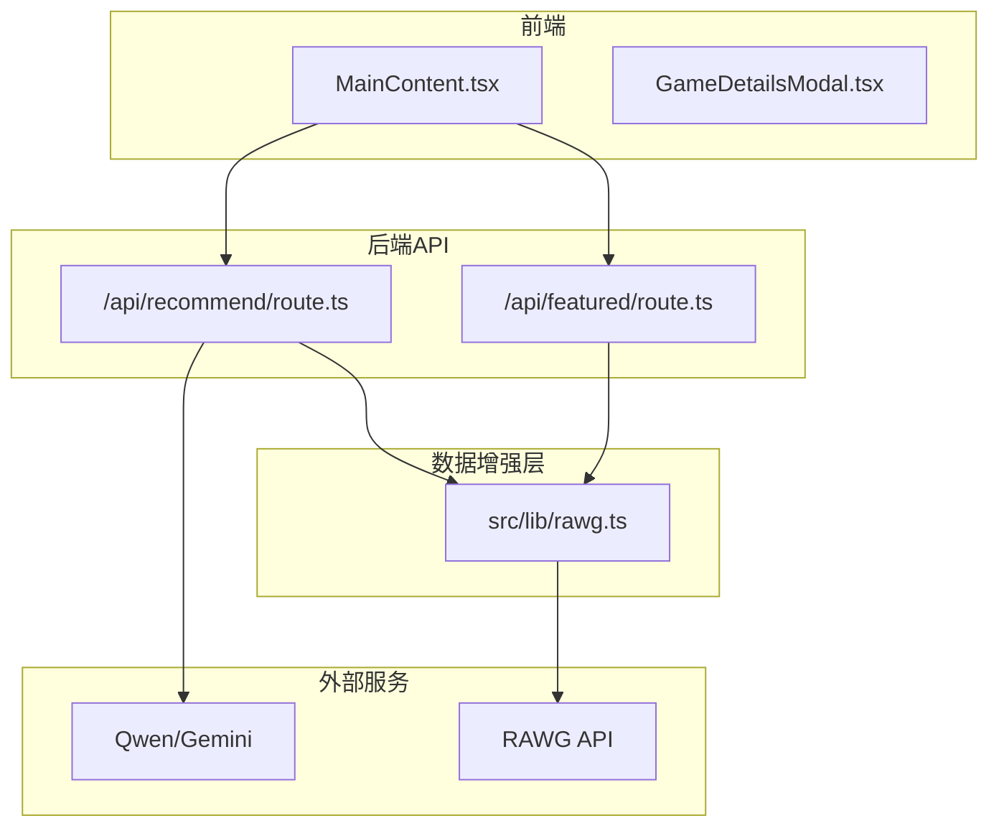
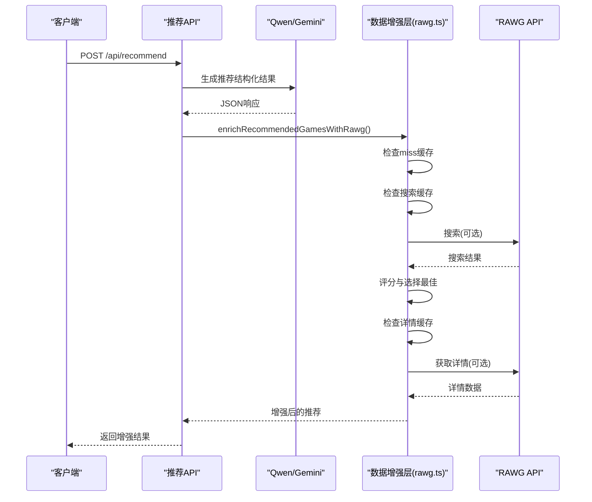
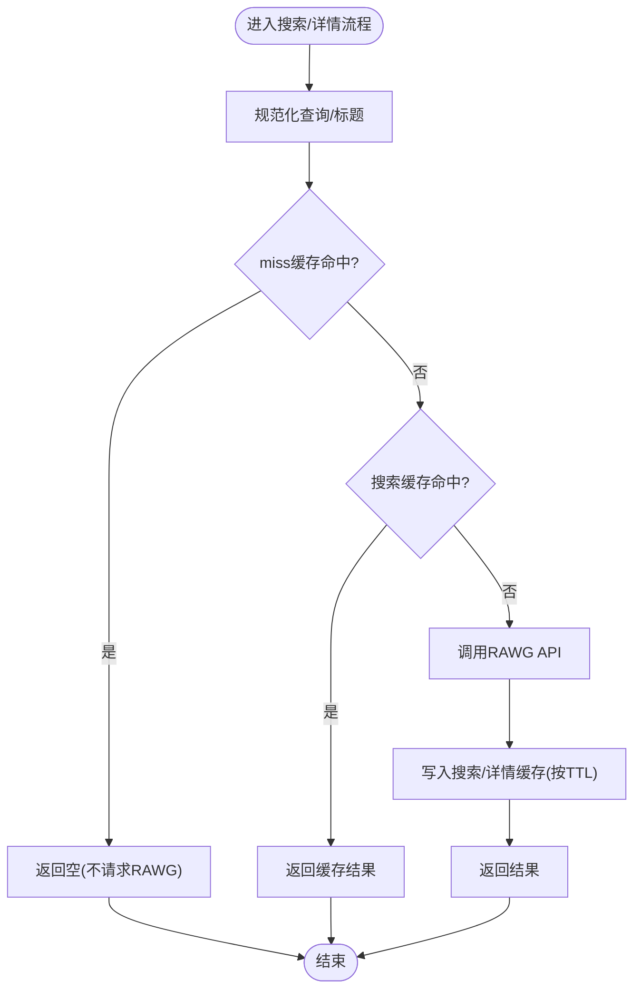
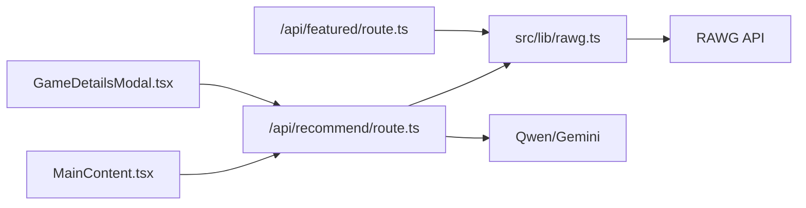

# 智能缓存策略

<cite>
**本文引用的文件**
- [README.md](file://README.md)
- [DESIGN_DOC.md](file://DESIGN_DOC.md)
- [RAWG_DATA_CACHE.md](file://RAWG_DATA_CACHE.md)
- [src/lib/rawg.ts](file://src/lib/rawg.ts)
- [src/app/api/recommend/route.ts](file://src/app/api/recommend/route.ts)
- [src/app/api/featured/route.ts](file://src/app/api/featured/route.ts)
- [src/services/gemini.ts](file://src/services/gemini.ts)
- [src/components/MainContent.tsx](file://src/components/MainContent.tsx)
- [src/components/GameDetailsModal.tsx](file://src/components/GameDetailsModal.tsx)
- [next.config.ts](file://next.config.ts)
- [package.json](file://package.json)
</cite>

## 目录
1. [引言](#引言)
2. [项目结构](#项目结构)
3. [核心组件](#核心组件)
4. [架构总览](#架构总览)
5. [详细组件分析](#详细组件分析)
6. [依赖关系分析](#依赖关系分析)
7. [性能考量](#性能考量)
8. [故障排除指南](#故障排除指南)
9. [结论](#结论)
10. [附录](#附录)

## 引言
本文件面向JoyMate项目的智能缓存策略，围绕多级缓存架构（搜索缓存、详情缓存、负缓存）进行系统化说明，覆盖缓存键设计、TTL与失效策略、命中率优化与内存管理、缓存一致性与并发控制、配置参数与性能调优、监控与调试工具以及故障排除最佳实践。文档同时结合项目现有实现与设计文档，提供可落地的工程化建议。

## 项目结构
- 前端交互与页面：Next.js应用，负责聊天界面、推荐卡片展示与模态详情。
- 后端API：Next.js API路由，封装LLM调用与数据增强流程。
- 数据增强层：基于RAWG API的搜索与详情增强逻辑，内置两级缓存与负缓存。
- 缓存实现：基于Map的内存缓存，具备TTL过期与自动清理能力。

图表来源
- [src/components/MainContent.tsx](file://src/components/MainContent.tsx)
- [src/app/api/recommend/route.ts](file://src/app/api/recommend/route.ts)
- [src/app/api/featured/route.ts](file://src/app/api/featured/route.ts)
- [src/lib/rawg.ts](file://src/lib/rawg.ts)

章节来源
- [README.md:1-41](file://README.md#L1-L41)
- [DESIGN_DOC.md:1-187](file://DESIGN_DOC.md#L1-L187)
- [next.config.ts:1-10](file://next.config.ts#L1-L10)

## 核心组件
- 搜索缓存（Search Cache）：键为规范化查询，值为搜索候选列表，TTL约7天。
- 详情缓存（Detail Cache）：键为RAWG id，值为详情对象，TTL约3天。
- 负缓存（Miss Cache）：键为“未命中的查询”，TTL24小时，避免重复请求。
- 缓存键设计：统一前缀+规范化键，减少重复与冲突。
- 过期与清理：按到期时间自动删除，无需显式LRU淘汰。
- 并发与超时：增强流程并发控制与请求超时，保障稳定性。

章节来源
- [RAWG_DATA_CACHE.md:79-122](file://RAWG_DATA_CACHE.md#L79-L122)
- [src/lib/rawg.ts:6-26](file://src/lib/rawg.ts#L6-L26)
- [src/lib/rawg.ts:172-210](file://src/lib/rawg.ts#L172-L210)

## 架构总览
智能缓存策略贯穿“推荐接口”与“精选接口”，在数据增强阶段显著降低RAWG API调用次数与延迟，提升用户体验与系统稳定性。

图表来源
- [src/app/api/recommend/route.ts:14-132](file://src/app/api/recommend/route.ts#L14-L132)
- [src/lib/rawg.ts:252-433](file://src/lib/rawg.ts#L252-L433)

## 详细组件分析

### 搜索缓存与详情缓存（Map内存缓存）
- 数据结构：三个Map分别保存搜索、详情与负缓存，值包含value与expiresAt。
- 键设计：
  - 搜索键：rawg:search:{normalized_query}
  - 详情键：rawg:detail:{rawg_id}
  - 负缓存键：rawg:miss:{normalized_query}
- TTL与失效：
  - 搜索缓存：7天
  - 详情缓存：3天
  - 负缓存：24小时
- 自动清理：读取时检查过期并删除，无需额外清理任务。

图表来源
- [src/lib/rawg.ts:172-210](file://src/lib/rawg.ts#L172-L210)
- [src/lib/rawg.ts:6-26](file://src/lib/rawg.ts#L6-L26)

章节来源
- [src/lib/rawg.ts:6-26](file://src/lib/rawg.ts#L6-L26)
- [src/lib/rawg.ts:172-210](file://src/lib/rawg.ts#L172-L210)

### 负缓存（Negative Cache）
- 目的：避免对“无结果/低分”查询重复请求，降低延迟与失败率。
- 触发条件：搜索结果为空或最高分低于阈值。
- TTL：24小时。
- 生效范围：同一规范化查询在24小时内不再发起搜索请求。

章节来源
- [RAWG_DATA_CACHE.md:109-115](file://RAWG_DATA_CACHE.md#L109-L115)
- [src/lib/rawg.ts:188-191](file://src/lib/rawg.ts#L188-L191)

### 缓存键设计与规范化
- 查询规范化：小写、去多余空白、去除特定后缀与标点、提取英文片段。
- 标题规范化：去除版本/合集等后缀，保留核心名称。
- 键前缀：rawg:search:/rawg:detail:/rawg:miss:，确保键空间隔离。

章节来源
- [src/lib/rawg.ts:28-41](file://src/lib/rawg.ts#L28-L41)
- [src/lib/rawg.ts:43-55](file://src/lib/rawg.ts#L43-L55)

### 命中率优化与相似度评分
- 评分维度：精确匹配、包含关系、编辑距离相似度、年份/数字冲突处理。
- 二次筛选：对DLCOther名称过滤，避免错误匹配。
- 降级策略：相似度过低或候选过于接近时拒绝匹配。

章节来源
- [src/lib/rawg.ts:116-158](file://src/lib/rawg.ts#L116-L158)
- [src/lib/rawg.ts:263-310](file://src/lib/rawg.ts#L263-L310)

### 并发访问控制与超时策略
- 推荐增强并发：默认2，最大3，避免对RAWG造成过大压力。
- 请求超时：单次RAWG请求4.5秒，整体增强流程硬超时建议6~8秒。
- 失败重试：默认不重试或仅1次，防止雪崩。

章节来源
- [src/lib/rawg.ts:357-358](file://src/lib/rawg.ts#L357-L358)
- [src/app/api/recommend/route.ts:97-102](file://src/app/api/recommend/route.ts#L97-L102)
- [RAWG_DATA_CACHE.md:116-122](file://RAWG_DATA_CACHE.md#L116-L122)

### 缓存一致性与降级策略
- 单卡片降级：增强失败保留AI字段，封面占位，评分/平台/简介不展示。
- 全局降级：RAWG整体不可用时，仍返回AI结构化结果，前端稳定渲染。
- 诊断字段：match_confidence/match_reason用于后续调优与A/B实验。

章节来源
- [RAWG_DATA_CACHE.md:123-138](file://RAWG_DATA_CACHE.md#L123-L138)
- [src/lib/rawg.ts:252-342](file://src/lib/rawg.ts#L252-L342)

### 精选接口缓存（静态卡片）
- 精选接口对结果进行全局缓存，TTL 24小时，避免重复增强。
- 无RAWG时提供默认卡片列表，保证前端稳定展示。

章节来源
- [src/app/api/featured/route.ts:24-82](file://src/app/api/featured/route.ts#L24-L82)

### 前端交互与缓存联动
- 主页面在加载时拉取精选接口，使用增强后的卡片数据。
- 详情模态框展示增强后的字段，包括封面、评分、平台、类型、标签与简介。

章节来源
- [src/components/MainContent.tsx:109-124](file://src/components/MainContent.tsx#L109-L124)
- [src/components/GameDetailsModal.tsx:5-20](file://src/components/GameDetailsModal.tsx#L5-L20)

## 依赖关系分析

图表来源
- [src/components/MainContent.tsx](file://src/components/MainContent.tsx)
- [src/app/api/recommend/route.ts](file://src/app/api/recommend/route.ts)
- [src/app/api/featured/route.ts](file://src/app/api/featured/route.ts)
- [src/lib/rawg.ts](file://src/lib/rawg.ts)

章节来源
- [src/services/gemini.ts:1-32](file://src/services/gemini.ts#L1-L32)
- [src/app/api/recommend/route.ts:1-157](file://src/app/api/recommend/route.ts#L1-L157)
- [src/app/api/featured/route.ts:1-84](file://src/app/api/featured/route.ts#L1-L84)

## 性能考量
- 缓存命中率优化
  - 查询规范化与英文片段提取，提升键命中率。
  - 评分阈值与二次筛选，降低错误匹配带来的缓存污染。
- 内存管理
  - Map内存缓存，按TTL自动清理，无需LRU淘汰逻辑。
  - 建议在生产环境替换为Redis或SQLite，实现持久化与跨实例共享。
- 并发与超时
  - 控制并发度与请求超时，避免上游限流与雪崩。
- 可观测性
  - 增强流程记录事件日志（增强总数、命中数、耗时），辅助性能分析。

章节来源
- [src/lib/rawg.ts:116-158](file://src/lib/rawg.ts#L116-L158)
- [src/app/api/recommend/route.ts:96-116](file://src/app/api/recommend/route.ts#L96-L116)
- [RAWG_DATA_CACHE.md:139-146](file://RAWG_DATA_CACHE.md#L139-L146)

## 故障排除指南
- RAWG不可用或配额不足
  - 推荐接口与图像生成接口均对429/配额耗尽进行友好降级，返回可读提示。
- 缓存未生效
  - 检查环境变量RAWG_API_KEY与RAWG_ENRICHMENT模式。
  - 确认查询是否被规范化为相同键。
- 响应缓慢
  - 检查并发设置与超时配置，适当降低并发或延长超时。
  - 关注日志中的增强耗时与命中率指标。
- 负缓存导致误伤
  - 24小时TTL较长时，可能出现“明明有结果却命中负缓存”的情况，建议缩短TTL或在业务层增加开关。

章节来源
- [src/app/api/recommend/route.ts:133-154](file://src/app/api/recommend/route.ts#L133-L154)
- [src/app/api/generate-art/route.ts:41-58](file://src/app/api/generate-art/route.ts#L41-L58)
- [src/lib/rawg.ts:188-191](file://src/lib/rawg.ts#L188-L191)

## 结论
JoyMate的智能缓存策略通过两级缓存与负缓存，有效降低了RAWG API的调用频次与延迟，提升了推荐接口的稳定性与用户体验。建议在生产环境中引入Redis或SQLite持久化缓存，配合可观测性指标与合理的TTL策略，持续优化命中率与资源利用率。

## 附录

### 缓存配置参数说明
- RAWG_API_KEY：启用数据增强的必要密钥。
- RAWG_ENRICHMENT：控制增强开关（on/off/auto），auto时依据是否存在密钥决定。
- RAWG_PAGE_SIZE：单次搜索返回候选数量，默认5。
- RAWG_TIMEOUT_MS：单次RAWG请求超时，默认4500ms。
- RAWG_MAX_ENRICH_GAMES：每次推荐最多增强条数，默认6。
- RAWG_CONCURRENCY：并发请求数，默认2，最大3。

章节来源
- [src/app/api/recommend/route.ts:89-102](file://src/app/api/recommend/route.ts#L89-L102)
- [src/lib/rawg.ts:356-358](file://src/lib/rawg.ts#L356-L358)
- [RAWG_DATA_CACHE.md:14-22](file://RAWG_DATA_CACHE.md#L14-L22)

### 缓存键与TTL对照表
- 搜索缓存：键 rawg:search:{normalized_query}，TTL 7天
- 详情缓存：键 rawg:detail:{rawg_id}，TTL 3天
- 负缓存：键 rawg:miss:{normalized_query}，TTL 24小时

章节来源
- [RAWG_DATA_CACHE.md:79-99](file://RAWG_DATA_CACHE.md#L79-L99)
- [src/lib/rawg.ts:172-210](file://src/lib/rawg.ts#L172-L210)

### 监控与调试建议
- 日志事件
  - rawg_enrich：记录增强总数、命中数与耗时。
  - rawg_featured：记录精选增强统计。
  - rawg_disabled_missing_key：记录增强关闭原因。
- 指标建议
  - 增强成功率 = enriched_count / total
  - 平均RAWG延迟（search/detail分开统计）
  - Top miss queries：用于规则与别名表优化

章节来源
- [src/app/api/recommend/route.ts:107-116](file://src/app/api/recommend/route.ts#L107-L116)
- [src/app/api/featured/route.ts:71-79](file://src/app/api/featured/route.ts#L71-L79)
- [RAWG_DATA_CACHE.md:139-146](file://RAWG_DATA_CACHE.md#L139-L146)