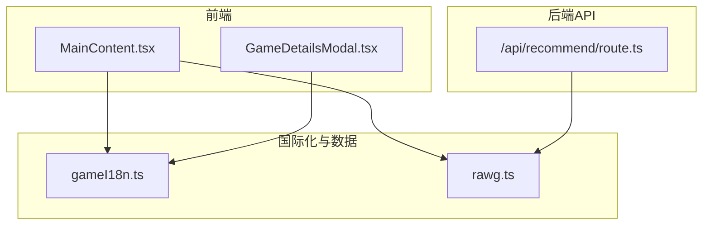
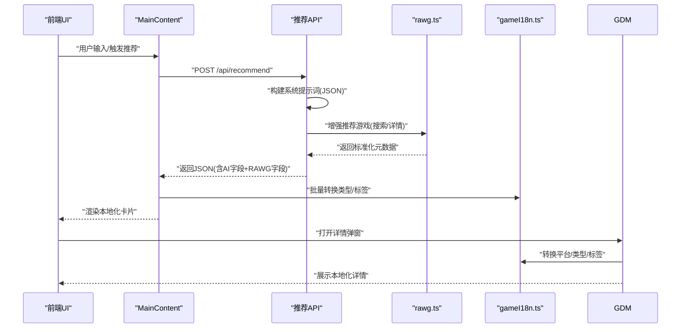
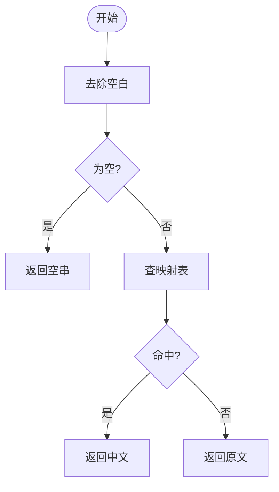
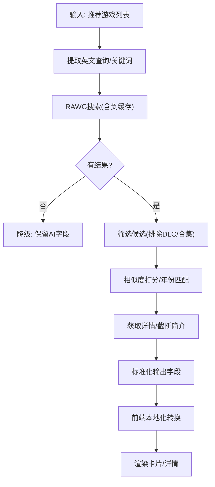
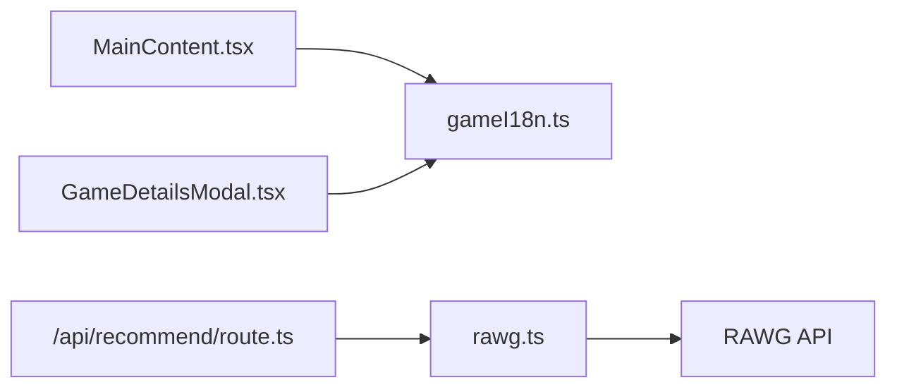

# 游戏数据国际化

<cite>
**本文引用的文件**
- [src/lib/gameI18n.ts](file://src/lib/gameI18n.ts)
- [src/lib/rawg.ts](file://src/lib/rawg.ts)
- [src/components/GameDetailsModal.tsx](file://src/components/GameDetailsModal.tsx)
- [src/components/MainContent.tsx](file://src/components/MainContent.tsx)
- [src/app/api/recommend/route.ts](file://src/app/api/recommend/route.ts)
- [RAWG 数据缓存与增强策略说明.md](file://RAWG_DATA_CACHE.md)
- [设计文档.md](file://DESIGN_DOC.md)
- [metadata.json](file://metadata.json)
- [next.config.ts](file://next.config.ts)
</cite>

## 目录
1. [引言](#引言)
2. [项目结构](#项目结构)
3. [核心组件](#核心组件)
4. [架构总览](#架构总览)
5. [详细组件分析](#详细组件分析)
6. [依赖关系分析](#依赖关系分析)
7. [性能考量](#性能考量)
8. [故障排查指南](#故障排查指南)
9. [结论](#结论)
10. [附录](#附录)

## 引言
本文件面向JoyMate项目中的游戏数据国际化系统，聚焦于游戏标签与分类的本地化转换机制、多语言支持策略、元数据的国际化处理流程、配置与上下文处理、实现示例与最佳实践，以及测试与验证方法。当前系统以中文为目标语言，通过静态映射表完成英文标签到中文的转换，并结合RAWG数据增强流程，为游戏卡片提供平台、类型、标签与简介等本地化展示。

## 项目结构
- 国际化核心逻辑位于src/lib/gameI18n.ts，提供标签映射与批量转换、CJK文本判断。
- 数据增强与缓存位于src/lib/rawg.ts，负责与RAWG API交互、查询归一化、相似度打分、缓存与降级。
- 前端组件在src/components/中消费本地化标签，如GameDetailsModal.tsx与MainContent.tsx。
- 后端API路由在src/app/api/recommend/route.ts中调用LLM生成推荐，并通过rawg.ts增强卡片元数据。
- 文档与配置参考：
  - RAWG数据缓存与增强策略说明.md定义了字段映射、缓存策略与降级规则。
  - 设计文档.md概述了技术架构与Agent流程。
  - metadata.json与next.config.ts提供应用元信息与构建配置。

图表来源
- [src/components/MainContent.tsx:1-721](file://src/components/MainContent.tsx#L1-L721)
- [src/components/GameDetailsModal.tsx:1-166](file://src/components/GameDetailsModal.tsx#L1-L166)
- [src/lib/gameI18n.ts:1-89](file://src/lib/gameI18n.ts#L1-L89)
- [src/lib/rawg.ts:1-434](file://src/lib/rawg.ts#L1-L434)
- [src/app/api/recommend/route.ts:1-71](file://src/app/api/recommend/route.ts#L1-L71)

章节来源
- [src/lib/gameI18n.ts:1-89](file://src/lib/gameI18n.ts#L1-L89)
- [src/lib/rawg.ts:1-434](file://src/lib/rawg.ts#L1-L434)
- [src/components/MainContent.tsx:1-721](file://src/components/MainContent.tsx#L1-L721)
- [src/components/GameDetailsModal.tsx:1-166](file://src/components/GameDetailsModal.tsx#L1-L166)
- [src/app/api/recommend/route.ts:1-71](file://src/app/api/recommend/route.ts#L1-L71)
- [RAWG 数据缓存与增强策略说明.md:1-153](file://RAWG_DATA_CACHE.md#L1-L153)
- [设计文档.md:1-187](file://DESIGN_DOC.md#L1-L187)
- [metadata.json:1-5](file://metadata.json#L1-L5)
- [next.config.ts:1-10](file://next.config.ts#L1-L10)

## 核心组件
- 标签本地化映射与转换
  - 映射表覆盖类型、玩法、平台、控制器支持、标签等英文术语到中文。
  - 提供单个标签转换与批量转换函数，并支持长度限制。
- CJK文本识别
  - 通过Unicode区间判断文本是否主要为CJK字符，用于决定简介展示策略。
- RAWG数据增强与缓存
  - 查询归一化、相似度计算、候选过滤与打分、详情获取、缓存与负缓存、并发与超时控制。
  - 输出标准化字段，包含标题、封面、评分、平台、类型、标签、简介等。
- 前端消费与展示
  - 在推荐卡片与详情弹窗中使用本地化标签，依据CJK文本选择简介文案。

章节来源
- [src/lib/gameI18n.ts:1-89](file://src/lib/gameI18n.ts#L1-L89)
- [src/lib/rawg.ts:1-434](file://src/lib/rawg.ts#L1-L434)
- [src/components/MainContent.tsx:1-721](file://src/components/MainContent.tsx#L1-L721)
- [src/components/GameDetailsModal.tsx:1-166](file://src/components/GameDetailsModal.tsx#L1-L166)

## 架构总览
下图展示了从前端到后端API再到RAWG数据增强的整体流程，以及本地化转换的关键节点。

图表来源
- [src/app/api/recommend/route.ts:1-71](file://src/app/api/recommend/route.ts#L1-L71)
- [src/lib/rawg.ts:252-342](file://src/lib/rawg.ts#L252-L342)
- [src/components/MainContent.tsx:476-593](file://src/components/MainContent.tsx#L476-L593)
- [src/components/GameDetailsModal.tsx:22-166](file://src/components/GameDetailsModal.tsx#L22-L166)
- [src/lib/gameI18n.ts:70-88](file://src/lib/gameI18n.ts#L70-L88)

## 详细组件分析

### 标签本地化转换机制
- 映射规则
  - 采用键值对映射，英文术语作为键，中文释义作为值。
  - 支持类型、玩法、平台、控制器支持、标签等类别。
- 转换算法
  - toZhLabel：去除空白后查表，未命中则回退原文。
  - toZhLabels：数组映射后过滤空字符串，可选限制输出数量。
  - isMostlyCjkText：统计CJK字符占比，用于判断是否主要为中文/日文/韩文。
- 使用场景
  - 推荐卡片与详情弹窗中对类型、标签、平台进行本地化展示。
  - 简介文案在CJK文本时直接展示，否则组合类型、平台、发售日期等生成本地化简介。

图表来源
- [src/lib/gameI18n.ts:70-81](file://src/lib/gameI18n.ts#L70-L81)

章节来源
- [src/lib/gameI18n.ts:1-89](file://src/lib/gameI18n.ts#L1-L89)
- [src/components/MainContent.tsx:530-542](file://src/components/MainContent.tsx#L530-L542)
- [src/components/GameDetailsModal.tsx:25-39](file://src/components/GameDetailsModal.tsx#L25-L39)

### 多语言支持策略与回退机制
- 语言检测
  - 通过isMostlyCjkText判断简介文本是否主要为CJK字符，决定是否使用原文简介。
- 回退机制
  - 类型/标签/平台转换未命中时回退原文。
  - RAWG增强失败时保留AI字段，封面使用占位图，不展示评分/平台/简介。
- 动态翻译处理
  - 当前系统以静态映射为主，未集成实时翻译服务。
  - 对于纯英文查询，通过extractEnglishQuery提取英文片段参与增强流程。

章节来源
- [src/lib/gameI18n.ts:83-88](file://src/lib/gameI18n.ts#L83-L88)
- [src/lib/rawg.ts:43-55](file://src/lib/rawg.ts#L43-L55)
- [src/lib/rawg.ts:382-417](file://src/lib/rawg.ts#L382-L417)
- [src/components/MainContent.tsx:476-483](file://src/components/MainContent.tsx#L476-L483)
- [src/components/GameDetailsModal.tsx:29-39](file://src/components/GameDetailsModal.tsx#L29-L39)

### 游戏元数据国际化处理流程
- 字段映射
  - RAWG字段映射到展示字段：id→rawg_id、slug→rawg_slug、name→title、background_image→cover_url、rating/…→对应字段、platforms[].platform.name→platforms[]、genres[].name→genres[]、tags[].name→tags[]、description_raw→description_short。
- 本地化处理
  - 类型、标签、平台经toZhLabels/toZhLabel转换。
  - 简介在CJK文本时直接展示，否则组合类型、平台、发售日期生成本地化简介。
- 增强与缓存
  - 搜索与详情分别缓存，负缓存避免重复失败请求。
  - 并发控制与超时策略保障稳定性与性能。

图表来源
- [src/lib/rawg.ts:252-342](file://src/lib/rawg.ts#L252-L342)
- [src/lib/rawg.ts:351-433](file://src/lib/rawg.ts#L351-L433)
- [src/components/MainContent.tsx:476-593](file://src/components/MainContent.tsx#L476-L593)
- [src/components/GameDetailsModal.tsx:22-166](file://src/components/GameDetailsModal.tsx#L22-L166)

章节来源
- [RAWG 数据缓存与增强策略说明.md:62-77](file://RAWG_DATA_CACHE.md#L62-L77)
- [src/lib/rawg.ts:252-342](file://src/lib/rawg.ts#L252-L342)
- [src/lib/rawg.ts:351-433](file://src/lib/rawg.ts#L351-L433)
- [src/components/MainContent.tsx:476-593](file://src/components/MainContent.tsx#L476-L593)
- [src/components/GameDetailsModal.tsx:22-166](file://src/components/GameDetailsModal.tsx#L22-L166)

### 国际化配置与上下文处理
- 配置文件
  - metadata.json：应用名称与描述等元信息。
  - next.config.ts：构建目录等基础配置。
- 上下文处理
  - 前端组件在渲染时根据数据存在性与CJK文本特征动态选择展示策略。
  - 后端API在响应中携带AI字段与RAWG字段，前端据此决定本地化与降级。

章节来源
- [metadata.json:1-5](file://metadata.json#L1-L5)
- [next.config.ts:1-10](file://next.config.ts#L1-L10)
- [src/components/MainContent.tsx:476-593](file://src/components/MainContent.tsx#L476-L593)
- [src/components/GameDetailsModal.tsx:22-166](file://src/components/GameDetailsModal.tsx#L22-L166)

### 实现示例与最佳实践
- 示例路径
  - 标签转换：[src/lib/gameI18n.ts:70-81](file://src/lib/gameI18n.ts#L70-L81)
  - 批量转换与限制：[src/components/MainContent.tsx:530-542](file://src/components/MainContent.tsx#L530-L542)
  - 简介策略：[src/components/GameDetailsModal.tsx:29-39](file://src/components/GameDetailsModal.tsx#L29-L39)
  - 增强流程：[src/lib/rawg.ts:252-342](file://src/lib/rawg.ts#L252-L342)
- 最佳实践
  - 使用映射表集中管理术语，便于维护与扩展。
  - 对类型/标签/平台进行批量转换并限制数量，避免界面拥挤。
  - 优先使用CJK原文简介，否则组合关键信息生成本地化简介。
  - 严格区分AI字段与RAWG字段，确保降级时界面稳定。

章节来源
- [src/lib/gameI18n.ts:1-89](file://src/lib/gameI18n.ts#L1-L89)
- [src/components/MainContent.tsx:530-542](file://src/components/MainContent.tsx#L530-L542)
- [src/components/GameDetailsModal.tsx:29-39](file://src/components/GameDetailsModal.tsx#L29-L39)
- [src/lib/rawg.ts:252-342](file://src/lib/rawg.ts#L252-L342)

## 依赖关系分析
- 组件耦合
  - MainContent与GameDetailsModal依赖gameI18n进行本地化转换。
  - API路由依赖rawg.ts进行数据增强。
- 外部依赖
  - RAWG API：用于搜索与详情获取。
  - LLM API：用于生成推荐与理由（Qwen/Gemini）。
- 可能的循环依赖
  - 当前模块间为单向依赖，未见循环。

图表来源
- [src/components/MainContent.tsx:1-721](file://src/components/MainContent.tsx#L1-L721)
- [src/components/GameDetailsModal.tsx:1-166](file://src/components/GameDetailsModal.tsx#L1-L166)
- [src/lib/gameI18n.ts:1-89](file://src/lib/gameI18n.ts#L1-L89)
- [src/app/api/recommend/route.ts:1-71](file://src/app/api/recommend/route.ts#L1-L71)
- [src/lib/rawg.ts:1-434](file://src/lib/rawg.ts#L1-L434)

章节来源
- [src/components/MainContent.tsx:1-721](file://src/components/MainContent.tsx#L1-L721)
- [src/components/GameDetailsModal.tsx:1-166](file://src/components/GameDetailsModal.tsx#L1-L166)
- [src/lib/gameI18n.ts:1-89](file://src/lib/gameI18n.ts#L1-L89)
- [src/app/api/recommend/route.ts:1-71](file://src/app/api/recommend/route.ts#L1-L71)
- [src/lib/rawg.ts:1-434](file://src/lib/rawg.ts#L1-L434)

## 性能考量
- 缓存策略
  - 搜索缓存：7天TTL，减少重复搜索。
  - 详情缓存：3天TTL，平衡新鲜度与性能。
  - 负缓存：24小时TTL，避免重复失败请求。
- 并发与超时
  - 增强过程并发控制在2-3之间，整体超时合理设置，失败快速回退。
- 展示优化
  - 限制类型/标签数量，避免过多标签影响渲染性能。
  - CJK文本直接展示，减少不必要的转换与拼接。

章节来源
- [RAWG 数据缓存与增强策略说明.md:79-122](file://RAWG_DATA_CACHE.md#L79-L122)
- [src/lib/rawg.ts:14-26](file://src/lib/rawg.ts#L14-L26)
- [src/lib/rawg.ts:196-210](file://src/lib/rawg.ts#L196-L210)
- [src/lib/rawg.ts:351-433](file://src/lib/rawg.ts#L351-L433)

## 故障排查指南
- 常见问题
  - RAWG API不可用或限流：检查环境变量与网络，观察负缓存是否生效。
  - 增强失败：确认查询是否为空或过短，检查英文提取逻辑。
  - 本地化缺失：检查映射表是否包含对应键，必要时补充。
- 调试建议
  - 查看match_reason与match_confidence，评估匹配质量。
  - 在降级场景下保留AI字段，确保界面稳定。
  - 关注CJK文本识别，避免错误回退到组合简介。

章节来源
- [src/lib/rawg.ts:172-195](file://src/lib/rawg.ts#L172-L195)
- [src/lib/rawg.ts:351-433](file://src/lib/rawg.ts#L351-L433)
- [src/components/MainContent.tsx:476-483](file://src/components/MainContent.tsx#L476-L483)
- [src/components/GameDetailsModal.tsx:29-39](file://src/components/GameDetailsModal.tsx#L29-L39)

## 结论
JoyMate的国际化系统以静态映射为核心，结合RAWG数据增强与缓存策略，实现了从英文术语到中文的高效转换与稳定的前端展示。通过CJK文本识别与降级机制，系统在保证用户体验的同时兼顾了性能与可靠性。未来可考虑引入动态翻译与更丰富的上下文语境处理，进一步提升多语言支持能力。

## 附录
- 相关文档
  - RAWG数据缓存与增强策略说明.md
  - 设计文档.md
- 配置文件
  - metadata.json
  - next.config.ts