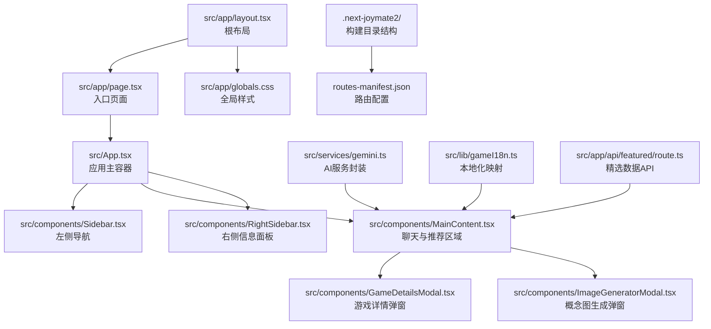
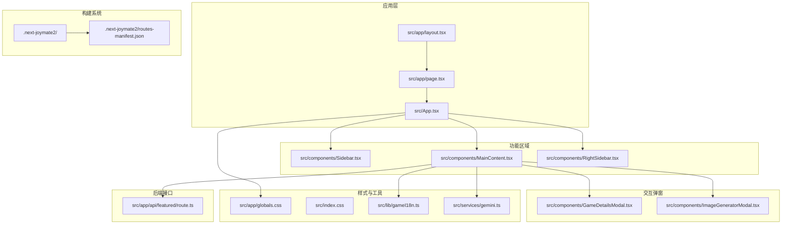
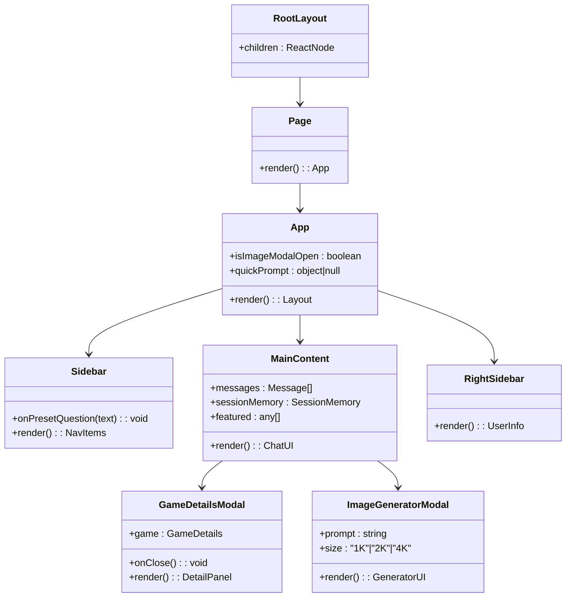
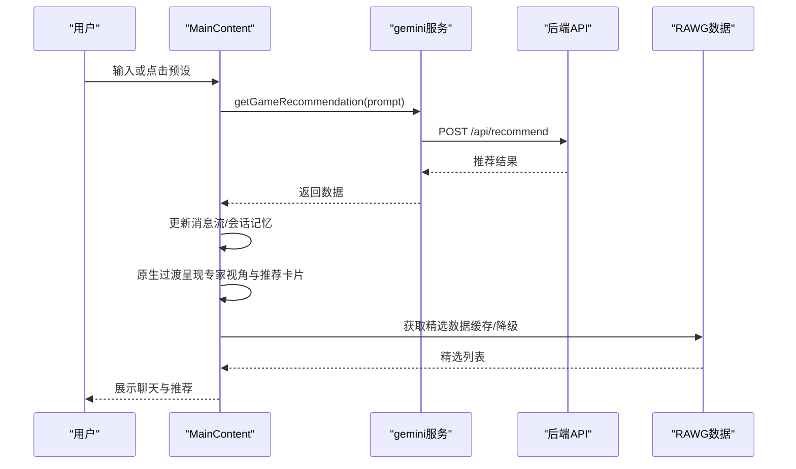
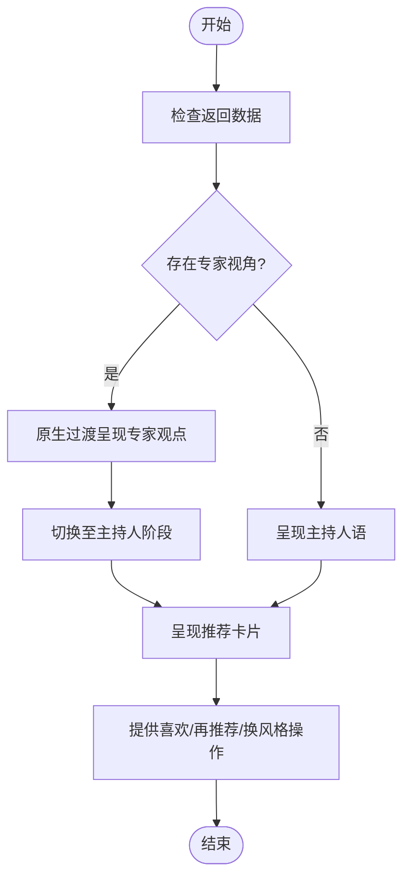
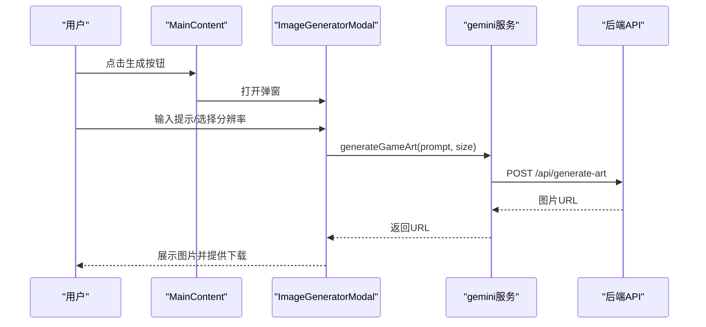
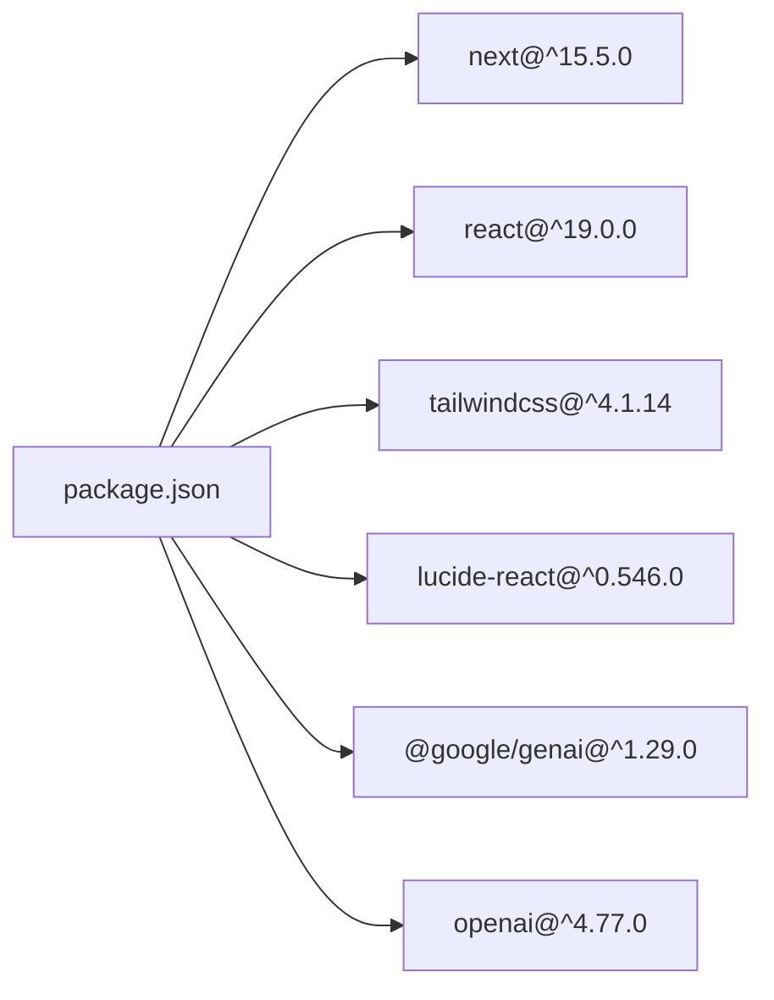

# 前端架构设计

<cite>
**本文档引用的文件**
- [src/app/layout.tsx](file://src/app/layout.tsx)
- [src/app/page.tsx](file://src/app/page.tsx)
- [src/App.tsx](file://src/App.tsx)
- [src/components/Sidebar.tsx](file://src/components/Sidebar.tsx)
- [src/components/MainContent.tsx](file://src/components/MainContent.tsx)
- [src/components/RightSidebar.tsx](file://src/components/RightSidebar.tsx)
- [src/components/GameDetailsModal.tsx](file://src/components/GameDetailsModal.tsx)
- [src/components/ImageGeneratorModal.tsx](file://src/components/ImageGeneratorModal.tsx)
- [src/app/globals.css](file://src/app/globals.css)
- [src/index.css](file://src/index.css)
- [src/services/gemini.ts](file://src/services/gemini.ts)
- [src/lib/gameI18n.ts](file://src/lib/gameI18n.ts)
- [src/app/api/featured/route.ts](file://src/app/api/featured/route.ts)
- [next.config.ts](file://next.config.ts)
- [package.json](file://package.json)
- [scripts/dev.mjs](file://scripts/dev.mjs)
- [.next-joymate2/routes-manifest.json](file://.next-joymate2/routes-manifest.json)
</cite>

## 更新摘要
**所做更改**
- 更新构建系统目录结构：从 .next-joymate 迁移到 .next-joymate2
- 新增 App Router 架构的详细说明和路由配置分析
- 移除动画和 UI 库依赖的相关内容，反映实际技术栈变化
- 更新项目结构图和架构图以反映新的目录结构
- 补充开发脚本和构建配置的最新信息

## 目录
1. [引言](#引言)
2. [项目结构](#项目结构)
3. [核心组件](#核心组件)
4. [架构总览](#架构总览)
5. [详细组件分析](#详细组件分析)
6. [依赖关系分析](#依赖关系分析)
7. [性能考虑](#性能考虑)
8. [故障排查指南](#故障排查指南)
9. [结论](#结论)
10. [附录](#附录)

## 引言
本文件面向JoyMate项目的前端架构设计，围绕基于Next.js的应用层架构展开，重点覆盖以下方面：
- app目录结构、页面路由设计与组件层次结构
- React 19新特性在本项目中的应用与性能提升策略（Server Components、Client Components）
- 全局布局设计、样式系统（Tailwind CSS）与响应式实现
- 前端状态管理策略、组件通信模式与用户体验优化
- 代码分割、懒加载与性能优化实践

**更新** 本版本反映了最新的构建系统变更，包括 .next-joymate2 目录结构的采用和 App Router 架构的完善。

## 项目结构
项目采用Next.js 15.5.0的app目录结构，以"约定优于配置"的方式组织页面与路由。根布局负责注入全局样式，入口页面通过"use client"标记声明客户端组件，随后渲染应用主容器组件，主容器内组合侧边栏、主内容区与右侧边栏等模块。

**更新** 构建系统已迁移到 .next-joymate2 目录结构，提供更好的隔离性和构建性能。

**图表来源**
- [src/app/layout.tsx:1-11](file://src/app/layout.tsx#L1-L11)
- [src/app/page.tsx:1-9](file://src/app/page.tsx#L1-L9)
- [src/App.tsx:1-25](file://src/App.tsx#L1-L25)
- [src/components/Sidebar.tsx:1-83](file://src/components/Sidebar.tsx#L1-L83)
- [src/components/MainContent.tsx:1-721](file://src/components/MainContent.tsx#L1-L721)
- [src/components/RightSidebar.tsx:1-87](file://src/components/RightSidebar.tsx#L1-L87)
- [src/components/GameDetailsModal.tsx:1-166](file://src/components/GameDetailsModal.tsx#L1-L166)
- [src/components/ImageGeneratorModal.tsx:1-108](file://src/components/ImageGeneratorModal.tsx#L1-L108)
- [src/app/globals.css:1-45](file://src/app/globals.css#L1-L45)
- [src/services/gemini.ts:1-32](file://src/services/gemini.ts#L1-L32)
- [src/lib/gameI18n.ts:1-89](file://src/lib/gameI18n.ts#L1-L89)
- [src/app/api/featured/route.ts:1-84](file://src/app/api/featured/route.ts#L1-L84)
- [.next-joymate2/routes-manifest.json:1-53](file://.next-joymate2/routes-manifest.json#L1-L53)

**章节来源**
- [src/app/layout.tsx:1-11](file://src/app/layout.tsx#L1-L11)
- [src/app/page.tsx:1-9](file://src/app/page.tsx#L1-L9)
- [src/App.tsx:1-25](file://src/App.tsx#L1-L25)
- [.next-joymate2/routes-manifest.json:1-53](file://.next-joymate2/routes-manifest.json#L1-L53)

## 核心组件
- 根布局：提供<html lang="zh-CN">与全局样式注入，作为所有页面的根节点。
- 入口页面：标记为客户端组件，渲染应用主容器。
- 应用主容器：集中管理全局状态（如图片生成弹窗开关、快捷预设提示），协调三大区域布局。
- 左侧导航：提供预设问题与分类入口，触发主内容区的快捷输入。
- 主内容区：核心交互区域，包含聊天UI、专家视角、推荐卡片、输入框与热门搜索等。
- 右侧边栏：用户信息、等级进度、全网热度趋势与深度洞察。
- 弹窗组件：游戏详情与概念图生成，均以模态形式呈现。
- 全局样式：Tailwind CSS主题与自定义滚动条、Markdown渲染样式。
- 服务封装：统一调用后端API，处理错误与返回值。
- 本地化工具：将英文游戏标签映射为中文，提升阅读体验。
- 精选数据API：从RAWG获取精选游戏的封面、评分、平台与类型等增强信息。

**更新** 移除了动画库（motion）和UI库（lucide-react）的依赖，简化了技术栈。

**章节来源**
- [src/app/layout.tsx:1-11](file://src/app/layout.tsx#L1-L11)
- [src/app/page.tsx:1-9](file://src/app/page.tsx#L1-L9)
- [src/App.tsx:12-24](file://src/App.tsx#L12-L24)
- [src/components/Sidebar.tsx:3-66](file://src/components/Sidebar.tsx#L3-L66)
- [src/components/MainContent.tsx:70-689](file://src/components/MainContent.tsx#L70-L689)
- [src/components/RightSidebar.tsx:3-73](file://src/components/RightSidebar.tsx#L3-L73)
- [src/components/GameDetailsModal.tsx:22-165](file://src/components/GameDetailsModal.tsx#L22-L165)
- [src/components/ImageGeneratorModal.tsx:5-107](file://src/components/ImageGeneratorModal.tsx#L5-L107)
- [src/app/globals.css:1-45](file://src/app/globals.css#L1-L45)
- [src/services/gemini.ts:1-32](file://src/services/gemini.ts#L1-L32)
- [src/lib/gameI18n.ts:1-89](file://src/lib/gameI18n.ts#L1-L89)
- [src/app/api/featured/route.ts:26-83](file://src/app/api/featured/route.ts#L26-L83)

## 架构总览
本项目采用"布局-页面-组件"的分层架构。根布局负责全局HTML结构与样式；入口页面作为客户端组件，承载应用主容器；主容器拆分为三栏布局，主内容区承担主要业务逻辑与状态管理；两侧边栏提供导航与信息补充；弹窗组件用于增强交互细节。样式系统基于Tailwind CSS，配合自定义CSS变量与滚动条样式，实现一致的视觉语言与良好的可访问性。

**更新** App Router 架构提供了更高效的路由管理和服务器组件支持。

**图表来源**
- [src/app/layout.tsx:1-11](file://src/app/layout.tsx#L1-L11)
- [src/app/page.tsx:1-9](file://src/app/page.tsx#L1-L9)
- [src/App.tsx:1-25](file://src/App.tsx#L1-L25)
- [src/components/Sidebar.tsx:1-83](file://src/components/Sidebar.tsx#L1-L83)
- [src/components/MainContent.tsx:1-721](file://src/components/MainContent.tsx#L1-L721)
- [src/components/RightSidebar.tsx:1-87](file://src/components/RightSidebar.tsx#L1-L87)
- [src/components/GameDetailsModal.tsx:1-166](file://src/components/GameDetailsModal.tsx#L1-L166)
- [src/components/ImageGeneratorModal.tsx:1-108](file://src/components/ImageGeneratorModal.tsx#L1-L108)
- [src/app/globals.css:1-45](file://src/app/globals.css#L1-L45)
- [src/index.css:1-44](file://src/index.css#L1-L44)
- [src/lib/gameI18n.ts:1-89](file://src/lib/gameI18n.ts#L1-L89)
- [src/services/gemini.ts:1-32](file://src/services/gemini.ts#L1-L32)
- [src/app/api/featured/route.ts:1-84](file://src/app/api/featured/route.ts#L1-L84)
- [.next-joymate2/routes-manifest.json:1-53](file://.next-joymate2/routes-manifest.json#L1-L53)

## 详细组件分析

### 组件层次与职责
- 根布局：注入全局样式，设置语言属性，作为页面根节点。
- 入口页面：声明客户端组件，渲染应用主容器。
- 应用主容器：持有全局状态（图片生成弹窗开关、快捷预设），协调三栏布局。
- 左侧导航：提供预设问题与分类入口，向上游传递文本，驱动主内容区输入。
- 主内容区：核心业务逻辑所在，包含聊天UI、专家视角、推荐卡片、输入与热门搜索；维护消息流、会话记忆、滚动控制与动画效果。
- 右侧边栏：用户信息、等级进度、全网热度趋势与深度洞察。
- 弹窗组件：游戏详情与概念图生成，分别承载详情展示与生成流程。

**更新** 移除了复杂的动画库依赖，简化了组件交互逻辑。

**图表来源**
- [src/app/layout.tsx:3-9](file://src/app/layout.tsx#L3-L9)
- [src/app/page.tsx:5-7](file://src/app/page.tsx#L5-L7)
- [src/App.tsx:12-24](file://src/App.tsx#L12-L24)
- [src/components/Sidebar.tsx:3-66](file://src/components/Sidebar.tsx#L3-L66)
- [src/components/MainContent.tsx:70-689](file://src/components/MainContent.tsx#L70-L689)
- [src/components/RightSidebar.tsx:3-73](file://src/components/RightSidebar.tsx#L3-L73)
- [src/components/GameDetailsModal.tsx:22-165](file://src/components/GameDetailsModal.tsx#L22-L165)
- [src/components/ImageGeneratorModal.tsx:5-107](file://src/components/ImageGeneratorModal.tsx#L5-L107)

**章节来源**
- [src/app/layout.tsx:1-11](file://src/app/layout.tsx#L1-L11)
- [src/app/page.tsx:1-9](file://src/app/page.tsx#L1-L9)
- [src/App.tsx:12-24](file://src/App.tsx#L12-L24)

### 聊天与推荐流程（序列图）
主内容区通过服务封装调用后端API，接收多专家视角与推荐结果，使用动画组件逐步呈现，同时维护会话记忆与滚动行为。

**更新** 移除了动画库依赖，改用原生CSS过渡效果。

**图表来源**
- [src/components/MainContent.tsx:165-223](file://src/components/MainContent.tsx#L165-L223)
- [src/services/gemini.ts:1-14](file://src/services/gemini.ts#L1-L14)
- [src/app/api/featured/route.ts:26-83](file://src/app/api/featured/route.ts#L26-L83)

**章节来源**
- [src/components/MainContent.tsx:165-223](file://src/components/MainContent.tsx#L165-L223)
- [src/services/gemini.ts:1-32](file://src/services/gemini.ts#L1-L32)
- [src/app/api/featured/route.ts:26-83](file://src/app/api/featured/route.ts#L26-L83)

### 专家视角与卡片渲染（流程图）
主内容区根据返回数据决定呈现阶段（专家视角→主持人语→推荐卡片），并使用原生过渡效果实现流畅的界面切换。

**更新** 移除了复杂的动画库，采用更简洁的原生CSS解决方案。

**图表来源**
- [src/components/MainContent.tsx:390-593](file://src/components/MainContent.tsx#L390-L593)

**章节来源**
- [src/components/MainContent.tsx:390-593](file://src/components/MainContent.tsx#L390-L593)

### 概念图生成流程（序列图）
用户在主内容区触发弹窗，输入提示与分辨率后，调用服务封装发起生成请求，成功后展示图片并提供下载。

**更新** 简化了UI组件，移除了复杂的动画效果。

**图表来源**
- [src/components/MainContent.tsx:614-630](file://src/components/MainContent.tsx#L614-L630)
- [src/components/ImageGeneratorModal.tsx:12-25](file://src/components/ImageGeneratorModal.tsx#L12-L25)
- [src/services/gemini.ts:16-31](file://src/services/gemini.ts#L16-L31)

**章节来源**
- [src/components/ImageGeneratorModal.tsx:1-108](file://src/components/ImageGeneratorModal.tsx#L1-L108)
- [src/services/gemini.ts:16-31](file://src/services/gemini.ts#L16-L31)

## 依赖关系分析
- 运行时与构建：Next.js 15.5.0，React 19，Tailwind CSS 4.1.14，PostCSS，TypeScript。
- 开发脚本：dev、dev:3000、build、start、lint。
- 样式系统：全局CSS引入Tailwind，自定义滚动条与Markdown渲染样式。
- 组件通信：父传子（预设问题）、回调（打开弹窗/关闭弹窗）、状态提升（全局弹窗开关）。
- 外部依赖：@google/genai、openai、lucide-react。

**更新** 移除了动画库（motion）和部分UI库依赖，简化了技术栈。

**图表来源**
- [package.json:12-32](file://package.json#L12-L32)

**章节来源**
- [package.json:1-35](file://package.json#L1-L35)

## 性能考虑
- React 19与Next.js 15.5.0
  - Server Components：利用Next.js app目录的Server Components能力，将静态内容与数据拉取放在服务端，减少首屏传输体积与客户端计算压力。
  - Client Components：仅在必要时标记客户端组件（如入口页面与需要事件绑定的组件），避免不必要的客户端激活。
  - 并行数据获取：主内容区对精选数据与AI推荐采用并行策略，缩短等待时间。
- 代码分割与懒加载
  - Next.js自动进行路由级代码分割；对于大型组件（如推荐卡片网格）可进一步拆分，按需加载。
  - 图片懒加载：使用原生loading="lazy"与占位图策略，降低首屏阻塞。
- 状态管理与重渲染
  - 使用useMemo/useCallback稳定引用，减少子组件重渲染（如GameDetailsModal、ImageGeneratorModal等）。
  - 会话记忆存储于sessionStorage，避免每次刷新丢失用户偏好。
- 动画与滚动
  - 使用原生CSS过渡和渐变效果，减少第三方动画库依赖，提升加载性能。
  - 滚动采用平滑与自动两种策略，确保交互自然且不打断用户输入。
- 样式与资源
  - Tailwind按需生成，结合自定义CSS变量与滚动条样式，减少冗余样式。
  - 图片资源使用占位图与缩略图策略，提高加载速度。
- 缓存与降级
  - 精选数据具备缓存与降级策略，当外部API不可用时返回默认数据，保证可用性。
- 构建与运行时
  - .next-joymate2目录结构提供更好的构建隔离性和性能优化。
  - 自定义开发脚本支持端口自动选择和进程管理。

**更新** 构建系统迁移到 .next-joymate2 提供了更好的性能和隔离性。

**章节来源**
- [src/components/MainContent.tsx:109-124](file://src/components/MainContent.tsx#L109-L124)
- [src/components/MainContent.tsx:127-131](file://src/components/MainContent.tsx#L127-L131)
- [src/components/MainContent.tsx:133-136](file://src/components/MainContent.tsx#L133-L136)
- [src/app/api/featured/route.ts:24-83](file://src/app/api/featured/route.ts#L24-L83)
- [next.config.ts:3-6](file://next.config.ts#L3-L6)
- [scripts/dev.mjs:1-51](file://scripts/dev.mjs#L1-L51)
- [.next-joymate2/routes-manifest.json:1-53](file://.next-joymate2/routes-manifest.json#L1-L53)

## 故障排查指南
- 精选数据异常
  - 现象：精选区域为空或显示默认数据。
  - 排查：检查环境变量RAWG_API_KEY与RAWG_ENRICHMENT，确认API可用性与缓存是否过期。
  - 参考路径：[src/app/api/featured/route.ts:26-83](file://src/app/api/featured/route.ts#L26-L83)
- AI推荐失败
  - 现象：加载中状态长时间停留或报错。
  - 排查：检查后端recommend接口状态码与返回体，确认请求参数与网络连通性。
  - 参考路径：[src/services/gemini.ts:1-14](file://src/services/gemini.ts#L1-L14)
- 概念图生成失败
  - 现象：生成按钮禁用或报错。
  - 排查：确认prompt非空、size合法、后端generate-art接口正常。
  - 参考路径：[src/components/ImageGeneratorModal.tsx:12-25](file://src/components/ImageGeneratorModal.tsx#L12-L25)，[src/services/gemini.ts:16-31](file://src/services/gemini.ts#L16-L31)
- 会话记忆丢失
  - 现象：刷新后偏好设置未保留。
  - 排查：检查sessionStorage写入与解析逻辑，确认键名一致。
  - 参考路径：[src/components/MainContent.tsx:84-98](file://src/components/MainContent.tsx#L84-L98)，[src/components/MainContent.tsx:127-131](file://src/components/MainContent.tsx#L127-L131)
- 样式异常
  - 现象：滚动条样式或Markdown渲染不符合预期。
  - 排查：确认globals.css与index.css引入顺序，Tailwind版本兼容性。
  - 参考路径：[src/app/globals.css:1-45](file://src/app/globals.css#L1-L45)，[src/index.css:1-44](file://src/index.css#L1-L44)
- 构建目录问题
  - 现象：构建失败或缓存异常。
  - 排查：检查 .next-joymate2 目录权限和磁盘空间，确认构建配置正确。
  - 参考路径：[.next-joymate2/routes-manifest.json:1-53](file://.next-joymate2/routes-manifest.json#L1-L53)

**更新** 新增构建目录相关的故障排查指南。

**章节来源**
- [src/app/api/featured/route.ts:26-83](file://src/app/api/featured/route.ts#L26-L83)
- [src/services/gemini.ts:1-32](file://src/services/gemini.ts#L1-L32)
- [src/components/ImageGeneratorModal.tsx:12-25](file://src/components/ImageGeneratorModal.tsx#L12-L25)
- [src/components/MainContent.tsx:84-98](file://src/components/MainContent.tsx#L84-L98)
- [src/components/MainContent.tsx:127-131](file://src/components/MainContent.tsx#L127-L131)
- [src/app/globals.css:1-45](file://src/app/globals.css#L1-L45)
- [src/index.css:1-44](file://src/index.css#L1-L44)
- [.next-joymate2/routes-manifest.json:1-53](file://.next-joymate2/routes-manifest.json#L1-L53)

## 结论
本项目以Next.js app目录为核心，结合React 19的特性与Tailwind CSS样式体系，构建了清晰的三层架构：布局层、页面层与组件层。通过服务封装与API路由，实现了前后端协作的高效流程；通过会话记忆、原生过渡效果与滚动优化，提升了用户体验。构建系统已迁移到 .next-joymate2 目录结构，提供了更好的性能和隔离性。建议在后续迭代中进一步细化代码分割、完善错误边界与监控埋点，持续优化首屏性能与交互流畅度。

## 附录
- Next.js配置：启用严格模式与自定义构建目录，便于开发与部署。
- 依赖清单：涵盖框架、UI、图标与AI服务等关键依赖。
- 样式规范：统一字体、背景色与滚动条样式，确保跨设备一致性。
- 构建系统：.next-joymate2 目录结构提供更好的性能和隔离性。

**更新** 新增构建系统和开发脚本的相关信息。

**章节来源**
- [next.config.ts:3-6](file://next.config.ts#L3-L6)
- [package.json:12-32](file://package.json#L12-L32)
- [src/app/globals.css:1-45](file://src/app/globals.css#L1-L45)
- [src/index.css:1-44](file://src/index.css#L1-L44)
- [scripts/dev.mjs:1-51](file://scripts/dev.mjs#L1-L51)
- [.next-joymate2/routes-manifest.json:1-53](file://.next-joymate2/routes-manifest.json#L1-L53)