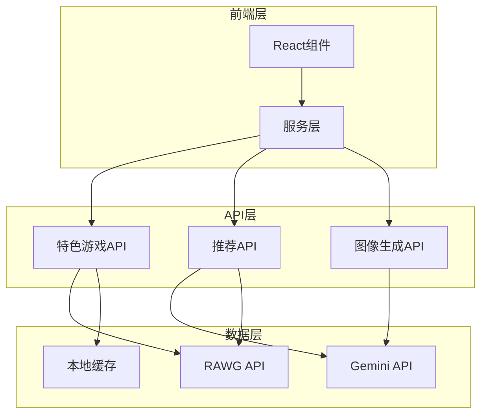
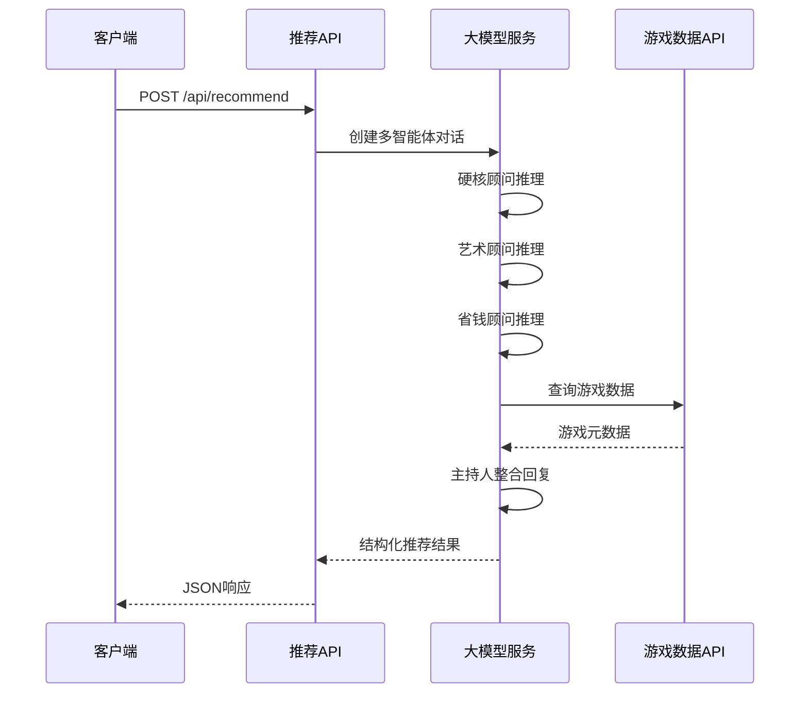
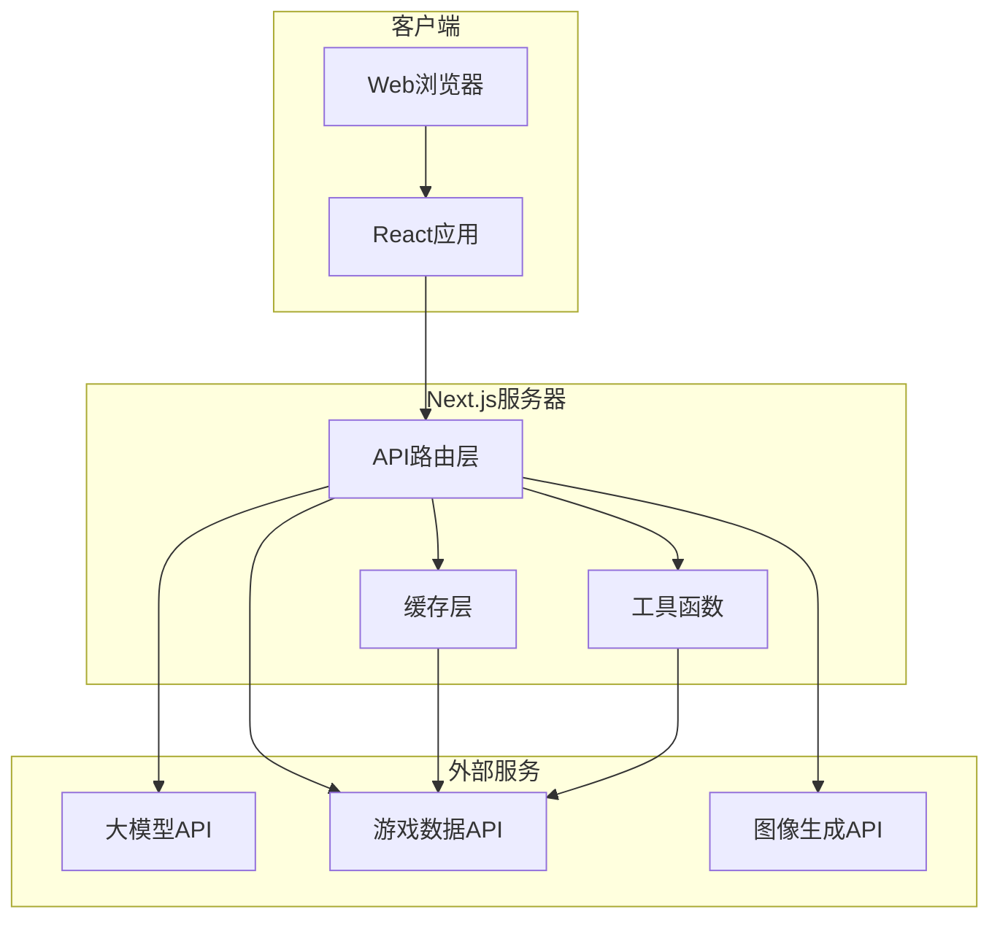
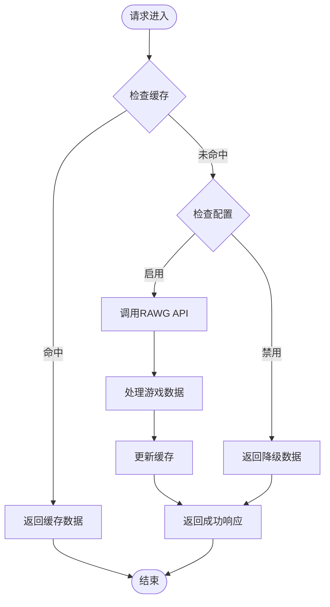
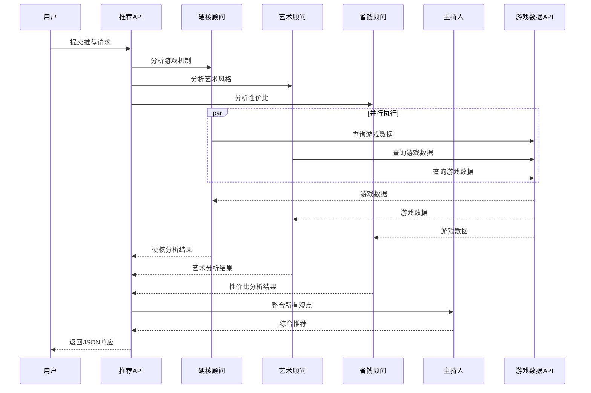
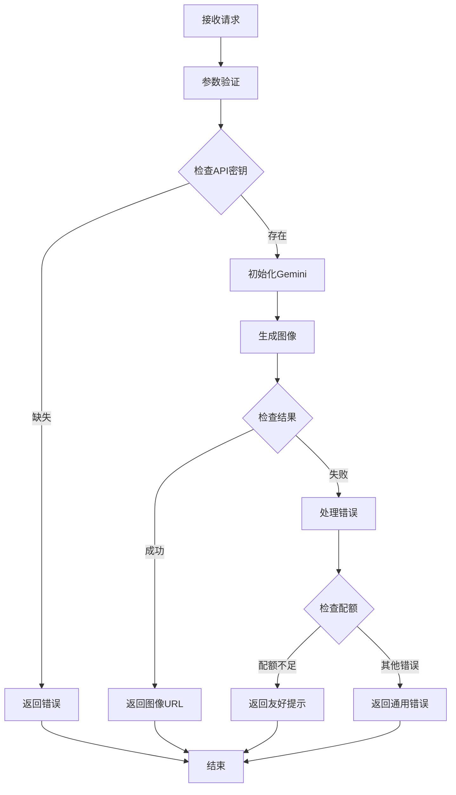
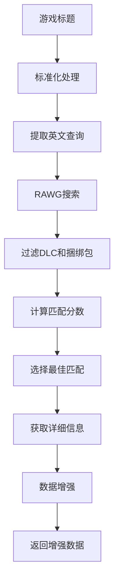
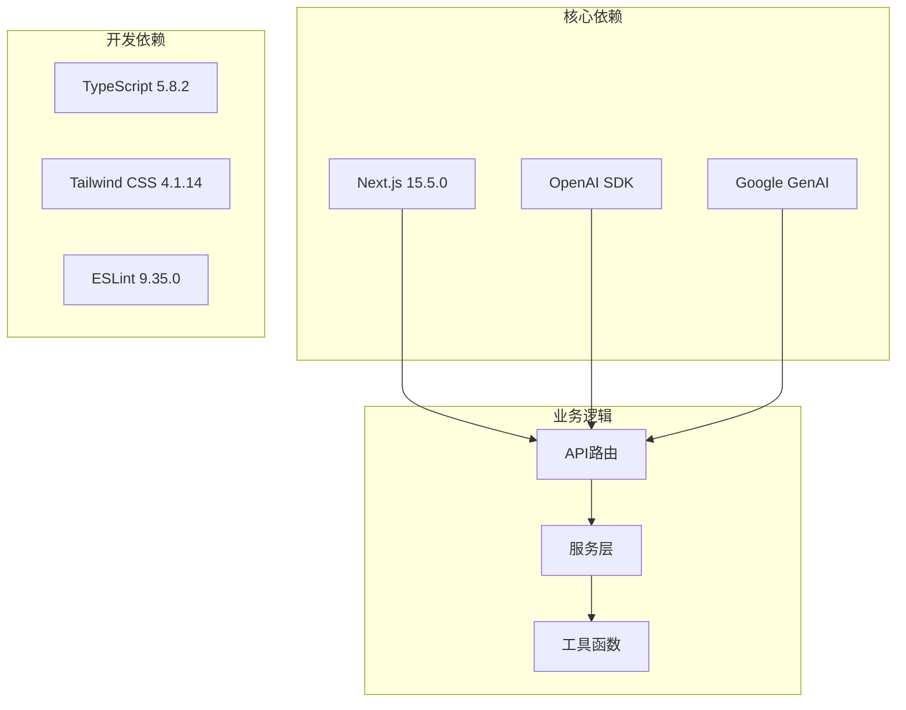

# 后端API架构设计

<cite>
**本文档引用的文件**
- [src/app/api/featured/route.ts](file://src/app/api/featured/route.ts)
- [src/app/api/generate-art/route.ts](file://src/app/api/generate-art/route.ts)
- [src/app/api/recommend/route.ts](file://src/app/api/recommend/route.ts)
- [src/services/gemini.ts](file://src/services/gemini.ts)
- [src/lib/rawg.ts](file://src/lib/rawg.ts)
- [src/components/MainContent.tsx](file://src/components/MainContent.tsx)
- [src/components/ImageGeneratorModal.tsx](file://src/components/ImageGeneratorModal.tsx)
- [DESIGN_DOC.md](file://DESIGN_DOC.md)
- [package.json](file://package.json)
- [next.config.ts](file://next.config.ts)
</cite>

## 目录
1. [引言](#引言)
2. [项目结构](#项目结构)
3. [核心组件](#核心组件)
4. [架构概览](#架构概览)
5. [详细组件分析](#详细组件分析)
6. [依赖关系分析](#依赖关系分析)
7. [性能考虑](#性能考虑)
8. [故障排除指南](#故障排除指南)
9. [结论](#结论)

## 引言

JoyMate是一个基于Next.js构建的AI游戏推荐系统，采用多智能体协作架构设计。该项目实现了"懂情绪、有品味、会主动推荐"的AI游戏买手功能，通过三个不同专业领域的智能体（硬核顾问、艺术顾问、省钱顾问）进行并行讨论，最终由主持人整合生成友好的推荐回复。

本项目的核心创新在于实现了真正的多智能体协作机制，每个智能体都有独特的专业视角和推理过程，通过并行处理提高响应效率和推荐质量。

## 项目结构

项目采用Next.js App Router架构，API路由位于`src/app/api/`目录下，采用文件系统路由模式：

**图表来源**
- [src/app/api/featured/route.ts:1-84](file://src/app/api/featured/route.ts#L1-L84)
- [src/app/api/recommend/route.ts:1-157](file://src/app/api/recommend/route.ts#L1-L157)
- [src/app/api/generate-art/route.ts:1-61](file://src/app/api/generate-art/route.ts#L1-L61)

**章节来源**
- [src/app/api/featured/route.ts:1-84](file://src/app/api/featured/route.ts#L1-L84)
- [src/app/api/recommend/route.ts:1-157](file://src/app/api/recommend/route.ts#L1-L157)
- [src/app/api/generate-art/route.ts:1-61](file://src/app/api/generate-art/route.ts#L1-L61)

## 核心组件

### API路由设计模式

项目采用Next.js App Router的文件系统路由模式，每个API端点都是独立的路由处理器：

1. **路由组织结构**：
   - `src/app/api/featured/route.ts` - 特色游戏推荐
   - `src/app/api/recommend/route.ts` - AI游戏推荐
   - `src/app/api/generate-art/route.ts` - 图像生成

2. **请求处理流程**：
   - 参数验证和类型检查
   - 环境变量配置检查
   - 外部API调用
   - 缓存管理
   - 错误处理和响应格式化

3. **响应格式标准化**：
   - 统一使用`NextResponse.json()`返回JSON格式
   - 标准化的错误响应状态码
   - 结构化的成功响应格式

**章节来源**
- [src/app/api/featured/route.ts:26-83](file://src/app/api/featured/route.ts#L26-L83)
- [src/app/api/recommend/route.ts:14-155](file://src/app/api/recommend/route.ts#L14-L155)
- [src/app/api/generate-art/route.ts:6-59](file://src/app/api/generate-art/route.ts#L6-L59)

### 多智能体协作架构

项目实现了真正的多智能体协作机制，通过并行处理提高效率：

**图表来源**
- [src/app/api/recommend/route.ts:35-73](file://src/app/api/recommend/route.ts#L35-L73)
- [src/lib/rawg.ts:351-433](file://src/lib/rawg.ts#L351-L433)

**章节来源**
- [DESIGN_DOC.md:28-38](file://DESIGN_DOC.md#L28-L38)
- [src/app/api/recommend/route.ts:45-69](file://src/app/api/recommend/route.ts#L45-L69)

## 架构概览

项目采用轻量级微服务架构，前端通过HTTP与后端API通信：

**图表来源**
- [src/components/MainContent.tsx:109-124](file://src/components/MainContent.tsx#L109-L124)
- [src/services/gemini.ts:1-32](file://src/services/gemini.ts#L1-L32)

## 详细组件分析

### 特色游戏API (`/api/featured`)

该API负责提供特色游戏推荐，集成了RAWG游戏数据API和本地缓存机制：

#### 数据流分析

**图表来源**
- [src/app/api/featured/route.ts:26-83](file://src/app/api/featured/route.ts#L26-L83)

#### 关键特性

1. **智能缓存策略**：
   - 24小时缓存有效期
   - 运行时缓存状态管理
   - 缓存命中率优化

2. **环境配置支持**：
   - RAWG_ENRICHMENT环境变量控制
   - 自动检测API密钥存在性
   - 三种运行模式（自动/开启/关闭）

3. **数据增强**：
   - 并行处理多个游戏查询
   - Promise.all并发优化
   - 失败容错处理

**章节来源**
- [src/app/api/featured/route.ts:6-11](file://src/app/api/featured/route.ts#L6-L11)
- [src/app/api/featured/route.ts:54-69](file://src/app/api/featured/route.ts#L54-L69)

### AI推荐API (`/api/recommend`)

这是项目的核心API，实现了多智能体协作机制：

#### 多智能体处理流程

**图表来源**
- [src/app/api/recommend/route.ts:35-73](file://src/app/api/recommend/route.ts#L35-L73)
- [src/app/api/recommend/route.ts:96-106](file://src/app/api/recommend/route.ts#L96-L106)

#### 核心功能实现

1. **多智能体并行处理**：
   - 使用Promise.all实现并发执行
   - 支持自定义并发数量（1-3）
   - 智能代理选择策略

2. **结构化输出**：
   - JSON格式强制输出
   - 标准化响应结构
   - 详细的思考过程统计

3. **错误处理机制**：
   - 配额不足的友好提示
   - 上游服务错误处理
   - 降级策略实现

**章节来源**
- [src/app/api/recommend/route.ts:35-73](file://src/app/api/recommend/route.ts#L35-L73)
- [src/app/api/recommend/route.ts:133-154](file://src/app/api/recommend/route.ts#L133-L154)

### 图像生成API (`/api/generate-art`)

该API集成了Google Gemini的图像生成功能：

#### 图像生成流程

**图表来源**
- [src/app/api/generate-art/route.ts:6-59](file://src/app/api/generate-art/route.ts#L6-L59)

#### 关键特性

1. **参数验证**：
   - 必需参数检查
   - 类型验证
   - 默认值处理

2. **API集成**：
   - Gemini图像生成模型
   - 可配置的分辨率选项
   - Base64编码的图像数据

3. **错误处理**：
   - 配额限制的优雅降级
   - 详细的错误日志
   - 用户友好的错误信息

**章节来源**
- [src/app/api/generate-art/route.ts:7-15](file://src/app/api/generate-art/route.ts#L7-L15)
- [src/app/api/generate-art/route.ts:42-58](file://src/app/api/generate-art/route.ts#L42-L58)

### RAWG数据增强服务

项目实现了完整的RAWG API集成和数据增强功能：

#### 数据增强算法

**图表来源**
- [src/lib/rawg.ts:252-342](file://src/lib/rawg.ts#L252-L342)

#### 核心算法特性

1. **智能匹配算法**：
   - Levenshtein距离计算
   - 年份和数字冲突检测
   - 多种匹配策略组合

2. **并发处理**：
   - 可配置的并发数量
   - Worker线程池
   - Promise.all优化

3. **缓存机制**：
   - 多级缓存策略
   - TTL过期管理
   - 冷启动优化

**章节来源**
- [src/lib/rawg.ts:116-158](file://src/lib/rawg.ts#L116-L158)
- [src/lib/rawg.ts:351-433](file://src/lib/rawg.ts#L351-L433)

## 依赖关系分析

项目的主要依赖关系如下：

**图表来源**
- [package.json:12-34](file://package.json#L12-L34)

**章节来源**
- [package.json:12-34](file://package.json#L12-L34)

## 性能考虑

### 缓存策略

项目实现了多层次的缓存机制：

1. **内存缓存**：
   - Map结构存储
   - TTL过期管理
   - 自动清理机制

2. **API响应缓存**：
   - 24小时固定缓存
   - 条件缓存检查
   - 缓存命中率统计

3. **并发优化**：
   - Promise.all并行处理
   - 可配置的并发限制
   - 资源使用监控

### 错误处理和降级

项目实现了完善的错误处理机制：

1. **上游服务降级**：
   - 配额不足时的友好提示
   - API密钥缺失的错误处理
   - 网络超时的容错机制

2. **前端错误处理**：
   - 统一的错误状态码
   - 用户友好的错误信息
   - 详细的日志记录

### 性能监控

项目内置了性能监控和日志记录：

1. **思考时间统计**：
   - 推荐API的处理时间
   - RAWG查询的耗时统计
   - 缓存命中率监控

2. **事件日志**：
   - RAWG查询事件
   - 配额使用情况
   - 错误发生统计

**章节来源**
- [src/app/api/recommend/route.ts:75-76](file://src/app/api/recommend/route.ts#L75-L76)
- [src/app/api/recommend/route.ts:107-115](file://src/app/api/recommend/route.ts#L107-L115)

## 故障排除指南

### 常见问题诊断

1. **API密钥问题**：
   - 检查环境变量配置
   - 验证API密钥有效性
   - 查看错误日志

2. **网络连接问题**：
   - 检查外部API可达性
   - 验证防火墙设置
   - 监控网络延迟

3. **缓存问题**：
   - 清理过期缓存
   - 检查缓存容量
   - 验证缓存一致性

### 调试技巧

1. **开发环境调试**：
   - 使用Next.js开发服务器
   - 启用详细日志记录
   - 利用浏览器开发者工具

2. **生产环境监控**：
   - 设置性能指标
   - 监控错误率
   - 跟踪用户行为

**章节来源**
- [src/app/api/recommend/route.ts:133-154](file://src/app/api/recommend/route.ts#L133-L154)
- [src/app/api/generate-art/route.ts:56-58](file://src/app/api/generate-art/route.ts#L56-L58)

## 结论

JoyMate项目展现了现代全栈应用的最佳实践，通过以下关键设计实现了高效、可靠的AI游戏推荐服务：

### 核心优势

1. **架构设计**：
   - 清晰的分层架构
   - 模块化的API设计
   - 可扩展的多智能体机制

2. **性能优化**：
   - 智能缓存策略
   - 并发处理优化
   - 资源使用监控

3. **用户体验**：
   - 流畅的交互体验
   - 友好的错误处理
   - 丰富的视觉反馈

### 技术亮点

1. **多智能体协作**：
   - 真正的并行处理
   - 专业的视角分工
   - 统一的输出格式

2. **数据增强**：
   - 智能匹配算法
   - 多源数据整合
   - 实时数据更新

3. **API设计**：
   - 标准化的响应格式
   - 完善的错误处理
   - 灵活的配置选项

该项目为AI驱动的应用程序提供了优秀的参考实现，展示了如何在保证性能的同时提供高质量的用户体验。通过持续的优化和扩展，JoyMate有望成为AI游戏推荐领域的标杆应用。