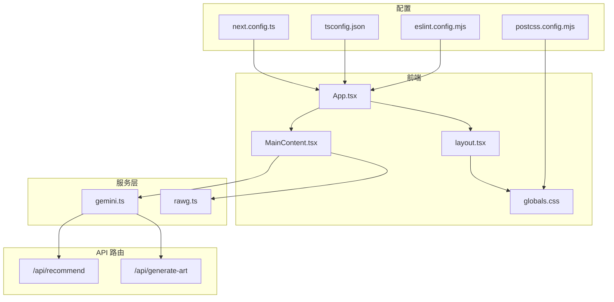
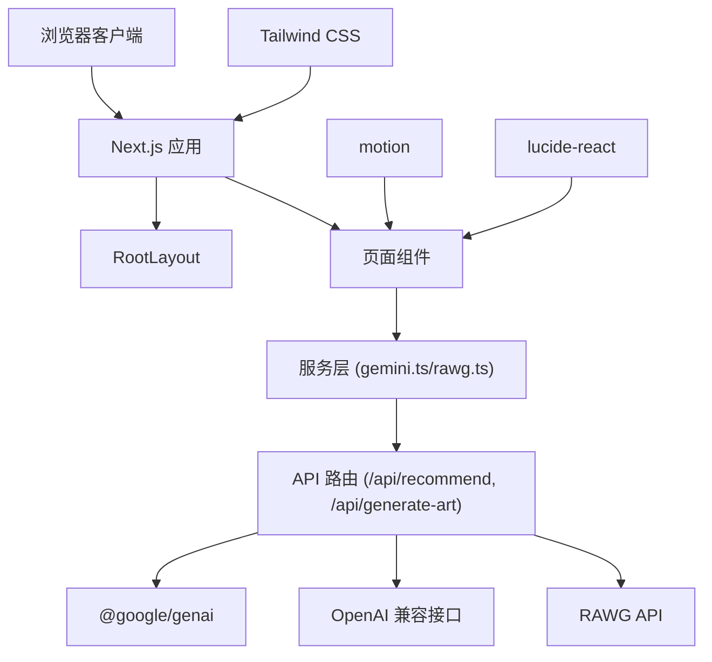
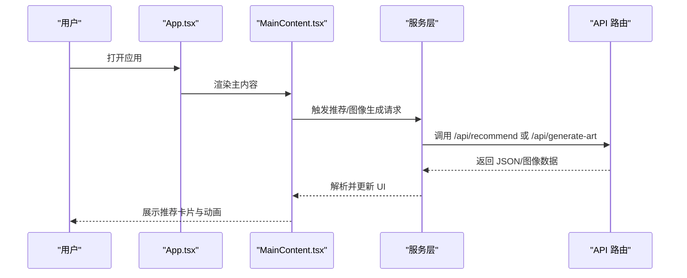
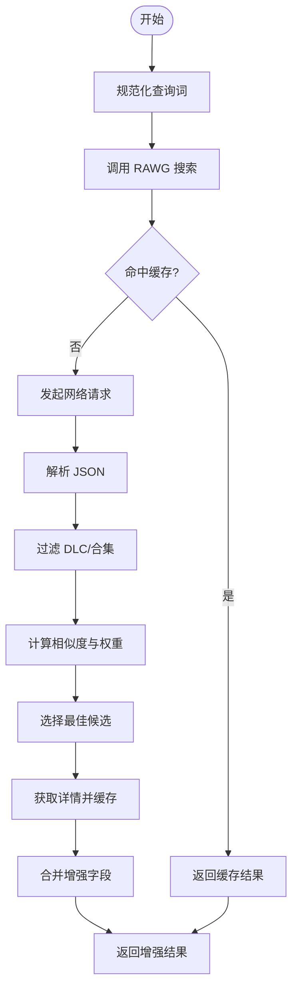
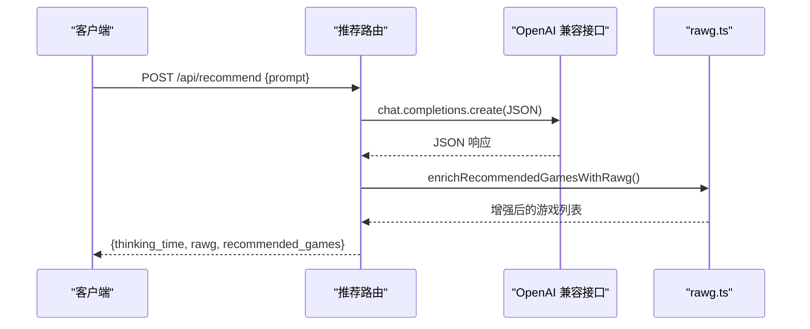
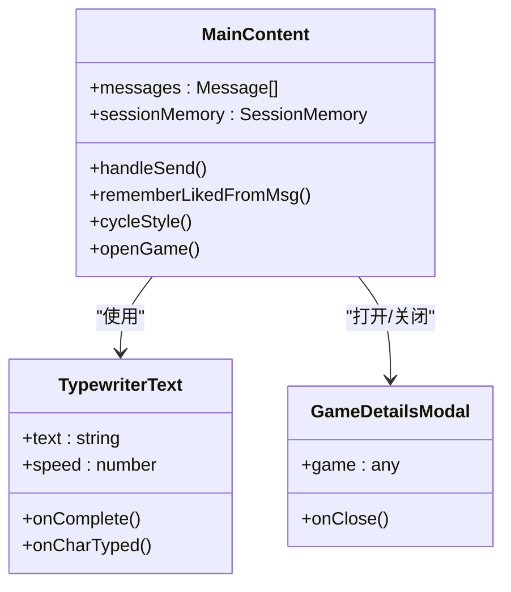
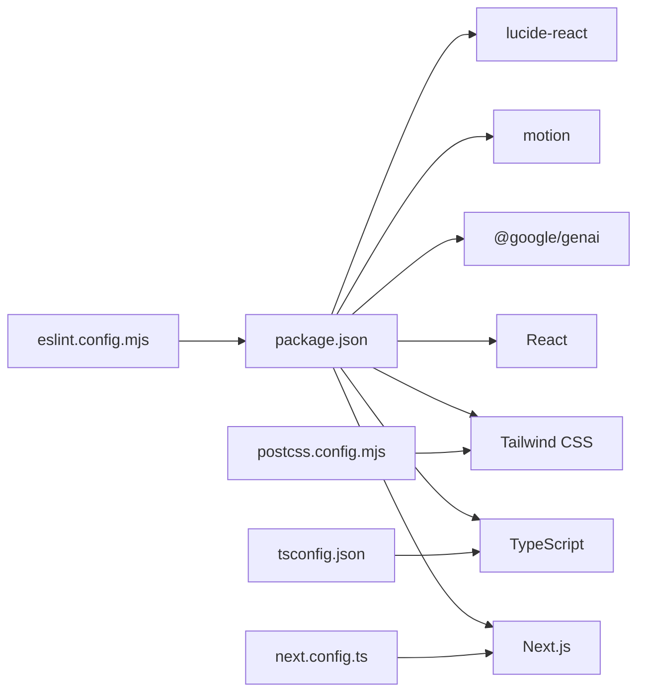

# 技术栈选型设计

<cite>
**本文档引用的文件**
- [package.json](file://package.json)
- [next.config.ts](file://next.config.ts)
- [tsconfig.json](file://tsconfig.json)
- [eslint.config.mjs](file://eslint.config.mjs)
- [postcss.config.mjs](file://postcss.config.mjs)
- [src/app/layout.tsx](file://src/app/layout.tsx)
- [src/services/gemini.ts](file://src/services/gemini.ts)
- [src/lib/rawg.ts](file://src/lib/rawg.ts)
- [src/components/MainContent.tsx](file://src/components/MainContent.tsx)
- [src/App.tsx](file://src/App.tsx)
- [src/app/api/recommend/route.ts](file://src/app/api/recommend/route.ts)
- [src/app/api/generate-art/route.ts](file://src/app/api/generate-art/route.ts)
- [src/app/globals.css](file://src/app/globals.css)
- [DESIGN_DOC.md](file://DESIGN_DOC.md)
- [metadata.json](file://metadata.json)
</cite>

## 目录
1. [引言](#引言)
2. [项目结构](#项目结构)
3. [核心组件](#核心组件)
4. [架构概览](#架构概览)
5. [详细组件分析](#详细组件分析)
6. [依赖关系分析](#依赖关系分析)
7. [性能考量](#性能考量)
8. [故障排除指南](#故障排除指南)
9. [结论](#结论)
10. [附录](#附录)

## 引言
本技术栈选型设计文档围绕 JoyMate 项目的核心技术决策展开，重点说明 Next.js 15.5.12、React 19.0.0、TypeScript 等核心技术的选择原因与优势；阐述 Tailwind CSS 在 UI 开发中的作用、@google/genai 在 AI 集成中的重要性，以及 motion 和 lucide-react 在用户体验方面的贡献。同时，文档涵盖技术栈的兼容性考虑、版本管理策略与升级路径规划，开发工具链配置、构建优化与部署策略，并提供技术债务评估与未来技术演进规划建议。

## 项目结构
项目采用 Next.js App Router 结构，前端以 React 19 为核心，配合 TypeScript 进行强类型约束；UI 层使用 Tailwind CSS 实现响应式与主题化设计；AI 能力通过 @google/genai 与 OpenAI 兼容接口接入；动画与交互由 motion 提供流畅体验，图标库使用 lucide-react。后端 API 路由位于 src/app/api 下，分别处理游戏推荐与图像生成。

**图表来源**
- [src/App.tsx:12-24](file://src/App.tsx#L12-L24)
- [src/components/MainContent.tsx:70-689](file://src/components/MainContent.tsx#L70-L689)
- [src/app/layout.tsx:1-11](file://src/app/layout.tsx#L1-L11)
- [src/app/globals.css:1-45](file://src/app/globals.css#L1-L45)
- [src/services/gemini.ts:1-32](file://src/services/gemini.ts#L1-L32)
- [src/lib/rawg.ts:252-433](file://src/lib/rawg.ts#L252-L433)
- [src/app/api/recommend/route.ts:14-157](file://src/app/api/recommend/route.ts#L14-L157)
- [src/app/api/generate-art/route.ts:6-61](file://src/app/api/generate-art/route.ts#L6-L61)
- [next.config.ts:1-10](file://next.config.ts#L1-L10)
- [tsconfig.json:1-44](file://tsconfig.json#L1-L44)
- [eslint.config.mjs:1-12](file://eslint.config.mjs#L1-L12)
- [postcss.config.mjs:1-10](file://postcss.config.mjs#L1-L10)

**章节来源**
- [src/App.tsx:12-24](file://src/App.tsx#L12-L24)
- [src/components/MainContent.tsx:70-689](file://src/components/MainContent.tsx#L70-L689)
- [src/app/layout.tsx:1-11](file://src/app/layout.tsx#L1-L11)
- [src/app/globals.css:1-45](file://src/app/globals.css#L1-L45)
- [src/services/gemini.ts:1-32](file://src/services/gemini.ts#L1-L32)
- [src/lib/rawg.ts:252-433](file://src/lib/rawg.ts#L252-L433)
- [src/app/api/recommend/route.ts:14-157](file://src/app/api/recommend/route.ts#L14-L157)
- [src/app/api/generate-art/route.ts:6-61](file://src/app/api/generate-art/route.ts#L6-L61)
- [next.config.ts:1-10](file://next.config.ts#L1-L10)
- [tsconfig.json:1-44](file://tsconfig.json#L1-L44)
- [eslint.config.mjs:1-12](file://eslint.config.mjs#L1-L12)
- [postcss.config.mjs:1-10](file://postcss.config.mjs#L1-L10)

## 核心组件
- Next.js 15.5.12：提供 App Router、Server Components、Streaming SSR、Edge Runtime 等能力，支持现代 Web 性能与开发体验。
- React 19.0.0：引入并发特性与新 Hooks，提升渲染性能与开发效率。
- TypeScript 5.8.x：严格类型检查，减少运行时错误，提升团队协作质量。
- Tailwind CSS 4.1.14：原子化 CSS 工具，快速构建一致且可维护的 UI。
- @google/genai 1.29.0：用于图像生成与内容生成，支持 Gemini 模型。
- motion 12.23.24：高性能动画库，提供流畅的过渡与交互动画。
- lucide-react 0.546.0：简洁美观的图标库，统一界面视觉语言。
- PostCSS + @tailwindcss/postcss：构建阶段处理 CSS，确保产物体积最小化与兼容性。

**章节来源**
- [package.json:12-32](file://package.json#L12-L32)
- [next.config.ts:3-6](file://next.config.ts#L3-L6)
- [tsconfig.json:2-24](file://tsconfig.json#L2-L24)
- [postcss.config.mjs:1-10](file://postcss.config.mjs#L1-L10)
- [src/app/globals.css:1-45](file://src/app/globals.css#L1-L45)

## 架构概览
JoyMate 采用前后端分离的前端优先架构：前端使用 Next.js App Router 提供页面与布局，服务层封装 AI 与第三方 API 调用，API 路由负责与上游大模型与图像生成服务交互。Tailwind CSS 提供一致的视觉体系，motion/lucide-react 提升交互与视觉体验。

**图表来源**
- [src/App.tsx:12-24](file://src/App.tsx#L12-L24)
- [src/components/MainContent.tsx:70-689](file://src/components/MainContent.tsx#L70-L689)
- [src/services/gemini.ts:1-32](file://src/services/gemini.ts#L1-L32)
- [src/lib/rawg.ts:252-433](file://src/lib/rawg.ts#L252-L433)
- [src/app/api/recommend/route.ts:14-157](file://src/app/api/recommend/route.ts#L14-L157)
- [src/app/api/generate-art/route.ts:6-61](file://src/app/api/generate-art/route.ts#L6-L61)
- [src/app/globals.css:1-45](file://src/app/globals.css#L1-L45)

## 详细组件分析

### 前端应用与布局
- App.tsx：根组件负责布局与状态管理，串联侧边栏、主内容区与右侧栏，并控制图像生成模态框的开关。
- layout.tsx：全局布局，设置语言、注入全局样式，作为所有页面的容器。
- globals.css：引入 Tailwind 并定义主题变量与自定义滚动条样式，保证暗色主题一致性。

**图表来源**
- [src/App.tsx:12-24](file://src/App.tsx#L12-L24)
- [src/components/MainContent.tsx:165-223](file://src/components/MainContent.tsx#L165-L223)
- [src/services/gemini.ts:1-32](file://src/services/gemini.ts#L1-L32)
- [src/app/api/recommend/route.ts:14-157](file://src/app/api/recommend/route.ts#L14-L157)
- [src/app/api/generate-art/route.ts:6-61](file://src/app/api/generate-art/route.ts#L6-L61)

**章节来源**
- [src/App.tsx:12-24](file://src/App.tsx#L12-L24)
- [src/app/layout.tsx:1-11](file://src/app/layout.tsx#L1-L11)
- [src/app/globals.css:1-45](file://src/app/globals.css#L1-L45)

### AI 服务与数据增强
- gemini.ts：封装推荐与图像生成的前端调用，统一错误处理与响应解析。
- rawg.ts：实现游戏数据的搜索、详情获取与缓存逻辑，包含相似度计算、年份与数字冲突处理、DLc/合集过滤等策略，支持并发与超时控制。

**图表来源**
- [src/lib/rawg.ts:172-210](file://src/lib/rawg.ts#L172-L210)
- [src/lib/rawg.ts:252-433](file://src/lib/rawg.ts#L252-L433)

**章节来源**
- [src/services/gemini.ts:1-32](file://src/services/gemini.ts#L1-L32)
- [src/lib/rawg.ts:14-85](file://src/lib/rawg.ts#L14-L85)
- [src/lib/rawg.ts:172-210](file://src/lib/rawg.ts#L172-L210)
- [src/lib/rawg.ts:252-433](file://src/lib/rawg.ts#L252-L433)

### API 路由与上游集成
- /api/recommend：接收用户输入，调用 OpenAI 兼容接口（Qwen），解析 JSON 输出，按需调用 rawg.ts 增强推荐结果，返回包含思考时间与增强统计的响应。
- /api/generate-art：接收提示词与尺寸参数，调用 @google/genai 生成图像，返回内联数据 URL，处理配额不足等异常。

**图表来源**
- [src/app/api/recommend/route.ts:14-157](file://src/app/api/recommend/route.ts#L14-L157)
- [src/lib/rawg.ts:351-433](file://src/lib/rawg.ts#L351-L433)

**章节来源**
- [src/app/api/recommend/route.ts:14-157](file://src/app/api/recommend/route.ts#L14-L157)
- [src/app/api/generate-art/route.ts:6-61](file://src/app/api/generate-art/route.ts#L6-L61)

### UI 与动画体验
- MainContent.tsx：实现聊天界面、消息流、专家意见展示与游戏卡片推荐，使用 motion 提供流畅的进入/退出动画与打字机效果，lucide-react 图标提升可读性与一致性。
- globals.css：通过 Tailwind 原子类与自定义滚动条样式，统一暗色主题下的视觉表现。

**图表来源**
- [src/components/MainContent.tsx:54-689](file://src/components/MainContent.tsx#L54-L689)

**章节来源**
- [src/components/MainContent.tsx:1-721](file://src/components/MainContent.tsx#L1-L721)
- [src/app/globals.css:1-45](file://src/app/globals.css#L1-L45)

## 依赖关系分析
- 核心依赖：Next.js、React、TypeScript、Tailwind CSS、@google/genai、motion、lucide-react。
- 开发依赖：PostCSS、@tailwindcss/postcss、ESLint、TypeScript 类型声明。
- 配置文件：next.config.ts 控制构建目录与严格模式；tsconfig.json 设置编译目标、模块解析与路径映射；eslint.config.mjs 基于 Next.js 推荐规则；postcss.config.mjs 集成 Tailwind 插件。

**图表来源**
- [package.json:12-32](file://package.json#L12-L32)
- [next.config.ts:1-10](file://next.config.ts#L1-10)
- [tsconfig.json:1-44](file://tsconfig.json#L1-L44)
- [eslint.config.mjs:1-12](file://eslint.config.mjs#L1-L12)
- [postcss.config.mjs:1-10](file://postcss.config.mjs#L1-L10)

**章节来源**
- [package.json:12-32](file://package.json#L12-L32)
- [next.config.ts:1-10](file://next.config.ts#L1-L10)
- [tsconfig.json:1-44](file://tsconfig.json#L1-L44)
- [eslint.config.mjs:1-12](file://eslint.config.mjs#L1-L12)
- [postcss.config.mjs:1-10](file://postcss.config.mjs#L1-L10)

## 性能考量
- 构建与打包：Next.js 15 的 App Router 与增量构建提升开发体验；distDir 自定义输出目录便于缓存与部署。
- 运行时优化：React 19 的并发特性与 React.lazy 可进一步优化首屏渲染；Tailwind 原子类减少 CSS 体积。
- 网络与缓存：rawg.ts 实现多级缓存（搜索、详情、缺失项），降低上游 API 压力；并发与超时控制保障稳定性。
- 动画与交互：motion 提供硬件加速动画，Lucide 图标按需加载，减少不必要的资源消耗。

**章节来源**
- [next.config.ts:3-6](file://next.config.ts#L3-L6)
- [src/lib/rawg.ts:6-26](file://src/lib/rawg.ts#L6-L26)
- [src/components/MainContent.tsx:285-299](file://src/components/MainContent.tsx#L285-L299)

## 故障排除指南
- API 错误处理：推荐与图像生成路由对上游错误进行分类处理，特别是配额不足时返回友好提示，避免前端直接暴露错误细节。
- 前端错误捕获：gemini.ts 对响应状态与 JSON 解析失败进行统一错误抛出，便于 UI 层展示与重试。
- 环境变量校验：API 路由在缺少密钥时返回明确的 5xx/4xx 状态码，便于运维监控与告警。

**章节来源**
- [src/app/api/recommend/route.ts:133-154](file://src/app/api/recommend/route.ts#L133-L154)
- [src/app/api/generate-art/route.ts:41-58](file://src/app/api/generate-art/route.ts#L41-L58)
- [src/services/gemini.ts:8-13](file://src/services/gemini.ts#L8-L13)

## 结论
JoyMate 的技术栈选型以 Next.js 15.5.12 与 React 19 为核心，结合 TypeScript 提供强类型保障，Tailwind CSS 实现高效 UI 构建，@google/genai 与 OpenAI 兼容接口支撑 AI 能力，motion 与 lucide-react 提升用户体验与一致性。通过合理的配置与模块化设计，项目具备良好的扩展性与可维护性。建议持续关注上游依赖的安全更新与性能改进，制定版本升级与迁移策略，确保长期稳定演进。

## 附录

### 版本管理与升级路径
- Next.js：建议采用 LTS 版本策略，关注 App Router 的稳定性与新特性发布节奏，逐步迁移至新版本。
- React：跟随官方发布周期，优先在测试环境验证新版本兼容性。
- TypeScript：保持与 React/Next.js 的兼容性，关注新语法与编译器优化。
- Tailwind CSS：关注原子类变更与新功能，定期清理未使用样式。
- @google/genai：关注模型更新与 API 变更，提前准备迁移方案。
- motion/lucide-react：遵循语义化版本，关注性能与安全补丁。

### 开发工具链与构建优化
- ESLint：基于 Next.js 推荐规则，确保代码风格一致。
- PostCSS/Tailwind：在构建阶段完成样式处理，减少运行时开销。
- TypeScript：启用严格模式与增量编译，提升开发效率。

### 部署策略
- 构建目录：next.config.ts 中 distDir 自定义输出目录，便于缓存与 CI/CD 集成。
- 环境变量：API 路由依赖环境变量进行密钥与功能开关控制，确保生产安全。
- 缓存策略：利用 rawg.ts 的多级缓存与 CDN 加速，降低延迟与成本。

**章节来源**
- [next.config.ts:3-6](file://next.config.ts#L3-L6)
- [eslint.config.mjs:10](file://eslint.config.mjs#L10)
- [postcss.config.mjs:2-6](file://postcss.config.mjs#L2-L6)
- [tsconfig.json:11-18](file://tsconfig.json#L11-L18)
- [src/app/api/recommend/route.ts:7-12](file://src/app/api/recommend/route.ts#L7-L12)
- [src/app/api/generate-art/route.ts:12](file://src/app/api/generate-art/route.ts#L12)
- [src/lib/rawg.ts:6-26](file://src/lib/rawg.ts#L6-L26)