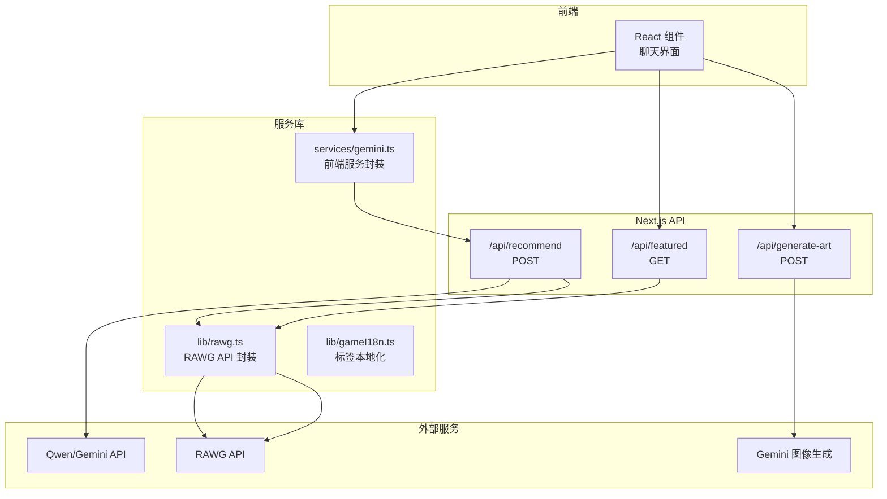
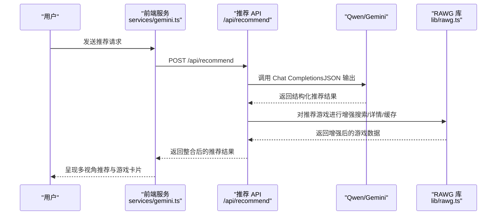
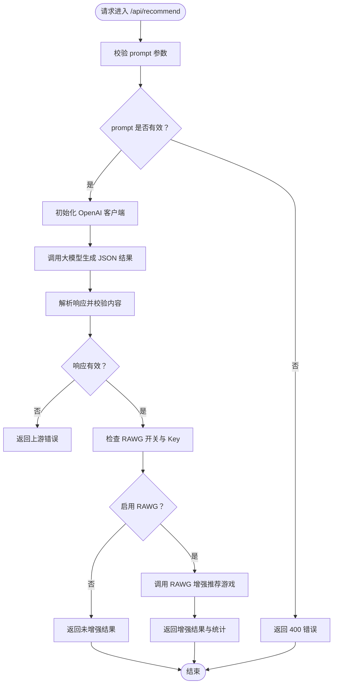
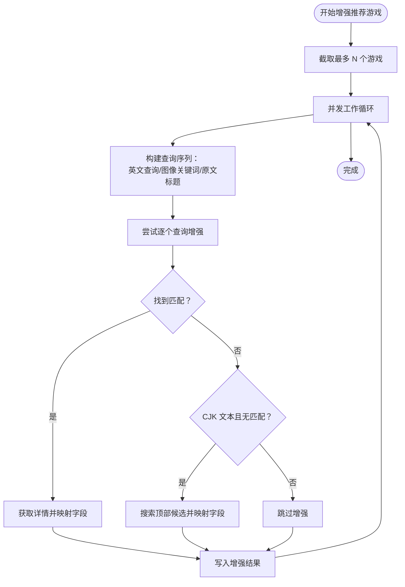
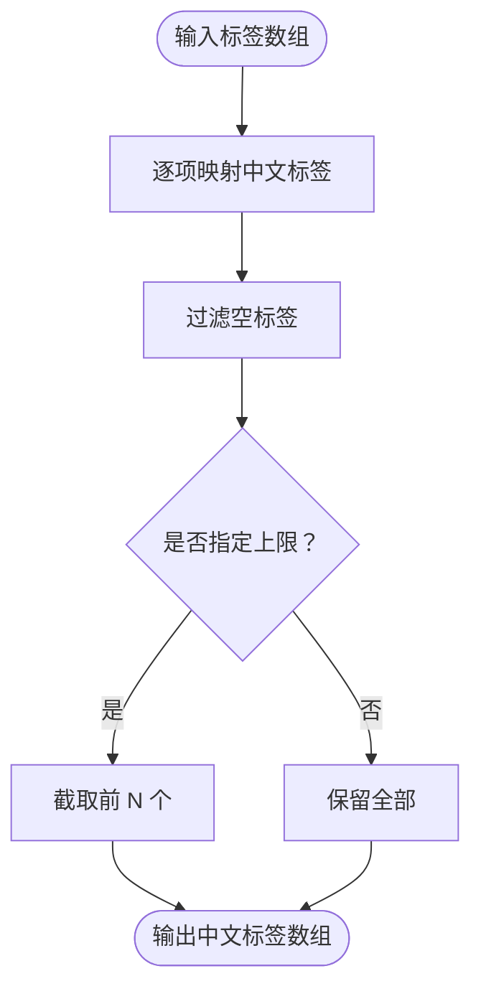
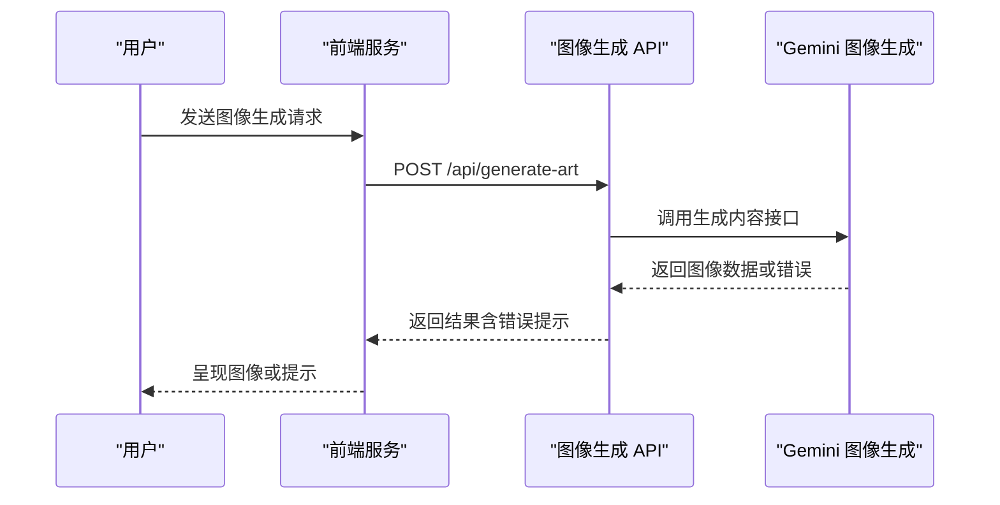
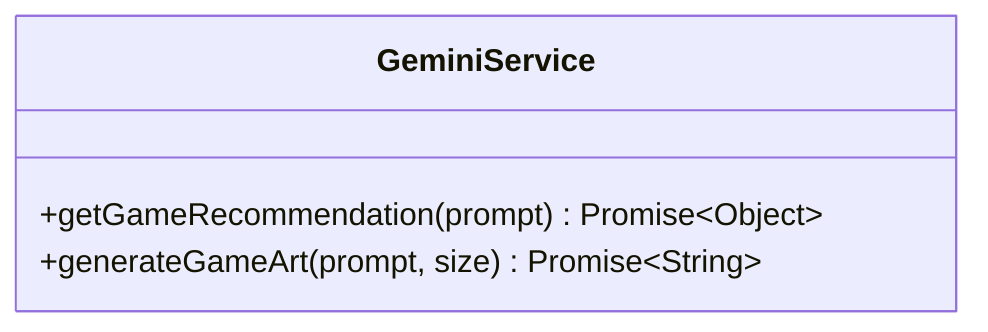
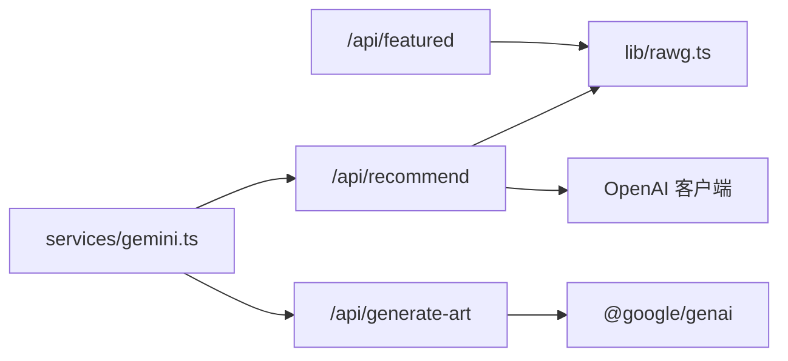

# 数据流架构设计

<cite>
**本文档引用的文件**
- [src/app/api/recommend/route.ts](file://src/app/api/recommend/route.ts)
- [src/services/gemini.ts](file://src/services/gemini.ts)
- [src/lib/rawg.ts](file://src/lib/rawg.ts)
- [src/lib/gameI18n.ts](file://src/lib/gameI18n.ts)
- [src/app/api/featured/route.ts](file://src/app/api/featured/route.ts)
- [src/app/api/generate-art/route.ts](file://src/app/api/generate-art/route.ts)
- [DESIGN_DOC.md](file://DESIGN_DOC.md)
- [RAWG_DATA_CACHE.md](file://RAWG_DATA_CACHE.md)
- [package.json](file://package.json)
- [README.md](file://README.md)
</cite>

## 目录
1. [引言](#引言)
2. [项目结构](#项目结构)
3. [核心组件](#核心组件)
4. [架构总览](#架构总览)
5. [详细组件分析](#详细组件分析)
6. [依赖关系分析](#依赖关系分析)
7. [性能考量](#性能考量)
8. [故障排查指南](#故障排查指南)
9. [结论](#结论)
10. [附录](#附录)

## 引言
本设计文档面向 JoyMate 项目，聚焦于从用户输入到最终推荐结果的完整数据流，涵盖意图识别、多智能体处理、数据增强与结果整合。文档还深入解释 RAWG API 的集成策略、缓存机制与数据本地化处理，阐述 AI 服务（含 Gemini API）的数据传递模式与响应处理方式，并说明游戏数据的增强逻辑（标签本地化、情绪标签添加、多平台数据融合）。最后提供数据流向图、错误处理策略与性能优化建议。

## 项目结构
项目采用 Next.js 应用结构，核心数据流集中在 API 路由与服务库之间：
- API 层：负责接收请求、调用大模型、执行数据增强与返回响应
- 服务库：封装 RAWG API、游戏本地化标签映射、图像生成等能力
- 前端服务：通过服务函数发起 API 请求并消费响应

图表来源
- [src/app/api/recommend/route.ts:1-157](file://src/app/api/recommend/route.ts#L1-L157)
- [src/app/api/generate-art/route.ts:1-61](file://src/app/api/generate-art/route.ts#L1-L61)
- [src/app/api/featured/route.ts:1-84](file://src/app/api/featured/route.ts#L1-L84)
- [src/lib/rawg.ts:1-434](file://src/lib/rawg.ts#L1-L434)
- [src/lib/gameI18n.ts:1-89](file://src/lib/gameI18n.ts#L1-L89)
- [src/services/gemini.ts:1-32](file://src/services/gemini.ts#L1-L32)

章节来源
- [src/app/api/recommend/route.ts:1-157](file://src/app/api/recommend/route.ts#L1-L157)
- [src/app/api/generate-art/route.ts:1-61](file://src/app/api/generate-art/route.ts#L1-L61)
- [src/app/api/featured/route.ts:1-84](file://src/app/api/featured/route.ts#L1-L84)
- [src/lib/rawg.ts:1-434](file://src/lib/rawg.ts#L1-L434)
- [src/lib/gameI18n.ts:1-89](file://src/lib/gameI18n.ts#L1-L89)
- [src/services/gemini.ts:1-32](file://src/services/gemini.ts#L1-L32)

## 核心组件
- 推荐 API：负责意图识别、多智能体讨论、数据增强与响应整合
- RAWG 库：封装搜索、详情、缓存与匹配算法
- 游戏本地化：提供标签中文映射与文本检测
- 图像生成 API：基于 Gemini 的图像生成服务
- 前端服务封装：统一调用推荐与图像生成 API

章节来源
- [src/app/api/recommend/route.ts:1-157](file://src/app/api/recommend/route.ts#L1-L157)
- [src/lib/rawg.ts:1-434](file://src/lib/rawg.ts#L1-L434)
- [src/lib/gameI18n.ts:1-89](file://src/lib/gameI18n.ts#L1-L89)
- [src/app/api/generate-art/route.ts:1-61](file://src/app/api/generate-art/route.ts#L1-L61)
- [src/services/gemini.ts:1-32](file://src/services/gemini.ts#L1-L32)

## 架构总览
从用户输入到最终推荐结果的数据流分为以下阶段：
1. 用户输入与请求校验
2. 大模型意图识别与多智能体讨论
3. 推荐结果结构化与 RAWG 数据增强
4. 结果整合与返回

图表来源
- [src/services/gemini.ts:1-32](file://src/services/gemini.ts#L1-L32)
- [src/app/api/recommend/route.ts:14-155](file://src/app/api/recommend/route.ts#L14-L155)
- [src/lib/rawg.ts:351-433](file://src/lib/rawg.ts#L351-L433)

## 详细组件分析

### 推荐 API（/api/recommend）
职责与流程：
- 校验请求参数与 API Key
- 初始化 OpenAI 客户端（兼容 Qwen）
- 调用大模型进行意图识别与多智能体讨论，强制 JSON 输出
- 解析并校验响应内容
- 可选地调用 RAWG 数据增强（根据环境变量与可用 Key）
- 返回包含思考时长与 RAWG 统计信息的结果

关键特性：
- 错误处理：针对配额不足（429/配额耗尽）返回友好提示
- RAWG 开关：支持自动、开启、关闭三种模式
- 性能统计：记录思考时长与 RAWG 增强耗时

图表来源
- [src/app/api/recommend/route.ts:14-155](file://src/app/api/recommend/route.ts#L14-L155)

章节来源
- [src/app/api/recommend/route.ts:1-157](file://src/app/api/recommend/route.ts#L1-L157)

### RAWG 数据增强（lib/rawg.ts）
职责与流程：
- 搜索缓存：对规范化查询进行缓存，避免重复请求
- 详情缓存：对 RAWG ID 进行缓存，减少详情请求
- 匹配算法：规范化标题、提取年份与数字、编辑距离相似度、冲突检测
- 增强逻辑：优先英文查询，其次图像关键词，最后原文标题；CJK 文本兜底搜索
- 并发控制：限制并发数，设置超时，保证稳定性
- 降级策略：增强失败时保留 AI 字段，前端可控展示

图表来源
- [src/lib/rawg.ts:351-433](file://src/lib/rawg.ts#L351-L433)

章节来源
- [src/lib/rawg.ts:1-434](file://src/lib/rawg.ts#L1-L434)
- [RAWG_DATA_CACHE.md:1-153](file://RAWG_DATA_CACHE.md#L1-L153)

### 游戏本地化（lib/gameI18n.ts）
职责与流程：
- 标签映射：将英文标签映射为中文标签，支持批量转换
- 文本检测：判断文本是否主要为 CJK 字符，辅助增强策略选择

图表来源
- [src/lib/gameI18n.ts:77-81](file://src/lib/gameI18n.ts#L77-L81)

章节来源
- [src/lib/gameI18n.ts:1-89](file://src/lib/gameI18n.ts#L1-L89)

### 图像生成 API（/api/generate-art）
职责与流程：
- 校验请求参数与 Gemini API Key
- 调用 Gemini 图像生成模型
- 处理配额不足与异常情况，返回友好提示或错误响应

图表来源
- [src/app/api/generate-art/route.ts:6-59](file://src/app/api/generate-art/route.ts#L6-L59)

章节来源
- [src/app/api/generate-art/route.ts:1-61](file://src/app/api/generate-art/route.ts#L1-L61)

### 前端服务封装（services/gemini.ts）
职责与流程：
- 封装推荐与图像生成的 fetch 调用
- 统一错误处理与响应解析

图表来源
- [src/services/gemini.ts:1-32](file://src/services/gemini.ts#L1-L32)

章节来源
- [src/services/gemini.ts:1-32](file://src/services/gemini.ts#L1-L32)

### 专题：RAWG API 集成与缓存机制
- 搜索缓存：Key 为规范化查询，Value 为候选结果，TTL 7 天
- 详情缓存：Key 为 RAWG ID，Value 为展示所需字段集合，TTL 3 天
- 负缓存：Key 为“未命中”查询，TTL 24 小时
- 并发与超时：并发数限制在 2~3，单请求超时 3~5 秒
- 降级策略：增强失败不影响整体响应，前端可控展示

章节来源
- [src/lib/rawg.ts:1-434](file://src/lib/rawg.ts#L1-L434)
- [RAWG_DATA_CACHE.md:79-138](file://RAWG_DATA_CACHE.md#L79-L138)

### 专题：AI 服务集成的数据传递模式
- 推荐 API：使用 OpenAI 客户端（兼容 Qwen），强制 JSON 输出格式，系统提示词定义多智能体讨论流程
- 图像生成 API：使用 @google/genai 客户端，按尺寸与宽高比生成图像
- 错误处理：统一捕获上游错误，区分配额不足与其它异常，返回友好提示

章节来源
- [src/app/api/recommend/route.ts:20-87](file://src/app/api/recommend/route.ts#L20-L87)
- [src/app/api/generate-art/route.ts:12-31](file://src/app/api/generate-art/route.ts#L12-L31)
- [package.json:12-21](file://package.json#L12-L21)

### 专题：游戏数据增强逻辑
- 标签本地化：通过映射表将英文标签转为中文，支持批量与上限控制
- 情绪标签添加：设计文档建议手动添加“情绪标签”，当前实现以本地化为主
- 多平台数据融合：RAWG 返回平台列表，结合本地化映射用于前端展示

章节来源
- [src/lib/gameI18n.ts:1-89](file://src/lib/gameI18n.ts#L1-L89)
- [DESIGN_DOC.md:159-161](file://DESIGN_DOC.md#L159-L161)

## 依赖关系分析

图表来源
- [src/app/api/recommend/route.ts:1-3](file://src/app/api/recommend/route.ts#L1-L3)
- [src/app/api/featured/route.ts:1-2](file://src/app/api/featured/route.ts#L1-L2)
- [src/app/api/generate-art/route.ts](file://src/app/api/generate-art/route.ts#L1)
- [src/services/gemini.ts:1-32](file://src/services/gemini.ts#L1-L32)

章节来源
- [src/app/api/recommend/route.ts:1-3](file://src/app/api/recommend/route.ts#L1-L3)
- [src/app/api/featured/route.ts:1-2](file://src/app/api/featured/route.ts#L1-L2)
- [src/app/api/generate-art/route.ts](file://src/app/api/generate-art/route.ts#L1)
- [src/services/gemini.ts:1-32](file://src/services/gemini.ts#L1-L32)

## 性能考量
- 并发控制：推荐增强并发限制在 2~3，避免上游限流与雪崩
- 超时策略：单请求 3~5 秒，整体增强层设置硬超时，确保响应稳定性
- 缓存策略：搜索与详情缓存显著降低延迟与失败率，负缓存避免无效请求
- 降级策略：增强失败不影响整体响应，前端可控展示，保障用户体验
- 日志与可观测性：记录增强成功率、平均延迟与误匹配反馈，支撑持续优化

章节来源
- [src/lib/rawg.ts:351-433](file://src/lib/rawg.ts#L351-L433)
- [RAWG_DATA_CACHE.md:116-146](file://RAWG_DATA_CACHE.md#L116-L146)

## 故障排查指南
常见问题与处理：
- 配额不足（429/配额耗尽）
  - 推荐 API：返回友好提示，引导用户稍后再试
  - 图像生成 API：返回包含错误提示的 JSON，前端可展示提示文案
- 缺少 API Key
  - 推荐 API：返回 500 并提示缺少 QWEN_API_KEY 或 GEMINI_API_KEY
  - 图像生成 API：返回 500 并提示缺少 GEMINI_API_KEY
- RAWG 不可用或 Key 缺失
  - 推荐 API：记录警告事件，返回未增强结果
  - Featured API：返回本地回退列表，记录警告事件
- 响应为空或解析失败
  - 推荐 API：返回 502 并提示上游错误

章节来源
- [src/app/api/recommend/route.ts:133-154](file://src/app/api/recommend/route.ts#L133-L154)
- [src/app/api/generate-art/route.ts:42-58](file://src/app/api/generate-art/route.ts#L42-L58)
- [src/app/api/featured/route.ts:34-44](file://src/app/api/featured/route.ts#L34-L44)

## 结论
JoyMate 的数据流架构围绕“意图识别 + 多智能体讨论 + 数据增强 + 结果整合”展开，通过 RAWG API 的缓存与匹配策略、以及 Gemini/Qwen 的大模型能力，实现了高质量的推荐体验。前端服务封装统一了调用方式，错误处理与降级策略保障了稳定性。未来可在情绪标签自动化、多平台价格链路与跨会话记忆等方面进一步扩展。

## 附录
- 产品设计与技术架构概览参见设计文档
- RAWG 数据字段与缓存策略参见专项文档
- 项目运行与部署说明参见 README

章节来源
- [DESIGN_DOC.md:41-74](file://DESIGN_DOC.md#L41-L74)
- [RAWG_DATA_CACHE.md:1-153](file://RAWG_DATA_CACHE.md#L1-L153)
- [README.md:1-41](file://README.md#L1-L41)