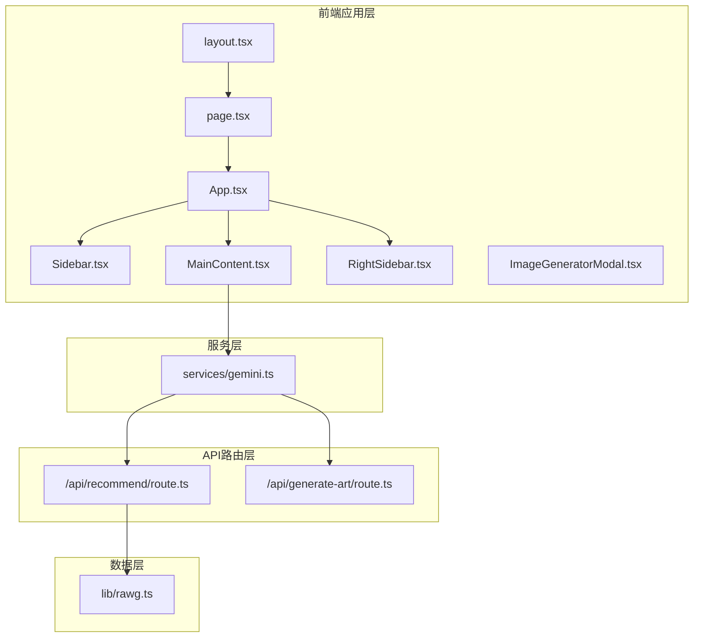
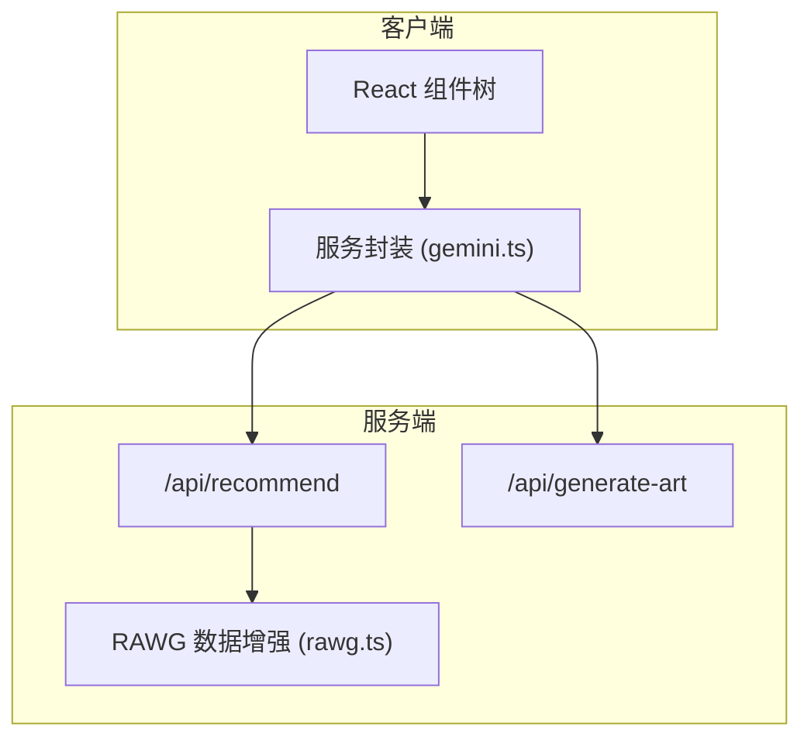
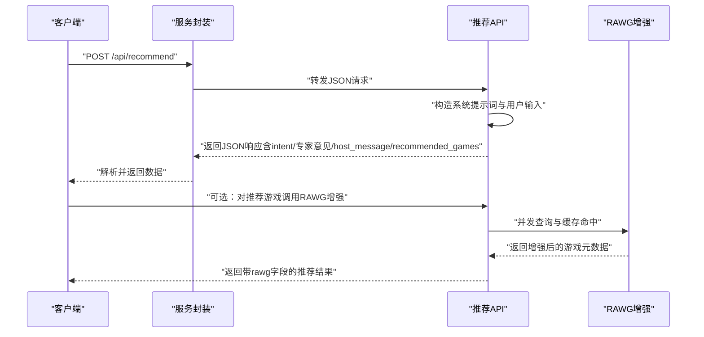
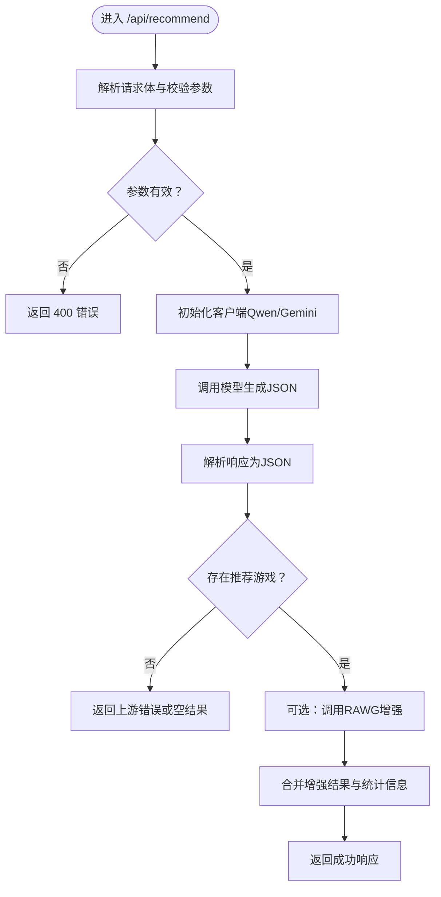
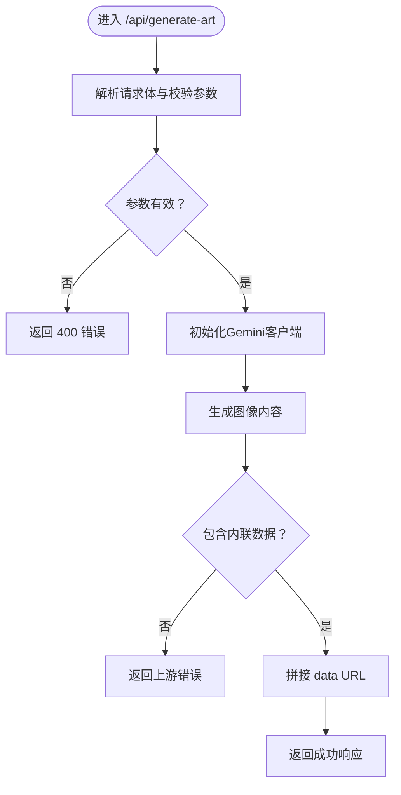
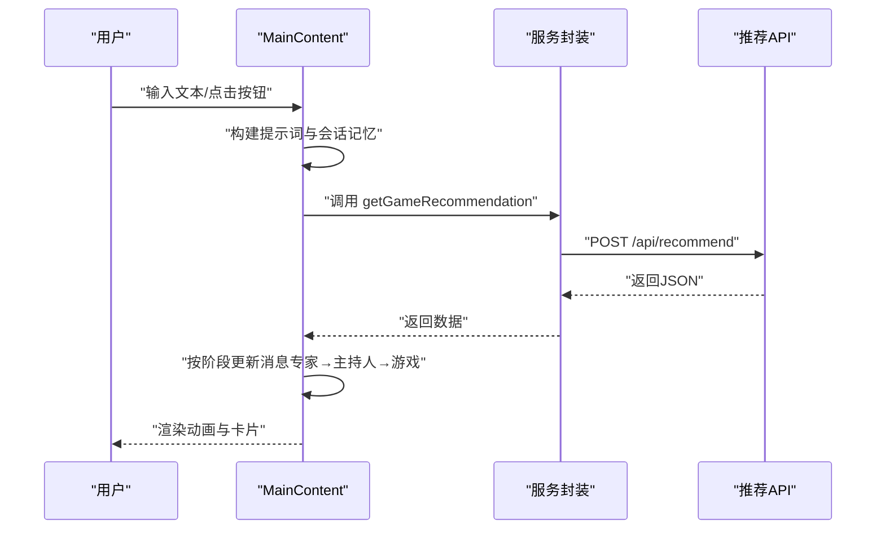
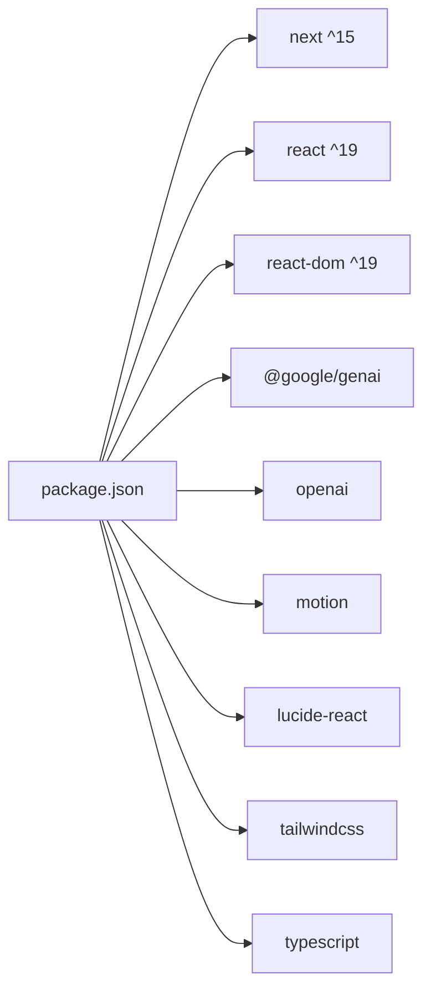

# 架构设计

<cite>
**本文引用的文件**
- [README.md](file://README.md)
- [package.json](file://package.json)
- [next.config.ts](file://next.config.ts)
- [src/index.css](file://src/index.css)
- [src/app/layout.tsx](file://src/app/layout.tsx)
- [src/app/page.tsx](file://src/app/page.tsx)
- [src/App.tsx](file://src/App.tsx)
- [src/components/Sidebar.tsx](file://src/components/Sidebar.tsx)
- [src/components/MainContent.tsx](file://src/components/MainContent.tsx)
- [src/components/RightSidebar.tsx](file://src/components/RightSidebar.tsx)
- [src/components/ImageGeneratorModal.tsx](file://src/components/ImageGeneratorModal.tsx)
- [src/services/gemini.ts](file://src/services/gemini.ts)
- [src/lib/rawg.ts](file://src/lib/rawg.ts)
- [src/app/api/recommend/route.ts](file://src/app/api/recommend/route.ts)
- [src/app/api/generate-art/route.ts](file://src/app/api/generate-art/route.ts)
</cite>

## 目录
1. [引言](#引言)
2. [项目结构](#项目结构)
3. [核心组件](#核心组件)
4. [架构总览](#架构总览)
5. [详细组件分析](#详细组件分析)
6. [依赖分析](#依赖分析)
7. [性能考量](#性能考量)
8. [故障排查指南](#故障排查指南)
9. [结论](#结论)
10. [附录](#附录)

## 引言
本项目为“JoyMate”AI游戏推荐助手，采用Next.js应用层、API路由层、服务层与数据层的分层架构设计。系统通过多智能体协作理念，将“视觉专家”“硬核导师”“预算专家”三种角色的分析意见融合，形成多维度的游戏推荐与解释。前端以React 19构建，使用Tailwind CSS进行样式管理；后端API路由基于Next.js App Router的API Routes，调用外部AI服务（Qwen/Gemini）与游戏数据库（RAWG）完成推理与增强。

## 项目结构
项目采用Next.js App Router目录结构，页面由客户端入口渲染，API路由集中于src/app/api路径，业务逻辑分布在服务层与工具库中。整体布局如下：

图表来源
- [src/app/layout.tsx:1-11](file://src/app/layout.tsx#L1-L11)
- [src/app/page.tsx:1-9](file://src/app/page.tsx#L1-L9)
- [src/App.tsx:1-25](file://src/App.tsx#L1-L25)
- [src/components/Sidebar.tsx:1-83](file://src/components/Sidebar.tsx#L1-L83)
- [src/components/MainContent.tsx:1-721](file://src/components/MainContent.tsx#L1-L721)
- [src/components/RightSidebar.tsx:1-87](file://src/components/RightSidebar.tsx#L1-L87)
- [src/components/ImageGeneratorModal.tsx:1-108](file://src/components/ImageGeneratorModal.tsx#L1-L108)
- [src/services/gemini.ts:1-32](file://src/services/gemini.ts#L1-L32)
- [src/lib/rawg.ts:1-434](file://src/lib/rawg.ts#L1-L434)
- [src/app/api/recommend/route.ts:1-157](file://src/app/api/recommend/route.ts#L1-L157)
- [src/app/api/generate-art/route.ts:1-61](file://src/app/api/generate-art/route.ts#L1-L61)

章节来源
- [src/app/layout.tsx:1-11](file://src/app/layout.tsx#L1-L11)
- [src/app/page.tsx:1-9](file://src/app/page.tsx#L1-L9)
- [src/App.tsx:1-25](file://src/App.tsx#L1-L25)
- [src/index.css:1-44](file://src/index.css#L1-L44)
- [next.config.ts:1-10](file://next.config.ts#L1-L10)

## 核心组件
- 应用根组件：负责布局与全局样式注入，承载页面容器。
- 页面入口：声明客户端渲染，挂载应用主组件。
- 主应用容器：组织侧边栏、主内容区、右侧信息区与模态框。
- 主内容区：聊天对话与推荐卡片展示，驱动多智能体流程。
- 服务封装：统一调用后端API，屏蔽错误细节。
- 数据增强：基于RAWG API进行游戏元数据增强与缓存。

章节来源
- [src/App.tsx:1-25](file://src/App.tsx#L1-L25)
- [src/components/MainContent.tsx:1-721](file://src/components/MainContent.tsx#L1-L721)
- [src/services/gemini.ts:1-32](file://src/services/gemini.ts#L1-L32)
- [src/lib/rawg.ts:1-434](file://src/lib/rawg.ts#L1-L434)

## 架构总览
系统采用前后端分离但同构部署的架构。前端负责UI与交互，后端API路由负责AI推理与数据增强。多智能体协作体现在推荐API的系统提示词设计与响应结构中，前端按阶段渲染不同角色的分析与最终汇总。

图表来源
- [src/components/MainContent.tsx:1-721](file://src/components/MainContent.tsx#L1-L721)
- [src/services/gemini.ts:1-32](file://src/services/gemini.ts#L1-L32)
- [src/app/api/recommend/route.ts:1-157](file://src/app/api/recommend/route.ts#L1-L157)
- [src/app/api/generate-art/route.ts:1-61](file://src/app/api/generate-art/route.ts#L1-L61)
- [src/lib/rawg.ts:1-434](file://src/lib/rawg.ts#L1-L434)

## 详细组件分析

### 多智能体协作系统
系统通过单个聊天补全请求，模拟三类专家的分析过程，最终由主持人汇总输出。前端按阶段渲染“专家意见→主持人总结→推荐列表”，形成流畅的阅读与交互体验。

图表来源
- [src/services/gemini.ts:1-32](file://src/services/gemini.ts#L1-L32)
- [src/app/api/recommend/route.ts:1-157](file://src/app/api/recommend/route.ts#L1-L157)
- [src/lib/rawg.ts:351-434](file://src/lib/rawg.ts#L351-L434)

章节来源
- [src/app/api/recommend/route.ts:35-73](file://src/app/api/recommend/route.ts#L35-L73)
- [src/components/MainContent.tsx:191-223](file://src/components/MainContent.tsx#L191-L223)

### 推荐API路由处理流程
推荐API路由负责参数校验、AI模型调用、错误处理与数据增强。其核心流程如下：

图表来源
- [src/app/api/recommend/route.ts:14-155](file://src/app/api/recommend/route.ts#L14-L155)

章节来源
- [src/app/api/recommend/route.ts:1-157](file://src/app/api/recommend/route.ts#L1-L157)

### 图像生成API路由处理流程
图像生成API路由负责接收提示词与尺寸参数，调用Gemini生成图像并返回Base64数据URL。配额不足时返回友好提示。

图表来源
- [src/app/api/generate-art/route.ts:6-59](file://src/app/api/generate-art/route.ts#L6-L59)

章节来源
- [src/app/api/generate-art/route.ts:1-61](file://src/app/api/generate-art/route.ts#L1-L61)

### 主内容区组件交互
主内容区负责消息状态管理、多阶段渲染与用户交互。其核心交互如下：

图表来源
- [src/components/MainContent.tsx:165-223](file://src/components/MainContent.tsx#L165-L223)
- [src/services/gemini.ts:1-14](file://src/services/gemini.ts#L1-L14)

章节来源
- [src/components/MainContent.tsx:1-721](file://src/components/MainContent.tsx#L1-L721)
- [src/services/gemini.ts:1-32](file://src/services/gemini.ts#L1-L32)

### 组件化架构与模块化开发
- 组件职责清晰：侧边栏提供预设问题，主内容区承载对话与推荐，右侧信息区提供社交与趋势，模态框承载图像生成。
- 状态管理：主内容区维护消息流、会话记忆与滚动行为，确保交互连贯。
- 可复用性：服务封装统一API调用，RAWG工具库提供缓存与评分逻辑，便于跨模块复用。

章节来源
- [src/components/Sidebar.tsx:1-83](file://src/components/Sidebar.tsx#L1-L83)
- [src/components/MainContent.tsx:1-721](file://src/components/MainContent.tsx#L1-L721)
- [src/components/RightSidebar.tsx:1-87](file://src/components/RightSidebar.tsx#L1-L87)
- [src/components/ImageGeneratorModal.tsx:1-108](file://src/components/ImageGeneratorModal.tsx#L1-L108)

## 依赖分析
- 运行时与框架：Next.js 15、React 19、Tailwind CSS 4。
- AI服务：@google/genai（Gemini）、openai（兼容Qwen）。
- 动画与图标：motion、lucide-react。
- TypeScript与ESLint：开发工具链。

图表来源
- [package.json:12-33](file://package.json#L12-L33)

章节来源
- [package.json:1-35](file://package.json#L1-L35)

## 性能考量
- 并发与限流：推荐API对RAWG增强采用可控并发与超时控制，避免阻塞与资源耗尽。
- 缓存策略：RAWG工具库内置搜索与详情缓存，降低重复请求成本。
- 渲染优化：主内容区使用动画与分阶段渲染，提升感知性能与用户体验。
- 构建配置：Next.js自定义dist目录，便于部署与缓存管理。

章节来源
- [src/lib/rawg.ts:1-434](file://src/lib/rawg.ts#L1-L434)
- [src/app/api/recommend/route.ts:96-106](file://src/app/api/recommend/route.ts#L96-L106)
- [next.config.ts:1-10](file://next.config.ts#L1-L10)

## 故障排查指南
- 推荐API配额不足：当出现配额限制时，API返回友好提示，前端可直接展示。
- 图像生成配额不足：与推荐API一致，返回可读提示而非内部错误。
- 参数缺失：API路由对请求体进行严格校验，缺失参数返回400。
- 上游服务异常：捕获异常并返回502，前端显示兜底消息。

章节来源
- [src/app/api/recommend/route.ts:133-154](file://src/app/api/recommend/route.ts#L133-L154)
- [src/app/api/generate-art/route.ts:41-58](file://src/app/api/generate-art/route.ts#L41-L58)

## 结论
JoyMate项目通过清晰的分层架构与组件化设计，实现了从UI交互到AI推理与数据增强的完整闭环。多智能体协作理念贯穿推荐流程，前端以流畅的动画与卡片展示提升用户体验。技术栈选择兼顾易用性与性能，具备良好的可扩展性与可维护性。

## 附录
- 部署与运行：参考项目自述文件中的本地运行与生产部署步骤。
- 样式与主题：通过Tailwind CSS与自定义CSS变量实现统一视觉风格。

章节来源
- [README.md:1-41](file://README.md#L1-L41)
- [src/index.css:1-44](file://src/index.css#L1-L44)