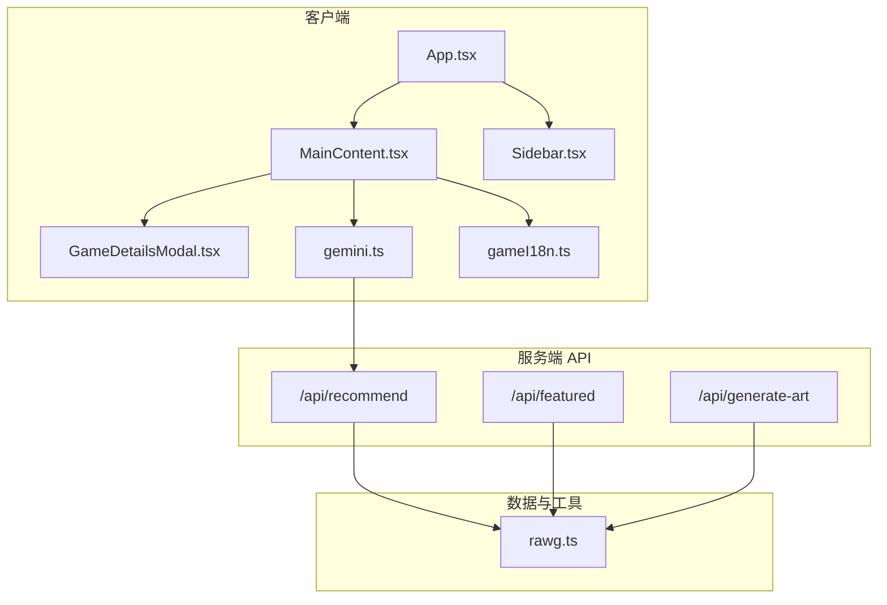
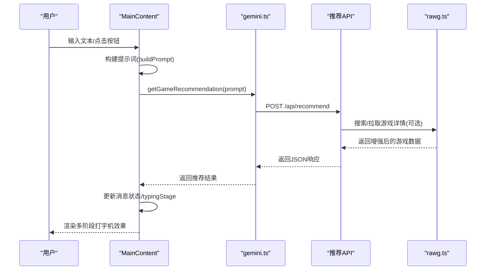
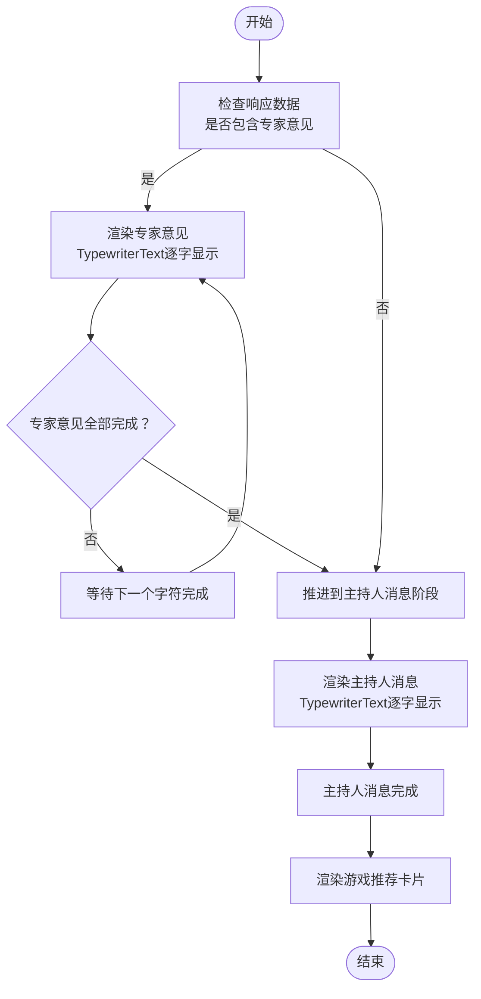
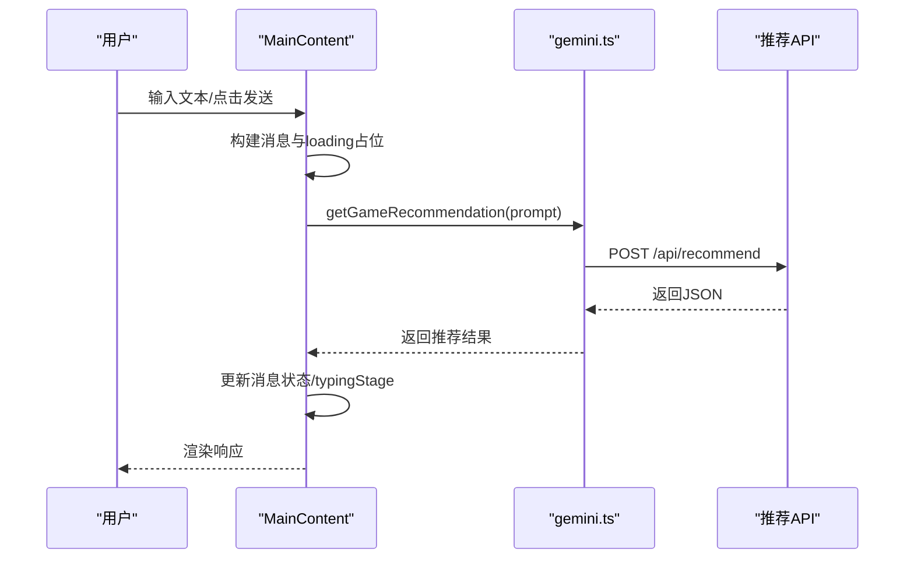
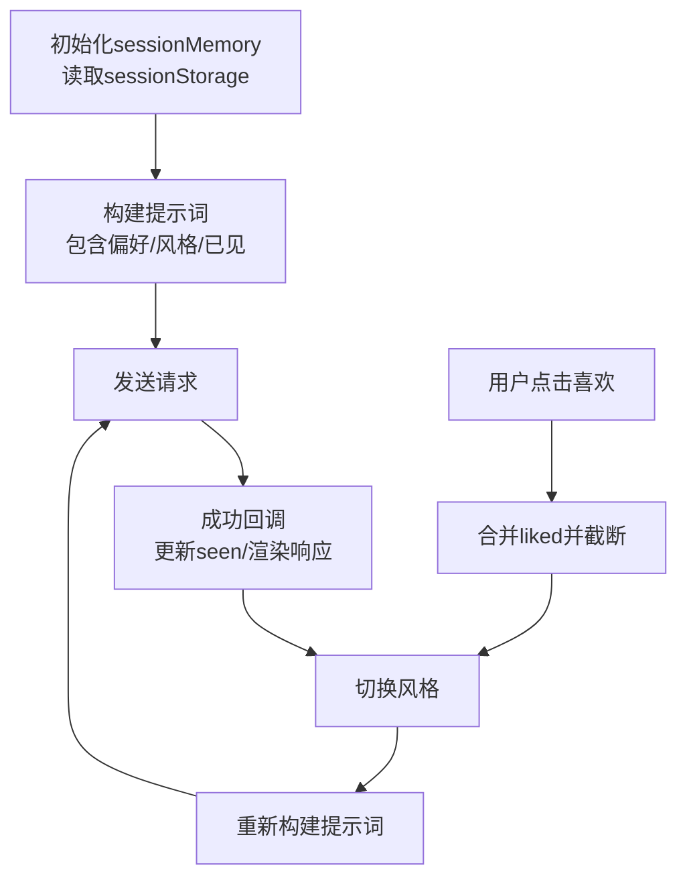
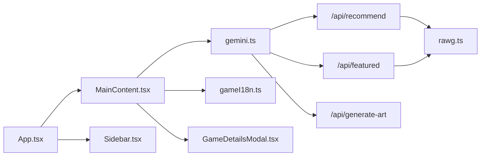

# 主内容组件

<cite>
**本文引用的文件列表**
- [MainContent.tsx](file://src/components/MainContent.tsx)
- [App.tsx](file://src/App.tsx)
- [gemini.ts](file://src/services/gemini.ts)
- [gameI18n.ts](file://src/lib/gameI18n.ts)
- [rawg.ts](file://src/lib/rawg.ts)
- [route.ts](file://src/app/api/recommend/route.ts)
- [route.ts](file://src/app/api/featured/route.ts)
- [route.ts](file://src/app/api/generate-art/route.ts)
- [GameDetailsModal.tsx](file://src/components/GameDetailsModal.tsx)
- [Sidebar.tsx](file://src/components/Sidebar.tsx)
- [page.tsx](file://src/app/page.tsx)
- [package.json](file://package.json)
- [README.md](file://README.md)
</cite>

## 目录
1. [引言](#引言)
2. [项目结构](#项目结构)
3. [核心组件](#核心组件)
4. [架构总览](#架构总览)
5. [详细组件分析](#详细组件分析)
6. [依赖关系分析](#依赖关系分析)
7. [性能考量](#性能考量)
8. [故障排查指南](#故障排查指南)
9. [结论](#结论)
10. [附录](#附录)

## 引言
本文件围绕 MainContent 主内容组件展开，系统性阐述其在聊天界面中的核心实现，包括：
- 消息状态管理与渲染流程
- AI 对话与多阶段打字机效果（专家意见、主持人消息、游戏推荐）
- 用户输入处理、消息发送与实时响应
- 会话记忆的持久化与偏好学习
- 风格切换与多视角推荐
- 组件生命周期、性能优化与错误处理
- 初学者使用指南与高级扩展建议

## 项目结构
该应用采用 Next.js 客户端页面 + 服务端 API 的前后端分离模式，MainContent 作为聊天主界面承载核心交互逻辑；服务层通过 Next.js 路由暴露 API，数据层集成 RAWG 第三方数据增强。

图表来源
- [App.tsx:12-24](file://src/App.tsx#L12-L24)
- [MainContent.tsx:70-131](file://src/components/MainContent.tsx#L70-L131)
- [gemini.ts:1-14](file://src/services/gemini.ts#L1-L14)
- [route.ts:14-155](file://src/app/api/recommend/route.ts#L14-L155)
- [route.ts:26-83](file://src/app/api/featured/route.ts#L26-L83)
- [route.ts:6-59](file://src/app/api/generate-art/route.ts#L6-L59)
- [rawg.ts:252-433](file://src/lib/rawg.ts#L252-L433)
- [gameI18n.ts:70-81](file://src/lib/gameI18n.ts#L70-L81)

章节来源
- [App.tsx:12-24](file://src/App.tsx#L12-L24)
- [page.tsx:5-7](file://src/app/page.tsx#L5-L7)
- [package.json:12-21](file://package.json#L12-L21)

## 核心组件
- MainContent：负责聊天界面、消息渲染、多阶段打字机、用户输入、发送与响应、会话记忆、风格切换、游戏详情弹窗等。
- App：应用根容器，协调侧边栏、主内容区与图像生成模态框。
- Sidebar：提供预设问题入口，触发快速提示。
- GameDetailsModal：展示游戏详情卡片，支持打开 RAWG 页面。
- 服务层 gemini.ts：封装推荐与图像生成 API 请求。
- 数据增强 rawg.ts：提供 RAWG 搜索、详情与推荐游戏增强能力。
- 国际化 gameI18n.ts：将英文游戏标签映射为中文标签。

章节来源
- [MainContent.tsx:70-131](file://src/components/MainContent.tsx#L70-L131)
- [App.tsx:12-24](file://src/App.tsx#L12-L24)
- [Sidebar.tsx:3-66](file://src/components/Sidebar.tsx#L3-L66)
- [GameDetailsModal.tsx:22-165](file://src/components/GameDetailsModal.tsx#L22-L165)
- [gemini.ts:1-14](file://src/services/gemini.ts#L1-L14)
- [rawg.ts:252-433](file://src/lib/rawg.ts#L252-L433)
- [gameI18n.ts:70-81](file://src/lib/gameI18n.ts#L70-L81)

## 架构总览
MainContent 通过 gemini.ts 调用 /api/recommend 获取 AI 推荐结果，结果中包含“意图识别”“专家意见”“主持人总结”“游戏推荐”等多阶段内容。同时，组件维护会话记忆（sessionMemory），用于偏好学习与风格切换，并通过 sessionStorage 实现持久化。

图表来源
- [MainContent.tsx:138-223](file://src/components/MainContent.tsx#L138-L223)
- [gemini.ts:1-14](file://src/services/gemini.ts#L1-L14)
- [route.ts:14-155](file://src/app/api/recommend/route.ts#L14-L155)
- [rawg.ts:351-433](file://src/lib/rawg.ts#L351-L433)

## 详细组件分析

### 消息状态管理与渲染
- 消息结构：包含 id、role、content、data、isLoading、typingStage 等字段，用于控制渲染与动画阶段。
- 渲染策略：使用 AnimatePresence/motion 控制消息进入/退出动画；根据 typingStage 分别渲染“专家意见”“主持人消息”“游戏推荐”三阶段。
- 加载态：当 isLoading=true 时显示加载指示器，避免重复提交。

章节来源
- [MainContent.tsx:54-61](file://src/components/MainContent.tsx#L54-L61)
- [MainContent.tsx:344-600](file://src/components/MainContent.tsx#L344-L600)

### 多阶段打字机效果
- 专家意见阶段：当响应包含 aesthetic_critic、hardcore_strategist、budget_expert 时，逐条以 TypewriterText 渲染，支持 onCharTyped 与 onComplete 回调，完成计数达到阈值后推进到下一阶段。
- 主持人消息阶段：渲染 host_message，完成后推进到游戏推荐阶段。
- 游戏推荐阶段：渲染推荐卡片与操作按钮（喜欢、再推荐、换风格）。

图表来源
- [MainContent.tsx:390-474](file://src/components/MainContent.tsx#L390-L474)
- [MainContent.tsx:465-470](file://src/components/MainContent.tsx#L465-L470)
- [MainContent.tsx:261-271](file://src/components/MainContent.tsx#L261-L271)

章节来源
- [MainContent.tsx:10-50](file://src/components/MainContent.tsx#L10-L50)
- [MainContent.tsx:390-474](file://src/components/MainContent.tsx#L390-L474)

### 用户输入处理与消息发送机制
- 输入框绑定：受控组件，支持 Enter 键发送。
- 快速提示：Sidebar 将预设问题传递给 MainContent，自动填充输入框。
- 发送流程：handleSend 支持字符串或对象参数，构建用户消息与 loading 消息，调用 getGameRecommendation 并更新消息状态与滚动位置。

图表来源
- [MainContent.tsx:165-223](file://src/components/MainContent.tsx#L165-L223)
- [gemini.ts:1-14](file://src/services/gemini.ts#L1-L14)
- [route.ts:14-155](file://src/app/api/recommend/route.ts#L14-L155)

章节来源
- [MainContent.tsx:606-638](file://src/components/MainContent.tsx#L606-L638)
- [Sidebar.tsx:16-52](file://src/components/Sidebar.tsx#L16-L52)

### 实时响应与滚动行为
- 发送后延迟滚动至底部，保证新消息可见。
- 打字机每出现一个字符即自动滚动，提升阅读连贯性。

章节来源
- [MainContent.tsx:105-107](file://src/components/MainContent.tsx#L105-L107)
- [MainContent.tsx:184-189](file://src/components/MainContent.tsx#L184-L189)
- [MainContent.tsx:273-275](file://src/components/MainContent.tsx#L273-L275)

### 会话记忆与偏好学习
- 结构：包含 liked/disliked/seen/style 字段，分别记录喜欢/不喜欢的游戏名、已见过的游戏集合与风格偏好。
- 初始化：从 sessionStorage 读取，若缺失则回退默认值。
- 更新策略：
  - 记录已见：每次收到推荐结果时，合并 seen 并截断长度，避免无限增长。
  - 偏好学习：用户点击“喜欢这波”时，将候选游戏加入 liked 并截断长度。
  - 风格切换：循环切换 style，配合 actionHint 重新请求推荐。
- 持久化：每次变更写入 sessionStorage，并同步到 ref 以供构建提示词使用。

图表来源
- [MainContent.tsx:84-98](file://src/components/MainContent.tsx#L84-L98)
- [MainContent.tsx:126-131](file://src/components/MainContent.tsx#L126-L131)
- [MainContent.tsx:138-163](file://src/components/MainContent.tsx#L138-L163)
- [MainContent.tsx:199-204](file://src/components/MainContent.tsx#L199-L204)
- [MainContent.tsx:225-235](file://src/components/MainContent.tsx#L225-L235)
- [MainContent.tsx:248-259](file://src/components/MainContent.tsx#L248-L259)

章节来源
- [MainContent.tsx:84-98](file://src/components/MainContent.tsx#L84-L98)
- [MainContent.tsx:126-131](file://src/components/MainContent.tsx#L126-L131)
- [MainContent.tsx:138-163](file://src/components/MainContent.tsx#L138-L163)
- [MainContent.tsx:199-204](file://src/components/MainContent.tsx#L199-L204)
- [MainContent.tsx:225-235](file://src/components/MainContent.tsx#L225-L235)
- [MainContent.tsx:248-259](file://src/components/MainContent.tsx#L248-L259)

### 游戏详情与卡片交互
- 打开详情：点击卡片触发 GameDetailsModal，展示封面、评分、平台、类型、标签与简述。
- 打开 RAWG：若存在 rawg_url，提供外部链接直达。
- 国际化标签：通过 gameI18n.toZhLabels 将英文标签映射为中文。

章节来源
- [MainContent.tsx:496-547](file://src/components/MainContent.tsx#L496-L547)
- [GameDetailsModal.tsx:22-165](file://src/components/GameDetailsModal.tsx#L22-L165)
- [gameI18n.ts:70-81](file://src/lib/gameI18n.ts#L70-L81)

### 图像生成与概念艺术
- 触发方式：顶部工具栏按钮打开图像生成模态框。
- 后端接口：/api/generate-art 使用 Gemini 生成图像，支持不同尺寸。
- 错误处理：配额不足时返回友好提示，避免前端崩溃。

章节来源
- [App.tsx:13-21](file://src/App.tsx#L13-L21)
- [route.ts:6-59](file://src/app/api/generate-art/route.ts#L6-L59)

### 服务端 API 与数据增强
- /api/recommend：接收用户提示词，调用第三方模型生成 JSON，包含 intent、专家意见、host_message、recommended_games；可选调用 rawg.ts 增强游戏详情。
- /api/featured：获取精选游戏列表，支持缓存与 RAWG 增强。
- rawg.ts：提供标题规范化、相似度计算、缓存、并发搜索与详情拉取，以及推荐游戏批量增强。

章节来源
- [route.ts:14-155](file://src/app/api/recommend/route.ts#L14-L155)
- [route.ts:26-83](file://src/app/api/featured/route.ts#L26-L83)
- [rawg.ts:252-433](file://src/lib/rawg.ts#L252-L433)

## 依赖关系分析
- 组件间依赖：App -> MainContent、Sidebar；MainContent 依赖 gemini.ts、gameI18n.ts、GameDetailsModal。
- 服务层依赖：gemini.ts 依赖 Next.js 路由（/api/recommend、/api/featured、/api/generate-art）。
- 数据层依赖：推荐 API 依赖 rawg.ts 进行标题匹配与详情增强。

图表来源
- [App.tsx:12-24](file://src/App.tsx#L12-L24)
- [MainContent.tsx:1-8](file://src/components/MainContent.tsx#L1-L8)
- [gemini.ts:1-14](file://src/services/gemini.ts#L1-L14)
- [route.ts:14-155](file://src/app/api/recommend/route.ts#L14-L155)
- [route.ts:26-83](file://src/app/api/featured/route.ts#L26-L83)
- [route.ts:6-59](file://src/app/api/generate-art/route.ts#L6-L59)
- [rawg.ts:252-433](file://src/lib/rawg.ts#L252-L433)

章节来源
- [package.json:12-21](file://package.json#L12-L21)

## 性能考量
- 打字机节流：TypewriterText 使用定时器逐字符渲染，避免长文本一次性渲染造成卡顿。
- 动画与滚动：AnimatePresence 与 motion 提供流畅过渡；滚动采用延迟策略，减少频繁布局抖动。
- 会话记忆截断：seen/liked 截断长度，防止内存膨胀。
- RAWG 增强并发：推荐增强使用并发限制（默认 2），并设置超时，平衡质量与性能。
- 缓存策略：rawg.ts 内置搜索与详情缓存，降低重复请求成本。
- 防抖与去重：构建提示词时对 liked/disliked/seen 做去重与截断，减少上下文冗余。

章节来源
- [MainContent.tsx:10-50](file://src/components/MainContent.tsx#L10-L50)
- [MainContent.tsx:199-204](file://src/components/MainContent.tsx#L199-L204)
- [MainContent.tsx:225-235](file://src/components/MainContent.tsx#L225-L235)
- [rawg.ts:351-433](file://src/lib/rawg.ts#L351-L433)

## 故障排查指南
- 推荐接口配额不足：服务端对 429/配额耗尽场景返回友好提示，前端无需额外处理。
- 网络异常：handleSend 捕获异常并回退为主持人消息，typingStage 设为 host。
- RAWG 缺失密钥：/api/featured 与 /api/recommend 在配置缺失时返回降级数据并记录警告日志。
- 图像生成配额不足：/api/generate-art 返回友好提示，避免前端报错。

章节来源
- [route.ts:133-154](file://src/app/api/recommend/route.ts#L133-L154)
- [MainContent.tsx:213-222](file://src/components/MainContent.tsx#L213-L222)
- [route.ts:34-44](file://src/app/api/featured/route.ts#L34-L44)
- [route.ts:43-54](file://src/app/api/generate-art/route.ts#L43-L54)

## 结论
MainContent 通过清晰的消息状态管理、多阶段打字机渲染与会话记忆机制，实现了自然流畅的 AI 游戏推荐对话体验。结合 RAWG 数据增强与风格切换，系统在个性化与多样性之间取得平衡。建议在生产环境中关注配额与缓存策略，持续优化首屏渲染与滚动性能。

## 附录

### 初学者使用指南
- 如何开始：在输入框中描述你的游戏偏好（如“想玩剧情向的开放世界”），点击发送或按回车。
- 快速体验：点击侧边栏“伙伴精选”中的预设问题，自动填充输入框并发送。
- 喜欢推荐：在游戏卡片下方点击“喜欢这波”，系统会记住你的偏好并用于后续推荐。
- 再次推荐：点击“再推荐”按钮，系统会基于上次意图继续生成新推荐。
- 换风格：点击“换一种风格”，系统会在不同风格（均衡/硬核/艺术/性价比）间循环切换。

章节来源
- [MainContent.tsx:550-591](file://src/components/MainContent.tsx#L550-L591)
- [Sidebar.tsx:16-52](file://src/components/Sidebar.tsx#L16-L52)

### 高级开发者扩展建议
- 自定义提示词：在 buildPrompt 中增加领域知识或业务规则，提升推荐准确性。
- 会话记忆扩展：引入更复杂的偏好模型（如协同过滤或嵌入相似度），替代简单的 seen/liked 截断。
- 动画与交互：为 TypewriterText 增加暂停/跳过功能，或为卡片添加更多交互（收藏、分享）。
- 错误与可观测性：在 handleSend 中统一上报错误指标，便于定位上游 API 问题。
- 配置化：将打字速度、截断长度、风格顺序等参数外置为配置，便于 A/B 测试。

章节来源
- [MainContent.tsx:138-163](file://src/components/MainContent.tsx#L138-L163)
- [MainContent.tsx:248-259](file://src/components/MainContent.tsx#L248-L259)