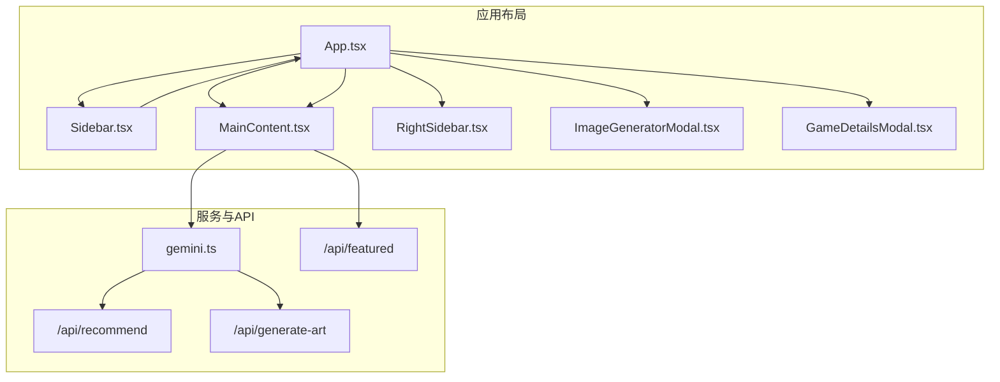
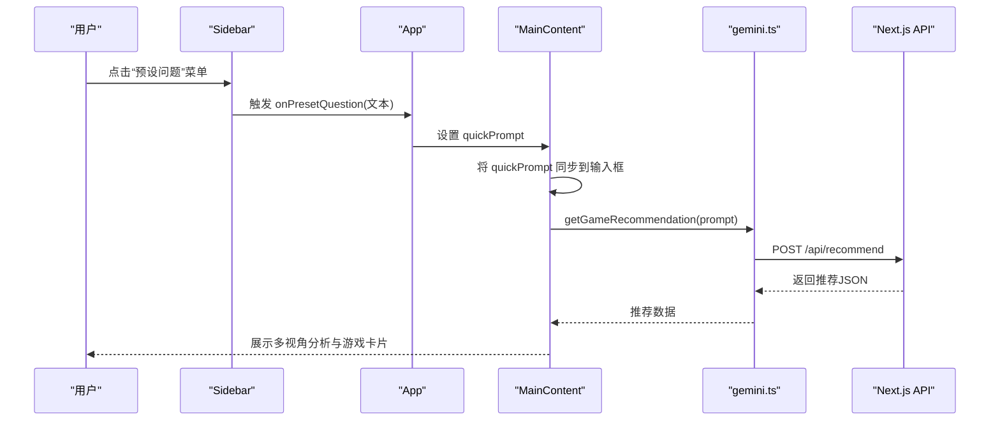
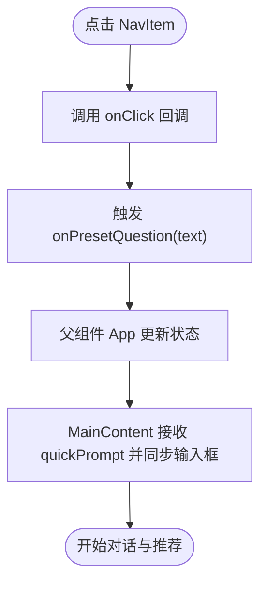
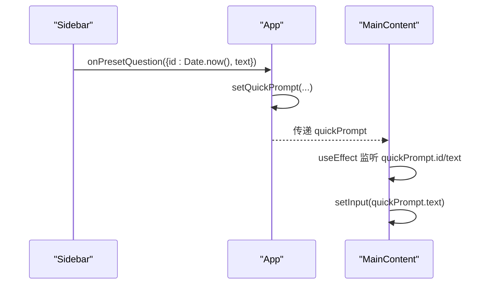
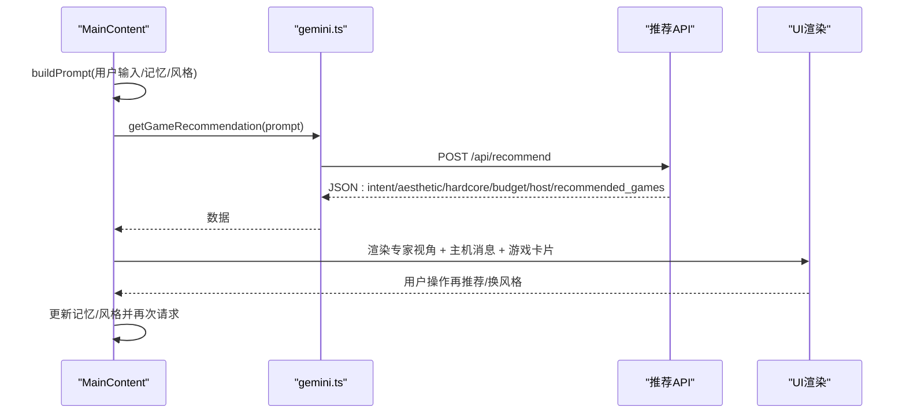
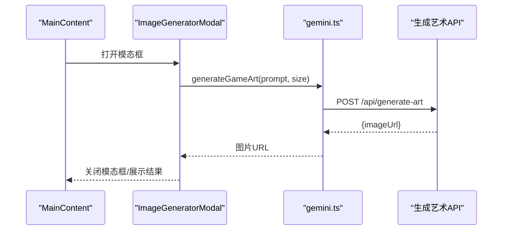
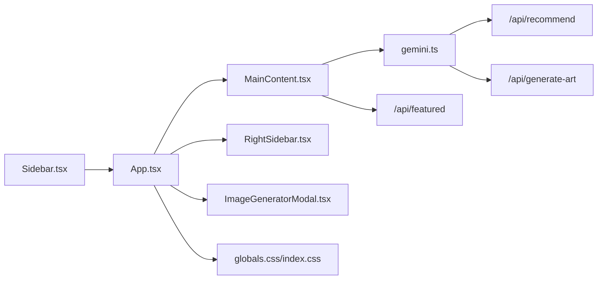

# 侧边栏组件

<cite>
**本文引用的文件**
- [Sidebar.tsx](file://src/components/Sidebar.tsx)
- [App.tsx](file://src/App.tsx)
- [MainContent.tsx](file://src/components/MainContent.tsx)
- [RightSidebar.tsx](file://src/components/RightSidebar.tsx)
- [GameDetailsModal.tsx](file://src/components/GameDetailsModal.tsx)
- [ImageGeneratorModal.tsx](file://src/components/ImageGeneratorModal.tsx)
- [gemini.ts](file://src/services/gemini.ts)
- [route.ts（推荐）](file://src/app/api/recommend/route.ts)
- [route.ts（精选）](file://src/app/api/featured/route.ts)
- [route.ts（生成艺术）](file://src/app/api/generate-art/route.ts)
- [layout.tsx](file://src/app/layout.tsx)
- [globals.css](file://src/app/globals.css)
- [index.css](file://src/index.css)
- [page.tsx](file://src/app/page.tsx)
</cite>

## 目录
1. [引言](#引言)
2. [项目结构](#项目结构)
3. [核心组件](#核心组件)
4. [架构总览](#架构总览)
5. [详细组件分析](#详细组件分析)
6. [依赖关系分析](#依赖关系分析)
7. [性能考量](#性能考量)
8. [故障排查指南](#故障排查指南)
9. [结论](#结论)
10. [附录](#附录)

## 引言
本文件围绕 Sidebar 侧边栏组件展开，系统性说明其“预设问题系统”的实现原理（问题分类、动态生成与用户选择处理）、导航功能设计（菜单项状态管理与路由跳转逻辑）、组件状态管理与事件处理、props 传递机制，以及样式定制、响应式设计、动画效果与用户体验优化。同时提供组件集成指南、自定义扩展方法，兼顾初学者入门与高级开发者的主题定制建议。

## 项目结构
Sidebar 位于组件层，作为应用布局的一部分，与主内容区、右侧边栏、模态框等共同构成页面骨架；通过 props 将用户选择的预设问题文本回传给父组件 App，由 App 统一驱动 MainContent 进行对话与推荐流程。

图表来源
- [App.tsx:12-24](file://src/App.tsx#L12-L24)
- [Sidebar.tsx:3-67](file://src/components/Sidebar.tsx#L3-L67)
- [MainContent.tsx:70-689](file://src/components/MainContent.tsx#L70-L689)
- [RightSidebar.tsx:3-73](file://src/components/RightSidebar.tsx#L3-L73)
- [ImageGeneratorModal.tsx:5-107](file://src/components/ImageGeneratorModal.tsx#L5-L107)
- [GameDetailsModal.tsx:22-165](file://src/components/GameDetailsModal.tsx#L22-L165)
- [gemini.ts:1-31](file://src/services/gemini.ts#L1-L31)
- [route.ts（推荐）:14-155](file://src/app/api/recommend/route.ts#L14-L155)
- [route.ts（精选）:26-83](file://src/app/api/featured/route.ts#L26-L83)
- [route.ts（生成艺术）:6-59](file://src/app/api/generate-art/route.ts#L6-L59)

章节来源
- [App.tsx:12-24](file://src/App.tsx#L12-L24)
- [Sidebar.tsx:3-67](file://src/components/Sidebar.tsx#L3-L67)
- [MainContent.tsx:70-689](file://src/components/MainContent.tsx#L70-L689)
- [RightSidebar.tsx:3-73](file://src/components/RightSidebar.tsx#L3-L73)
- [ImageGeneratorModal.tsx:5-107](file://src/components/ImageGeneratorModal.tsx#L5-L107)
- [GameDetailsModal.tsx:22-165](file://src/components/GameDetailsModal.tsx#L22-L165)
- [gemini.ts:1-31](file://src/services/gemini.ts#L1-L31)
- [route.ts（推荐）:14-155](file://src/app/api/recommend/route.ts#L14-L155)
- [route.ts（精选）:26-83](file://src/app/api/featured/route.ts#L26-L83)
- [route.ts（生成艺术）:6-59](file://src/app/api/generate-art/route.ts#L6-L59)

## 核心组件
- Sidebar：提供“伙伴精选”预设问题导航，每个菜单项绑定一个固定问题文本，点击后通过回调 onPresetQuestion 将文本传递给父组件。
- App：接收预设问题文本，将其注入 MainContent 的输入框，触发后续对话与推荐。
- MainContent：负责消息流、AI 推理、游戏卡片渲染、模态框交互等，是推荐系统的核心执行体。
- 右侧边栏与模态框：提供用户信息、进度、趋势与详情展示，以及图像生成入口。

章节来源
- [Sidebar.tsx:3-67](file://src/components/Sidebar.tsx#L3-L67)
- [App.tsx:12-24](file://src/App.tsx#L12-L24)
- [MainContent.tsx:70-689](file://src/components/MainContent.tsx#L70-L689)
- [RightSidebar.tsx:3-73](file://src/components/RightSidebar.tsx#L3-L73)
- [ImageGeneratorModal.tsx:5-107](file://src/components/ImageGeneratorModal.tsx#L5-L107)
- [GameDetailsModal.tsx:22-165](file://src/components/GameDetailsModal.tsx#L22-L165)

## 架构总览
Sidebar 与 App 之间通过 props 回调建立松耦合连接；App 将预设问题文本注入 MainContent，MainContent 调用服务层 gemini.ts，后者通过 Next.js API 路由对接外部模型服务，完成推荐与图像生成。

图表来源
- [Sidebar.tsx:16-52](file://src/components/Sidebar.tsx#L16-L52)
- [App.tsx:18](file://src/App.tsx#L18)
- [MainContent.tsx:134-136](file://src/components/MainContent.tsx#L134-L136)
- [gemini.ts:1-14](file://src/services/gemini.ts#L1-L14)
- [route.ts（推荐）:14-155](file://src/app/api/recommend/route.ts#L14-L155)

## 详细组件分析

### Sidebar 侧边栏组件
- 预设问题系统
  - 分类：以“伙伴精选”为主题，覆盖“按心情推荐”“耐玩神作”“手感爽快”“好友开黑”“剧情沉浸”“轻松解压”等六类场景。
  - 动态生成：每个 NavItem 通过 props 传入图标、标签、计数与点击回调；点击时调用 onPresetQuestion 并传入对应问题文本。
  - 用户选择处理：Sidebar 不维护选中状态，仅负责触发回调；选中态由父组件 App 控制（见下方 NavItem 状态管理说明）。
- 导航与样式
  - 使用 Flex 布局与 Tailwind 类控制宽度、边框、背景色与隐藏规则，实现桌面端可见、移动端隐藏的响应式行为。
  - NavItem 支持 active 状态与悬停态切换，通过条件类名实现不同视觉反馈。
- Props 与事件
  - 外部回调 onPresetQuestion：用于将预设问题文本回传给父组件。
  - NavItem 接收 icon、label、count、active、onClick 等 props，便于复用与扩展。

图表来源
- [Sidebar.tsx:69-82](file://src/components/Sidebar.tsx#L69-L82)
- [Sidebar.tsx:16-52](file://src/components/Sidebar.tsx#L16-L52)
- [App.tsx:18](file://src/App.tsx#L18)
- [MainContent.tsx:134-136](file://src/components/MainContent.tsx#L134-L136)

章节来源
- [Sidebar.tsx:3-67](file://src/components/Sidebar.tsx#L3-L67)
- [Sidebar.tsx:69-82](file://src/components/Sidebar.tsx#L69-L82)

### App 与状态管理
- App 维护 quickPrompt 状态，当 Sidebar 的 onPresetQuestion 回调被触发时，将当前时间戳作为唯一 id 与文本写入该状态。
- MainContent 通过 props 接收 quickPrompt，监听其 id 与文本变化，自动将文本同步到输入框，从而实现“预设问题即刻提问”。

图表来源
- [App.tsx:18](file://src/App.tsx#L18)
- [MainContent.tsx:134-136](file://src/components/MainContent.tsx#L134-L136)

章节来源
- [App.tsx:12-24](file://src/App.tsx#L12-L24)
- [MainContent.tsx:134-136](file://src/components/MainContent.tsx#L134-L136)

### MainContent 与推荐流程
- 输入与发送
  - 支持直接输入或通过 quickPrompt 注入；按下回车或点击发送按钮触发 handleSend。
  - handleSend 构建最终 prompt（含会话记忆、风格偏好、用户意图等），调用 getGameRecommendation。
- 推荐与渲染
  - 接收推荐 JSON 后，根据是否包含专家视角与主机消息，分阶段渲染 TypewriterText 文本与游戏卡片网格。
  - 支持“再推荐”“换一种风格”等交互，动态更新会话记忆与风格偏好。
- 会话记忆与风格循环
  - 使用 sessionStorage 存储 liked/disliked/seen/style，保证刷新后记忆延续。
  - cycleStyle 在四种风格间轮转，配合 actionHint 重新请求模型。

图表来源
- [MainContent.tsx:138-163](file://src/components/MainContent.tsx#L138-L163)
- [MainContent.tsx:165-223](file://src/components/MainContent.tsx#L165-L223)
- [gemini.ts:1-14](file://src/services/gemini.ts#L1-L14)
- [route.ts（推荐）:14-155](file://src/app/api/recommend/route.ts#L14-L155)

章节来源
- [MainContent.tsx:70-689](file://src/components/MainContent.tsx#L70-L689)
- [gemini.ts:1-31](file://src/services/gemini.ts#L1-L31)
- [route.ts（推荐）:14-155](file://src/app/api/recommend/route.ts#L14-L155)

### 图像生成与模态框
- ImageGeneratorModal 提供概念图生成入口，支持 1K/2K/4K 分辨率选择，异步生成后展示下载链接。
- MainContent 顶部工具栏提供打开模态框的按钮，点击后触发状态切换。

图表来源
- [ImageGeneratorModal.tsx:5-107](file://src/components/ImageGeneratorModal.tsx#L5-L107)
- [gemini.ts:16-31](file://src/services/gemini.ts#L16-L31)
- [route.ts（生成艺术）:6-59](file://src/app/api/generate-art/route.ts#L6-L59)

章节来源
- [ImageGeneratorModal.tsx:5-107](file://src/components/ImageGeneratorModal.tsx#L5-L107)
- [gemini.ts:16-31](file://src/services/gemini.ts#L16-L31)
- [route.ts（生成艺术）:6-59](file://src/app/api/generate-art/route.ts#L6-L59)

### 右侧边栏与详情模态框
- RightSidebar：展示用户等级、经验进度、周统计与全网热度趋势，提供“深度见解”卡片。
- GameDetailsModal：展示游戏封面、评分、平台/类型/标签、一句话简介与伙伴点评，支持打开 RAWG 页面。

章节来源
- [RightSidebar.tsx:3-73](file://src/components/RightSidebar.tsx#L3-L73)
- [GameDetailsModal.tsx:22-165](file://src/components/GameDetailsModal.tsx#L22-L165)

## 依赖关系分析
- 组件依赖
  - Sidebar 依赖 NavItem（内部函数组件）与图标库 lucide-react。
  - App 依赖 Sidebar、MainContent、RightSidebar、ImageGeneratorModal。
  - MainContent 依赖服务层 gemini.ts、动画库 motion/react、Markdown 渲染库 react-markdown。
- 外部依赖与 API
  - 推荐 API：/api/recommend，返回多视角分析与游戏推荐。
  - 精选 API：/api/featured，返回精选游戏列表并尝试补充 RAWG 数据。
  - 图像生成 API：/api/generate-art，返回 base64 或错误提示。
- 样式与主题
  - 全局样式采用 Tailwind，背景色统一为深蓝灰，滚动条与 Markdown 样式在全局 CSS 中定义。

图表来源
- [Sidebar.tsx:3-67](file://src/components/Sidebar.tsx#L3-L67)
- [App.tsx:12-24](file://src/App.tsx#L12-L24)
- [MainContent.tsx:70-689](file://src/components/MainContent.tsx#L70-L689)
- [RightSidebar.tsx:3-73](file://src/components/RightSidebar.tsx#L3-L73)
- [ImageGeneratorModal.tsx:5-107](file://src/components/ImageGeneratorModal.tsx#L5-L107)
- [gemini.ts:1-31](file://src/services/gemini.ts#L1-L31)
- [route.ts（推荐）:14-155](file://src/app/api/recommend/route.ts#L14-L155)
- [route.ts（精选）:26-83](file://src/app/api/featured/route.ts#L26-L83)
- [route.ts（生成艺术）:6-59](file://src/app/api/generate-art/route.ts#L6-L59)
- [globals.css:1-45](file://src/app/globals.css#L1-L45)
- [index.css:1-44](file://src/index.css#L1-L44)

章节来源
- [Sidebar.tsx:3-67](file://src/components/Sidebar.tsx#L3-L67)
- [App.tsx:12-24](file://src/App.tsx#L12-L24)
- [MainContent.tsx:70-689](file://src/components/MainContent.tsx#L70-L689)
- [RightSidebar.tsx:3-73](file://src/components/RightSidebar.tsx#L3-L73)
- [ImageGeneratorModal.tsx:5-107](file://src/components/ImageGeneratorModal.tsx#L5-L107)
- [gemini.ts:1-31](file://src/services/gemini.ts#L1-L31)
- [route.ts（推荐）:14-155](file://src/app/api/recommend/route.ts#L14-L155)
- [route.ts（精选）:26-83](file://src/app/api/featured/route.ts#L26-L83)
- [route.ts（生成艺术）:6-59](file://src/app/api/generate-art/route.ts#L6-L59)
- [globals.css:1-45](file://src/app/globals.css#L1-L45)
- [index.css:1-44](file://src/index.css#L1-L44)

## 性能考量
- 请求缓存与降级
  - /api/featured 对结果进行缓存，减少重复请求；在禁用 RAWG 或缺少密钥时提供降级数据。
  - /api/recommend 在配额不足时返回友好提示，避免前端崩溃。
- 渲染优化
  - MainContent 使用 react-markdown 与 motion/react 实现文本逐字渲染与卡片入场动画，提升阅读体验。
  - 游戏卡片网格使用 staggered 动画变体，增强层级感。
- 会话记忆
  - 使用 sessionStorage 存储用户偏好，避免频繁请求与重复计算。

章节来源
- [route.ts（精选）:26-83](file://src/app/api/featured/route.ts#L26-L83)
- [route.ts（推荐）:133-154](file://src/app/api/recommend/route.ts#L133-L154)
- [MainContent.tsx:285-299](file://src/components/MainContent.tsx#L285-L299)
- [MainContent.tsx:84-98](file://src/components/MainContent.tsx#L84-L98)

## 故障排查指南
- 预设问题无效
  - 确认 Sidebar 的 onPresetQuestion 回调正确传递至 App，并检查 App 是否设置 quickPrompt。
  - 检查 MainContent 是否监听 quickPrompt 的 id 与 text 并同步到输入框。
- 推荐失败
  - 查看 /api/recommend 的返回状态码与错误信息；若为配额不足，接口会返回友好提示。
  - 确认环境变量 QWEN_API_KEY 或 GEMINI_API_KEY 已配置。
- 图像生成异常
  - 检查 /api/generate-art 的返回值是否包含 imageUrl；若配额不足，接口会返回错误提示文本而非抛错。
- 样式问题
  - 确认全局 CSS 已正确引入，Tailwind 类命名未被覆盖；检查深色主题背景与滚动条样式。

章节来源
- [App.tsx:18](file://src/App.tsx#L18)
- [MainContent.tsx:134-136](file://src/components/MainContent.tsx#L134-L136)
- [route.ts（推荐）:133-154](file://src/app/api/recommend/route.ts#L133-L154)
- [route.ts（生成艺术）:43-58](file://src/app/api/generate-art/route.ts#L43-L58)
- [globals.css:1-45](file://src/app/globals.css#L1-L45)
- [index.css:1-44](file://src/index.css#L1-L44)

## 结论
Sidebar 通过简洁的预设问题系统与清晰的回调机制，将用户意图快速转化为可执行的对话输入；App 与 MainContent 协同完成推荐与渲染，形成从“问题—输入—推理—展示”的完整闭环。组件间职责明确、耦合度低，便于扩展与定制。建议在保持现有结构的前提下，逐步引入更多预设分类、动态加载与个性化记忆，进一步提升用户体验。

## 附录

### 基础使用说明（初学者）
- 在父组件中引入 Sidebar，并传入 onPresetQuestion 回调。
- 将回调参数注入 MainContent 的 quickPrompt，即可实现“点击即问”。
- 如需新增预设问题，只需在 Sidebar 中添加新的 NavItem，并确保回调文本语义清晰。

章节来源
- [Sidebar.tsx:3-67](file://src/components/Sidebar.tsx#L3-L67)
- [App.tsx:18](file://src/App.tsx#L18)
- [MainContent.tsx:134-136](file://src/components/MainContent.tsx#L134-L136)

### 高级扩展与主题定制（进阶）
- 预设问题扩展
  - 新增分类：在 Sidebar 中添加新的 NavItem，设置 icon、label、count 与 onClick。
  - 动态加载：将预设问题存储在后端或本地配置，运行时渲染，便于 A/B 测试与迭代。
- 导航状态管理
  - 当前实现中 NavItem 的 active 状态由外部控制；可在 Sidebar 内部引入 useState，通过点击切换 active，或在 App 中维护当前选中项并传递给 Sidebar。
- 样式与主题
  - 使用 Tailwind 自定义颜色与尺寸变量，统一品牌色板。
  - 为 NavItem 添加过渡动画与悬停反馈，提升交互质感。
- 动画与体验
  - 在 MainContent 中为新消息与卡片增加进入/退出动画，结合 TypewriterText 优化阅读节奏。
  - 为按钮与模态框添加轻量阴影与边框，增强层级感。
- 集成指南
  - 在 App.tsx 中保留 quickPrompt 状态与 Sidebar 回调，确保与 MainContent 的数据流畅通。
  - 为每个新 API 路由编写对应的 service 方法与错误处理，保持一致的错误提示风格。

章节来源
- [Sidebar.tsx:69-82](file://src/components/Sidebar.tsx#L69-L82)
- [App.tsx:12-24](file://src/App.tsx#L12-L24)
- [MainContent.tsx:70-689](file://src/components/MainContent.tsx#L70-L689)
- [globals.css:1-45](file://src/app/globals.css#L1-L45)
- [index.css:1-44](file://src/index.css#L1-L44)