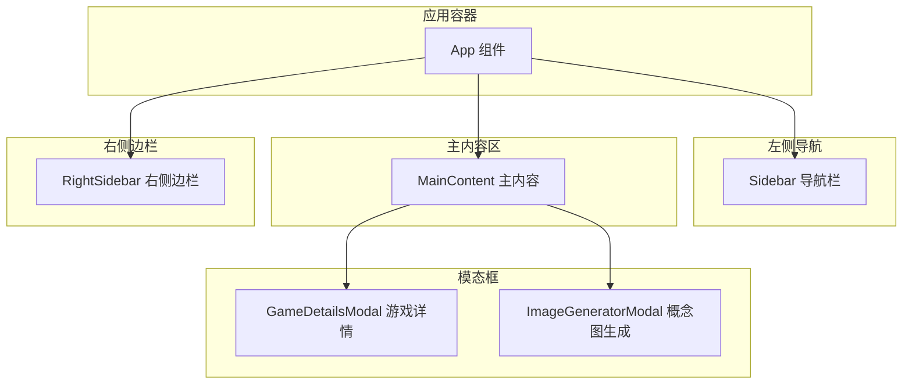
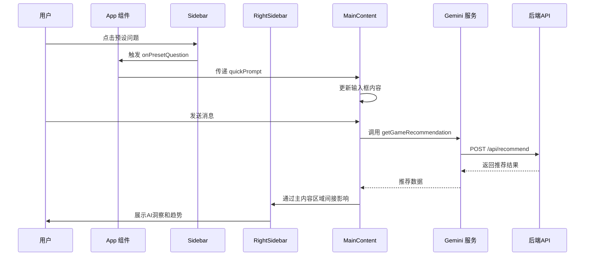
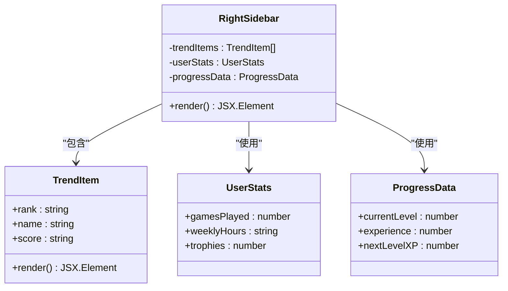
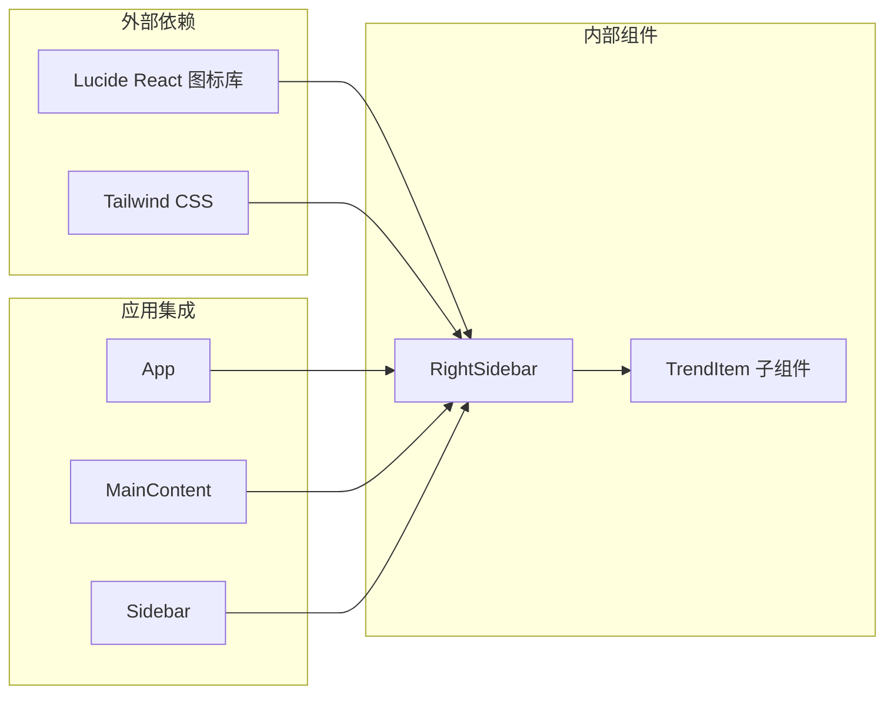

# 右侧边栏组件

<cite>
**本文档引用的文件**
- [RightSidebar.tsx](file://src/components/RightSidebar.tsx)
- [App.tsx](file://src/App.tsx)
- [MainContent.tsx](file://src/components/MainContent.tsx)
- [Sidebar.tsx](file://src/components/Sidebar.tsx)
- [GameDetailsModal.tsx](file://src/components/GameDetailsModal.tsx)
- [ImageGeneratorModal.tsx](file://src/components/ImageGeneratorModal.tsx)
- [layout.tsx](file://src/app/layout.tsx)
- [page.tsx](file://src/app/page.tsx)
- [index.css](file://src/index.css)
- [gemini.ts](file://src/services/gemini.ts)
- [route.ts](file://src/app/api/featured/route.ts)
</cite>

## 目录
1. [简介](#简介)
2. [项目结构](#项目结构)
3. [核心组件](#核心组件)
4. [架构概览](#架构概览)
5. [详细组件分析](#详细组件分析)
6. [依赖关系分析](#依赖关系分析)
7. [性能考虑](#性能考虑)
8. [故障排除指南](#故障排除指南)
9. [结论](#结论)
10. [附录](#附录)

## 简介

RightSidebar（右侧边栏）是 JoyMate 游戏推荐应用中的重要辅助组件，位于主界面右侧，提供用户个人资料展示、经验进度追踪、全网热度趋势和AI深度见解等功能。该组件采用现代化的设计语言，通过渐变色彩和圆角元素营造科技感，同时具备良好的响应式适配能力。

右侧边栏的主要功能定位包括：
- **用户个人中心**：展示用户头像、昵称和会员状态
- **进度追踪**：可视化显示经验值和等级进度
- **快捷操作**：提供游戏推荐、AI分析等快速入口
- **信息展示**：展示全网热度趋势和个性化AI洞察
- **辅助工具**：集成概念图生成功能

## 项目结构

JoyMate 应用采用模块化的组件架构，右侧边栏作为独立组件与主内容区域协同工作：

**图表来源**
- [App.tsx:12-24](file://src/App.tsx#L12-L24)
- [RightSidebar.tsx:3-74](file://src/components/RightSidebar.tsx#L3-L74)

**章节来源**
- [App.tsx:12-24](file://src/App.tsx#L12-L24)
- [layout.tsx:3-9](file://src/app/layout.tsx#L3-L9)
- [page.tsx:5-7](file://src/app/page.tsx#L5-L7)

## 核心组件

右侧边栏组件由多个功能模块组成，每个模块都有明确的职责分工：

### 用户信息模块
- **头像展示**：圆形渐变边框头像，支持自定义头像
- **用户标识**：用户名和会员状态显示
- **响应式布局**：在小屏幕设备上自动隐藏

### 经验进度模块
- **圆形进度条**：SVG绘制的环形进度指示器
- **等级显示**：当前等级和经验值
- **统计信息**：游戏数量、周游玩时长、奖杯数量
- **动态更新**：实时显示经验值变化

### 热度趋势模块
- **趋势列表**：全网热门游戏排行
- **排名系统**：数字排名和游戏名称
- **热度指标**：播放量或关注度统计
- **视觉设计**：简洁的列表布局

### AI洞察模块
- **个性化分析**：基于用户偏好的深度见解
- **风格偏好**：展示用户对特定游戏风格的偏好程度
- **推荐建议**：AI推荐的相关游戏
- **行动按钮**：获取完整报告的交互入口

**章节来源**
- [RightSidebar.tsx:5-74](file://src/components/RightSidebar.tsx#L5-L74)
- [RightSidebar.tsx:76-87](file://src/components/RightSidebar.tsx#L76-L87)

## 架构概览

右侧边栏与应用其他组件的协作关系体现了清晰的分层架构：

**图表来源**
- [App.tsx:18-20](file://src/App.tsx#L18-L20)
- [Sidebar.tsx:21-52](file://src/components/Sidebar.tsx#L21-L52)
- [MainContent.tsx:133-136](file://src/components/MainContent.tsx#L133-L136)
- [gemini.ts:1-14](file://src/services/gemini.ts#L1-L14)

### 数据流分析

右侧边栏的数据流主要通过以下路径实现：

1. **用户交互**：用户通过左侧导航触发预设问题
2. **状态传递**：App 组件维护全局状态并通过 props 传递给各组件
3. **内容渲染**：右侧边栏根据用户状态和应用数据进行条件渲染
4. **外部集成**：通过 API 路由获取实时数据

**章节来源**
- [App.tsx:13-14](file://src/App.tsx#L13-L14)
- [MainContent.tsx:133-136](file://src/components/MainContent.tsx#L133-L136)

## 详细组件分析

### 组件结构设计

右侧边栏采用 Flexbox 布局，通过 Tailwind CSS 实现响应式设计：

**图表来源**
- [RightSidebar.tsx:3-74](file://src/components/RightSidebar.tsx#L3-L74)
- [RightSidebar.tsx:76-87](file://src/components/RightSidebar.tsx#L76-L87)

### 布局结构分析

右侧边栏采用垂直分层布局，每个功能模块都有明确的边界：

1. **头部区域**：用户信息展示
2. **进度区域**：经验进度和统计数据
3. **趋势区域**：全网热度趋势
4. **洞察区域**：AI深度见解

### 交互设计模式

组件实现了多种交互模式：

- **条件渲染**：根据用户状态动态显示内容
- **响应式隐藏**：在小屏幕设备上自动隐藏
- **渐进式加载**：通过 SVG 动画展示进度
- **视觉反馈**：悬停效果和过渡动画

**章节来源**
- [RightSidebar.tsx:5](file://src/components/RightSidebar.tsx#L5)
- [RightSidebar.tsx:16](file://src/components/RightSidebar.tsx#L16)
- [RightSidebar.tsx:46](file://src/components/RightSidebar.tsx#L46)

### 代码示例展示

#### 组件渲染流程
组件渲染采用函数式组件模式，通过 props 接收数据并返回 JSX 元素。

#### 事件绑定机制
右侧边栏本身不直接处理用户交互事件，但通过与主内容区域的协作实现完整的交互体验。

#### 状态同步策略
组件通过外部状态管理实现数据同步，确保与应用整体状态保持一致。

**章节来源**
- [RightSidebar.tsx:3](file://src/components/RightSidebar.tsx#L3)
- [App.tsx:18-20](file://src/App.tsx#L18-L20)

## 依赖关系分析

右侧边栏组件的依赖关系相对简单，主要依赖于外部图标库和内部组件：

**图表来源**
- [RightSidebar.tsx:1](file://src/components/RightSidebar.tsx#L1)
- [App.tsx:7-10](file://src/App.tsx#L7-L10)

### 外部依赖分析

右侧边栏主要依赖以下外部库：
- **Lucide React**：提供精美的图标组件
- **Tailwind CSS**：提供实用的样式类名

### 内部依赖关系

组件间依赖关系清晰，右侧边栏包含一个专门的 TrendItem 子组件用于渲染趋势列表项。

**章节来源**
- [RightSidebar.tsx:1](file://src/components/RightSidebar.tsx#L1)
- [RightSidebar.tsx:76](file://src/components/RightSidebar.tsx#L76)

## 性能考虑

右侧边栏组件在性能方面表现出色，主要体现在：

### 渲染优化
- **纯函数组件**：避免不必要的状态管理开销
- **静态内容**：大部分内容为静态展示，减少重渲染
- **条件渲染**：在小屏幕设备上完全隐藏，避免无效渲染

### 样式优化
- **CSS-in-JS**：通过 Tailwind 类名实现高效的样式应用
- **硬件加速**：利用 CSS3 变换和过渡实现流畅动画
- **最小化重绘**：避免频繁的 DOM 操作

### 响应式设计
- **断点设置**：使用 `lg:` 断点确保在小屏幕设备上的良好表现
- **弹性布局**：Flexbox 布局适应不同屏幕尺寸
- **滚动优化**：独立的滚动容器避免影响主页面滚动

## 故障排除指南

### 常见问题及解决方案

#### 组件未显示
**症状**：右侧边栏在小屏幕设备上完全不可见
**原因**：响应式断点设置导致在小屏幕设备上隐藏
**解决方法**：调整 Tailwind CSS 的断点配置或修改组件的响应式类名

#### 图标显示异常
**症状**：Lucide 图标不显示或显示错误
**原因**：图标库未正确安装或导入
**解决方法**：检查依赖安装和正确的导入语句

#### 样式冲突
**症状**：组件样式与主题不匹配
**原因**：CSS 类名冲突或样式优先级问题
**解决方法**：检查 Tailwind CSS 配置和样式覆盖规则

**章节来源**
- [RightSidebar.tsx:5](file://src/components/RightSidebar.tsx#L5)
- [index.css:1-44](file://src/index.css#L1-L44)

## 结论

RightSidebar 右侧边栏组件是一个设计精良的辅助工具组件，它有效地整合了用户信息展示、进度追踪、趋势分析和AI洞察等功能。组件采用现代化的设计语言和响应式布局，提供了良好的用户体验。

组件的主要优势包括：
- **功能完整性**：涵盖了用户常用的辅助功能
- **设计一致性**：与应用整体设计风格保持一致
- **性能优化**：通过合理的架构设计确保良好的性能表现
- **可扩展性**：清晰的组件结构便于功能扩展和定制

对于初学者来说，右侧边栏提供了直观的使用体验；对于高级开发者而言，组件的架构设计为功能扩展和定制化开发提供了良好的基础。

## 附录

### 组件集成指南

#### 基本集成步骤
1. 在 App 组件中引入 RightSidebar 组件
2. 将组件添加到应用布局中
3. 确保适当的响应式断点设置
4. 测试不同屏幕尺寸下的显示效果

#### 自定义开发建议
1. **主题定制**：通过 Tailwind CSS 类名定制颜色和样式
2. **功能扩展**：添加新的功能模块如通知中心、快捷链接等
3. **数据集成**：连接后端 API 获取实时数据
4. **动画优化**：添加更多的过渡动画提升用户体验

### 功能扩展方案

#### 新增功能模块
- **通知中心**：集成系统通知和用户消息
- **快捷操作**：添加常用功能的快捷入口
- **个性化设置**：允许用户自定义显示内容
- **数据分析**：集成更多用户行为分析数据

#### 技术改进方向
- **状态管理**：集成更复杂的状态管理方案
- **缓存机制**：实现数据缓存提高加载速度
- **国际化**：支持多语言显示
- **无障碍访问**：增强无障碍功能支持