# 核心组件

<cite>
**本文档引用的文件**
- [MainContent.tsx](file://src/components/MainContent.tsx)
- [Sidebar.tsx](file://src/components/Sidebar.tsx)
- [GameDetailsModal.tsx](file://src/components/GameDetailsModal.tsx)
- [ImageGeneratorModal.tsx](file://src/components/ImageGeneratorModal.tsx)
- [RightSidebar.tsx](file://src/components/RightSidebar.tsx)
- [App.tsx](file://src/App.tsx)
- [gemini.ts](file://src/services/gemini.ts)
- [gameI18n.ts](file://src/lib/gameI18n.ts)
- [rawg.ts](file://src/lib/rawg.ts)
- [page.tsx](file://src/app/page.tsx)
- [route.ts](file://src/app/api/recommend/route.ts)
- [route.ts](file://src/app/api/featured/route.ts)
- [route.ts](file://src/app/api/generate-art/route.ts)
</cite>

## 目录
1. [简介](#简介)
2. [项目结构](#项目结构)
3. [核心组件](#核心组件)
4. [架构概览](#架构概览)
5. [详细组件分析](#详细组件分析)
6. [依赖关系分析](#依赖关系分析)
7. [性能考虑](#性能考虑)
8. [故障排除指南](#故障排除指南)
9. [结论](#结论)

## 简介

JoyMate是一个基于AI驱动的游戏推荐系统，提供了沉浸式的聊天界面和丰富的游戏发现功能。本项目的核心UI组件包括MainContent聊天界面、Sidebar导航系统、GameDetailsModal详情模态框和ImageGeneratorModal图像生成模态框。这些组件通过精心设计的状态管理和组件间通信机制，为用户提供流畅的游戏推荐体验。

## 项目结构

项目采用模块化的组件架构，主要文件组织如下：

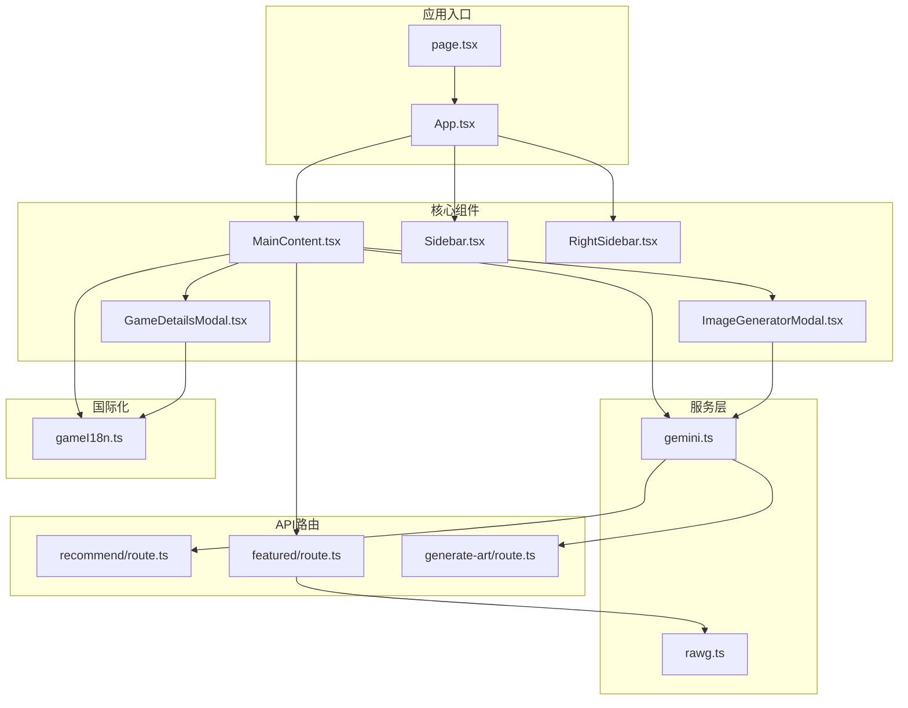

**图表来源**
- [page.tsx:1-9](file://src/app/page.tsx#L1-L9)
- [App.tsx:12-24](file://src/App.tsx#L12-L24)
- [MainContent.tsx:1-721](file://src/components/MainContent.tsx#L1-L721)

**章节来源**
- [page.tsx:1-9](file://src/app/page.tsx#L1-L9)
- [App.tsx:12-24](file://src/App.tsx#L12-L24)

## 核心组件

### 组件间通信机制

JoyMate采用自顶向下的props传递和回调函数模式实现组件间通信：

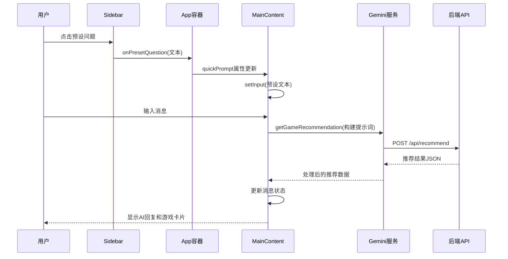

**图表来源**
- [Sidebar.tsx:3-53](file://src/components/Sidebar.tsx#L3-L53)
- [App.tsx:18-19](file://src/App.tsx#L18-L19)
- [MainContent.tsx:165-223](file://src/components/MainContent.tsx#L165-L223)
- [gemini.ts:1-14](file://src/services/gemini.ts#L1-L14)

### 状态管理模式

组件采用React Hooks实现状态管理，包括：

- **局部状态**：组件内部使用的临时状态
- **全局状态**：通过App组件管理的跨组件共享状态
- **持久化状态**：使用sessionStorage存储会话记忆

**章节来源**
- [MainContent.tsx:84-98](file://src/components/MainContent.tsx#L84-L98)
- [App.tsx:13-14](file://src/App.tsx#L13-L14)

## 架构概览

JoyMate采用前后端分离的架构设计，前端负责UI渲染和用户交互，后端提供AI推理和数据增强服务：

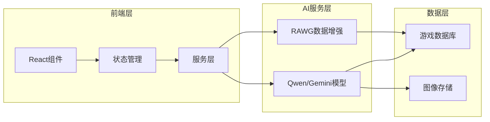

**图表来源**
- [MainContent.tsx:3-7](file://src/components/MainContent.tsx#L3-L7)
- [gemini.ts:1-31](file://src/services/gemini.ts#L1-L31)
- [rawg.ts:1-434](file://src/lib/rawg.ts#L1-L434)

## 详细组件分析

### MainContent组件分析

MainContent是整个应用的核心聊天界面，实现了复杂的AI对话逻辑和会话记忆管理。

#### 核心功能架构

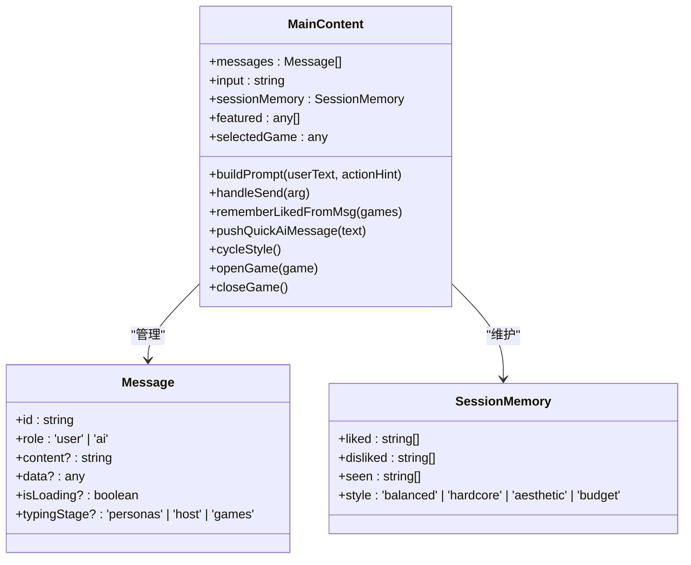

**图表来源**
- [MainContent.tsx:54-68](file://src/components/MainContent.tsx#L54-L68)
- [MainContent.tsx:70-283](file://src/components/MainContent.tsx#L70-L283)

#### 聊天界面实现

MainContent实现了多层次的消息显示系统：

1. **意图识别阶段**：提取用户输入中的游戏名称、情感和场景
2. **专家意见阶段**：三个AI专家从不同角度分析推荐
3. **主持人总结阶段**：AI助手综合所有观点给出最终建议
4. **游戏推荐阶段**：展示具体的游戏卡片和相关信息

#### 会话记忆管理系统

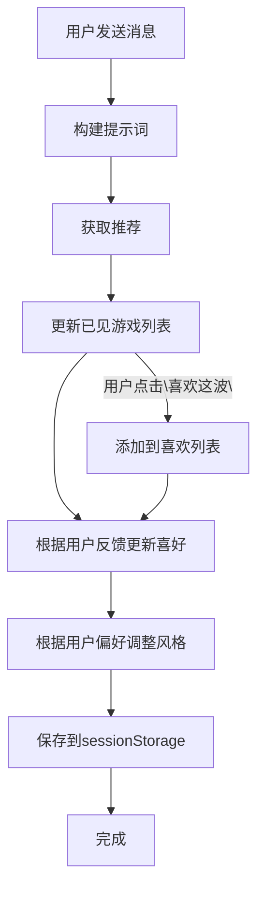

**图表来源**
- [MainContent.tsx:138-163](file://src/components/MainContent.tsx#L138-L163)
- [MainContent.tsx:191-223](file://src/components/MainContent.tsx#L191-L223)
- [MainContent.tsx:225-235](file://src/components/MainContent.tsx#L225-L235)

#### 用户交互处理

MainContent提供了丰富的用户交互功能：

- **快捷按钮**：快速重新推荐、切换推荐风格
- **游戏卡片**：点击查看详情，支持批量操作
- **输入处理**：支持回车发送、热词推荐
- **滚动控制**：自动滚动到最新消息

**章节来源**
- [MainContent.tsx:165-283](file://src/components/MainContent.tsx#L165-L283)
- [MainContent.tsx:550-592](file://src/components/MainContent.tsx#L550-L592)

### Sidebar组件分析

Sidebar实现了预设问题系统和导航功能，为用户提供快速访问入口。

#### 导航系统设计

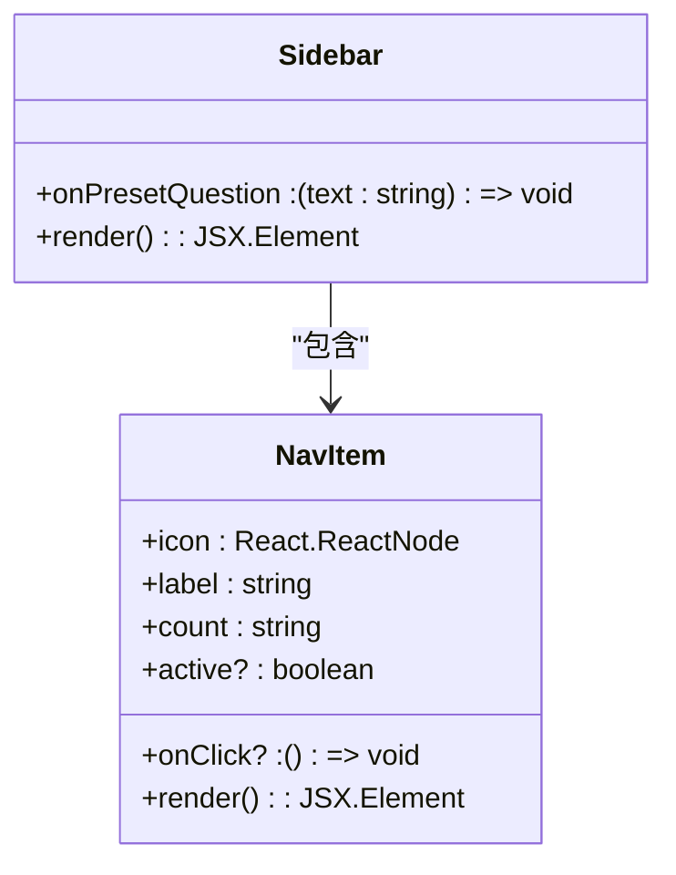

**图表来源**
- [Sidebar.tsx:3-83](file://src/components/Sidebar.tsx#L3-L83)

#### 预设问题系统

Sidebar包含6个精心设计的预设问题类别：

| 类别 | 图标 | 描述 | 示例查询 |
|------|------|------|----------|
| 按心情推荐 | Gamepad2 | 放松、治愈、解压 | "我现在需要一款能让我放松的游戏..." |
| 耐玩神作 | Puzzle | 深度、可重复游玩 | "系统深、可反复玩很久的游戏..." |
| 手感爽快 | Swords | 打击感强、节奏紧凑 | "手感爽快、打击感强的动作游戏..." |
| 好友开黑 | Users | 合作/联机游戏 | "2-4人一起玩的合作游戏..." |
| 剧情沉浸 | Glasses | 叙事向、氛围强 | "剧情沉浸、氛围强的游戏..." |
| 轻松解压 | Car | 不需要动脑的游戏 | "轻松解压，随时开玩的游戏..." |

**章节来源**
- [Sidebar.tsx:14-53](file://src/components/Sidebar.tsx#L14-L53)

### GameDetailsModal组件分析

GameDetailsModal提供了游戏详情的模态框展示，支持多种游戏信息的可视化呈现。

#### 数据模型设计

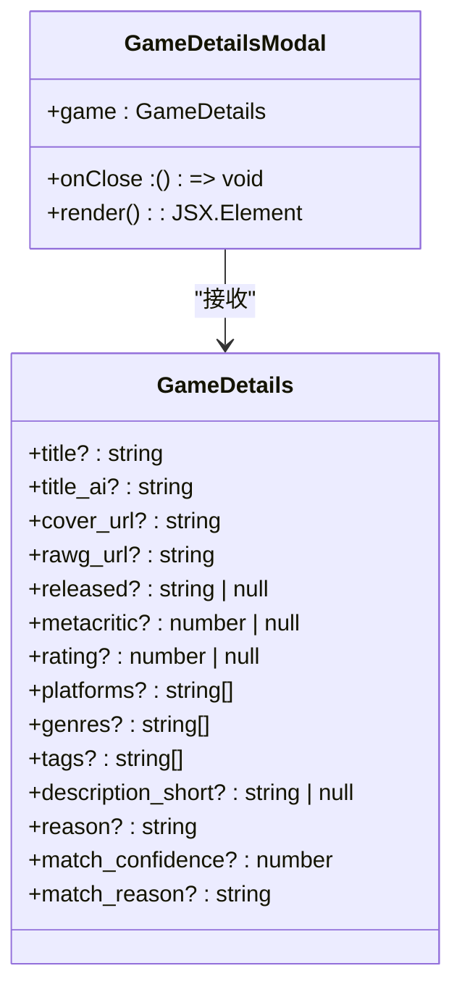

**图表来源**
- [GameDetailsModal.tsx:5-27](file://src/components/GameDetailsModal.tsx#L5-L27)

#### 信息展示策略

GameDetailsModal采用了智能的信息展示策略：

1. **简介生成**：根据语言环境选择合适的简介格式
2. **标签系统**：支持平台、类型、标签的分类展示
3. **评分系统**：支持Metacritic和用户评分的双模式显示
4. **链接集成**：提供RAWG平台的外部链接

**章节来源**
- [GameDetailsModal.tsx:22-166](file://src/components/GameDetailsModal.tsx#L22-L166)

### ImageGeneratorModal组件分析

ImageGeneratorModal实现了概念图生成功能，集成了Google Gemini AI的能力。

#### 图像生成流程

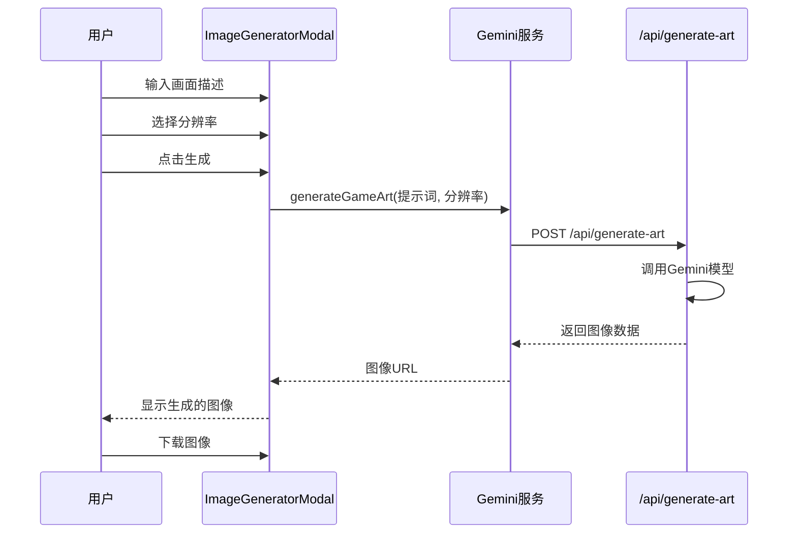

**图表来源**
- [ImageGeneratorModal.tsx:12-25](file://src/components/ImageGeneratorModal.tsx#L12-L25)
- [gemini.ts:16-31](file://src/services/gemini.ts#L16-L31)

#### 功能特性

ImageGeneratorModal提供了以下功能：

- **多分辨率支持**：1K、2K、4K三种分辨率选项
- **错误处理**：友好的配额不足提示
- **下载功能**：支持直接下载生成的图像
- **加载状态**：生成过程的可视化反馈

**章节来源**
- [ImageGeneratorModal.tsx:5-108](file://src/components/ImageGeneratorModal.tsx#L5-L108)

## 依赖关系分析

### 组件依赖图

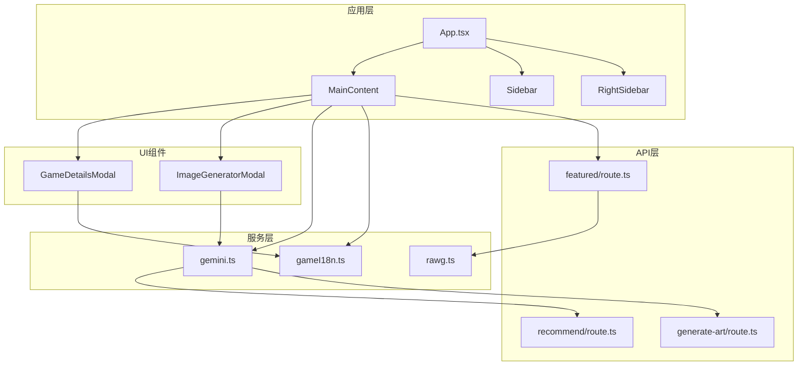

**图表来源**
- [App.tsx:6-10](file://src/App.tsx#L6-L10)
- [MainContent.tsx:3-7](file://src/components/MainContent.tsx#L3-L7)
- [gemini.ts:1-31](file://src/services/gemini.ts#L1-L31)

### 数据流分析

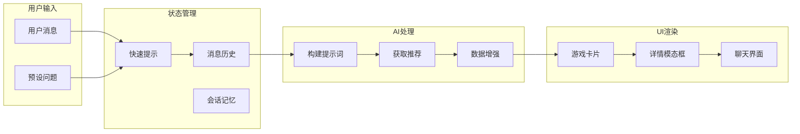

**图表来源**
- [MainContent.tsx:138-223](file://src/components/MainContent.tsx#L138-L223)
- [App.tsx:13-14](file://src/App.tsx#L13-L14)

**章节来源**
- [MainContent.tsx:109-131](file://src/components/MainContent.tsx#L109-L131)
- [Sidebar.tsx:3](file://src/components/Sidebar.tsx#L3)

## 性能考虑

### 优化策略

1. **状态缓存**：使用sessionStorage持久化会话记忆
2. **懒加载**：按需加载特色游戏数据
3. **防抖处理**：输入框的防抖机制减少不必要的请求
4. **并发控制**：RAWG数据增强的并发限制
5. **内存管理**：及时清理定时器和取消网络请求

### 性能监控

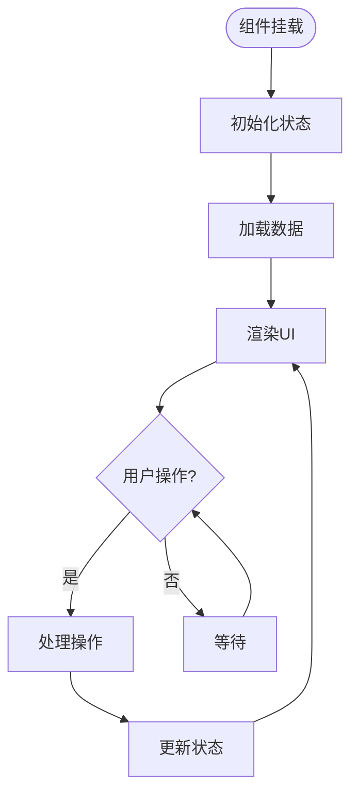

**图表来源**
- [MainContent.tsx:109-124](file://src/components/MainContent.tsx#L109-L124)
- [MainContent.tsx:126-131](file://src/components/MainContent.tsx#L126-L131)

## 故障排除指南

### 常见问题及解决方案

#### AI推荐失败

**症状**：AI回复显示"分析引擎遇到问题"
**原因**：上游API服务异常或网络问题
**解决**：检查API密钥配置和网络连接

#### 图像生成失败

**症状**：图像生成界面显示配额不足提示
**原因**：Gemini API配额耗尽
**解决**：等待配额恢复或检查API密钥

#### 游戏数据缺失

**症状**：游戏卡片显示备用信息
**原因**：RAWG API不可用或数据匹配失败
**解决**：检查RAWG配置和网络连接

**章节来源**
- [MainContent.tsx:213-222](file://src/components/MainContent.tsx#L213-L222)
- [route.ts:134-154](file://src/app/api/recommend/route.ts#L134-L154)

## 结论

JoyMate的核心UI组件展现了现代React应用的最佳实践，通过精心设计的组件架构、状态管理和组件间通信机制，为用户提供了流畅的游戏推荐体验。各个组件职责明确、耦合度低，既便于维护又易于扩展。

对于初学者，建议从MainContent组件开始理解整体架构，重点关注状态管理和异步数据处理。对于高级开发者，可以在此基础上扩展更多AI专家角色、优化数据缓存策略或增加更多的个性化推荐算法。