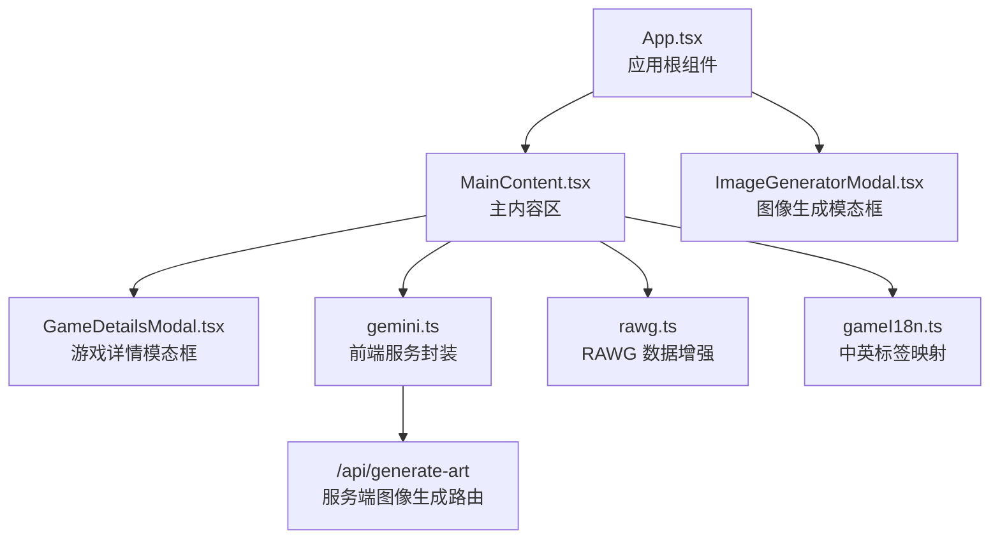
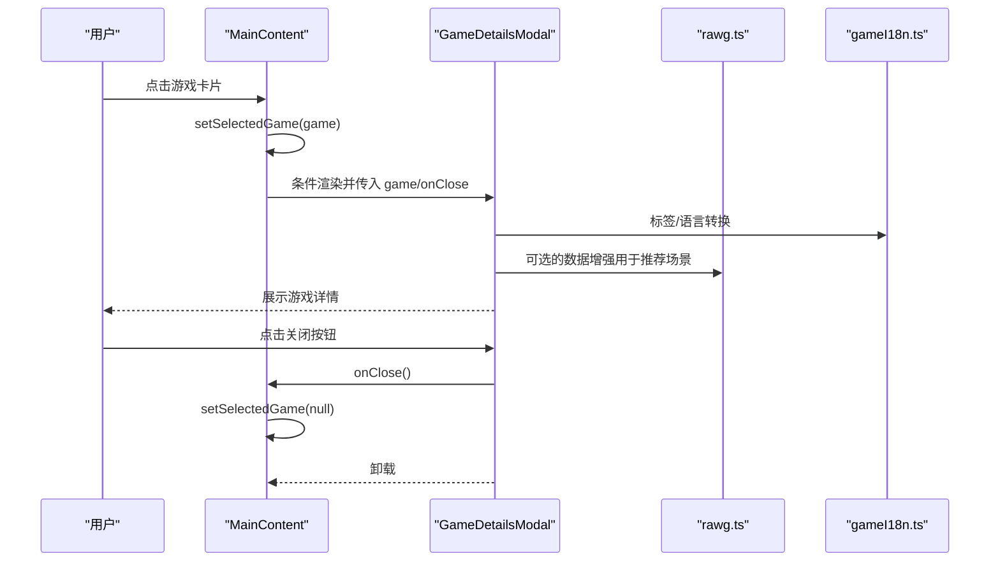
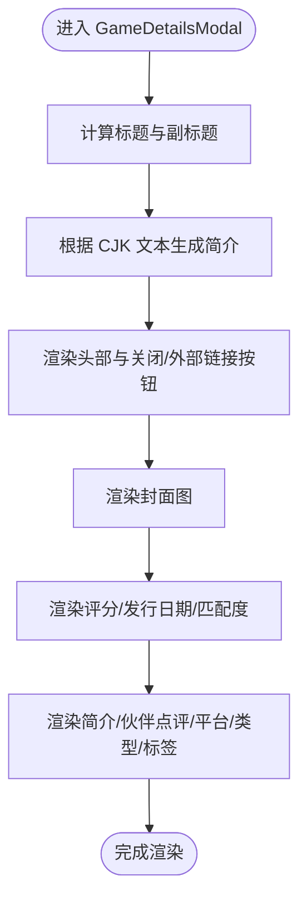
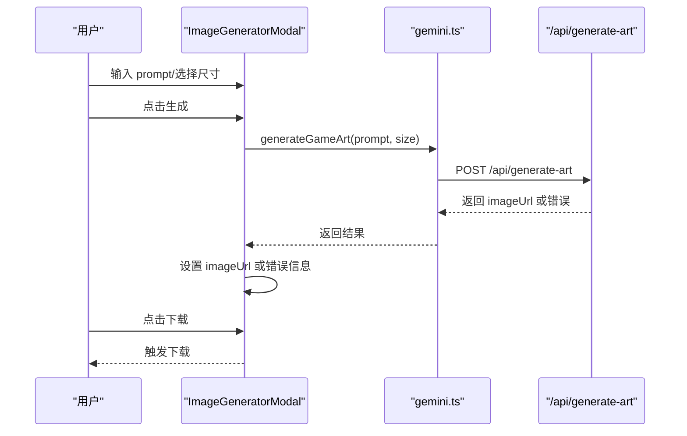
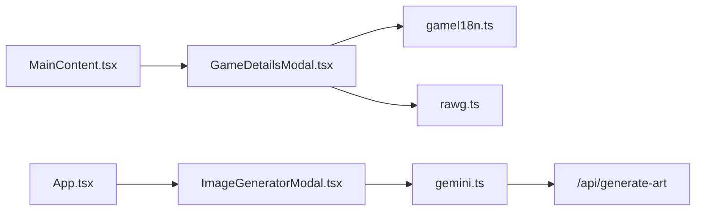

# 模态框组件

<cite>
**本文引用的文件列表**
- [GameDetailsModal.tsx](file://src/components/GameDetailsModal.tsx)
- [ImageGeneratorModal.tsx](file://src/components/ImageGeneratorModal.tsx)
- [App.tsx](file://src/App.tsx)
- [MainContent.tsx](file://src/components/MainContent.tsx)
- [gemini.ts](file://src/services/gemini.ts)
- [rawg.ts](file://src/lib/rawg.ts)
- [gameI18n.ts](file://src/lib/gameI18n.ts)
- [route.ts](file://src/app/api/generate-art/route.ts)
- [route.ts](file://src/app/api/recommend/route.ts)
- [layout.tsx](file://src/app/layout.tsx)
</cite>

## 目录
1. [引言](#引言)
2. [项目结构](#项目结构)
3. [核心组件](#核心组件)
4. [架构总览](#架构总览)
5. [详细组件分析](#详细组件分析)
6. [依赖关系分析](#依赖关系分析)
7. [性能考量](#性能考量)
8. [故障排查指南](#故障排查指南)
9. [结论](#结论)
10. [附录](#附录)

## 引言
本文件面向“模态框组件”系列，重点解析以下两个组件：
- GameDetailsModal：游戏详情模态框，负责展示游戏封面、评分、平台、类型、标签、简介与伙伴点评等信息，并提供打开外部链接的能力。
- ImageGeneratorModal：图像生成模态框，负责接收用户输入的概念描述与分辨率选项，调用服务端图像生成接口，展示生成结果并支持下载。

同时，文档将阐述模态框的通用设计模式、状态管理与事件处理机制，覆盖触发、内容渲染与关闭流程；解释动画、遮罩层与键盘事件支持；给出样式定制、主题适配与无障碍优化建议，并提供从入门到进阶的实践指导。

## 项目结构
模态框组件位于 src/components 下，分别由 GameDetailsModal 与 ImageGeneratorModal 实现；应用入口 App 负责控制 ImageGeneratorModal 的开关；主内容区域 MainContent 负责触发 GameDetailsModal 并传递游戏数据。

图表来源
- [App.tsx:12-24](file://src/App.tsx#L12-L24)
- [MainContent.tsx:6, 70, 686:6-70](file://src/components/MainContent.tsx#L6-L70)
- [ImageGeneratorModal.tsx:5, 28:5-28](file://src/components/ImageGeneratorModal.tsx#L5-L28)
- [GameDetailsModal.tsx:22, 42:22-42](file://src/components/GameDetailsModal.tsx#L22-L42)
- [gemini.ts:16-31](file://src/services/gemini.ts#L16-L31)
- [route.ts:6-59](file://src/app/api/generate-art/route.ts#L6-L59)
- [rawg.ts:252-342](file://src/lib/rawg.ts#L252-L342)
- [gameI18n.ts:70-88](file://src/lib/gameI18n.ts#L70-L88)

章节来源
- [App.tsx:12-24](file://src/App.tsx#L12-L24)
- [MainContent.tsx:6, 70, 686:6-70](file://src/components/MainContent.tsx#L6-L70)

## 核心组件
- GameDetailsModal：接收游戏对象与关闭回调，渲染标题、副标题、封面、评分、发行日期、平台/类型/标签、简介与伙伴点评等信息，并提供跳转至外部平台的入口。
- ImageGeneratorModal：维护 prompt、尺寸、生成状态、错误信息与结果 URL，提供生成按钮、尺寸选择、结果展示与下载功能。

章节来源
- [GameDetailsModal.tsx:22-166](file://src/components/GameDetailsModal.tsx#L22-L166)
- [ImageGeneratorModal.tsx:5-108](file://src/components/ImageGeneratorModal.tsx#L5-L108)

## 架构总览
模态框的触发与状态管理遵循“父组件持有状态，子组件通过 props 接收数据与回调”的模式。GameDetailsModal 在 MainContent 中被条件渲染；ImageGeneratorModal 在 App 中被条件渲染。两者均采用固定定位与背景模糊遮罩层，确保模态框层级高于页面内容。

图表来源
- [MainContent.tsx:277-283, 686:277-283](file://src/components/MainContent.tsx#L277-L283)
- [GameDetailsModal.tsx:22-166](file://src/components/GameDetailsModal.tsx#L22-L166)
- [rawg.ts:252-342](file://src/lib/rawg.ts#L252-L342)
- [gameI18n.ts:70-88](file://src/lib/gameI18n.ts#L70-L88)

## 详细组件分析

### GameDetailsModal 组件分析
- 设计要点
  - 使用固定定位与背景模糊遮罩层，z-index 较高，保证模态框层级。
  - 头部包含标题、副标题与关闭按钮；若存在外部链接则提供打开入口。
  - 左侧展示封面图，右侧分为“一句话简介”“伙伴点评”“平台/类型/标签”等区块。
  - 支持评分、Metacritic 分数、发行日期与匹配置信度等元信息展示。
- 数据处理
  - 标题优先使用 title，若存在 title_ai 则作为副标题。
  - 简介根据文本是否主要为 CJK 文本决定直接使用或拼接字段生成。
  - 平台/类型/标签通过国际化映射函数转换为中文标签。
- 交互与事件
  - 关闭按钮调用父组件传入的 onClose 回调。
  - 外部链接按钮在新窗口打开，遵守 noreferrer 安全策略。
- 可访问性
  - 图片提供 alt 文本；按钮具备 hover/焦点状态反馈。
- 动画与布局
  - 使用 Tailwind 响应式网格布局，移动端与桌面端自适应。
  - 滚动条自定义样式，避免滚动穿透。

图表来源
- [GameDetailsModal.tsx:22-166](file://src/components/GameDetailsModal.tsx#L22-L166)
- [gameI18n.ts:70-88](file://src/lib/gameI18n.ts#L70-L88)

章节来源
- [GameDetailsModal.tsx:22-166](file://src/components/GameDetailsModal.tsx#L22-L166)
- [gameI18n.ts:70-88](file://src/lib/gameI18n.ts#L70-L88)

### ImageGeneratorModal 组件分析
- 设计要点
  - 提供 prompt 输入框与分辨率选择（1K/2K/4K）。
  - 生成按钮在加载时显示旋转图标与禁用状态。
  - 结果区域支持展示生成图片与下载按钮。
  - 错误信息以提示框形式展示。
- 状态管理
  - 通过 useState 维护 prompt、尺寸、生成状态、结果 URL 与错误信息。
  - handleGenerate 调用 generateGameArt 并捕获异常。
- 事件处理
  - 文本域变更更新 prompt。
  - 尺寸按钮切换当前尺寸。
  - 生成按钮触发异步生成流程。
  - 下载按钮触发浏览器下载。
- 与后端集成
  - generateGameArt 通过 fetch 调用 /api/generate-art。
  - 服务端路由使用 Gemini 生成图像，返回 data URI 或配额不足友好提示。

图表来源
- [ImageGeneratorModal.tsx:5-108](file://src/components/ImageGeneratorModal.tsx#L5-L108)
- [gemini.ts:16-31](file://src/services/gemini.ts#L16-L31)
- [route.ts:6-59](file://src/app/api/generate-art/route.ts#L6-L59)

章节来源
- [ImageGeneratorModal.tsx:5-108](file://src/components/ImageGeneratorModal.tsx#L5-L108)
- [gemini.ts:16-31](file://src/services/gemini.ts#L16-L31)
- [route.ts:6-59](file://src/app/api/generate-art/route.ts#L6-L59)

### 通用设计模式与状态管理
- 状态提升：App 控制 ImageGeneratorModal 的开关；MainContent 控制 GameDetailsModal 的开关。
- 受控组件：模态框内部表单字段通过 useState 管理，onChange 同步更新。
- 生命周期：模态框在父组件状态变化时挂载/卸载，避免内存泄漏。
- 事件冒泡：模态框内点击关闭按钮触发 onClose，父组件清理状态。

章节来源
- [App.tsx:13-21](file://src/App.tsx#L13-L21)
- [MainContent.tsx:277-283, 686:277-283](file://src/components/MainContent.tsx#L277-L283)

### 事件处理与键盘支持
- Enter 键发送消息：MainContent 的输入框监听键盘事件，回车键触发发送。
- 关闭按钮：模态框头部提供关闭按钮，点击触发 onClose。
- 焦点管理：模态框打开后自动聚焦到输入框或首个可交互元素（可在实际实现中补充）。

章节来源
- [MainContent.tsx:609-612](file://src/components/MainContent.tsx#L609-L612)
- [GameDetailsModal.tsx:61-63](file://src/components/GameDetailsModal.tsx#L61-L63)
- [ImageGeneratorModal.tsx:35-37](file://src/components/ImageGeneratorModal.tsx#L35-L37)

### 动画效果与遮罩层
- 遮罩层：模态框使用固定定位与背景模糊，z-index 较高，确保覆盖页面内容。
- 进入/退出：MainContent 使用动画库进行消息块的进入/退出过渡，模态框本身未引入额外动画。
- 建议：如需模态框入场动画，可在父组件状态切换时配合动画库实现淡入/缩放。

章节来源
- [GameDetailsModal.tsx:42-43](file://src/components/GameDetailsModal.tsx#L42-L43)
- [ImageGeneratorModal.tsx:28-29](file://src/components/ImageGeneratorModal.tsx#L28-L29)

### 样式定制、主题适配与无障碍优化
- 样式定制
  - 使用 Tailwind 类名统一风格，可通过变量或主题文件替换颜色与边框。
  - 自定义滚动条：通过自定义类名实现滚动条样式。
- 主题适配
  - 深色主题：组件已内置深色背景与浅色文字，适配暗色界面。
  - 可扩展：为不同主题提供变量映射，便于切换。
- 无障碍优化
  - 图片 alt 文本：封面图提供标题作为 alt。
  - 键盘导航：模态框内按钮具备可聚焦状态。
  - 屏幕阅读器：可为模态框添加 aria-labelledby/aria-describedby 提升可读性。

章节来源
- [GameDetailsModal.tsx:71-76, 104-105:71-76](file://src/components/GameDetailsModal.tsx#L71-L76)
- [ImageGeneratorModal.tsx:44-49, 87-94:44-49](file://src/components/ImageGeneratorModal.tsx#L44-L49)

## 依赖关系分析
- GameDetailsModal
  - 依赖 gameI18n.ts 进行标签/平台/类型名称的中文映射。
  - 可选依赖 rawg.ts 用于推荐场景下的数据增强。
- ImageGeneratorModal
  - 依赖 gemini.ts 的 generateGameArt 封装。
  - 依赖 /api/generate-art 路由进行图像生成。
- App 与 MainContent
  - App 控制 ImageGeneratorModal 开关。
  - MainContent 控制 GameDetailsModal 开关，并提供触发入口（按钮）。

图表来源
- [GameDetailsModal.tsx:22-166](file://src/components/GameDetailsModal.tsx#L22-L166)
- [ImageGeneratorModal.tsx:5-108](file://src/components/ImageGeneratorModal.tsx#L5-L108)
- [gemini.ts:16-31](file://src/services/gemini.ts#L16-L31)
- [route.ts:6-59](file://src/app/api/generate-art/route.ts#L6-L59)
- [App.tsx:13-21](file://src/App.tsx#L13-L21)
- [MainContent.tsx:686](file://src/components/MainContent.tsx#L686)

章节来源
- [GameDetailsModal.tsx:22-166](file://src/components/GameDetailsModal.tsx#L22-L166)
- [ImageGeneratorModal.tsx:5-108](file://src/components/ImageGeneratorModal.tsx#L5-L108)
- [gemini.ts:16-31](file://src/services/gemini.ts#L16-L31)
- [route.ts:6-59](file://src/app/api/generate-art/route.ts#L6-L59)
- [App.tsx:13-21](file://src/App.tsx#L13-L21)
- [MainContent.tsx:686](file://src/components/MainContent.tsx#L686)

## 性能考量
- 模态框渲染成本低：仅在状态为真时挂载，卸载时释放资源。
- 图像生成延迟：ImageGeneratorModal 在生成过程中禁用按钮并显示加载指示，避免重复请求。
- 数据缓存：rawg.ts 对搜索与详情结果设置 TTL 缓存，减少重复请求。
- 建议
  - 对频繁切换的模态框可考虑使用 React.lazy 与 Suspense 延迟加载。
  - 图像生成接口可增加节流/防抖，避免用户连续点击导致的并发请求。

章节来源
- [rawg.ts:14-26, 172-210:14-26](file://src/lib/rawg.ts#L14-L26)
- [ImageGeneratorModal.tsx:12-25](file://src/components/ImageGeneratorModal.tsx#L12-L25)

## 故障排查指南
- 图像生成失败
  - 现象：生成按钮显示错误提示或为空结果。
  - 排查：检查 GEMINI_API_KEY 是否配置；查看服务端路由对配额不足的友好提示逻辑。
- 生成配额不足
  - 现象：服务端返回配额不足提示。
  - 处理：提示用户稍后再试或记录想法，等待配额恢复。
- RAWG 数据增强失败
  - 现象：推荐卡片缺少真实数据或使用备用信息。
  - 排查：检查 RAWG_API_KEY 与 RAWG_ENRICHMENT 配置；确认网络与超时设置。

章节来源
- [route.ts:12-15, 43-54:12-15](file://src/app/api/generate-art/route.ts#L12-L15)
- [route.ts:135-150](file://src/app/api/recommend/route.ts#L135-L150)
- [rawg.ts:172-210](file://src/lib/rawg.ts#L172-L210)

## 结论
本模态框组件系列以简洁的状态管理模式与清晰的职责划分实现了良好的用户体验。GameDetailsModal 注重信息密度与可读性，ImageGeneratorModal 则强调易用性与反馈及时性。通过合理的依赖注入与服务端集成，模态框在功能与性能之间取得平衡。建议后续可引入统一的动画与无障碍增强，进一步提升可访问性与一致性。

## 附录

### 基本使用指南（初学者）
- 打开图像生成模态框
  - 在 App 中设置 isImageModalOpen 为 true，渲染 ImageGeneratorModal。
  - 示例路径参考：[App.tsx:13-21](file://src/App.tsx#L13-L21)
- 关闭图像生成模态框
  - 在 ImageGeneratorModal 的关闭按钮回调中将 isImageModalOpen 设为 false。
  - 示例路径参考：[ImageGeneratorModal.tsx:35-37](file://src/components/ImageGeneratorModal.tsx#L35-L37)
- 打开游戏详情模态框
  - 在 MainContent 中点击游戏卡片后设置 selectedGame，并渲染 GameDetailsModal。
  - 示例路径参考：[MainContent.tsx:277-283, 686:277-283](file://src/components/MainContent.tsx#L277-L283)
- 关闭游戏详情模态框
  - 在 GameDetailsModal 的关闭按钮回调中清空 selectedGame。
  - 示例路径参考：[GameDetailsModal.tsx:61-63](file://src/components/GameDetailsModal.tsx#L61-L63)

### 扩展与自定义开发建议（高级开发者）
- 统一模态框容器
  - 抽象出通用的 Modal 容器组件，统一处理遮罩层、键盘事件与动画。
- 动画与过渡
  - 为模态框增加入场/出场动画，结合父组件状态切换实现平滑过渡。
- 无障碍增强
  - 为模态框添加 aria-modal、aria-labelledby、aria-describedby，确保屏幕阅读器正确识别。
- 主题系统
  - 将颜色与边框抽象为主题变量，支持动态切换明/暗主题。
- 错误边界
  - 在模态框内部包裹错误边界，捕获子组件异常并优雅降级。