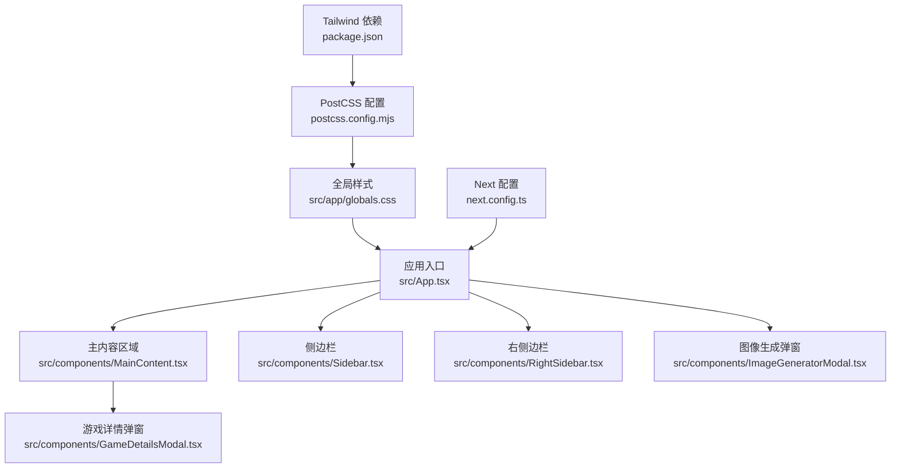
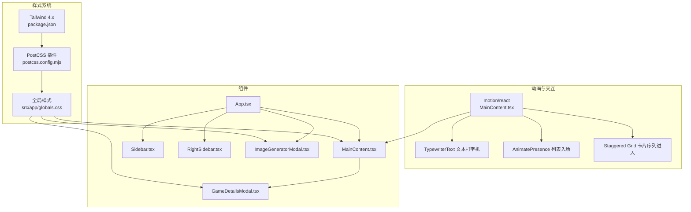
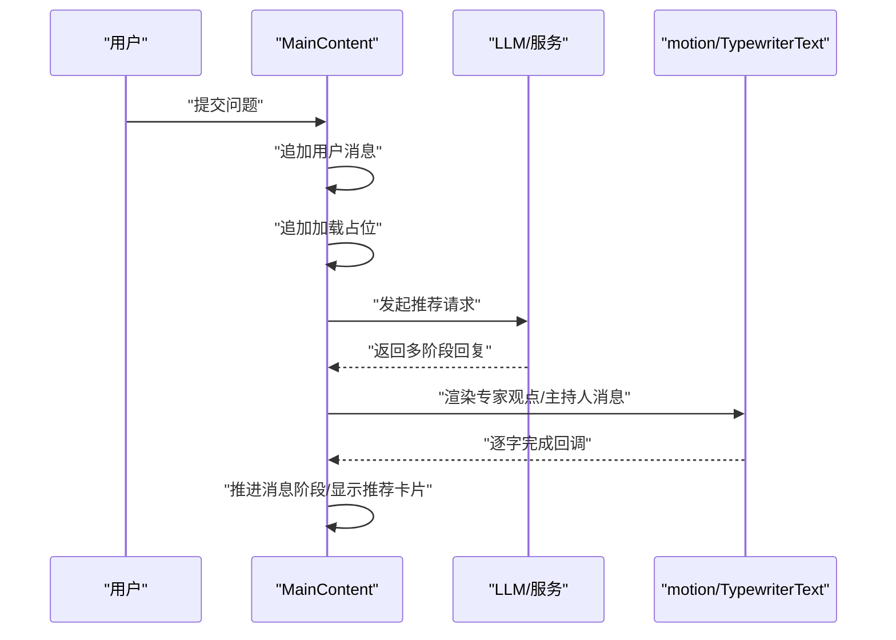
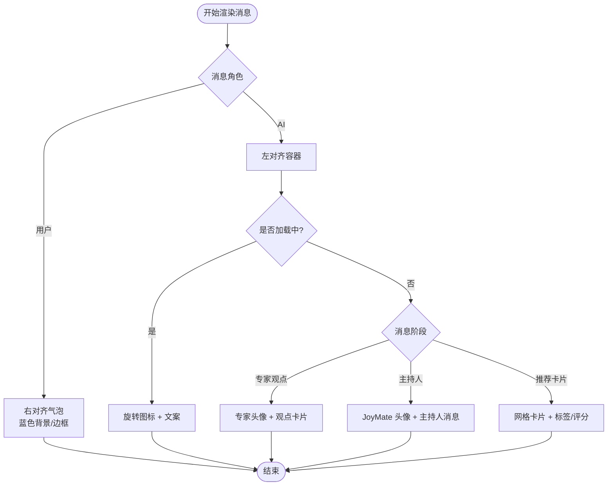
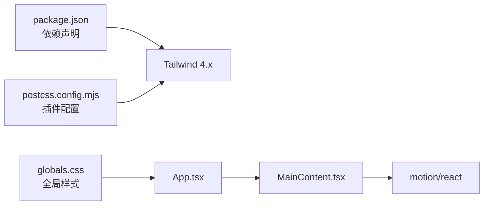

# 界面设计与用户体验

<cite>
**本文引用的文件**
- [src/app/globals.css](file://src/app/globals.css)
- [src/index.css](file://src/index.css)
- [package.json](file://package.json)
- [postcss.config.mjs](file://postcss.config.mjs)
- [next.config.ts](file://next.config.ts)
- [src/App.tsx](file://src/App.tsx)
- [src/components/MainContent.tsx](file://src/components/MainContent.tsx)
- [src/components/Sidebar.tsx](file://src/components/Sidebar.tsx)
- [src/components/RightSidebar.tsx](file://src/components/RightSidebar.tsx)
- [src/components/GameDetailsModal.tsx](file://src/components/GameDetailsModal.tsx)
- [src/components/ImageGeneratorModal.tsx](file://src/components/ImageGeneratorModal.tsx)
- [DESIGN_DOC.md](file://DESIGN_DOC.md)
- [README.md](file://README.md)
</cite>

## 目录
1. [引言](#引言)
2. [项目结构](#项目结构)
3. [核心组件](#核心组件)
4. [架构总览](#架构总览)
5. [详细组件分析](#详细组件分析)
6. [依赖关系分析](#依赖关系分析)
7. [性能考量](#性能考量)
8. [故障排查指南](#故障排查指南)
9. [结论](#结论)
10. [附录](#附录)

## 引言
本文件面向设计师与开发者，系统梳理 JoyMate 的界面设计与用户体验，重点覆盖：
- Tailwind CSS 样式体系与主题定制
- 响应式设计与组件样式规范
- 动画与交互体验（motion 库）
- 聊天界面的视觉设计原则（消息气泡、输入框、加载态）
- 样式定制与主题切换机制建议
- 无障碍设计与跨浏览器兼容性
- UI 组件使用规范与最佳实践

## 项目结构
项目采用 Next.js 应用程序目录结构，样式通过 Tailwind CSS 4.x 与 PostCSS 集成，全局样式在应用入口统一注入。

**图表来源**
- [src/App.tsx:12-24](file://src/App.tsx#L12-L24)
- [src/components/MainContent.tsx:301-302](file://src/components/MainContent.tsx#L301-L302)
- [src/components/Sidebar.tsx:4-5](file://src/components/Sidebar.tsx#L4-L5)
- [src/components/RightSidebar.tsx:4-5](file://src/components/RightSidebar.tsx#L4-L5)
- [src/components/GameDetailsModal.tsx:42-43](file://src/components/GameDetailsModal.tsx#L42-L43)
- [src/components/ImageGeneratorModal.tsx:28-29](file://src/components/ImageGeneratorModal.tsx#L28-L29)
- [src/app/globals.css:1-10](file://src/app/globals.css#L1-L10)
- [postcss.config.mjs:1-10](file://postcss.config.mjs#L1-L10)
- [package.json:31-32](file://package.json#L31-L32)
- [next.config.ts:1-10](file://next.config.ts#L1-L10)

**章节来源**
- [src/App.tsx:12-24](file://src/App.tsx#L12-L24)
- [src/app/globals.css:1-10](file://src/app/globals.css#L1-L10)
- [postcss.config.mjs:1-10](file://postcss.config.mjs#L1-L10)
- [package.json:31-32](file://package.json#L31-L32)
- [next.config.ts:1-10](file://next.config.ts#L1-L10)

## 核心组件
- 应用容器与布局：App 组件负责整体布局与弹窗调度，采用全屏 flex 布局，背景色与字体族在全局样式中统一定义。
- 主内容区域：聊天界面承载多阶段消息流（专家观点 → 主持人汇总 → 推荐卡片），并包含输入区与快捷提示。
- 侧边栏与右侧边栏：提供导航、预设问题与用户信息、热度趋势等辅助信息。
- 弹窗组件：游戏详情与图像生成弹窗，均采用统一的背景遮罩与圆角边框风格。

**章节来源**
- [src/App.tsx:12-24](file://src/App.tsx#L12-L24)
- [src/components/MainContent.tsx:301-302](file://src/components/MainContent.tsx#L301-L302)
- [src/components/Sidebar.tsx:4-5](file://src/components/Sidebar.tsx#L4-L5)
- [src/components/RightSidebar.tsx:4-5](file://src/components/RightSidebar.tsx#L4-L5)
- [src/components/GameDetailsModal.tsx:42-43](file://src/components/GameDetailsModal.tsx#L42-L43)
- [src/components/ImageGeneratorModal.tsx:28-29](file://src/components/ImageGeneratorModal.tsx#L28-L29)

## 架构总览
样式系统与动画交互在应用中的协作关系如下：

**图表来源**
- [package.json:31-32](file://package.json#L31-L32)
- [postcss.config.mjs:1-10](file://postcss.config.mjs#L1-L10)
- [src/app/globals.css:1-10](file://src/app/globals.css#L1-L10)
- [src/components/MainContent.tsx:4,344-351,484-489:4-4](file://src/components/MainContent.tsx#L4-L4)
- [src/components/MainContent.tsx:9-50](file://src/components/MainContent.tsx#L9-L50)
- [src/components/MainContent.tsx:285-299](file://src/components/MainContent.tsx#L285-L299)
- [src/App.tsx:12-24](file://src/App.tsx#L12-L24)

## 详细组件分析

### Tailwind CSS 与主题定制
- 字体与主题变量：全局样式通过 @theme 定义 sans 字体族，确保一致的排版基线；body 使用深色背景与高对比文本色。
- 自定义滚动条：提供细窄的自定义滚动条样式，提升深色界面的可读性与一致性。
- Markdown 渲染：为 markdown-body 提供基础段落、列表与强调色的样式，保证 AI 输出的可读性。

建议扩展：
- 将颜色、阴影、圆角等常用变量集中管理，便于主题切换。
- 为交互状态（hover/focus/active/disabled）建立命名规范，减少重复定义。

**章节来源**
- [src/app/globals.css:3-10](file://src/app/globals.css#L3-L10)
- [src/app/globals.css:12-24](file://src/app/globals.css#L12-L24)
- [src/app/globals.css:26-43](file://src/app/globals.css#L26-L43)
- [src/index.css:3-10](file://src/index.css#L3-L10)
- [src/index.css:12-24](file://src/index.css#L12-L24)
- [src/index.css:26-43](file://src/index.css#L26-L43)

### 响应式设计与组件样式规范
- 主内容区域：采用 max-w-4xl 居中布局，移动端优先，配合 grid-cols-* 在不同断点下调整推荐卡片列数。
- 输入区：相对定位的输入框与右侧操作按钮，支持快捷提示与一键发送。
- 弹窗：统一的圆角边框与背景色，内容区使用自定义滚动条，确保深色模式下的滚动条可见性。

最佳实践：
- 使用语义化断点类（sm/md/lg/xl）控制布局变化，避免硬编码尺寸。
- 为关键交互元素设置明确的焦点样式，提升键盘可达性。

**章节来源**
- [src/components/MainContent.tsx:313-314](file://src/components/MainContent.tsx#L313-L314)
- [src/components/MainContent.tsx:484-489](file://src/components/MainContent.tsx#L484-L489)
- [src/components/MainContent.tsx:604-638](file://src/components/MainContent.tsx#L604-L638)
- [src/components/GameDetailsModal.tsx:42-43](file://src/components/GameDetailsModal.tsx#L42-L43)
- [src/components/ImageGeneratorModal.tsx:28-29](file://src/components/ImageGeneratorModal.tsx#L28-L29)

### 动画与交互体验（motion 库）
- 文本打字机：TypewriterText 逐字符渲染，支持速度控制与完成回调，用于专家观点与主持人消息的渐进呈现。
- 列表入场：AnimatePresence 结合 motion.div 的初始/动画状态，实现消息气泡的平滑出现。
- 卡片序列：Staggered Children 在网格中逐项进入，增强推荐卡片的节奏感与层次感。
- 加载态：旋转图标与文案组合，提供明确的“处理中”反馈。

**图表来源**
- [src/components/MainContent.tsx:165-223](file://src/components/MainContent.tsx#L165-L223)
- [src/components/MainContent.tsx:9-50](file://src/components/MainContent.tsx#L9-L50)
- [src/components/MainContent.tsx:344-351](file://src/components/MainContent.tsx#L344-L351)
- [src/components/MainContent.tsx:484-489](file://src/components/MainContent.tsx#L484-L489)

**章节来源**
- [src/components/MainContent.tsx:9-50](file://src/components/MainContent.tsx#L9-L50)
- [src/components/MainContent.tsx:285-299](file://src/components/MainContent.tsx#L285-L299)
- [src/components/MainContent.tsx:344-351](file://src/components/MainContent.tsx#L344-L351)

### 聊天界面视觉设计原则
- 消息气泡
  - 用户消息：右对齐，使用蓝色系背景与边框，强调归属感。
  - AI 消息：左对齐，分层展示“专家观点 → 主持人 → 推荐卡片”，通过边框与留白区分层级。
- 输入框
  - 深色背景与聚焦边框高亮，右侧集成“图像生成”与“发送”按钮，支持 Enter 快捷键。
- 加载状态
  - 星形旋转图标与说明文案，提供预期耗时提示，缓解等待焦虑。
- 推荐卡片
  - 图片覆盖与渐变遮罩，突出标题与匹配度；标签与评分清晰展示关键属性；悬停缩放增强交互反馈。

**图表来源**
- [src/components/MainContent.tsx:353-357](file://src/components/MainContent.tsx#L353-L357)
- [src/components/MainContent.tsx:359-367](file://src/components/MainContent.tsx#L359-L367)
- [src/components/MainContent.tsx:390-447](file://src/components/MainContent.tsx#L390-L447)
- [src/components/MainContent.tsx:449-474](file://src/components/MainContent.tsx#L449-L474)
- [src/components/MainContent.tsx:476-593](file://src/components/MainContent.tsx#L476-L593)

**章节来源**
- [src/components/MainContent.tsx:353-357](file://src/components/MainContent.tsx#L353-L357)
- [src/components/MainContent.tsx:359-367](file://src/components/MainContent.tsx#L359-L367)
- [src/components/MainContent.tsx:449-474](file://src/components/MainContent.tsx#L449-L474)
- [src/components/MainContent.tsx:476-593](file://src/components/MainContent.tsx#L476-L593)

### 样式定制指南与主题切换机制
现状：
- 全局深色主题（#0a0c10 背景、白色文字）通过全局样式与组件内联类实现。
- Tailwind 4.x 通过 @theme 定义字体变量，未见显式的颜色主题变量。

建议方案（无需改动现有代码即可落地）：
- 使用 CSS 变量作为主题开关的唯一真相源，将背景、文字、边框、卡片等关键色映射到变量。
- 在根元素上切换 data-theme 属性，通过 @apply 或条件类名驱动样式切换。
- 为交互状态（hover/focus/active/disabled）建立变量映射，确保在不同主题下保持一致的反馈强度。

实施要点：
- 将组件内联颜色值（如 #151820、#0a0c10）替换为变量引用。
- 为 motion 与滚动条等外部样式提供变量适配。

**章节来源**
- [src/app/globals.css:7-10](file://src/app/globals.css#L7-L10)
- [src/components/MainContent.tsx:302,327,342,604:302-302](file://src/components/MainContent.tsx#L302-L302)
- [src/components/GameDetailsModal.tsx:43,67:43-43](file://src/components/GameDetailsModal.tsx#L43-L43)
- [src/components/ImageGeneratorModal.tsx:29,84:29-29](file://src/components/ImageGeneratorModal.tsx#L29-L29)

### 无障碍设计与跨浏览器兼容性
- 无障碍建议
  - 为按钮与可交互元素提供明确的焦点指示与键盘可达性。
  - 为图片提供替代文本，避免仅用装饰性图片影响屏幕阅读器体验。
  - 为弹窗提供可访问的关闭方式（Esc 键、遮罩点击），并在打开时自动聚焦到首个可交互元素。
- 跨浏览器兼容性
  - Tailwind 4.x 与 PostCSS 已在工程中配置，确保现代浏览器的特性支持。
  - 对较老浏览器，建议通过 Autoprefixer 与 polyfill 补丁保障关键动画与 API 的可用性（如 Web Streams Polyfill）。

**章节来源**
- [package.json:23-32](file://package.json#L23-L32)
- [src/components/MainContent.tsx:606-612](file://src/components/MainContent.tsx#L606-L612)
- [src/components/GameDetailsModal.tsx:61,62:61-62](file://src/components/GameDetailsModal.tsx#L61-L62)
- [src/components/ImageGeneratorModal.tsx:35,36:35-36](file://src/components/ImageGeneratorModal.tsx#L35-L36)

### UI 组件使用规范与最佳实践
- 组件命名与职责
  - App：布局与弹窗调度
  - MainContent：聊天与推荐主流程
  - Sidebar/RightSidebar：导航与辅助信息
  - GameDetailsModal/ImageGeneratorModal：信息展示与功能入口
- 样式规范
  - 使用语义化类名（如 bg-*/border-*/text-*），避免硬编码颜色。
  - 为交互元素提供 hover/focus/active/disabled 的一致反馈。
- 动效规范
  - 使用 motion 提供平滑过渡，避免过度动画造成不适。
  - 文本打字机需考虑可读性与性能，合理设置速度与回调。
- 可维护性
  - 将通用样式抽离为工具类或变量，减少重复定义。
  - 为关键交互提供测试覆盖（键盘操作、焦点顺序、弹窗行为）。

**章节来源**
- [src/App.tsx:12-24](file://src/App.tsx#L12-L24)
- [src/components/MainContent.tsx:301-302](file://src/components/MainContent.tsx#L301-L302)
- [src/components/Sidebar.tsx:69-82](file://src/components/Sidebar.tsx#L69-L82)
- [src/components/RightSidebar.tsx:76-86](file://src/components/RightSidebar.tsx#L76-L86)
- [src/components/GameDetailsModal.tsx:22-28](file://src/components/GameDetailsModal.tsx#L22-L28)
- [src/components/ImageGeneratorModal.tsx:5,12-25:5-25](file://src/components/ImageGeneratorModal.tsx#L5-L25)

## 依赖关系分析
- 样式链路：Tailwind 4.x 通过 PostCSS 插件编译，全局样式在应用入口注入，组件通过类名消费样式。
- 动画链路：motion/react 与 AnimatePresence 提供流畅的入场/出场与序列动画。
- 运行时配置：Next 配置指定构建目录，不影响样式与动画。

**图表来源**
- [package.json:31-32](file://package.json#L31-L32)
- [postcss.config.mjs:1-10](file://postcss.config.mjs#L1-L10)
- [src/app/globals.css:1-10](file://src/app/globals.css#L1-L10)
- [src/App.tsx:12-24](file://src/App.tsx#L12-L24)
- [src/components/MainContent.tsx:4](file://src/components/MainContent.tsx#L4-L4)

**章节来源**
- [package.json:31-32](file://package.json#L31-L32)
- [postcss.config.mjs:1-10](file://postcss.config.mjs#L1-L10)
- [src/app/globals.css:1-10](file://src/app/globals.css#L1-L10)
- [src/App.tsx:12-24](file://src/App.tsx#L12-L24)
- [src/components/MainContent.tsx:4](file://src/components/MainContent.tsx#L4-L4)

## 性能考量
- 图片与资源
  - 推荐卡片与详情弹窗使用占位图与渐进式加载，降低首屏压力。
  - Next.js 图片优化已在工程中启用，建议为关键图片设置合适的尺寸与格式。
- 动画与滚动
  - motion 的序列动画与滚动条自定义在低端设备上可能带来性能负担，建议在低性能设备上降级或禁用部分动效。
- 样式体积
  - Tailwind 4.x 默认按需生成，建议定期清理未使用的类名，避免样式膨胀。

**章节来源**
- [src/components/MainContent.tsx:496-503](file://src/components/MainContent.tsx#L496-L503)
- [src/components/GameDetailsModal.tsx:70-77](file://src/components/GameDetailsModal.tsx#L70-L77)
- [src/components/ImageGeneratorModal.tsx:84-102](file://src/components/ImageGeneratorModal.tsx#L84-L102)

## 故障排查指南
- 样式未生效
  - 检查 Tailwind 与 PostCSS 是否正确安装与配置。
  - 确认全局样式文件被正确导入且未被覆盖。
- 动画异常
  - 确保 motion/react 版本与 React 兼容。
  - 检查 AnimatePresence 的 key 与初始状态是否一致。
- 弹窗无法关闭或焦点错乱
  - 确认弹窗关闭逻辑与事件绑定。
  - 为弹窗提供自动聚焦与键盘关闭支持。

**章节来源**
- [package.json:16,31-32:16-16](file://package.json#L16-L16)
- [postcss.config.mjs:1-10](file://postcss.config.mjs#L1-L10)
- [src/components/MainContent.tsx:344-351](file://src/components/MainContent.tsx#L344-L351)
- [src/components/GameDetailsModal.tsx:61-62](file://src/components/GameDetailsModal.tsx#L61-L62)
- [src/components/ImageGeneratorModal.tsx:35-36](file://src/components/ImageGeneratorModal.tsx#L35-L36)

## 结论
JoyMate 的界面以深色主题为核心，借助 Tailwind CSS 4.x 与 PostCSS 实现一致的样式基线，结合 motion 库打造流畅的文本与卡片动画体验。聊天界面通过多阶段消息流与推荐卡片，形成清晰的信息层次与交互节奏。建议进一步完善主题变量体系与无障碍细节，以提升可维护性与包容性。

## 附录
- 设计文档参考：多智能体讨论机制、交互流程与技术架构，有助于理解 UI 设计背后的业务目标与交互逻辑。
- 快速启动：按照 README 设置环境变量与运行命令，确保 Gemini API 可用。

**章节来源**
- [DESIGN_DOC.md:20-38](file://DESIGN_DOC.md#L20-L38)
- [DESIGN_DOC.md:41-74](file://DESIGN_DOC.md#L41-L74)
- [README.md:18-28](file://README.md#L18-L28)