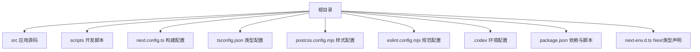
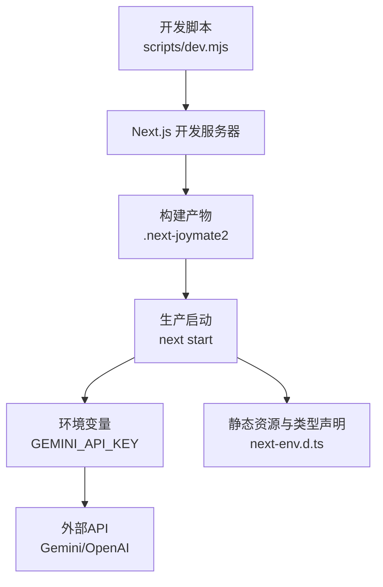
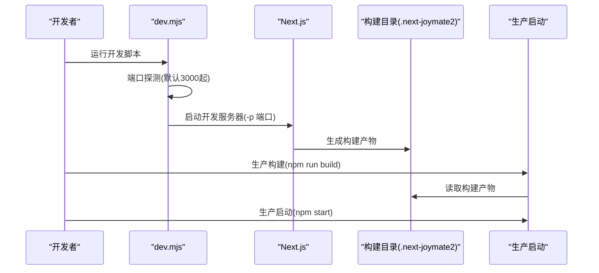
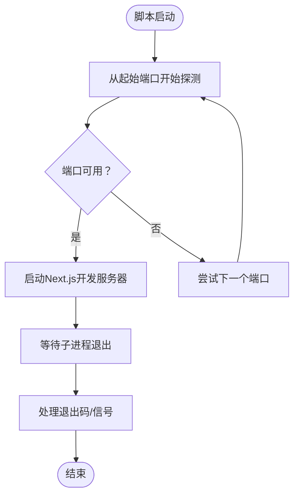
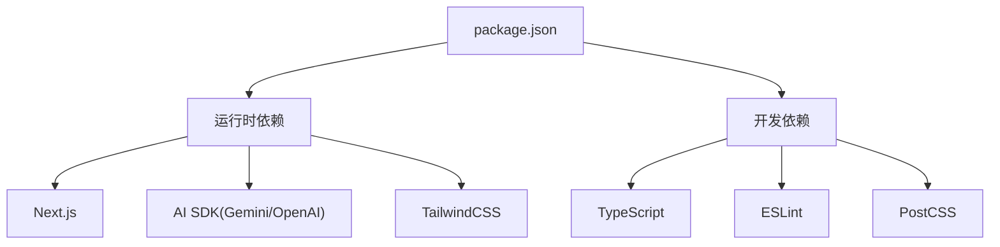

# 部署与运维

<cite>
**本文引用的文件**
- [package.json](file://package.json)
- [next.config.ts](file://next.config.ts)
- [README.md](file://README.md)
- [scripts/dev.mjs](file://scripts/dev.mjs)
- [next-env.d.ts](file://next-env.d.ts)
- [tsconfig.json](file://tsconfig.json)
- [postcss.config.mjs](file://postcss.config.mjs)
- [eslint.config.mjs](file://eslint.config.mjs)
- [.codex/environments/environment.toml](file://.codex/environments/environment.toml)
</cite>

## 目录
1. [简介](#简介)
2. [项目结构](#项目结构)
3. [核心组件](#核心组件)
4. [架构概览](#架构概览)
5. [详细组件分析](#详细组件分析)
6. [依赖分析](#依赖分析)
7. [性能考虑](#性能考虑)
8. [故障排除指南](#故障排除指南)
9. [结论](#结论)
10. [附录](#附录)

## 简介
本文件面向JoyMate项目的运维与发布团队，提供从生产环境配置、构建与静态资源优化、容器化与云平台部署、环境变量管理策略、性能监控与日志记录、错误追踪到自动化部署流水线与CI/CD集成的完整指南。文档内容严格基于仓库现有配置与脚本，确保可执行性与一致性。

## 项目结构
- 项目采用Next.js应用结构，使用TypeScript与TailwindCSS，通过自定义构建目录与开发脚本提升可维护性。
- 关键配置集中在根目录的构建与工具链配置文件中，开发脚本位于scripts目录下，便于统一入口与端口探测。

图表来源
- [package.json](file://package.json)
- [next.config.ts](file://next.config.ts)
- [tsconfig.json](file://tsconfig.json)
- [postcss.config.mjs](file://postcss.config.mjs)
- [eslint.config.mjs](file://eslint.config.mjs)
- [.codex/environments/environment.toml](file://.codex/environments/environment.toml)

章节来源
- [package.json](file://package.json)
- [next.config.ts](file://next.config.ts)
- [tsconfig.json](file://tsconfig.json)
- [postcss.config.mjs](file://postcss.config.mjs)
- [eslint.config.mjs](file://eslint.config.mjs)
- [.codex/environments/environment.toml](file://.codex/environments/environment.toml)

## 核心组件
- 构建与启动脚本：通过package.json中的脚本统一管理开发、构建与启动流程；开发脚本支持端口探测与子进程管理。
- 构建配置：next.config.ts指定构建目录与严格模式，提升产物隔离与稳定性。
- 类型与样式：tsconfig.json启用严格类型与路径映射；postcss.config.mjs集成TailwindCSS插件。
- 规范与声明：eslint.config.mjs遵循Next.js核心Web Vitals规范；next-env.d.ts声明Next类型与路由类型。
- 环境与入口：.codex/environments/environment.toml提供一键运行入口，简化本地开发体验。

章节来源
- [package.json](file://package.json)
- [scripts/dev.mjs](file://scripts/dev.mjs)
- [next.config.ts](file://next.config.ts)
- [tsconfig.json](file://tsconfig.json)
- [postcss.config.mjs](file://postcss.config.mjs)
- [eslint.config.mjs](file://eslint.config.mjs)
- [next-env.d.ts](file://next-env.d.ts)
- [.codex/environments/environment.toml](file://.codex/environments/environment.toml)

## 架构概览
下图展示了从开发到生产的整体流程，涵盖端口探测、构建目录、类型声明与环境入口。

图表来源
- [scripts/dev.mjs](file://scripts/dev.mjs)
- [next.config.ts](file://next.config.ts)
- [next-env.d.ts](file://next-env.d.ts)
- [README.md](file://README.md)

章节来源
- [scripts/dev.mjs](file://scripts/dev.mjs)
- [next.config.ts](file://next.config.ts)
- [next-env.d.ts](file://next-env.d.ts)
- [README.md](file://README.md)

## 详细组件分析

### 构建与启动流程
- 开发模式：通过自定义脚本进行端口探测与子进程管理，确保端口可用并继承父进程环境变量。
- 生产模式：使用Next.js内置构建与启动命令，结合自定义构建目录，保证产物隔离与可追溯性。

图表来源
- [scripts/dev.mjs](file://scripts/dev.mjs)
- [package.json](file://package.json)
- [next.config.ts](file://next.config.ts)

章节来源
- [scripts/dev.mjs](file://scripts/dev.mjs)
- [package.json](file://package.json)
- [next.config.ts](file://next.config.ts)

### 端口探测与进程管理
- 端口探测：从指定起始端口开始尝试，若不可用则递增，直至找到可用端口或耗尽尝试次数。
- 进程管理：子进程继承环境变量，优雅处理退出信号，主进程响应中断信号并转发给子进程。

图表来源
- [scripts/dev.mjs](file://scripts/dev.mjs)

章节来源
- [scripts/dev.mjs](file://scripts/dev.mjs)

### 构建配置与静态资源优化
- 自定义构建目录：通过next.config.ts将构建产物输出至独立目录，便于版本隔离与缓存控制。
- 类型声明：next-env.d.ts声明Next类型与路由类型，确保开发时类型安全。
- 样式与规范：postcss.config.mjs集成TailwindCSS插件；eslint.config.mjs遵循Next.js核心Web Vitals规范。

章节来源
- [next.config.ts](file://next.config.ts)
- [next-env.d.ts](file://next-env.d.ts)
- [postcss.config.mjs](file://postcss.config.mjs)
- [eslint.config.mjs](file://eslint.config.mjs)

### 环境变量管理策略
- 必需变量：生产环境必须设置外部API密钥，用于访问大模型与游戏数据接口。
- 环境差异：开发、测试与生产环境应分别维护独立的密钥与端点，避免交叉污染。
- 变量注入：通过容器或平台的环境变量注入机制提供密钥，避免硬编码与提交到版本库。

章节来源
- [README.md](file://README.md)

### Docker容器化部署方案
- 基础镜像：选择官方Node.js运行时作为基础镜像，确保二进制兼容性与安全性。
- 构建阶段：安装依赖、执行构建、清理开发依赖，减少最终镜像体积。
- 运行阶段：使用非root用户运行应用，限制权限；设置工作目录与端口暴露。
- 健康检查：配置健康检查端点，确保容器启动成功且服务可用。
- 环境变量：通过镜像参数或编排平台注入必需的环境变量。

[本节为通用容器化最佳实践，未直接分析具体文件，故不附加章节来源]

### 云平台部署指南
- 容器编排：在Kubernetes中使用Deployment与Service，配置副本数、滚动更新策略与资源限制。
- 存储与持久化：对于需要缓存或日志的场景，挂载持久化卷或使用云存储服务。
- 网络与安全：配置Ingress以暴露服务，启用TLS与WAF；限制入站流量与访问控制。
- 监控与告警：集成平台监控与日志服务，设置关键指标阈值与告警规则。

[本节为通用云平台部署建议，未直接分析具体文件，故不附加章节来源]

### 性能监控、日志记录与错误追踪
- 性能监控：采集CPU、内存、请求延迟与吞吐量，结合业务指标（如API响应时间）进行综合评估。
- 日志记录：统一输出结构化日志，区分级别与上下文，保留必要的追踪ID以便关联。
- 错误追踪：集成错误上报服务，对异常进行采样与聚合，建立根因分析流程。

[本节为通用运维实践，未直接分析具体文件，故不附加章节来源]

### 自动化部署流水线与CI/CD集成
- 触发条件：分支保护、PR合并、标签推送等触发策略。
- 构建与测试：在流水线中执行依赖安装、构建、单元测试与代码质量检查。
- 容器化与发布：构建镜像、推送至镜像仓库、部署至目标环境并进行健康检查。
- 回滚策略：支持灰度发布与一键回滚，降低变更风险。

[本节为通用CI/CD实践，未直接分析具体文件，故不附加章节来源]

## 依赖分析
- 运行时依赖：Next.js、React、TailwindCSS、AI SDK（Gemini/OpenAI）、动画库等。
- 开发依赖：TypeScript、ESLint、PostCSS、TailwindCSS等。
- 依赖关系：运行时依赖决定应用功能，开发依赖保障代码质量与构建稳定性。

图表来源
- [package.json](file://package.json)

章节来源
- [package.json](file://package.json)

## 性能考虑
- 构建目录隔离：使用独立构建目录减少冲突与加速增量构建。
- 严格类型与模块解析：启用严格模式与Bundler解析，提升编译性能与包体积控制。
- 样式与资源：通过TailwindCSS按需生成样式，避免无用类导致的体积膨胀。
- 运行时优化：在生产环境中启用压缩与缓存策略，合理配置静态资源缓存头。

章节来源
- [next.config.ts](file://next.config.ts)
- [tsconfig.json](file://tsconfig.json)
- [postcss.config.mjs](file://postcss.config.mjs)

## 故障排除指南
- 端口占用：当端口被占用时，脚本会自动尝试下一个端口；若全部失败，需手动释放端口或调整起始端口。
- 构建失败：检查构建目录权限与磁盘空间；确认Node.js版本满足依赖要求。
- 环境变量缺失：生产环境必须提供外部API密钥；验证变量名与注入方式。
- 类型错误：同步更新类型声明与路由类型，确保next-env.d.ts与构建配置一致。

章节来源
- [scripts/dev.mjs](file://scripts/dev.mjs)
- [next.config.ts](file://next.config.ts)
- [next-env.d.ts](file://next-env.d.ts)
- [README.md](file://README.md)

## 结论
本文件基于仓库现有配置与脚本，提供了从环境准备、构建与启动、容器化与云部署、环境变量管理到监控与CI/CD的完整运维指南。建议在实际落地时结合团队规范与平台特性进行细化与扩展。

## 附录
- 本地运行与部署步骤：参考项目README中的运行与部署说明，确保前置条件与环境变量正确配置。
- 环境入口：通过.Codex环境配置提供一键运行入口，简化本地开发体验。

章节来源
- [README.md](file://README.md)
- [.codex/environments/environment.toml](file://.codex/environments/environment.toml)