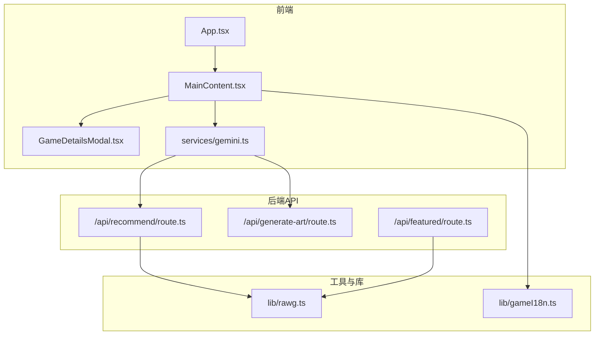
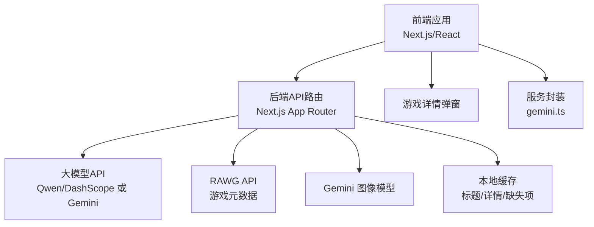
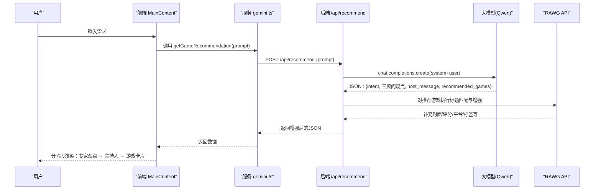
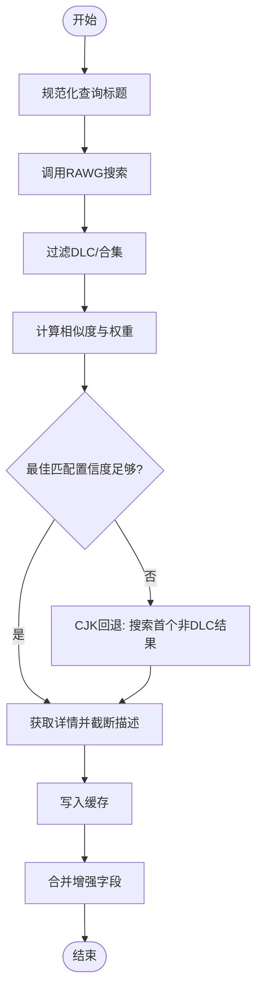
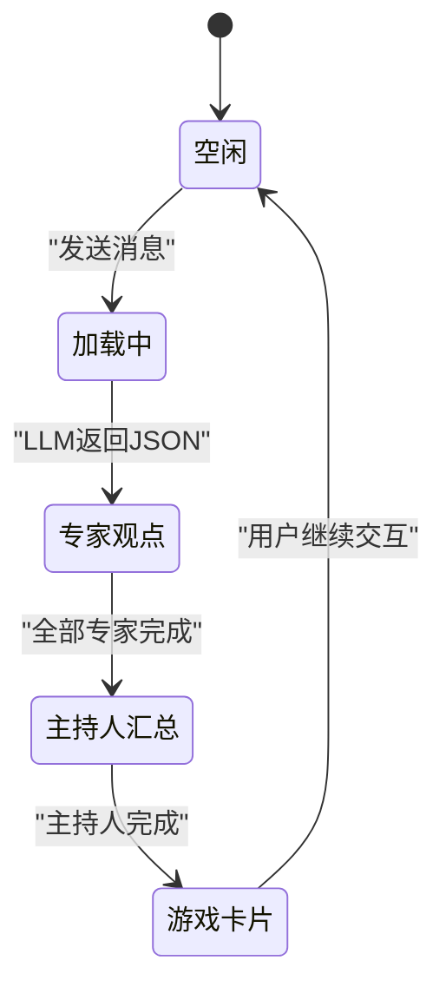
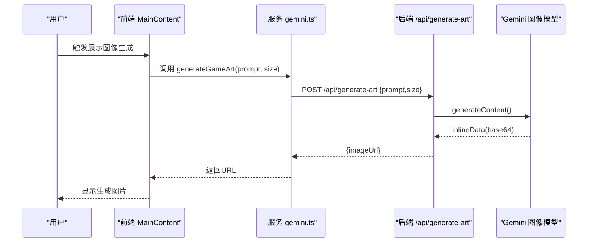
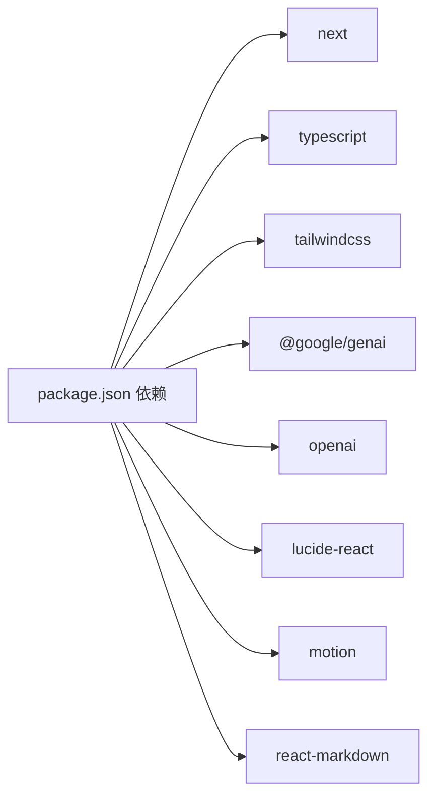

# 项目概述

<cite>
**本文档引用的文件**
- [README.md](file://README.md)
- [DESIGN_DOC.md](file://DESIGN_DOC.md)
- [package.json](file://package.json)
- [src/App.tsx](file://src/App.tsx)
- [src/components/MainContent.tsx](file://src/components/MainContent.tsx)
- [src/components/GameDetailsModal.tsx](file://src/components/GameDetailsModal.tsx)
- [src/services/gemini.ts](file://src/services/gemini.ts)
- [src/app/api/recommend/route.ts](file://src/app/api/recommend/route.ts)
- [src/app/api/generate-art/route.ts](file://src/app/api/generate-art/route.ts)
- [src/app/api/featured/route.ts](file://src/app/api/featured/route.ts)
- [src/lib/rawg.ts](file://src/lib/rawg.ts)
- [src/lib/gameI18n.ts](file://src/lib/gameI18n.ts)
- [tsconfig.json](file://tsconfig.json)
- [.next-joymate2/required-server-files.json](file://.next-joymate2/required-server-files.json)
- [metadata.json](file://metadata.json)
</cite>

## 目录
1. [引言](#引言)
2. [项目结构](#项目结构)
3. [核心组件](#核心组件)
4. [架构总览](#架构总览)
5. [详细组件分析](#详细组件分析)
6. [依赖关系分析](#依赖关系分析)
7. [性能考量](#性能考量)
8. [故障排查指南](#故障排查指南)
9. [结论](#结论)
10. [附录](#附录)

## 引言
JoyMate 是一款“懂情绪、有品味、会主动推荐”的AI游戏推荐助手。它通过多智能体协作机制（硬核顾问、艺术顾问、省钱顾问）与主持人聚合，为用户提供从机制深度、艺术表现到性价比的多维度游戏推荐；并通过Gemini等大模型API提供个性化、有温度的对话式体验。项目旨在帮助玩家在信息过载时代快速找到真正想玩的游戏。

- 产品定位：AI游戏买手，提供“情绪/场景匹配 + 多智能体讨论 + 友好汇总”的推荐体验
- 目标用户：普通玩家、硬核玩家、纠结型玩家
- 核心优势：多视角协同、情绪与场景感知、跨平台数据整合、可扩展的Agent体系

**章节来源**
- [DESIGN_DOC.md: 3-17:3-17](file://DESIGN_DOC.md#L3-L17)
- [README.md: 14-16:14-16](file://README.md#L14-L16)

## 项目结构
项目采用前后端一体化的Next.js应用结构，前端负责聊天界面与交互，后端API路由负责与大模型与外部数据源交互。

**图表来源**
- [src/App.tsx: 12-24:12-24](file://src/App.tsx#L12-L24)
- [src/components/MainContent.tsx: 70-124:70-124](file://src/components/MainContent.tsx#L70-L124)
- [src/services/gemini.ts: 1-32:1-32](file://src/services/gemini.ts#L1-L32)
- [src/app/api/recommend/route.ts: 14-31:14-31](file://src/app/api/recommend/route.ts#L14-L31)
- [src/app/api/generate-art/route.ts: 6-17:6-17](file://src/app/api/generate-art/route.ts#L6-L17)
- [src/app/api/featured/route.ts: 26-45:26-45](file://src/app/api/featured/route.ts#L26-L45)
- [src/lib/rawg.ts: 351-433:351-433](file://src/lib/rawg.ts#L351-L433)
- [src/lib/gameI18n.ts: 1-89:1-89](file://src/lib/gameI18n.ts#L1-L89)

**章节来源**
- [tsconfig.json: 26-30:26-30](file://tsconfig.json#L26-L30)
- [.next-joymate2/required-server-files.json: 297-316:297-316](file://.next-joymate2/required-server-files.json#L297-L316)

## 核心组件
- 前端聊天界面与交互
  - 主内容区域负责渲染用户与AI的对话、专家观点、主持人汇总与游戏卡片
  - 支持预设问题、风格切换、再推荐、喜欢标记等交互
- 服务层封装
  - 将前端与后端API解耦，统一错误处理与响应格式
- 推荐API
  - 调用大模型完成意图识别、多Agent并行思考与主持人汇总
  - 可选集成RAWG数据增强，补充封面、评分、平台、标签等元数据
- 图像生成功能
  - 基于Gemini图像模型生成概念图，支持尺寸与配额控制
- 游戏详情弹窗
  - 展示游戏封面、评分、平台、类型、标签、简述与匹配信息
- RAWG工具库
  - 标题规范化、相似度计算、缓存、并发增强、CJK文本适配
- 国际化与标签映射
  - 将英文游戏标签映射为中文，提升阅读体验

**章节来源**
- [src/components/MainContent.tsx: 70-163:70-163](file://src/components/MainContent.tsx#L70-L163)
- [src/services/gemini.ts: 1-32:1-32](file://src/services/gemini.ts#L1-L32)
- [src/app/api/recommend/route.ts: 14-31:14-31](file://src/app/api/recommend/route.ts#L14-L31)
- [src/app/api/generate-art/route.ts: 6-17:6-17](file://src/app/api/generate-art/route.ts#L6-L17)
- [src/components/GameDetailsModal.tsx: 22-166:22-166](file://src/components/GameDetailsModal.tsx#L22-L166)
- [src/lib/rawg.ts: 351-433:351-433](file://src/lib/rawg.ts#L351-L433)
- [src/lib/gameI18n.ts: 70-89:70-89](file://src/lib/gameI18n.ts#L70-L89)

## 架构总览
系统采用轻量级微服务架构，前端Next.js应用通过HTTP调用后端API路由，后端路由调用大模型与外部数据源（RAWG、Gemini），并在必要时进行数据增强与缓存。

**图表来源**
- [DESIGN_DOC.md: 41-60:41-60](file://DESIGN_DOC.md#L41-L60)
- [src/app/api/recommend/route.ts: 20-31:20-31](file://src/app/api/recommend/route.ts#L20-L31)
- [src/app/api/generate-art/route.ts: 12-17:12-17](file://src/app/api/generate-art/route.ts#L12-L17)
- [src/lib/rawg.ts: 6-26:6-26](file://src/lib/rawg.ts#L6-L26)

**章节来源**
- [DESIGN_DOC.md: 41-60:41-60](file://DESIGN_DOC.md#L41-L60)

## 详细组件分析

### 多智能体协作与主持人汇总
- 设计理念
  - 意图识别：从用户输入中抽取游戏名、情绪、场景、偏好、价格范围、平台偏好
  - 多Agent并行：硬核顾问（机制/难度/深度）、艺术顾问（美术/音乐/叙事）、省钱顾问（价格/折扣/性价比）
  - 主持人汇总：将三位顾问观点整合为“朋友式”的友好回复
- 前端呈现
  - 分阶段渲染：专家观点 → 主持人汇总 → 推荐游戏卡片
  - 动画与交互：打字机效果、风格切换、再推荐、喜欢标记
- 后端实现
  - 使用系统消息定义推理步骤，要求模型输出JSON结构，包含意图、三顾问观点、主持人汇总与推荐游戏列表
  - 可选RAWG增强：对推荐游戏进行标题匹配与元数据补充，统计增强耗时与命中数

**图表来源**
- [src/components/MainContent.tsx: 165-223:165-223](file://src/components/MainContent.tsx#L165-L223)
- [src/services/gemini.ts: 1-14:1-14](file://src/services/gemini.ts#L1-L14)
- [src/app/api/recommend/route.ts: 35-133:35-133](file://src/app/api/recommend/route.ts#L35-L133)
- [src/lib/rawg.ts: 351-433:351-433](file://src/lib/rawg.ts#L351-L433)

**章节来源**
- [DESIGN_DOC.md: 77-147:77-147](file://DESIGN_DOC.md#L77-L147)
- [src/app/api/recommend/route.ts: 35-133:35-133](file://src/app/api/recommend/route.ts#L35-L133)
- [src/components/MainContent.tsx: 390-593:390-593](file://src/components/MainContent.tsx#L390-L593)

### RAWG数据增强与缓存策略
- 标题规范化与相似度计算
  - 规范化去除版本/合集等后缀，提取年份与数字，使用编辑距离计算相似度
- 缓存机制
  - 搜索缓存、详情缓存、缺失项缓存，支持TTL与失效清理
- 并发增强
  - 控制并发度、限制最大增强数量、超时保护
- CJK适配
  - 对中文为主的查询，回退到RAWG搜索结果作为备选

**图表来源**
- [src/lib/rawg.ts: 28-158:28-158](file://src/lib/rawg.ts#L28-L158)
- [src/lib/rawg.ts: 172-210:172-210](file://src/lib/rawg.ts#L172-L210)
- [src/lib/rawg.ts: 252-342:252-342](file://src/lib/rawg.ts#L252-L342)
- [src/lib/rawg.ts: 351-433:351-433](file://src/lib/rawg.ts#L351-L433)

**章节来源**
- [src/lib/rawg.ts: 6-26:6-26](file://src/lib/rawg.ts#L6-L26)
- [src/lib/rawg.ts: 172-210:172-210](file://src/lib/rawg.ts#L172-L210)
- [src/lib/rawg.ts: 351-433:351-433](file://src/lib/rawg.ts#L351-L433)

### 前端交互与动画呈现
- 消息状态管理
  - 用户消息、加载态、专家观点、主持人汇总、游戏卡片阶段
- 动画与滚动
  - 打字机效果、逐段渲染、自动滚动至底部
- 会话记忆
  - 喜欢/不喜欢/已见游戏集合与风格偏好，持久化到sessionStorage
- 快捷入口
  - 预设问题、热门搜索、风格切换、再推荐、打开RAWG

**图表来源**
- [src/components/MainContent.tsx: 54-68:54-68](file://src/components/MainContent.tsx#L54-L68)
- [src/components/MainContent.tsx: 261-271:261-271](file://src/components/MainContent.tsx#L261-L271)

**章节来源**
- [src/components/MainContent.tsx: 70-163:70-163](file://src/components/MainContent.tsx#L70-L163)
- [src/components/MainContent.tsx: 390-593:390-593](file://src/components/MainContent.tsx#L390-L593)

### 图像生成功能
- 能力概述
  - 基于Gemini图像模型生成概念图，支持1K/2K/4K尺寸与纵横比
- 错误与配额处理
  - 429/配额耗尽时返回友好提示，避免前端直接报错
- 前端调用
  - 通过服务封装统一发起请求并解析响应

**图表来源**
- [src/services/gemini.ts: 16-31:16-31](file://src/services/gemini.ts#L16-L31)
- [src/app/api/generate-art/route.ts: 17-31:17-31](file://src/app/api/generate-art/route.ts#L17-L31)

**章节来源**
- [src/services/gemini.ts: 16-31:16-31](file://src/services/gemini.ts#L16-L31)
- [src/app/api/generate-art/route.ts: 6-59:6-59](file://src/app/api/generate-art/route.ts#L6-L59)

## 依赖关系分析
- 运行时与构建
  - Next.js 15、TypeScript、TailwindCSS、Lucide图标、React-Markdown、Motion动画
- 大模型与图像
  - @google/genai（图像生成）、openai（兼容DashScope/Qwen模式）
- 开发与类型
  - ESLint、PostCSS、Tailwind、TypeScript类型声明

**图表来源**
- [package.json: 12-32:12-32](file://package.json#L12-L32)

**章节来源**
- [package.json: 12-32:12-32](file://package.json#L12-L32)

## 性能考量
- 推荐链路
  - 大模型调用耗时与上游限流：建议前端显示“思考用时”与“预计等待时间”
  - RAWG增强：限制并发与最大增强数量，设置超时，避免阻塞
- 缓存策略
  - 搜索/详情/缺失项缓存，降低重复请求与延迟
- 前端渲染
  - 渐进式渲染与动画，避免长列表一次性绘制
- 错误降级
  - 配额不足时返回友好提示，保证用户体验连续性

**章节来源**
- [src/app/api/recommend/route.ts: 35-133:35-133](file://src/app/api/recommend/route.ts#L35-L133)
- [src/lib/rawg.ts: 6-26:6-26](file://src/lib/rawg.ts#L6-L26)
- [src/components/MainContent.tsx: 318-324:318-324](file://src/components/MainContent.tsx#L318-L324)

## 故障排查指南
- 环境变量
  - 缺少API密钥：检查GEMINI_API_KEY或QWEN_API_KEY是否正确设置
  - RAWG开关：通过RAWG_ENRICHMENT控制开启/关闭/自动模式
- 大模型配额
  - 429或配额耗尽：后端返回友好提示，前端显示“配额恢复后继续分析”
- 网络与超时
  - RAWG请求超时：调整timeoutMs参数，确保在合理范围内
- 前端错误
  - JSON解析失败或响应为空：捕获异常并提示稍后再试

**章节来源**
- [src/app/api/recommend/route.ts: 20-31:20-31](file://src/app/api/recommend/route.ts#L20-L31)
- [src/app/api/recommend/route.ts: 134-154:134-154](file://src/app/api/recommend/route.ts#L134-L154)
- [src/app/api/generate-art/route.ts: 12-17:12-17](file://src/app/api/generate-art/route.ts#L12-L17)
- [src/app/api/generate-art/route.ts: 42-58:42-58](file://src/app/api/generate-art/route.ts#L42-L58)

## 结论
JoyMate通过“多智能体 + 主持人”的对话式推荐体系，结合RAWG数据增强与Gemini大模型能力，为用户提供从情绪/场景到机制/艺术/性价比的立体化游戏发现体验。项目结构清晰、职责分离明确，具备良好的可扩展性与工程化实践，适合在生产环境中持续演进与部署。

## 附录
- 快速运行
  - 安装依赖、设置API密钥、启动开发服务器
- 生产部署
  - 构建应用、启动生产服务器、确保环境变量配置正确

**章节来源**
- [README.md: 18-41:18-41](file://README.md#L18-L41)